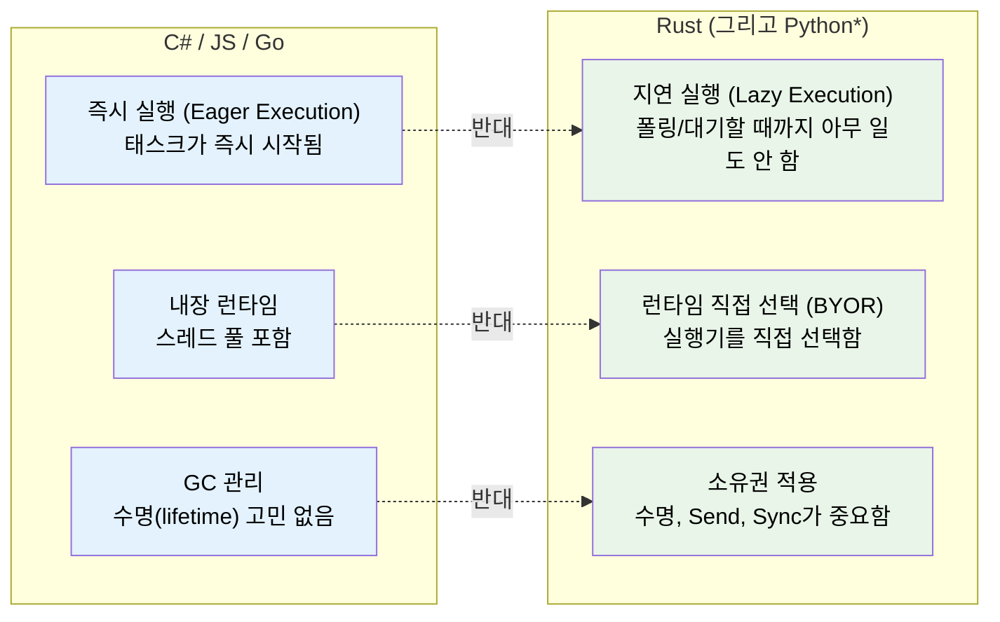
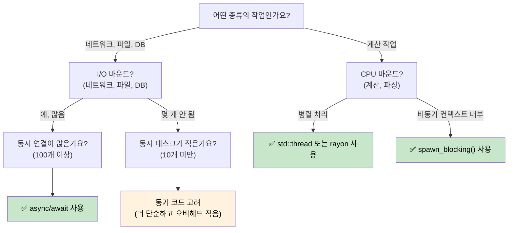

# 1. 왜 Rust의 비동기는 다른가요? 🟢

> **학습 내용:**
> - Rust에 내장 비동기 런타임이 없는 이유 (그리고 그것이 갖는 의미)
> - 세 가지 핵심 속성: 지연 실행(lazy execution), 런타임 없음, 제로 비용 추상화(zero-cost abstraction)
> - 비동기가 적절한 도구인 경우 (그리고 언제 더 느린지)
> - Rust의 모델과 C#, Go, Python, JavaScript의 비교

## 근본적인 차이점

`async/await`를 지원하는 대부분의 언어는 그 내부 메커니즘을 숨깁니다. C#은 CLR 스레드 풀이 있고, JavaScript는 이벤트 루프가 있습니다. Go는 고루틴(goroutines)과 런타임에 내장된 스케줄러가 있으며, Python은 `asyncio`를 사용합니다.

**Rust에는 아무것도 없습니다.**

내장된 런타임도, 스레드 풀도, 이벤트 루프도 없습니다. `async` 키워드는 제로 비용 컴파일 전략입니다. 이는 여러분의 함수를 `Future` 트레이트를 구현하는 상태 머신으로 변환합니다. 그 상태 머신을 앞으로 구동하는 것은 다른 누군가(실행기, *executor*)의 몫입니다.

### Rust 비동기의 세 가지 핵심 속성



> \* Python 코루틴은 Rust의 퓨처처럼 지연 실행됩니다. 즉, await되거나 스케줄링될 때까지 실행되지 않습니다. 하지만 Python은 여전히 GC를 사용하며 소유권이나 수명에 대한 고민은 없습니다.

### 내장 런타임 없음

```rust
// 이 코드는 컴파일되지만 아무 일도 하지 않습니다:
async fn fetch_data() -> String {
    "hello".to_string()
}

fn main() {
    let future = fetch_data(); // Future를 생성하지만 실행하지는 않음
    // future는 그냥 스택에 놓인 구조체일 뿐입니다.
    // 출력도 없고, 부수 효과도 없으며, 아무 일도 일어나지 않습니다.
    drop(future); // 조용히 버려짐 — 작업이 시작조차 되지 않았음
}
```

`Task`가 즉시 시작되는 C#과 비교해 보세요:
```csharp
// C# — 이 코드는 즉시 실행을 시작합니다:
async Task<string> FetchData() => "hello";

var task = FetchData(); // 이미 실행 중!
var result = await task; // 완료될 때까지 기다릴 뿐임
```

### 지연 실행 퓨처(Lazy Futures) vs 즉시 실행 태스크(Eager Tasks)

이것이 가장 중요한 사고의 전환입니다:

| | C# / JavaScript | Python | Go | Rust |
|---|---|---|---|---|
| **생성** | `Task`가 즉시 실행을 시작함 | 코루틴은 **지연(lazy)** 실행됨 — 객체를 반환하며 await되거나 스케줄링될 때까지 실행되지 않음 | 고루틴이 즉시 시작됨 | `Future`는 폴링(polled)될 때까지 아무것도 하지 않음 |
| **버리기(Drop)** | 분리된(Detached) 태스크는 계속 실행됨 | await되지 않은 코루틴은 가비지 컬렉션됨 (경고 발생) | 고루틴은 반환될 때까지 실행됨 | Future를 드롭하면 취소됨 |
| **런타임** | 언어/VM에 내장됨 | `asyncio` 이벤트 루프 (명시적으로 시작해야 함) | 바이너리에 내장됨 (M:N 스케줄러) | 직접 선택 (tokio, smol 등) |
| **스케줄링** | 자동 (스레드 풀) | 이벤트 루프 + `await` 또는 `create_task()` | 자동 (GMP 스케줄러) | 명시적 (`spawn`, `block_on`) |
| **취소** | `CancellationToken` (협력적) | `Task.cancel()` (협력적, `CancelledError` 발생) | `context.Context` (협력적) | Future 드롭 (즉각적) |

```rust
// 실제로 future를 실행하려면 실행기(executor)가 필요합니다:
#[tokio::main]
async fn main() {
    let result = fetch_data().await; // 이제서야 실행됨
    println!("{result}");
}
```

### 비동기를 사용해야 할 때 (그리고 그렇지 않을 때)



**경험 법칙**: 비동기는 CPU 병렬성(하나의 작업을 더 빠르게 만들기)이 아니라 I/O 동시성(기다리는 동안 많은 일을 한꺼번에 하기)을 위한 것입니다. 10,000개의 네트워크 연결이 있다면 비동기가 빛을 발합니다. 숫자를 계산하고 있다면 `rayon`이나 OS 스레드를 사용하세요.

### 비동기가 더 *느릴* 수 있는 경우

비동기는 공짜가 아닙니다. 낮은 동시성 작업의 경우 동기 코드가 비동기 코드보다 성능이 좋을 수 있습니다:

| 비용 | 이유 |
|------|-----|
| **상태 머신 오버헤드** | 각 `.await`마다 열거형(enum) 변형이 추가됩니다. 깊게 중첩된 퓨처는 크고 복잡한 상태 머신을 생성합니다. |
| **동적 디스패치** | `Box<dyn Future>`는 간접 참조를 추가하고 인라이닝(inlining)을 방해합니다. |
| **컨텍스트 스위칭** | 협력적 스케줄링에도 비용이 듭니다. 실행기는 태스크 큐, 웨이커(wakers), I/O 등록을 관리해야 합니다. |
| **컴파일 시간** | 비동기 코드는 더 복잡한 타입을 생성하여 컴파일 속도를 늦춥니다. |
| **디버깅 용이성** | 상태 머신을 통한 스택 추적(stack trace)은 읽기 어렵습니다. (12장 참조) |

**벤치마킹 가이드**: 동시 I/O 작업이 약 10개 미만이라면 비동기를 도입하기 전에 프로파일링을 해보세요. 연결당 하나의 `std::thread::spawn`을 사용하는 방식은 현대 리눅스에서 수백 개의 스레드까지 잘 확장됩니다.

### 연습 문제: 언제 비동기를 사용하시겠습니까?

<details>
<summary>🏋️ 연습 문제 (클릭하여 확장)</summary>

각 시나리오에 대해 비동기가 적절한지 결정하고 그 이유를 설명하세요:

1. 10,000개의 동시 WebSocket 연결을 처리하는 웹 서버
2. 하나의 큰 파일을 압축하는 CLI 도구
3. 5개의 서로 다른 데이터베이스에 쿼리하고 결과를 병합하는 서비스
4. 60 FPS로 물리 시뮬레이션을 실행하는 게임 엔진

<details>
<summary>🔑 정답</summary>

1. **비동기** — 대규모 동시성을 가진 I/O 바운드 작업입니다. 각 연결은 대부분의 시간을 데이터를 기다리는 데 보냅니다. 스레드를 사용하면 10,000개의 스택이 필요합니다.
2. **동기/스레드** — 단일 태스크의 CPU 바운드 작업입니다. 비동기는 이점 없이 오버헤드만 추가합니다. 병렬 압축을 위해 `rayon`을 사용하세요.
3. **비동기** — 5개의 동시 I/O 대기가 발생합니다. `tokio::join!`을 사용하면 5개의 쿼리를 동시에 실행할 수 있습니다.
4. **동기/스레드** — 지연 시간에 민감한 CPU 바운드 작업입니다. 비동기의 협력적 스케줄링은 프레임 지터를 유발할 수 있습니다.

</details>
</details>

> **핵심 요약 — 왜 비동기가 다른가요?**
> - Rust 퓨처는 **지연 실행(lazy)**됩니다. 즉, 실행기에 의해 폴링될 때까지 아무 일도 하지 않습니다.
> - **내장 런타임이 없으므로** 직접 선택하거나 구축해야 합니다.
> - 비동기는 상태 머신을 생성하는 **제로 비용 컴파일 전략**입니다.
> - 비동기는 **I/O 바운드 동시성**에서 빛을 발하며, CPU 바운드 작업에는 스레드나 rayon을 사용하세요.

> **참고:** 이 모든 것을 가능하게 하는 트레이트에 대해서는 [2장 — Future 트레이트](ch02-the-future-trait.md)를, 런타임 선택에 대해서는 [7장 — 실행기와 런타임](ch07-executors-and-runtimes.md)을 참조하세요.

***
