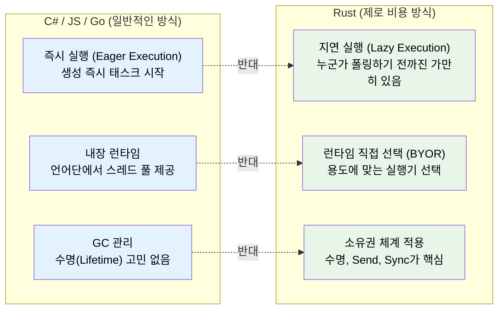

# 1. 왜 Rust의 비동기는 다른가? 🟢

> **학습 목표:**
> - Rust에 내장 비동기 런타임이 없는 이유와 그 의미를 이해합니다.
> - **지연 실행(Lazy Execution)**, **제로 비용 추상화(Zero-cost Abstraction)** 등 Rust 비동기의 3대 속성을 배웁니다.
> - 비동기가 적절한 상황(I/O 바운드)과 부적절한 상황(CPU 바운드)을 구분합니다.
> - 타 언어(C#, Go, Python, JS)의 비동기 모델과 Rust의 차이점을 익힙니다.

---

### 근본적인 차이점: "Rust에는 아무것도 없습니다"
대부분의 비동기 언어느 내부 작동 방식을 숨깁니다. C#은 CLR 스레드 풀이, JS는 이벤트 루프가 있고, Go는 고루틴(Goroutine)과 스케줄러가 내장되어 있습니다.

**하지만 Rust는 다릅니다.**
내장 런타임도, 스케줄러도, 이벤트 루프도 없습니다. `async` 키워드는 단지 함수를 **`Future` 트레이트를 구현하는 상태 머신(State Machine)**으로 변환하는 컴파일 전략일 뿐입니다. 이 상태 머신을 실제로 구동하고 관리하는 것은 여러분이 선택한 **실행기(Executor)**의 몫입니다.

---

### Rust 비동기의 3대 핵심 속성



#### ① 지연 실행 (Lazy Futures)
파이썬의 코루틴처럼, Rust의 퓨처는 `await`되거나 스케줄러에 등록되기 전까지는 단 한 줄의 코드도 실행되지 않습니다.

```rust
// 이 코드는 컴파일되지만 아무런 동작도 하지 않습니다.
async fn fetch_data() -> String {
    "hello".to_string()
}

fn main() {
    let _future = fetch_data(); // 퓨처 객체만 생성됨
    // 출력도, 부수 효과도 없습니다. 퓨처는 스택 위의 구조체일 뿐입니다.
}
```

#### ② 내장 런타임 없음 (BYOR: Bring Your Own Runtime)
런타임이 없다는 것은 임베디드 장치부터 대규모 서버까지, 시스템의 크기와 용도에 맞게 최적의 실행기를 골라 쓸 수 있다는 뜻입니다. 가장 대중적인 것은 `Tokio`이지만, 초경량 시스템을 위한 `smol`이나 임베디드용 `Embassy` 등 다양한 선택지가 있습니다.

#### ③ 소유권과 수명
Rust 비동기에서 가장 어려운 부분입니다. 비동기 작업이 언제 끝날지 알 수 없으므로, 데이터의 소유권이나 참조의 수명이 작업이 완료될 때까지 유효한지 컴파일러가 철저히 검증합니다.

---

### 비동기를 써야 할 때 vs 말아야 할 때
비동기는 '한 가지 일을 더 빨리 하는 것(병렬성)'이 아니라, **'기다리는 동안 다른 일을 더 많이 하는 것(동시성)'**에 특화되어 있습니다.

| **상황** | **추천 도구** | **이유** |
| :--- | :--- | :--- |
| **I/O 바운드** (네트워크, DB 대기) | **`async/await`** | 대기 시간 동안 다른 요청을 처리하기 좋음 |
| **CPU 바운드** (복잡한 연산, 파싱) | **`std::thread` / `Rayon`** | 모든 CPU 코어를 활용해 병렬로 처리해야 함 |
| **동시 연결 100개 미만** | **동기 코드** | 비동기의 오버헤드보다 단순한 스레드 생성이 빠를 수 있음 |
| **임베디드/실시간 시스템** | **`Embassy` 등** | 메모리 제약이 크고 정확한 타이밍이 중요함 |

---

### 💡 실무 팁: 비동기가 더 느릴 수도 있습니다
비동기 코드는 상태 머신을 유지 관리하고, 컨텍스트 스위칭을 수행하며, 퓨처를 박싱(`Box`)하는 등의 비용이 발생합니다. 동시 작업이 아주 적은 경우에는 일반적인 동기(Synchronous) 코드가 더 빠르고 디버깅하기도 쉽습니다. 무조건 비동기를 쓰기보다는 **프로파일링**을 통해 도입 여부를 결정하세요.

