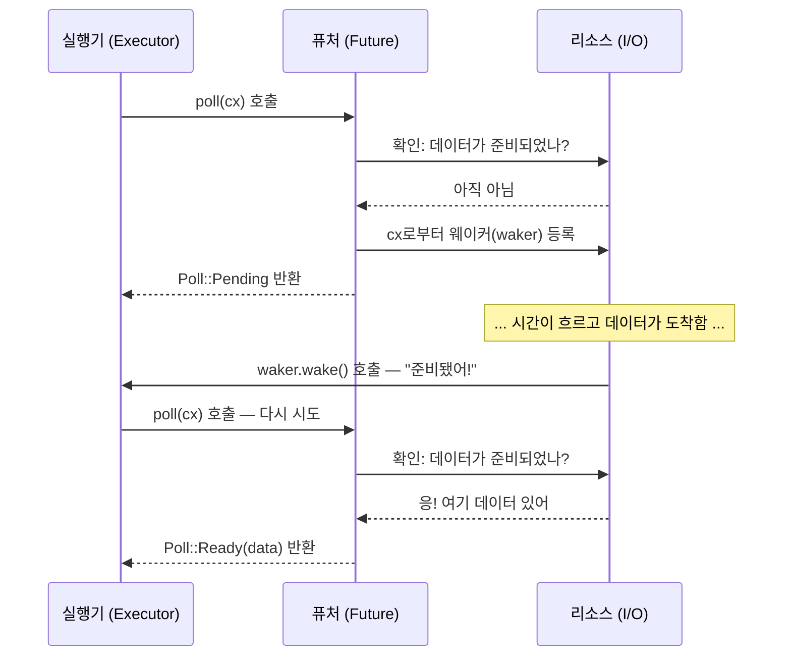

# 2. Future 트레이트 🟡

> **학습 내용:**
> - `Future` 트레이트: `Output`, `poll()`, `Context`, `Waker`
> - 웨이커(waker)가 실행기에게 "나를 다시 폴링해줘"라고 알리는 방법
> - 계약 관계: `wake()`를 호출하지 않으면 프로그램이 조용히 멈춥니다.
> - 실제 퓨처 수동 구현해보기 (`Delay`)

## Future의 구조

비동기 Rust의 모든 것은 궁극적으로 이 트레이트를 구현합니다:

```rust
pub trait Future {
    type Output;

    fn poll(self: Pin<&mut Self>, cx: &mut Context<'_>) -> Poll<Self::Output>;
}

pub enum Poll<T> {
    Ready(T),   // 퓨처가 값 T와 함께 완료됨
    Pending,    // 퓨처가 아직 준비되지 않음 — 나중에 다시 호출해줘
}
```

이것이 전부입니다. `Future`는 *폴링(polled)*될 수 있는 모든 것입니다. 즉, "아직 안 끝났니?"라는 질문을 받고 "응, 여기 결과야" 또는 "아직 아니야, 준비되면 깨워줄게"라고 답하는 객체입니다.

### Output, poll(), Context, Waker



각 구성 요소를 살펴보겠습니다:

```rust
use std::future::Future;
use std::pin::Pin;
use std::task::{Context, Poll};

// 즉시 42를 반환하는 퓨처
struct Ready42;

impl Future for Ready42 {
    type Output = i32; // 퓨처가 최종적으로 생성하는 값의 타입

    fn poll(self: Pin<&mut Self>, _cx: &mut Context<'_>) -> Poll<i32> {
        Poll::Ready(42) // 대기 없이 항상 준비됨
    }
}
```

**구성 요소**:
- **`Output`** — 퓨처가 완료될 때 생성되는 값의 타입
- **`poll()`** — 실행기가 진행 상황을 확인하기 위해 호출합니다. `Ready(value)` 또는 `Pending`을 반환합니다.
- **`Pin<&mut Self>`** — 퓨처가 메모리에서 이동되지 않도록 보장합니다. (이유는 4장에서 다룹니다.)
- **`Context`** — `Waker`를 전달하여 퓨처가 진행할 준비가 되었을 때 실행기에 신호를 보낼 수 있게 합니다.

### 웨이커(Waker) 계약

`Waker`는 콜백 메커니즘입니다. 퓨처가 `Pending`을 반환할 때, 반드시 나중에 `waker.wake()`가 호출되도록 준비해야 합니다. 그렇지 않으면 실행기는 해당 퓨처를 다시 폴링하지 않으며 프로그램은 멈춰버립니다.

```rust
use std::task::{Context, Poll, Waker};
use std::pin::Pin;
use std::future::Future;
use std::sync::{Arc, Mutex};
use std::thread;
use std::time::Duration;

/// 지연 시간 후 완료되는 퓨처 (학습용 구현)
struct Delay {
    completed: Arc<Mutex<bool>>,
    waker_stored: Arc<Mutex<Option<Waker>>>,
    duration: Duration,
    started: bool,
}

impl Delay {
    fn new(duration: Duration) -> Self {
        Delay {
            completed: Arc::new(Mutex::new(false)),
            waker_stored: Arc::new(Mutex::new(None)),
            duration,
            started: false,
        }
    }
}

impl Future for Delay {
    type Output = ();

    fn poll(mut self: Pin<&mut Self>, cx: &mut Context<'_>) -> Poll<()> {
        // 이미 완료되었는지 확인
        if *self.completed.lock().unwrap() {
            return Poll::Ready(());
        }

        // 백그라운드 스레드가 우리를 깨울 수 있도록 웨이커 저장
        *self.waker_stored.lock().unwrap() = Some(cx.waker().clone());

        // 첫 번째 폴링 때 백그라운드 타이머 시작
        if !self.started {
            self.started = true;
            let completed = Arc::clone(&self.completed);
            let waker = Arc::clone(&self.waker_stored);
            let duration = self.duration;

            thread::spawn(move || {
                thread::sleep(duration);
                *completed.lock().unwrap() = true;

                // 중요: 실행기를 깨워 우리를 다시 폴링하게 함
                if let Some(w) = waker.lock().unwrap().take() {
                    w.wake(); // "이봐 실행기, 나 준비됐어 — 다시 폴링해줘!"
                }
            });
        }

        Poll::Pending // 아직 안 끝남
    }
}
```

> **핵심 통찰**: C#에서는 TaskScheduler가 자동으로 깨우기를 처리합니다.
> Rust에서는 **여러분**(또는 여러분이 사용하는 I/O 라이브러리)이
> `waker.wake()`를 호출할 책임이 있습니다. 이를 잊으면 프로그램이 조용히 멈춥니다.

### 연습 문제: CountdownFuture 구현하기

<details>
<summary>🏋️ 연습 문제 (클릭하여 확장)</summary>

**도전 과제**: N부터 0까지 카운트다운하고, 폴링될 때마다 현재 숫자를 출력하는 `CountdownFuture`를 구현하세요. 0에 도달하면 `Ready("Liftoff!")`와 함께 완료됩니다.

*힌트*: 퓨처는 현재 카운트를 저장하고 폴링할 때마다 이를 감소시켜야 합니다. 항상 웨이커를 다시 등록하는 것을 잊지 마세요!

<details>
<summary>🔑 정답</summary>

```rust
use std::future::Future;
use std::pin::Pin;
use std::task::{Context, Poll};

struct CountdownFuture {
    count: u32,
}

impl CountdownFuture {
    fn new(start: u32) -> Self {
        CountdownFuture { count: start }
    }
}

impl Future for CountdownFuture {
    type Output = &'static str;

    fn poll(mut self: Pin<&mut Self>, cx: &mut Context<'_>) -> Poll<Self::Output> {
        if self.count == 0 {
            println!("Liftoff!");
            Poll::Ready("Liftoff!")
        } else {
            println!("{}...", self.count);
            self.count -= 1;
            cx.waker().wake_by_ref(); // 즉시 다시 폴링되도록 스케줄링
            Poll::Pending
        }
    }
}
```

**핵심 요약**: 이 퓨처는 카운트당 한 번씩 폴링됩니다. `Pending`을 반환할 때마다 즉시 자신을 깨워 다시 폴링되도록 합니다. 운영 환경에서는 이처럼 비지 폴링(busy-polling) 대신 타이머를 사용해야 합니다.

</details>
</details>

> **핵심 요약 — Future 트레이트**
> - `Future::poll()`은 `Poll::Ready(value)` 또는 `Poll::Pending`을 반환합니다.
> - 퓨처는 `Pending`을 반환하기 전에 반드시 `Waker`를 등록해야 합니다. 실행기는 이를 사용하여 재폴링 시점을 알게 됩니다.
> - `Pin<&mut Self>`는 퓨처가 메모리에서 이동되지 않음을 보장합니다. (자기 참조 상태 머신에 필요 — 4장 참조)
> - 비동기 Rust의 모든 것(`async fn`, `.await`, 결합기)은 이 하나의 트레이트를 기반으로 구축됩니다.

> **참고:** 실행기 루프에 대해서는 [3장 — Poll의 작동 원리](ch03-how-poll-works.md)를, 더 복잡한 구현 사례는 [6장 — 수동으로 Future 구현하기](ch06-building-futures-by-hand.md)를 참조하세요.

***
