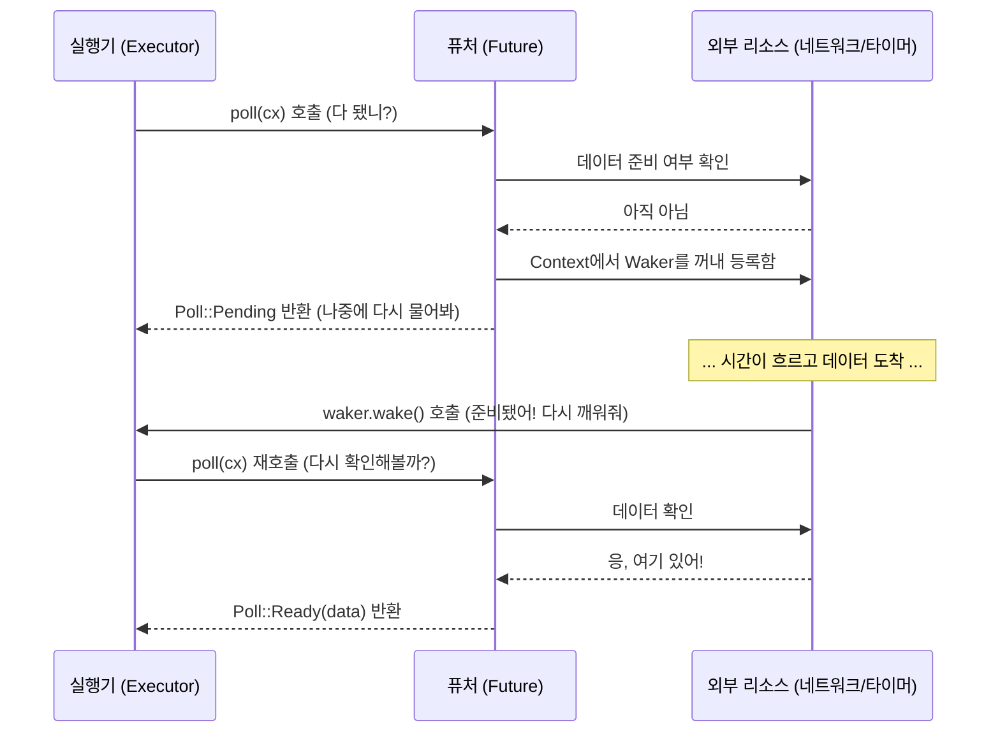

# 2. Future 트레이트: 비동기의 약속 🟡

> **학습 목표:**
> - Rust 비동기의 심장인 **`Future` 트레이트**의 구조(`Output`, `poll`, `Context`, `Waker`)를 이해합니다.
> - **웨이커(Waker)**가 실행기에게 재폴링 신호를 보내는 메커니즘을 배웁니다.
> - `wake()` 호출이 누락되었을 때 프로그램이 무한 대기에 빠지는 이유를 파악합니다.
> - 간단한 `Delay` 퓨처를 직접 구현하며 작동 원리를 체득합니다.

---

### Future의 구조: "다 됐어?"
비동기 Rust의 모든 작업은 궁극적으로 이 트레이트를 구현합니다.

```rust
pub trait Future {
    type Output; // 작업이 완료되었을 때 반환할 값의 타입

    // 실행기가 상태를 확인하기 위해 호출하는 메서드
    fn poll(self: Pin<&mut Self>, cx: &mut Context<'_>) -> Poll<Self::Output>;
}

pub enum Poll<T> {
    Ready(T), // 작업 완료! 결과값 T를 반환함
    Pending,  // 아직 작업 중. 준비되면 깨워줄 테니 나중에 다시 물어봐줘
}
```

퓨처는 능동적으로 실행되는 객체가 아닙니다. 누군가(실행기)가 "작업 다 됐니?"라고 물어볼 때(`poll` 호출), "응 여기 결과야"(`Ready`) 또는 "아직 아니야"(`Pending`)라고 답하는 수동적인 상태 머신입니다.

---

### 실행기와 퓨처의 상호작용 (Waker 메커니즘)



---

### 핵심 구성 요소 이해하기

- **`Output`**: 퓨처가 최종적으로 내놓는 결과물입니다. 파이썬의 `await fetch()`가 반환하는 값과 같습니다.
- **`poll()`**: 실행기가 진행 상황을 체크하는 유일한 통로입니다.
- **`Pin<&mut Self>`**: 퓨처가 메모리 상에서 이동하지 못하게 고정합니다. (이유는 4장에서 자세히 다룹니다.)
- **`Context`**: 퓨처에 대한 메타데이터를 담고 있으며, 특히 **`Waker`**를 통해 실행기와 소통합니다.

---

### 💡 실무 팁: 웨이커(Waker) 계약을 준수하세요
퓨처가 `Pending`을 반환했다면, 반드시 나중에 `waker.wake()`가 호출되도록 보장해야 합니다. 만약 이를 잊으면, 실행기는 해당 퓨처가 준비되었다는 사실을 영영 알 수 없게 되어 프로그램이 조용히 멈춰버립니다(Stall). 직접 퓨처를 구현할 때 가장 흔히 저지르는 실수입니다.

---

### 🏋️ 연습 문제: CountdownFuture 만들기
**도전 과제:** 지정된 숫자 N부터 0까지 카운트다운하고, 0에 도달하면 "Liftoff!"를 반환하는 `CountdownFuture`를 구현해 보세요. 

- *힌트*: 매 폴링마다 숫자를 출력하고 1씩 줄입니다. 숫자가 0보다 크면 `cx.waker().wake_by_ref()`를 호출하여 즉시 다시 폴링되도록 스케줄링하고 `Pending`을 반환하세요.

<details>
<summary>🔑 정답 및 해설 보기</summary>

```rust
impl Future for CountdownFuture {
    type Output = &'static str;

    fn poll(mut self: Pin<&mut Self>, cx: &mut Context<'_>) -> Poll<Self::Output> {
        if self.count == 0 {
            Poll::Ready("Liftoff!")
        } else {
            println!("{}...", self.count);
            self.count -= 1;
            // 중요: 나중에 다시 깨워달라고 예약함 (여기서는 즉시 다시 깨움)
            cx.waker().wake_by_ref(); 
            Poll::Pending
        }
    }
}
```
실전에선 이처럼 무한 루프를 돌며 깨우는(Busy-polling) 방식 대신, OS의 이벤트나 타이머 알람을 기다리는 방식을 사용합니다.
</details>

---

### 📌 요약
- `Future`는 폴링될 수 있는 모든 것입니다.
- `Pending`을 반환할 때는 반드시 나중에 깨워달라는 **`Waker`**를 등록해야 합니다.
- 비동기 Rust의 모든 문법(`async`, `await`, `select!`)은 이 `Future` 트레이트 위에 세워진 마법입니다.

