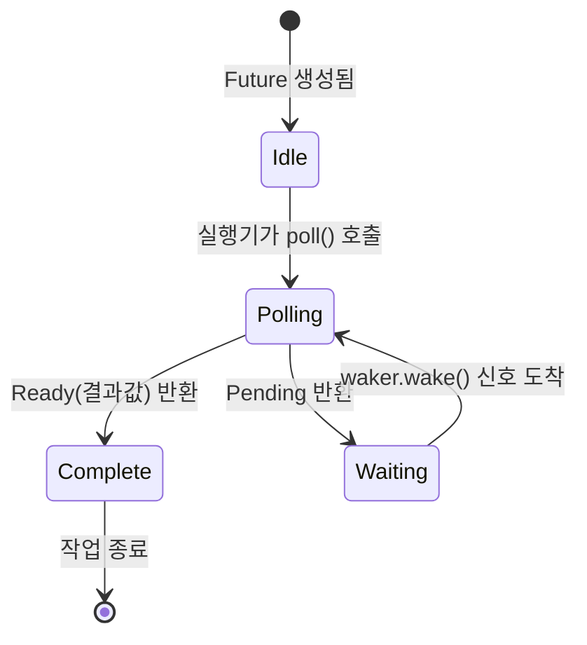

# 3. Poll의 작동 원리: 실행 루프 속으로 🟡

> **학습 목표:**
> - 실행기(Executor)의 핵심 루프인 `poll` → `pending` → `wake` → `poll` 과정을 이해합니다.
> - 최소한의 기능만 갖춘 **`block_on` 실행기**를 직접 만들어 봅니다.
> - **허위 깨움(Spurious Wake)**의 개념과 이를 안전하게 처리하는 법을 배웁니다.
> - 비동기 제어권을 양보하는 `yield_now`와 클로저 기반의 `poll_fn` 활용법을 익힙니다.

---

### 폴링 상태 머신: 실행기의 일과
실행기는 퓨처를 계속해서 폴링하는 무한 루프를 돌립니다. 퓨처가 `Pending`을 반환하면 잠시 멈췄다가, 웨이커가 신호를 보내면 다시 폴링을 시작합니다.



> **주의:** *Waiting* 상태에서 퓨처가 웨이커를 외부 리소스(네트워크, 타이머 등)에 등록하지 않으면, 다시는 깨어날 수 없어 프로그램이 영원히 대기 상태에 빠집니다.

---

### 최소한의 실행기 (`block_on`) 맛보기
실행기가 대단한 마법이 아님을 확인하기 위해, 비지 루프(Busy-loop) 방식을 사용하는 아주 단순한 실행기를 만들어 보겠습니다.

```rust
fn block_on<F: Future>(mut future: F) -> F::Output {
    // 퓨처를 메모리에 고정(Pin)합니다.
    let mut future = unsafe { Pin::new_unchecked(&mut future) };
    
    // 아무 일도 안 하는 가짜 웨이커 생성
    let waker = create_noop_waker();
    let mut cx = Context::from_waker(&waker);

    loop {
        match future.as_mut().poll(&mut cx) {
            Poll::Ready(val) => return val, // 완료되면 결과 반환
            Poll::Pending => {
                // 실제 실행기는 여기서 스레드를 잠재우고 wake를 기다리지만,
                // 여기서는 단순히 CPU 제어권만 잠시 양보합니다.
                std::thread::yield_now();
            }
        }
    }
}
```
*실제 `Tokio`나 `smol` 같은 실행기는 `epoll`이나 `io_uring` 같은 OS 기능을 활용해 효율적으로 잠들고 깨어납니다.*

---

### 💡 실무 팁: 허위 깨움(Spurious Wake)에 대비하세요
퓨처는 데이터가 준비되지 않았는데도 폴링될 수 있습니다. 이를 '허위 깨움'이라고 합니다. 따라서 `poll` 구현 시에는 항상 **실제 조건**을 다시 확인해야 합니다.

```rust
impl Future for MyFuture {
    fn poll(self: Pin<&mut Self>, cx: &mut Context<'_>) -> Poll<Data> {
        // ✅ 좋은 예: 데이터가 진짜 있는지 다시 확인합니다.
        if let Some(data) = self.try_read() {
            Poll::Ready(data)
        } else {
            // 아직 없다면 웨이커를 다시 등록하고 Pending 반환
            self.register(cx.waker());
            Poll::Pending
        }
    }
}
```

---

### 유용한 비동기 유틸리티

- **`poll_fn`**: 구조체를 따로 만들지 않고 클로저만으로 즉석 퓨처를 생성할 때 씁니다.
- **`yield_now`**: CPU 연산이 너무 길어서 다른 비동기 태스크들이 굶고 있을 때(Starvation), 잠시 제어권을 넘겨주는 '배려'의 기술입니다.

#### 💡 `yield_now`가 필요한 순간
비동기 루프 안에서 무거운 계산(예: 대용량 파일 파싱)을 수행하고 있다면, 중간에 `.await tokio::task::yield_now()`를 호출해 보세요. 덕분에 같은 스레드에서 돌아가던 다른 네트워크 요청들이 끊기지 않고 처리될 수 있습니다.

---

### 📌 요약
- 실행기는 퓨처가 `Ready`가 될 때까지 반복적으로 `poll`을 호출하는 루프입니다.
- 퓨처는 폴링될 때마다 상태를 재확인하고, 필요하면 웨이커를 갱신해야 합니다.
- `poll_fn`과 `yield_now`는 비동기 프로그래밍의 유연함을 더해주는 도구입니다.

