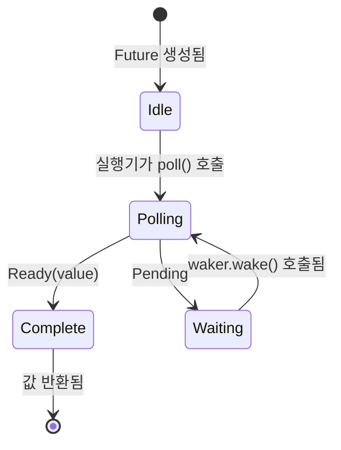

# 3. Poll의 작동 원리 🟡

> **학습 내용:**
> - 실행기의 폴링 루프: poll → pending → wake → poll again
> - 처음부터 최소한의 실행기 구축해보기
> - 허위 깨움(spurious wake) 규칙과 그 중요성
> - 유틸리티 함수: `poll_fn()` 및 `yield_now()`

## 폴링 상태 머신

실행기는 루프를 실행합니다: 퓨처를 폴링하고, 만약 `Pending`이면 웨이커가 발화될 때까지 대기시킨 후 다시 폴링합니다. 이는 커널이 스케줄링을 처리하는 OS 스레드와 근본적으로 다릅니다.



> **중요:** *Waiting* 상태에 있는 동안 퓨처는 **반드시** I/O 소스에
> 웨이커를 등록했어야 합니다. 등록하지 않으면 영원히 멈춥니다.

### 최소한의 실행기 (Minimal Executor)

실행기의 신비감을 없애기 위해 가장 단순한 실행기를 직접 만들어 보겠습니다:

```rust
use std::future::Future;
use std::task::{Context, Poll, RawWaker, RawWakerVTable, Waker};
use std::pin::Pin;

/// 가장 단순한 실행기: Ready가 될 때까지 비지 루프(busy-loop)로 폴링함
fn block_on<F: Future>(mut future: F) -> F::Output {
    // 퓨처를 스택에 고정(Pin)합니다.
    // 안전성: `future`는 이 시점 이후 절대 이동되지 않습니다.
    // 완료될 때까지 고정된 참조를 통해서만 접근합니다.
    let mut future = unsafe { Pin::new_unchecked(&mut future) };

    // 아무 일도 하지 않는 웨이커 생성 (계속 폴링함 — 비효율적이지만 단순함)
    fn noop_raw_waker() -> RawWaker {
        fn no_op(_: *const ()) {}
        fn clone(_: *const ()) -> RawWaker { noop_raw_waker() }
        let vtable = &RawWakerVTable::new(clone, no_op, no_op, no_op);
        RawWaker::new(std::ptr::null(), vtable)
    }

    // 안전성: noop_raw_waker()는 올바른 vtable을 가진 유효한 RawWaker를 반환합니다.
    let waker = unsafe { Waker::from_raw(noop_raw_waker()) };
    let mut cx = Context::from_waker(&waker);

    // 퓨처가 완료될 때까지 비지 루프 실행
    loop {
        match future.as_mut().poll(&mut cx) {
            Poll::Ready(value) => return value,
            Poll::Pending => {
                // 실제 실행기는 여기서 스레드를 파킹(park)하고
                // waker.wake()를 기다리겠지만, 여기서는 그냥 양보합니다.
                std::thread::yield_now();
            }
        }
    }
}

// 사용 예시:
fn main() {
    let result = block_on(async {
        println!("미니 실행기에서 인사드립니다!");
        42
    });
    println!("결과: {result}");
}
```

> **이 코드를 운영 환경에서 사용하지 마세요!** 이 코드는 비지 루프를 돌아 CPU를 낭비합니다.
> 실제 실행기(tokio, smol)는 I/O가 준비될 때까지 잠들기 위해 `epoll`/`kqueue`/`io_uring` 등을 사용합니다.
> 하지만 이 예제는 핵심 아이디어를 보여줍니다: 실행기는 단지 `poll()`을 호출하는 루프일 뿐입니다.

### 깨움 알림 (Wake-Up Notifications)

실제 실행기는 이벤트 기반입니다. 모든 퓨처가 `Pending`이면 실행기는 잠듭니다. 웨이커는 일종의 인터럽트 메커니즘입니다:

```rust
// 실제 실행기의 메인 루프 개념 모델:
fn executor_loop(tasks: &mut TaskQueue) {
    loop {
        // 1. 깨어난 모든 태스크를 폴링함
        while let Some(task) = tasks.get_woken_task() {
            match task.poll() {
                Poll::Ready(result) => task.complete(result),
                Poll::Pending => { /* 태스크는 큐에 남아 깨어나기를 기다림 */ }
            }
        }

        // 2. 누군가 깨울 때까지 잠듦 (epoll_wait, kevent 등)
        //    여기서 mio/polling이 고생을 해줍니다.
        tasks.wait_for_events(); // I/O 이벤트나 웨이커가 발화될 때까지 블록됨
    }
}
```

### 허위 깨움 (Spurious Wakes)

퓨처는 I/O가 준비되지 않았음에도 폴링될 수 있습니다. 이를 *허위 깨움*이라고 합니다. 퓨처는 이를 올바르게 처리해야 합니다:

```rust
impl Future for MyFuture {
    type Output = Data;

    fn poll(self: Pin<&mut Self>, cx: &mut Context<'_>) -> Poll<Data> {
        // ✅ 올바른 방식: 항상 실제 조건을 다시 확인합니다.
        if let Some(data) = self.try_read_data() {
            Poll::Ready(data)
        } else {
            // 웨이커를 다시 등록합니다 (변경되었을 수도 있습니다!)
            self.register_waker(cx.waker());
            Poll::Pending
        }

        // ❌ 잘못된 방식: 폴링되었다고 데이터가 준비되었다고 가정함
        // let data = self.read_data(); // 블록되거나 패닉이 발생할 수 있음
        // Poll::Ready(data)
    }
}
```

**`poll()` 구현 규칙**:
1. **절대 블록하지 마세요** — 준비되지 않았다면 즉시 `Pending`을 반환하세요.
2. **항상 웨이커를 다시 등록하세요** — 폴링 사이에 웨이커가 변경되었을 수 있습니다.
3. **허위 깨움을 처리하세요** — 준비되었다고 가정하지 말고 실제 조건을 확인하세요.
4. **`Ready` 이후에 폴링하지 마세요** — 그 이후의 동작은 **정의되지 않았습니다** (패닉, `Pending` 반환, 또는 `Ready` 반복). 오직 `FusedFuture`만이 완료 후의 안전한 폴링을 보장합니다.

<details>
<summary><strong>🏋️ 연습 문제: CountdownFuture 구현하기</strong> (클릭하여 확장)</summary>

**도전 과제**: N부터 0까지 카운트다운하고, 폴링될 때마다 현재 숫자를 *출력*하는 부수 효과를 가진 `CountdownFuture`를 구현하세요. 0에 도달하면 `Ready("Liftoff!")`와 함께 완료됩니다. (참고: `Future`는 하나의 최종 값만 생성합니다. 출력은 yielded 값이 아니라 부수 효과입니다. 여러 비동기 값을 위해서는 11장의 `Stream`을 참조하세요.)

*힌트*: 실제 I/O 소스가 필요하지 않습니다. 매번 숫자를 줄인 후 `cx.waker().wake_by_ref()`를 사용하여 즉시 자신을 깨울 수 있습니다.

<details>
<summary>🔑 정답</summary>

```rust
use std::future::Future;
use std::pin::Pin;
use std::task::{Context, Poll};

struct CountdownFuture {
    count: u32,
}

impl CountdownFuture {
    fn new(start: u32) -> Self {
        CountdownFuture { count: start }
    }
}

impl Future for CountdownFuture {
    type Output = &'static str;

    fn poll(mut self: Pin<&mut Self>, cx: &mut Context<'_>) -> Poll<Self::Output> {
        if self.count == 0 {
            Poll::Ready("Liftoff!")
        } else {
            println!("{}...", self.count);
            self.count -= 1;
            // 즉시 깨움 — 우리는 항상 진행할 준비가 되어 있습니다.
            cx.waker().wake_by_ref();
            Poll::Pending
        }
    }
}

// 미니 실행기나 tokio에서의 사용:
// let msg = block_on(CountdownFuture::new(5));
// 출력: 5... 4... 3... 2... 1...
// msg == "Liftoff!"
```

**핵심 요약**: 이 퓨처는 항상 진행할 준비가 되어 있음에도 불구하고, 단계 사이에서 제어권을 양보하기 위해 `Pending`을 반환합니다. `wake_by_ref()`를 즉시 호출하여 실행기가 바로 다시 폴링하게 합니다. 이것이 협력적 멀티태스킹(cooperative multitasking)의 기초입니다. 각 퓨처가 자발적으로 양보하는 것이죠.

</details>
</details>

### 유용한 유틸리티: `poll_fn` 및 `yield_now`

완전한 `Future` 구현을 피하게 해주는 표준 라이브러리와 tokio의 두 유틸리티입니다:

```rust
use std::future::poll_fn;
use std::task::Poll;

// poll_fn: 클로저로부터 일회성 퓨처를 생성함
let value = poll_fn(|cx| {
    // cx.waker()로 무언가를 하고 Ready 또는 Pending 반환
    Poll::Ready(42)
}).await;

// 실제 사례: 콜백 기반 API를 비동기로 연결함
async fn read_when_ready(source: &MySource) -> Data {
    poll_fn(|cx| source.poll_read(cx)).await
}
```

```rust
// yield_now: 실행기에게 제어권을 자발적으로 양보함
// CPU 집약적인 비동기 루프에서 다른 태스크가 굶지 않도록 할 때 유용함
async fn cpu_heavy_work(items: &[Item]) {
    for (i, item) in items.iter().enumerate() {
        process(item); // CPU 작업

        // 매 100개 아이템마다 양보하여 다른 태스크가 실행되게 함
        if i % 100 == 0 {
            tokio::task::yield_now().await;
        }
    }
}
```

> **`yield_now()`를 사용해야 할 때**: 비동기 함수가 `.await` 지점 없이 루프에서 CPU 작업을 수행하면 실행기 스레드를 독점하게 됩니다. 주기적으로 `yield_now().await`를 삽입하여 협력적 멀티태스킹을 가능하게 하세요.

> **핵심 요약 — Poll의 작동 원리**
> - 실행기는 깨어난 퓨처에 대해 반복적으로 `poll()`을 호출합니다.
> - 퓨처는 **허위 깨움**을 처리해야 합니다. 즉, 항상 실제 조건을 다시 확인해야 합니다.
> - `poll_fn()`을 사용하면 클로저로 즉석 퓨처를 만들 수 있습니다.
> - `yield_now()`는 CPU 집약적인 비동기 코드에서 사용되는 협력적 스케줄링 탈출구입니다.

> **참고:** 트레이트 정의는 [2장 — Future 트레이트](ch02-the-future-trait.md)를, 컴파일러가 생성하는 것에 대해서는 [5장 — 상태 머신의 실체](ch05-the-state-machine-reveal.md)를 참조하세요.

***
