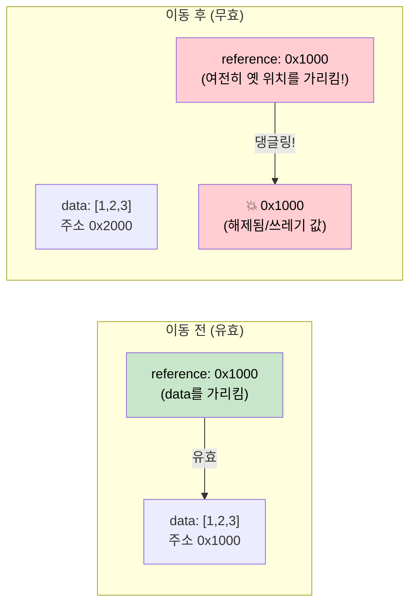

# 4. Pin과 Unpin 🔴

> **학습 내용:**
> - 자기 참조 구조체(self-referential structs)가 메모리에서 이동할 때 발생하는 문제
> - `Pin<P>`의 보장 내용과 이동 방지 방법
> - 세 가지 실용적인 피닝(pinning) 패턴: `Box::pin()`, `tokio::pin!()`, `Pin::new()`
> - `Unpin`이 탈출구를 제공하는 경우

## Pin이 존재하는 이유

이것은 비동기 Rust에서 가장 혼란스러운 개념입니다. 직관을 하나씩 쌓아보겠습니다.

### 문제: 자기 참조 구조체

컴파일러가 `async fn`을 상태 머신으로 변환할 때, 그 상태 머신은 자신의 필드에 대한 참조를 포함할 수 있습니다. 이것이 *자기 참조 구조체*를 생성하며, 이를 메모리에서 이동시키면 내부 참조가 무효화됩니다.

```rust
// 다음 코드를 위해 컴파일러가 생성하는 상태 머신 (단순화됨):
// async fn example() {
//     let data = vec![1, 2, 3];
//     let reference = &data;       // data를 가리킴
//     use_ref(reference).await;
// }

// 대략 다음과 같이 변합니다:
enum ExampleStateMachine {
    State0 {
        data: Vec<i32>,
        // reference: &Vec<i32>,  // 문제: 위의 `data`를 가리킴
        //                        // 이 구조체가 이동하면 포인터가 댕글링(dangling)됨!
    },
    State1 {
        data: Vec<i32>,
        reference: *const Vec<i32>, // data 필드를 가리키는 내부 포인터
    },
    Complete,
}
```



### 자기 참조 구조체의 예

이는 이론적인 문제가 아닙니다. `.await` 지점을 넘어서 참조를 유지하는 모든 `async fn`은 자기 참조 상태 머신을 생성합니다:

```rust
async fn problematic() {
    let data = String::from("hello");
    let slice = &data[..]; // slice가 data를 빌림
    
    some_io().await; // <-- .await 지점: 상태 머신이 data와 slice를 모두 저장함
    
    println!("{slice}"); // await 이후에 참조 사용
}
// 생성된 상태 머신은 `data: String`과 data 내부를 가리키는 `slice: &str`을 가집니다.
// 상태 머신을 이동시키면 댕글링 포인터가 발생합니다.
```

### 실전에서의 Pin

`Pin<P>`는 포인터 뒤에 있는 값이 이동되는 것을 방지하는 래퍼(wrapper)입니다:

```rust
use std::pin::Pin;

let mut data = String::from("hello");

// 고정(Pin)합니다 — 이제 이동할 수 없습니다.
let pinned: Pin<&mut String> = Pin::new(&mut data);

// 여전히 사용할 수 있습니다:
println!("{}", pinned.as_ref().get_ref()); // "hello"

// 하지만 &mut String을 다시 얻을 수는 없습니다 (mem::swap이 가능해지기 때문).
// let mutable: &mut String = Pin::into_inner(pinned); // String: Unpin인 경우에만 가능
// String은 Unpin이므로 실제로는 작동합니다.
// 하지만 자기 참조 상태 머신(!Unpin)의 경우 차단됩니다.
```

실제 코드에서 Pin은 주로 다음 세 곳에서 마주치게 됩니다:

```rust
// 1. poll() 시그니처 — 모든 퓨처는 Pin을 통해 폴링됩니다.
fn poll(self: Pin<&mut Self>, cx: &mut Context<'_>) -> Poll<Output>;

// 2. Box::pin() — 퓨처를 힙에 할당하고 고정합니다.
let future: Pin<Box<dyn Future<Output = i32>>> = Box::pin(async { 42 });

// 3. tokio::pin!() — 퓨처를 스택에 고정합니다.
tokio::pin!(my_future);
// 이제 my_future의 타입은 Pin<&mut impl Future>가 됩니다.
```

### Unpin 탈출구

Rust의 대부분의 타입은 `Unpin`입니다. 이들은 자기 참조를 포함하지 않으므로 피닝이 아무런 효과가 없습니다. 오직 `async fn`으로부터 생성된 컴파일러 생성 상태 머신만이 `!Unpin`입니다.

```rust
// 이들은 모두 Unpin입니다 — 고정해도 특별한 일이 일어나지 않습니다:
// i32, String, Vec<T>, HashMap<K,V>, Box<T>, &T, &mut T

// 이들은 !Unpin입니다 — 폴링하기 전에 반드시 고정되어야 합니다:
// `async fn` 및 `async {}` 블록으로 생성된 상태 머신들

// 실질적 의미:
// 만약 퓨처를 수동으로 구현하고 자기 참조가 없다면,
// Unpin을 구현하여 다루기 쉽게 만드세요:
impl Unpin for MySimpleFuture {} // "나는 이동해도 안전해요, 믿으세요"
```

### 빠른 참조 카드

| 대상 | 상황 | 방법 |
|------|------|-----|
| 퓨처를 힙에 고정 | 컬렉션에 저장하거나 함수에서 반환할 때 | `Box::pin(future)` |
| 퓨처를 스택에 고정 | `select!`에서의 로컬 사용이나 수동 폴링 | `tokio::pin!(future)` 또는 `pin-utils`의 `pin_mut!` |
| 함수 시그니처에서의 Pin | 고정된 퓨처를 인자로 받을 때 | `future: Pin<&mut F>` |
| Unpin 요구 | 생성 후 퓨처를 이동시켜야 할 때 | `F: Future + Unpin` |

<details>
<summary><strong>🏋️ 연습 문제: Pin과 이동</strong> (클릭하여 확장)</summary>

**도전 과제**: 다음 코드 스니펫 중 컴파일되는 것은 무엇인가요? 컴파일되지 않는 경우 이유를 설명하고 수정하세요.

```rust
// 스니펫 A
let fut = async { 42 };
let pinned = Box::pin(fut);
let moved = pinned; // Box를 이동시킴
let result = moved.await;

// 스니펫 B
let fut = async { 42 };
tokio::pin!(fut);
let moved = fut; // 고정된 퓨처를 이동시킴
let result = moved.await;

// 스니펫 C
use std::pin::Pin;
let mut fut = async { 42 };
let pinned = Pin::new(&mut fut);
```

<details>
<summary>🔑 정답</summary>

**스니펫 A**: ✅ **컴파일됨.** `Box::pin()`은 퓨처를 힙에 넣습니다. `Box`를 이동시키는 것은 *포인터*를 이동시키는 것이지 퓨처 자체를 이동시키는 것이 아닙니다. 퓨처는 힙 위치에 고정된 채로 유지됩니다.

**스니펫 B**: ❌ **컴파일되지 않음.** `tokio::pin!`은 퓨처를 스택에 고정하고 `fut`를 `Pin<&mut ...>`로 재바인딩합니다. 고정된 참조에서 값을 밖으로 이동시킬 수 없습니다. **수정**: 이동시키지 말고 제자리에서 사용하세요:
```rust
let fut = async { 42 };
tokio::pin!(fut);
let result = fut.await; // 재할당하지 않고 직접 사용
```

**스니펫 C**: ❌ **컴파일되지 않음.** `Pin::new()`는 `T: Unpin`을 요구합니다. 비동기 블록은 `!Unpin` 타입을 생성합니다. **수정**: `Box::pin()` 또는 `unsafe Pin::new_unchecked()`를 사용하세요:
```rust
let fut = async { 42 };
let pinned = Box::pin(fut); // 힙 고정 — !Unpin과 함께 작동함
```

**핵심 요약**: `Box::pin()`은 `!Unpin` 퓨처를 고정하는 가장 안전하고 쉬운 방법입니다. `tokio::pin!()`은 스택에 고정하지만 그 이후에는 퓨처를 이동할 수 없습니다. `Pin::new()`는 `Unpin` 타입에만 작동합니다.

</details>
</details>

> **핵심 요약 — Pin과 Unpin**
> - `Pin<P>`는 **피지시자(pointee)가 이동되는 것을 방지**하는 래퍼입니다. 자기 참조 상태 머신에 필수적입니다.
> - `Box::pin()`은 퓨처를 힙에 고정하는 안전하고 쉬운 기본 방법입니다.
> - `tokio::pin!()`은 스택에 고정합니다. 비용이 저렴하지만 이후에 퓨처를 이동할 수 없습니다.
> - `Unpin`은 자동 트레이트 제외 항목입니다: `Unpin`을 구현하는 타입은 고정되어도 이동할 수 있습니다. (대부분의 타입은 `Unpin`이지만, 비동기 블록은 아닙니다.)

> **참고:** poll에서의 `Pin<&mut Self>`는 [2장 — Future 트레이트](ch02-the-future-trait.md)를, 왜 비동기 상태 머신이 자기 참조적인지는 [5장 — 상태 머신의 실체](ch05-the-state-machine-reveal.md)를 참조하세요.

***
