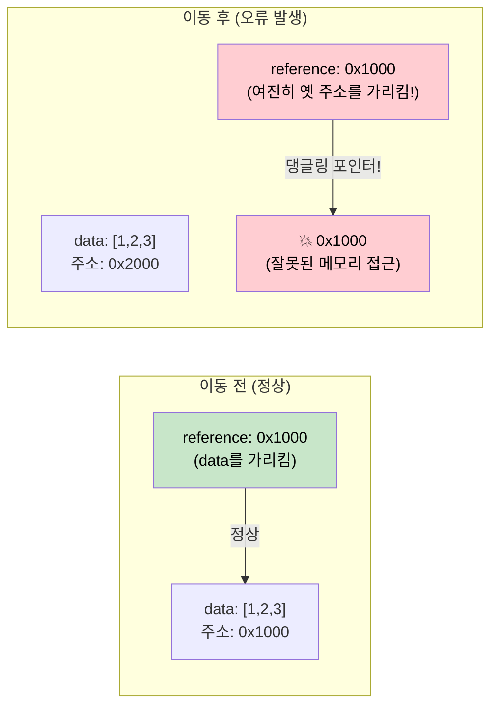

# 4. Pin과 Unpin: 메모리 위의 고정 🔴

> **학습 목표:**
> - 자기 참조 구조체(Self-referential Structs)가 메모리에서 이동할 때 발생하는 치명적인 문제를 이해합니다.
> - **`Pin<P>`**가 어떻게 데이터의 이동을 방지하고 안정성을 보장하는지 배웁니다.
> - 실전에서 쓰이는 3가지 피닝(Pinning) 패턴(`Box::pin`, `tokio::pin!`, `Pin::new`)을 익힙니다.
> - 대부분의 타입이 가진 **`Unpin`** 속성과 그 예외 상황을 파악합니다.

---

### Pin이 필요한 이유: "움직이면 죽는다"
비동기 Rust에서 가장 난해한 개념 중 하나지만, 핵심은 명확합니다. 컴파일러가 `async fn`을 상태 머신 구조체로 변환할 때, 이 구조체는 **자신의 다른 필드를 가리키는 참조(자기 참조)**를 포함할 수 있습니다.



만약 이 구조체가 메모리 상의 다른 위치로 이동(Move)하면, 내부 포인터는 여전히 과거의 주소를 가리키게 되어 프로그램이 비정상 종료되거나 메모리 오염이 발생합니다. **`Pin`은 바로 이런 이동을 원천 봉쇄하는 장치입니다.**

---

### 실전 피닝(Pinning) 패턴

비동기 작업 시 주로 마주하게 되는 세 가지 방식입니다.

1.  **`Box::pin(future)`**: 퓨처를 **힙(Heap)** 메모리에 할당하고 고정합니다. 가장 쉽고 안전한 방법이며, 함수에서 퓨처를 반환하거나 컬렉션에 담을 때 필수적입니다.
2.  **`tokio::pin!(future)`**: 퓨처를 **스택(Stack)** 메모리에 고정합니다. 힙 할당 비용이 없어 빠르지만, 고정한 이후에는 해당 변수를 다른 곳으로 이동시킬 수 없습니다. 주로 `select!` 매크로를 쓸 때 유용합니다.
3.  **`Pin::new(&mut data)`**: 데이터가 이미 **`Unpin`** 트레이트를 구현하고 있을 때만 사용 가능합니다.

---

### Unpin: "나는 움직여도 괜찮아요"
다행히 Rust의 거의 모든 타입(`i32`, `String`, `Vec` 등)은 `Unpin`입니다. 이들은 자기 참조를 하지 않으므로 자유롭게 이동해도 안전합니다. 오직 `async` 블록이나 `async fn`으로 생성된 상태 머신들만이 `!Unpin`(Unpin이 아님) 상태이며, 이들만이 `Pin`의 보호를 필요로 합니다.

---

### 💡 실무 팁: 퓨처를 반환할 땐 `Box::pin`
라이브러리를 작성하거나 복잡한 비동기 함수를 만들 때, `impl Future`를 반환하는 대신 `Pin<Box<dyn Future<Output = ...>>>`를 반환하면 호출하는 쪽에서 별도의 피닝 없이도 즉시 `.await`를 쓸 수 있어 편리합니다.

---

### 🏋️ 연습 문제: Pin과 소유권 이동
**도전 과제:** 다음 중 컴파일 에러가 발생하는 코드를 찾고 이유를 설명하세요.

```rust
// 1번: 힙 고정
let fut = async { 42 };
let pinned = Box::pin(fut);
let moved = pinned; // 이동 시도
let res = moved.await;

// 2번: 스택 고정
let fut = async { 42 };
tokio::pin!(fut);
let moved = fut; // 이동 시도
let res = moved.await;
```

<details>
<summary>🔑 정답 및 해설 보기</summary>
**정답:** 2번 코드가 컴파일 에러를 일으킵니다. 
`tokio::pin!`은 스택에 값을 고정한 뒤 변수를 `Pin<&mut T>` 타입으로 재바인딩합니다. 고정된 참조는 소유권을 이동시킬 수 없으므로 `let moved = fut;` 줄에서 에러가 납니다. 반면 1번의 `Box::pin`은 스마트 포인터 자체를 이동시키는 것이지 힙에 담긴 실제 퓨처를 이동시키는 것이 아니기 때문에 안전하게 동작합니다.
</details>

---

### 📌 요약
- `Pin`은 자기 참조 구조체가 메모리에서 이동하여 포인터가 꼬이는 것을 막아줍니다.
- 비동기 로직(`.await`가 포함된 코드)은 내부적으로 자기 참조 상태 머신이 되므로 `Pin`이 필수입니다.
- `Box::pin`은 힙에, `tokio::pin!`은 스택에 고정할 때 사용합니다.
- `Unpin` 타입은 고정 여부와 상관없이 자유롭게 이동할 수 있는 평범한 타입들입니다.

