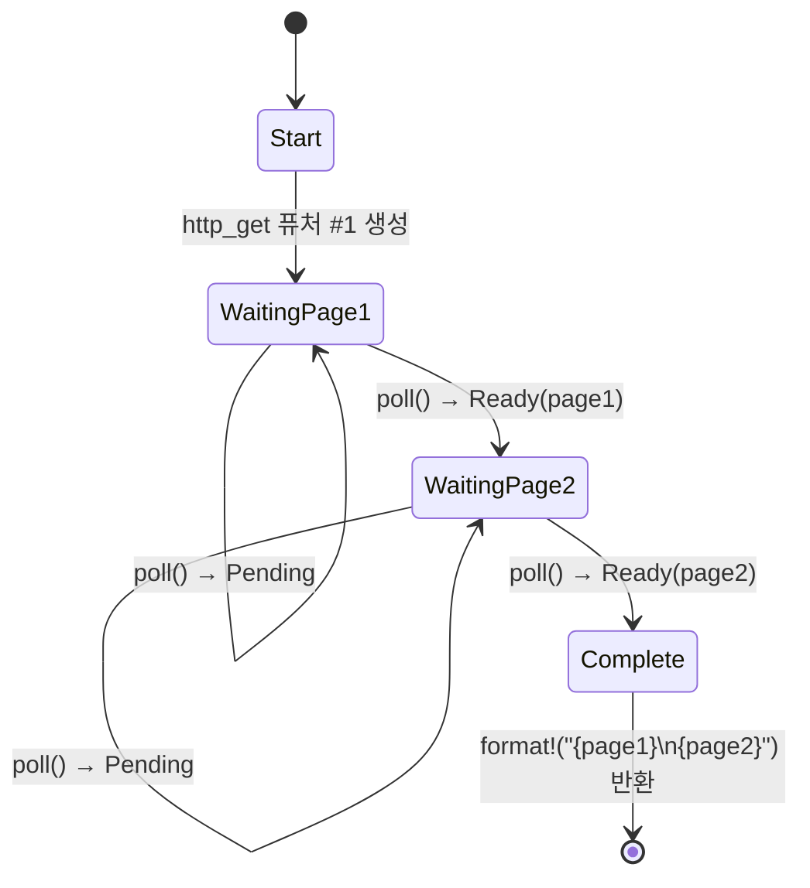

# 5. 상태 머신의 실체 🟢

> **학습 내용:**
> - 컴파일러가 `async fn`을 어떻게 열거형(enum) 상태 머신으로 변환하는지
> - 소스 코드와 생성된 상태의 일대일 비교
> - `async fn` 내의 대규모 스택 할당이 퓨처의 크기를 키우는 이유
> - 드롭 최적화: 더 이상 필요하지 않은 값은 즉시 드롭됨

## 컴파일러가 실제로 생성하는 것

여러분이 `async fn`을 작성하면, 컴파일러는 순차적으로 보이는 코드를 열거형 기반의 상태 머신으로 변환합니다. 이 변환 과정을 이해하는 것이 비동기 Rust의 성능 특성과 여러 독특한 동작들을 이해하는 핵심입니다.

### 일대일 비교: async fn vs 상태 머신

```rust
// 여러분이 작성하는 코드:
async fn fetch_two_pages() -> String {
    let page1 = http_get("https://example.com/a").await;
    let page2 = http_get("https://example.com/b").await;
    format!("{page1}\n{page2}")
}
```

컴파일러는 개념적으로 다음과 같은 것을 생성합니다:

```rust
enum FetchTwoPagesStateMachine {
    // 상태 0: page1을 위한 http_get 호출 직전
    Start,

    // 상태 1: page1을 기다리는 중, 퓨처를 보유함
    WaitingPage1 {
        fut1: HttpGetFuture,
    },

    // 상태 2: page1을 얻었고, page2를 기다리는 중
    WaitingPage2 {
        page1: String,
        fut2: HttpGetFuture,
    },

    // 최종 상태
    Complete,
}

impl Future for FetchTwoPagesStateMachine {
    type Output = String;

    fn poll(mut self: Pin<&mut Self>, cx: &mut Context<'_>) -> Poll<String> {
        loop {
            match self.as_mut().get_mut() {
                Self::Start => {
                    let fut1 = http_get("https://example.com/a");
                    *self.as_mut().get_mut() = Self::WaitingPage1 { fut1 };
                }
                Self::WaitingPage1 { fut1 } => {
                    let page1 = match Pin::new(fut1).poll(cx) {
                        Poll::Ready(v) => v,
                        Poll::Pending => return Poll::Pending,
                    };
                    let fut2 = http_get("https://example.com/b");
                    *self.as_mut().get_mut() = Self::WaitingPage2 { page1, fut2 };
                }
                Self::WaitingPage2 { page1, fut2 } => {
                    let page2 = match Pin::new(fut2).poll(cx) {
                        Poll::Ready(v) => v,
                        Poll::Pending => return Poll::Pending,
                    };
                    let result = format!("{page1}\n{page2}");
                    *self.as_mut().get_mut() = Self::Complete;
                    return Poll::Ready(result);
                }
                Self::Complete => panic!("완료된 후 폴링됨"),
            }
        }
    }
}
```

> **참고**: 이 역설탕화(desugaring)는 *개념적*인 것입니다. 실제 컴파일러 출력은
> `unsafe` 핀 투영(pin projections)을 사용합니다. 위 예시의 `get_mut()` 호출은
> `Unpin`을 요구하지만, 비동기 상태 머신은 `!Unpin`입니다. 여기서는 컴파일 가능한 코드를 만드는 것이 아니라 상태 전이를 설명하는 것이 목표입니다.



> **상태 내용물:**
> - **WaitingPage1** — `fut1: HttpGetFuture`를 저장함 (page2는 아직 할당되지 않음)
> - **WaitingPage2** — `page1: String`, `fut2: HttpGetFuture`를 저장함 (fut1은 드롭됨)

### 성능에 중요한 이유

**제로 비용(Zero-cost)**: 상태 머신은 스택에 할당되는 열거형입니다. 여러분이 명시적으로 `Box::pin()`을 사용하지 않는 한, 퓨처마다 힙 할당이 발생하지 않고, 가비지 컬렉터도 없으며, 박싱(boxing)도 없습니다.

**크기(Size)**: 열거형의 크기는 모든 변형(variant) 중 최대 크기입니다. 각 `.await` 지점은 새로운 변형을 생성합니다. 이는 다음을 의미합니다:

```rust
async fn small() {
    let a: u8 = 0;
    yield_now().await;
    let b: u8 = 0;
    yield_now().await;
}
// 크기 ≈ max(size_of(u8), size_of(u8)) + 식별자(discriminant) + 내부 퓨처 크기
//      ≈ 작음!

async fn big() {
    let buf: [u8; 1_000_000] = [0; 1_000_000]; // 스택에 1MB!
    some_io().await;
    process(&buf);
}
// 크기 ≈ 1MB + 내부 퓨처 크기
// ⚠️ 비동기 함수 내에서 거대한 버퍼를 스택에 할당하지 마세요!
// 대신 Vec<u8>이나 Box<[u8]>을 사용하세요.
```

**드롭 최적화(Drop optimization)**: 상태 머신이 전이될 때, 더 이상 필요하지 않은 값은 드롭됩니다. 위의 예에서 `WaitingPage1`에서 `WaitingPage2`로 전이될 때 `fut1`은 드롭됩니다. 컴파일러가 드롭 코드를 자동으로 삽입합니다.

> **실전 규칙**: `async fn` 내의 거대한 스택 할당은 퓨처의 크기를 부풀립니다.
> 비동기 코드에서 스택 오버플로가 발생한다면, 거대한 배열이나 깊게 중첩된 퓨처가 있는지 확인하세요.
> 필요한 경우 하위 퓨처를 힙에 할당하기 위해 `Box::pin()`을 사용하세요.

### 연습 문제: 상태 머신 예측하기

<details>
<summary>🏋️ 연습 문제 (클릭하여 확장)</summary>

**도전 과제**: 다음 비동기 함수가 주어졌을 때, 컴파일러가 생성할 상태 머신을 스케치해 보세요. 상태(열거형 변형)는 몇 개인가요? 각 상태에는 어떤 값이 저장되나요?

```rust
async fn pipeline(url: &str) -> Result<usize, Error> {
    let response = fetch(url).await?;
    let body = response.text().await?;
    let parsed = parse(body).await?;
    Ok(parsed.len())
}
```

<details>
<summary>🔑 정답</summary>

4개의 상태가 있습니다:

1. **Start** — `url` 저장
2. **WaitingFetch** — `url`, `fetch` 퓨처 저장
3. **WaitingText** — `response`, `text()` 퓨처 저장
4. **WaitingParse** — `body`, `parse` 퓨처 저장
5. **Done** — `Ok(parsed.len())` 반환됨

각 `.await`는 중단 지점(yield point) = 새로운 열거형 변형을 생성합니다. `?`는 조기 종료 경로를 추가하지만 추가 상태를 만들지는 않습니다. 이는 단지 `Poll::Ready` 값에 대한 `match`일 뿐입니다.

</details>
</details>

> **핵심 요약 — 상태 머신의 실체**
> - `async fn`은 각 `.await` 지점마다 하나의 변형을 가진 열거형으로 컴파일됩니다.
> - 퓨처의 **크기** = 모든 변형 크기 중 최대값입니다. 거대한 스택 값은 이 크기를 키웁니다.
> - 컴파일러는 상태 전이 시 자동으로 **드롭** 코드를 삽입합니다.
> - 퓨처 크기가 문제가 될 때는 `Box::pin()`이나 힙 할당을 사용하세요.

> **참고:** 생성된 열거형에 왜 피닝이 필요한지는 [4장 — Pin과 Unpin](ch04-pin-and-unpin.md)을, 이러한 상태 머신을 직접 만들어보려면 [6장 — 수동으로 Future 구현하기](ch06-building-futures-by-hand.md)를 참조하세요.

***
