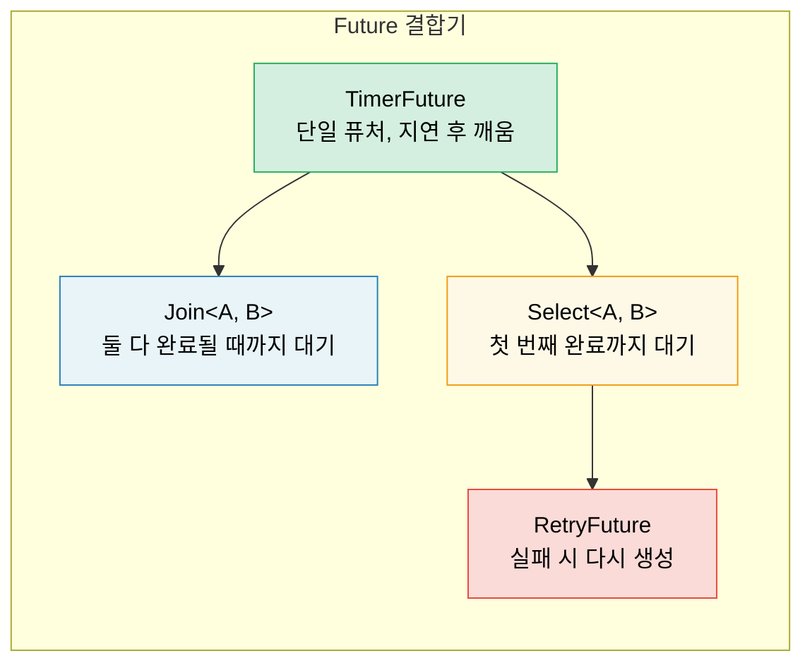

# 6. 수동으로 Future 구현하기 🟡

> **학습 내용:**
> - 스레드 기반 깨움(thread-based waking)을 이용한 `TimerFuture` 구현
> - `Join` 결합기(combinator) 구축: 두 퓨처를 동시에 실행하기
> - `Select` 결합기 구축: 두 퓨처의 경합(race) 처리
> - 결합기의 구성 방식 — 끝까지 퓨처로 이루어진 구조

## 간단한 타이머 퓨처 (Timer Future)

이제 기초부터 실제 유용한 퓨처를 만들어 보겠습니다. 이를 통해 2~5장에서 배운 이론을 확고히 다질 수 있습니다.

### TimerFuture: 완전한 예제

```rust
use std::future::Future;
use std::pin::Pin;
use std::sync::{Arc, Mutex};
use std::task::{Context, Poll, Waker};
use std::thread;
use std::time::{Duration, Instant};

pub struct TimerFuture {
    shared_state: Arc<Mutex<SharedState>>,
}

struct SharedState {
    completed: bool,
    waker: Option<Waker>,
}

impl TimerFuture {
    pub fn new(duration: Duration) -> Self {
        let shared_state = Arc::new(Mutex::new(SharedState {
            completed: false,
            waker: None,
        }));

        // 지정된 시간 후에 completed=true로 설정하는 스레드를 스폰합니다.
        let thread_shared_state = Arc::clone(&shared_state);
        thread::spawn(move || {
            thread::sleep(duration);
            let mut state = thread_shared_state.lock().unwrap();
            state.completed = true;
            if let Some(waker) = state.waker.take() {
                waker.wake(); // 실행기에 알림
            }
        });

        TimerFuture { shared_state }
    }
}

impl Future for TimerFuture {
    type Output = ();

    fn poll(self: Pin<&mut Self>, cx: &mut Context<'_>) -> Poll<()> {
        let mut state = self.shared_state.lock().unwrap();
        if state.completed {
            Poll::Ready(())
        } else {
            // 타이머 스레드가 우리를 깨울 수 있도록 웨이커를 저장합니다.
            // 중요: 실행기가 폴링 사이에 웨이커를 변경했을 수 있으므로
            // 항상 웨이커를 업데이트해야 합니다.
            state.waker = Some(cx.waker().clone());
            Poll::Pending
        }
    }
}

// 사용 예시:
// async fn example() {
//     println!("타이머 시작...");
//     TimerFuture::new(Duration::from_secs(2)).await;
//     println!("타이머 완료!");
// }
//
// ⚠️ 이 방식은 타이머마다 OS 스레드를 하나씩 생성합니다. 학습용으로는 괜찮지만,
// 운영 환경에서는 공유 타이머 휠(timer wheel)을 사용하고 추가 스레드가 필요 없는
// `tokio::time::sleep`을 사용하세요.
```

### Join: 두 퓨처를 동시에 실행하기

`Join`은 두 개의 퓨처를 폴링하고 *둘 다* 완료되었을 때 종료됩니다. 이것이 `tokio::join!`이 내부적으로 작동하는 방식입니다:

```rust
use std::future::Future;
use std::pin::Pin;
use std::task::{Context, Poll};

/// 두 퓨처를 동시에 폴링하고 결과를 튜플로 반환합니다.
pub struct Join<A, B>
where
    A: Future,
    B: Future,
{
    a: MaybeDone<A>,
    b: MaybeDone<B>,
}

enum MaybeDone<F: Future> {
    Pending(F),
    Done(F::Output),
    Taken, // 결과값이 이미 사용됨
}

impl<A, B> Join<A, B>
where
    A: Future,
    B: Future,
{
    pub fn new(a: A, b: B) -> Self {
        Join {
            a: MaybeDone::Pending(a),
            b: MaybeDone::Pending(b),
        }
    }
}

impl<A, B> Future for Join<A, B>
where
    A: Future + Unpin,
    B: Future + Unpin,
{
    type Output = (A::Output, B::Output);

    fn poll(mut self: Pin<&mut Self>, cx: &mut Context<'_>) -> Poll<Self::Output> {
        // 완료되지 않았다면 A를 폴링
        if let MaybeDone::Pending(ref mut fut) = self.a {
            if let Poll::Ready(val) = Pin::new(fut).poll(cx) {
                self.a = MaybeDone::Done(val);
            }
        }

        // 완료되지 않았다면 B를 폴링
        if let MaybeDone::Pending(ref mut fut) = self.b {
            if let Poll::Ready(val) = Pin::new(fut).poll(cx) {
                self.b = MaybeDone::Done(val);
            }
        }

        // 둘 다 완료되었나요?
        match (&self.a, &self.b) {
            (MaybeDone::Done(_), MaybeDone::Done(_)) => {
                // 두 결과값을 모두 가져옵니다.
                let a_val = match std::mem::replace(&mut self.a, MaybeDone::Taken) {
                    MaybeDone::Done(v) => v,
                    _ => unreachable!(),
                };
                let b_val = match std::mem::replace(&mut self.b, MaybeDone::Taken) {
                    MaybeDone::Done(v) => v,
                    _ => unreachable!(),
                };
                Poll::Ready((a_val, b_val))
            }
            _ => Poll::Pending, // 적어도 하나가 아직 진행 중임
        }
    }
}

// 사용 예시:
// let (page1, page2) = Join::new(
//     http_get("https://example.com/a"),
//     http_get("https://example.com/b"),
// ).await;
// 두 요청이 동시에 실행됩니다!
```

> **핵심 통찰**: 여기서 "동시(Concurrent)"는 *동일한 스레드에서 교차 실행됨*을 의미합니다.
> Join은 스레드를 생성하지 않으며, 단일 `poll()` 호출 내에서 두 퓨처를 모두 폴링합니다.
> 이는 병렬성(parallelism)이 아닌 협력적 동시성(cooperative concurrency)입니다.



### Select: 두 퓨처의 경합 (Race)

`Select`는 두 퓨처 중 *하나*라도 먼저 완료되면 종료됩니다 (나머지 하나는 드롭됩니다):

```rust
use std::future::Future;
use std::pin::Pin;
use std::task::{Context, Poll};

pub enum Either<A, B> {
    Left(A),
    Right(B),
}

/// 먼저 완료되는 퓨처를 반환하고, 다른 하나는 드롭합니다.
pub struct Select<A, B> {
    a: A,
    b: B,
}

impl<A, B> Select<A, B>
where
    A: Future + Unpin,
    B: Future + Unpin,
{
    pub fn new(a: A, b: B) -> Self {
        Select { a, b }
    }
}

impl<A, B> Future for Select<A, B>
where
    A: Future + Unpin,
    B: Future + Unpin,
{
    type Output = Either<A::Output, B::Output>;

    fn poll(mut self: Pin<&mut Self>, cx: &mut Context<'_>) -> Poll<Self::Output> {
        // A를 먼저 폴링
        if let Poll::Ready(val) = Pin::new(&mut self.a).poll(cx) {
            return Poll::Ready(Either::Left(val));
        }

        // 그 다음 B를 폴링
        if let Poll::Ready(val) = Pin::new(&mut self.b).poll(cx) {
            return Poll::Ready(Either::Right(val));
        }

        Poll::Pending
    }
}

// 타임아웃과 함께 사용 예시:
// match Select::new(http_get(url), TimerFuture::new(timeout)).await {
//     Either::Left(response) => println!("응답 받음: {}", response),
//     Either::Right(()) => println!("요청 시간 초과!"),
// }
```

> **공정성(Fairness) 참고**: 우리가 만든 `Select`는 항상 A를 먼저 폴링합니다. 둘 다 준비된 경우 항상 A가 이깁니다. Tokio의 `select!` 매크로는 공정성을 위해 폴링 순서를 무작위로 섞습니다.

<details>
<summary><strong>🏋️ 연습 문제: RetryFuture 구축하기</strong> (클릭하여 확장)</summary>

**도전 과제**: 클로저 `F: Fn() -> Fut`를 받아서 내부 퓨처가 `Err`를 반환할 경우 최대 N번까지 재시도하는 `RetryFuture<F, Fut>`를 구축하세요. 첫 번째 `Ok` 결과나 마지막 `Err`를 반환해야 합니다.

*힌트*: "실행 중인 시도"와 "모든 시도 소진"에 대한 상태가 필요합니다.

<details>
<summary>🔑 정답</summary>

```rust
use std::future::Future;
use std::pin::Pin;
use std::task::{Context, Poll};

pub struct RetryFuture<F, Fut, T, E>
where
    F: Fn() -> Fut,
    Fut: Future<Output = Result<T, E>> + Unpin,
{
    factory: F,
    current: Option<Fut>,
    remaining: usize,
    last_error: Option<E>,
}

impl<F, Fut, T, E> RetryFuture<F, Fut, T, E>
where
    F: Fn() -> Fut,
    Fut: Future<Output = Result<T, E>> + Unpin,
{
    pub fn new(max_attempts: usize, factory: F) -> Self {
        let current = Some((factory)());
        RetryFuture {
            factory,
            current,
            remaining: max_attempts.saturating_sub(1),
            last_error: None,
        }
    }
}

impl<F, Fut, T, E> Future for RetryFuture<F, Fut, T, E>
where
    F: Fn() -> Fut + Unpin,
    Fut: Future<Output = Result<T, E>> + Unpin,
    T: Unpin,
    E: Unpin,
{
    type Output = Result<T, E>;

    fn poll(mut self: Pin<&mut Self>, cx: &mut Context<'_>) -> Poll<Self::Output> {
        loop {
            if let Some(ref mut fut) = self.current {
                match Pin::new(fut).poll(cx) {
                    Poll::Ready(Ok(val)) => return Poll::Ready(Ok(val)),
                    Poll::Ready(Err(e)) => {
                        self.last_error = Some(e);
                        if self.remaining > 0 {
                            self.remaining -= 1;
                            self.current = Some((self.factory)());
                            // 새 퓨처를 즉시 폴링하기 위해 루프 반복
                        } else {
                            return Poll::Ready(Err(self.last_error.take().unwrap()));
                        }
                    }
                    Poll::Pending => return Poll::Pending,
                }
            } else {
                return Poll::Ready(Err(self.last_error.take().unwrap()));
            }
        }
    }
}

// 사용 예시:
// let result = RetryFuture::new(3, || async {
//     http_get("https://flaky-server.com/api").await
// }).await;
```

**핵심 요약**: 재시도 퓨처 자체가 하나의 상태 머신입니다. 현재 시도를 보유하고 실패 시 새로운 내부 퓨처를 생성합니다. 이것이 결합기가 구성되는 방식입니다. 끝까지 퓨처로 이루어진 구조이죠.

</details>
</details>

> **핵심 요약 — 수동으로 Future 구현하기**
> - 퓨처에는 상태, `poll()` 구현, 그리고 웨이커 등록이라는 세 가지가 필요합니다.
> - `Join`은 모든 하위 퓨처를 폴링하고, `Select`는 가장 먼저 끝나는 것을 반환합니다.
> - 결합기는 다른 퓨처를 감싸는 퓨처 그 자체입니다.
> - 퓨처를 수동으로 구축해보면 깊은 통찰을 얻을 수 있지만, 운영 환경에서는 `tokio::join!`/`select!`를 사용하세요.

> **참고:** 트레이트 정의는 [2장 — Future 트레이트](ch02-the-future-trait.md)를, 운영 수준의 대안은 [8장 — Tokio 심층 분석](ch08-tokio-deep-dive.md)을 참조하세요.

***
