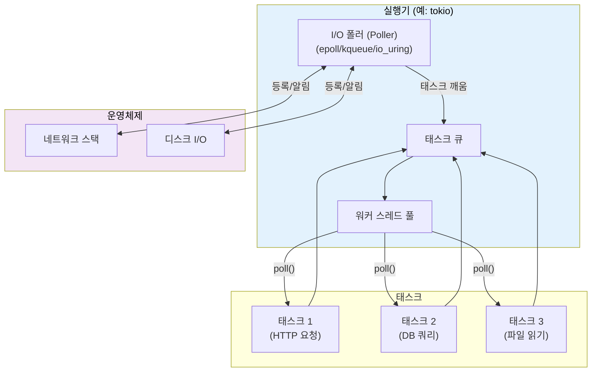
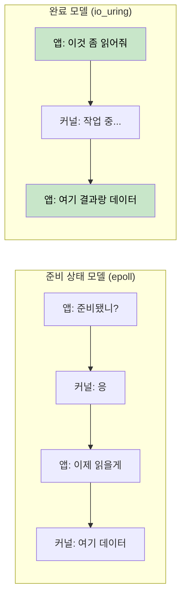
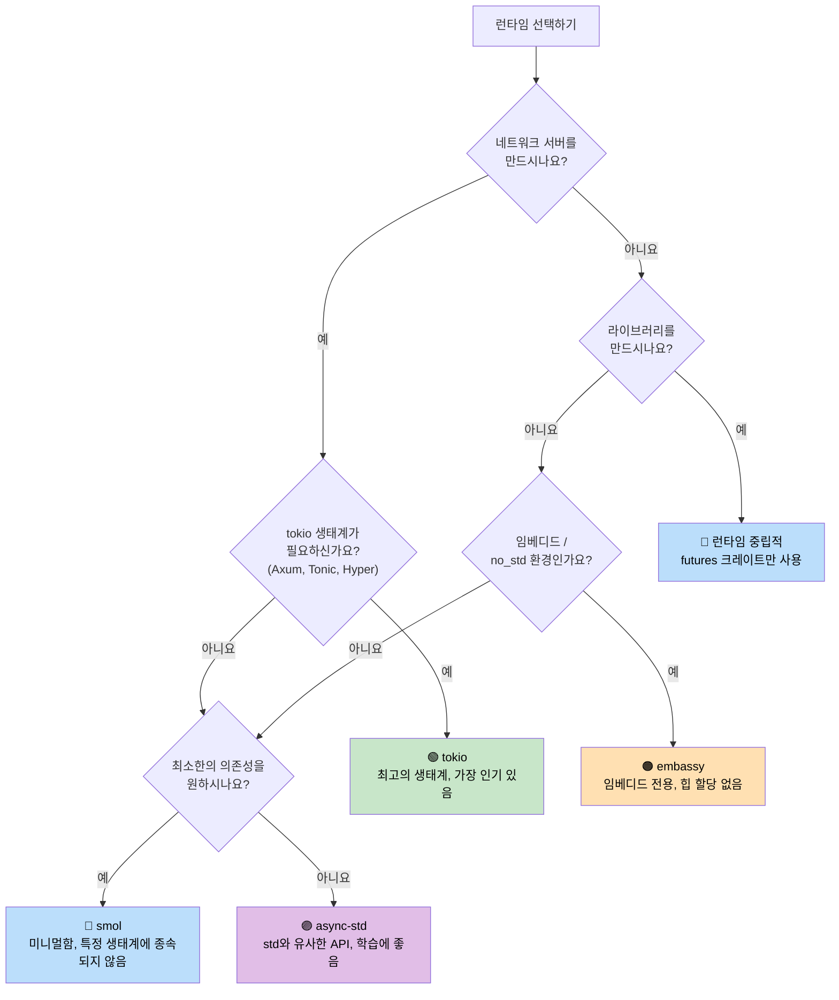

# 7. 실행기와 런타임 🟡

> **학습 내용:**
> - 실행기(executor)의 역할: 효율적인 폴링(poll)과 잠자기(sleep)
> - 6가지 주요 런타임: mio, io_uring, tokio, async-std, smol, embassy
> - 적합한 런타임 선택을 위한 의사 결정 트리
> - 런타임 중립적(runtime-agnostic) 라이브러리 설계가 중요한 이유

## 실행기의 역할

실행기는 두 가지 일을 합니다:
1. 진행할 준비가 된 **퓨처를 폴링**합니다.
2. 준비된 퓨처가 없을 때 (OS I/O 알림 API를 사용하여) **효율적으로 잠듭니다.**



### mio: 기초 계층

[mio](https://github.com/tokio-rs/mio) (Metal I/O)는 실행기가 아닙니다. 이는 가장 낮은 수준의 크로스 플랫폼 I/O 알림 라이브러리입니다. `epoll`(Linux), `kqueue`(macOS/BSD), IOCP(Windows)를 감싸고 있습니다.

```rust
// 개념적인 mio 사용 예시 (단순화됨):
use mio::{Events, Interest, Poll, Token};
use mio::net::TcpListener;

let mut poll = Poll::new()?;
let mut events = Events::with_capacity(128);

let mut server = TcpListener::bind("0.0.0.0:8080")?;
poll.registry().register(&mut server, Token(0), Interest::READABLE)?;

// 이벤트 루프 — 이벤트가 발생할 때까지 블록됨
loop {
    poll.poll(&mut events, None)?; // I/O 이벤트까지 잠듦
    for event in events.iter() {
        match event.token() {
            Token(0) => { /* 서버에 새로운 연결이 들어옴 */ }
            _ => { /* 다른 I/O 준비됨 */ }
        }
    }
}
```

대부분의 개발자는 mio를 직접 만지지 않습니다. tokio와 smol이 그 위에서 구축됩니다.

### io_uring: 완료 기반(Completion-Based) 퓨처

리눅스의 `io_uring`(커널 5.1 이상)은 mio/epoll이 사용하는 준비 상태 기반(readiness-based) I/O 모델에서 근본적인 변화를 나타냅니다:

```text
준비 상태 기반 (epoll / mio / tokio):
  1. 질문: "이 소켓이 읽기 가능한가요?"     → epoll_wait()
  2. 커널: "네, 준비됐습니다"               → EPOLLIN 이벤트
  3. 앱:   read(fd, buf)                    → 여전히 잠깐 블록될 수 있음!

완료 기반 (io_uring):
  1. 제출: "이 소켓에서 이 버퍼로 읽어주세요"  → SQE (Submission Queue Entry)
  2. 커널: 비동기적으로 읽기 수행
  3. 앱:   데이터와 함께 완료 결과를 받음      → CQE (Completion Queue Entry)
```



**소유권 문제**: io_uring은 작업이 완료될 때까지 커널이 버퍼를 소유해야 합니다. 이는 버퍼를 빌려오는(borrow) Rust의 표준 `AsyncRead` 트레이트와 충돌합니다. 이것이 `tokio-uring`이 다른 I/O 트레이트를 가지는 이유입니다:

```rust
// 표준 tokio (준비 상태 기반) — 버퍼를 빌려옴:
let n = stream.read(&mut buf).await?;  // buf가 빌려짐

// tokio-uring (완료 기반) — 버퍼의 소유권을 가져감:
let (result, buf) = stream.read(buf).await;  // buf가 들어갔다가 다시 반환됨
let n = result?;
```

```rust
// Cargo.toml: tokio-uring = "0.5"
// 참고: 리눅스 전용, 커널 5.1+ 필요

fn main() {
    tokio_uring::start(async {
        let file = tokio_uring::fs::File::open("data.bin").await.unwrap();
        let buf = vec![0u8; 4096];
        let (result, buf) = file.read_at(buf, 0).await;
        let bytes_read = result.unwrap();
        println!("{} 바이트 읽음: {:?}", bytes_read, &buf[..bytes_read]);
    });
}
```

| 특징 | epoll (tokio) | io_uring (tokio-uring) |
|--------|--------------|----------------------|
| **모델** | 준비 상태 알림 | 완료 알림 |
| **시스템 콜** | epoll_wait + read/write | 배치 처리된 SQE/CQE 링 |
| **버퍼 소유권** | 앱이 유지 (&mut buf) | 소유권 이전 (buf 이동) |
| **플랫폼** | 리눅스, macOS (kqueue), 윈도우 (IOCP) | 리눅스 5.1+ 전용 |
| **제로 카피** | 없음 (유저 공간 복사) | 있음 (등록된 버퍼) |
| **성숙도** | 운영 환경 준비 완료 | 실험적 |

> **io_uring을 사용해야 할 때**: 시스템 콜 오버헤드가 병목인 고성능 파일 I/O나 네트워킹(데이터베이스, 스토리지 엔진, 10만 개 이상의 연결을 처리하는 프록시). 대부분의 애플리케이션에는 epoll을 사용하는 표준 tokio가 적합합니다.

### tokio: 필요한 모든 것이 포함된 런타임

Rust 생태계에서 가장 지배적인 비동기 런타임입니다. Axum, Hyper, Tonic 및 대부분의 운영 환경 Rust 서버에서 사용됩니다.

```rust
// Cargo.toml:
// [dependencies]
// tokio = { version = "1", features = ["full"] }

#[tokio::main]
async fn main() {
    // 워크 스틸링(work-stealing) 스케줄러가 있는 멀티스레드 런타임 생성
    let handle = tokio::spawn(async {
        tokio::time::sleep(std::time::Duration::from_secs(1)).await;
        "완료"
    });

    let result = handle.await.unwrap();
    println!("{result}");
}
```

**tokio 기능**: 타이머, I/O, TCP/UDP, Unix 소켓, 시그널 처리, 동기화 기본 요소(Mutex, RwLock, Semaphore, 채널), fs, 프로세스, tracing 연동.

### async-std: 표준 라이브러리 미러링

`std` API를 비동기 버전으로 미러링합니다. tokio보다 인기는 적지만 초보자에게 더 단순하게 느껴질 수 있습니다.

```rust
// Cargo.toml:
// [dependencies]
// async-std = { version = "1", features = ["attributes"] }

#[async_std::main]
async fn main() {
    use async_std::fs;
    let content = fs::read_to_string("hello.txt").await.unwrap();
    println!("{content}");
}
```

### smol: 미니멀리스트 런타임

작고 의존성이 없는 비동기 런타임입니다. tokio를 끌어들이지 않고 비동기를 사용하려는 라이브러리에 적합합니다.

```rust
// Cargo.toml:
// [dependencies]
// smol = "2"

fn main() {
    smol::block_on(async {
        let result = smol::unblock(|| {
            // 스레드 풀에서 블로킹 코드 실행
            std::fs::read_to_string("hello.txt")
        }).await.unwrap();
        println!("{result}");
    });
}
```

### embassy: 임베디드용 비동기 (no_std)

임베디드 시스템용 비동기 런타임입니다. 힙 할당이 필요 없고 `std` 없이 작동합니다.

```rust
// 마이크로컨트롤러(예: STM32, nRF52, RP2040)에서 실행
#[embassy_executor::main]
async fn main(spawner: embassy_executor::Spawner) {
    // async/await로 LED 깜빡이기 — RTOS가 필요 없습니다!
    let mut led = Output::new(p.PA5, Level::Low, Speed::Low);
    loop {
        led.set_high();
        Timer::after(Duration::from_millis(500)).await;
        led.set_low();
        Timer::after(Duration::from_millis(500)).await;
    }
}
```

### 런타임 결정 트리



### 런타임 비교표

| 기능 | tokio | async-std | smol | embassy |
|---------|-------|-----------|------|---------|
| **생태계** | 독보적 | 작음 | 미미함 | 임베디드 |
| **멀티스레드** | ✅ 워크 스틸링 | ✅ | ✅ | ❌ (단일 코어) |
| **no_std** | ❌ | ❌ | ❌ | ✅ |
| **타이머** | ✅ 내장 | ✅ 내장 | `async-io` 사용 | ✅ HAL 기반 |
| **I/O** | ✅ 독자 추상화 | ✅ std 미러링 | `async-io` 사용 | ✅ HAL 드라이버 |
| **채널** | ✅ 다양함 | ✅ | `async-channel` 사용 | ✅ |
| **학습 곡선** | 중간 | 낮음 | 낮음 | 높음 (HW 지식 필요) |
| **바이너리 크기** | 큼 | 중간 | 작음 | 매우 작음 |

<details>
<summary><strong>🏋️ 연습 문제: 런타임 비교</strong> (클릭하여 확장)</summary>

**도전 과제**: 세 가지 다른 런타임(tokio, smol, async-std)을 사용하여 동일한 프로그램을 작성하세요. 프로그램은 다음을 수행해야 합니다:
1. URL 호출 (sleep으로 시뮬레이션)
2. 파일 읽기 (sleep으로 시뮬레이션)
3. 두 결과를 출력

이 연습 문제는 async/await 코드는 동일하며 런타임 설정만 다르다는 것을 보여줍니다.

<details>
<summary>🔑 정답</summary>

```rust
// ----- tokio 버전 -----
// Cargo.toml: tokio = { version = "1", features = ["full"] }
#[tokio::main]
async fn main() {
    let (url_result, file_result) = tokio::join!(
        async {
            tokio::time::sleep(std::time::Duration::from_millis(100)).await;
            "URL 응답"
        },
        async {
            tokio::time::sleep(std::time::Duration::from_millis(50)).await;
            "파일 내용"
        },
    );
    println!("URL: {url_result}, 파일: {file_result}");
}

// ----- smol 버전 -----
// Cargo.toml: smol = "2", futures-lite = "2"
fn main() {
    smol::block_on(async {
        let (url_result, file_result) = futures_lite::future::zip(
            async {
                smol::Timer::after(std::time::Duration::from_millis(100)).await;
                "URL 응답"
            },
            async {
                smol::Timer::after(std::time::Duration::from_millis(50)).await;
                "파일 내용"
            },
        ).await;
        println!("URL: {url_result}, 파일: {file_result}");
    });
}

// ----- async-std 버전 -----
// Cargo.toml: async-std = { version = "1", features = ["attributes"] }
#[async_std::main]
async fn main() {
    let (url_result, file_result) = futures::future::join(
        async {
            async_std::task::sleep(std::time::Duration::from_millis(100)).await;
            "URL 응답"
        },
        async {
            async_std::task::sleep(std::time::Duration::from_millis(50)).await;
            "파일 내용"
        },
    ).await;
    println!("URL: {url_result}, 파일: {file_result}");
}
```

**핵심 요약**: 비동기 비즈니스 로직은 런타임 간에 동일합니다. 진입점과 타이머/IO API만 다릅니다. 이것이 `std::future::Future`만을 사용하여 런타임 중립적인 라이브러리를 작성하는 것이 가치 있는 이유입니다.

</details>
</details>

> **핵심 요약 — 실행기와 런타임**
> - 실행기의 역할은 깨어난 퓨처를 폴링하고 OS I/O API를 사용하여 효율적으로 잠드는 것입니다.
> - **tokio**는 서버용 기본 선택지이며, **smol**은 최소한의 설치 공간에, **embassy**는 임베디드에 적합합니다.
> - 비즈니스 로직은 특정 런타임이 아니라 `std::future::Future`에 의존해야 합니다.
> - io_uring(리눅스 5.1+)은 고성능 I/O의 미래이지만 아직 생태계가 성숙해가는 중입니다.

> **참고:** tokio의 상세 내용은 [8장 — Tokio 심층 분석](ch08-tokio-deep-dive.md)을, 다른 대안들은 [9장 — Tokio가 적합하지 않은 경우](ch09-when-tokio-isnt-the-right-fit.md)를 참조하세요.

***
