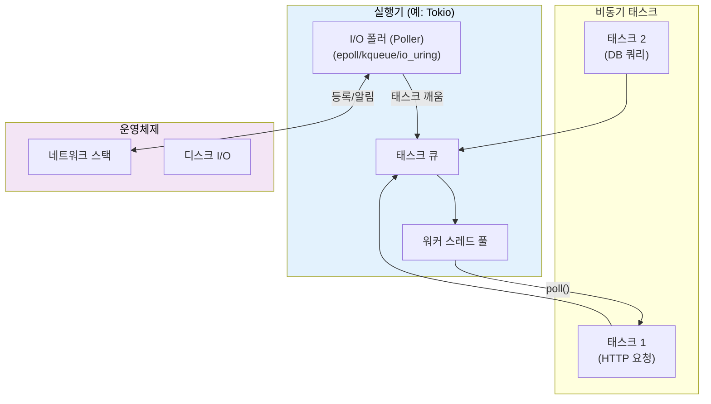
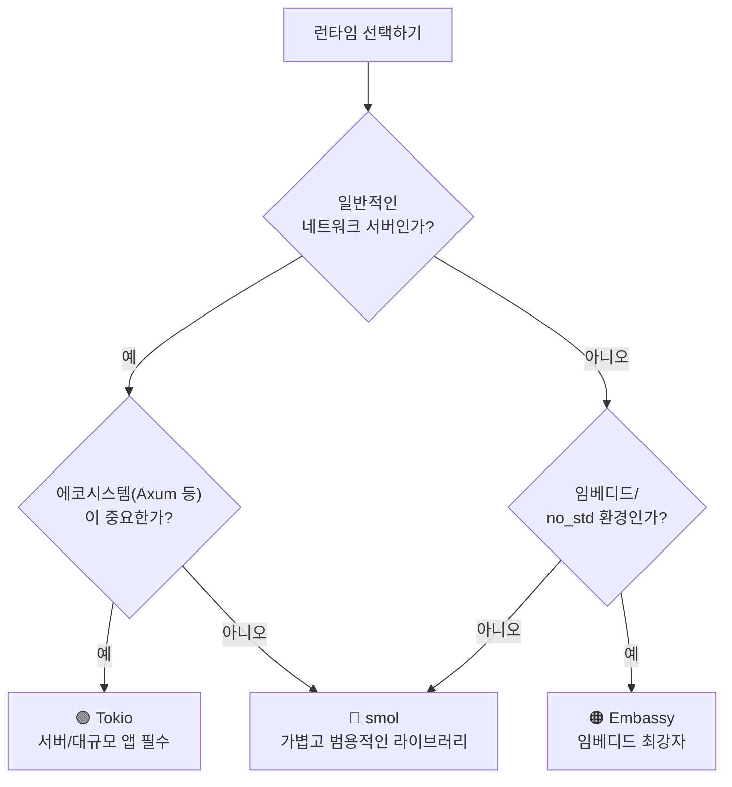

# 7. 실행기와 런타임: 비동기의 엔진 🟡

> **학습 목표:**
> - 실행기(Executor)의 역할인 **효율적인 폴링(Poll)**과 **대기(Sleep)** 메커니즘을 이해합니다.
> - 주요 런타임인 **Mio, io_uring, Tokio, async-std, smol, Embassy**의 특징을 비교합니다.
> - 프로젝트 성격에 맞는 최적의 런타임 선택법을 익힙니다.
> - 특정 런타임에 종속되지 않는 **런타임 중립적(Runtime-agnostic)** 라이브러리 설계의 중요성을 배웁니다.

---

### 실행기의 역할: "누가 퓨처를 깨우는가?"
퓨처는 스스로 실행되지 않습니다. 실행기는 다음 두 가지 핵심 작업을 수행합니다.
1.  진행 준비가 된 **퓨처를 폴링**합니다.
2.  준비된 퓨처가 없으면 OS의 I/O 알림 API(epoll, kqueue 등)를 활용해 **효율적으로 잠듭니다.**

---

### 주요 런타임 한눈에 보기

#### ① 기초 계층: Mio (Metal I/O)
실행기는 아니지만, `epoll`(Linux), `kqueue`(macOS), `IOCP`(Windows)를 추상화한 가장 낮은 수준의 I/O 라이브러리입니다. 대부분의 고수준 런타임이 이 위에서 동작합니다.

#### ② 고성능의 미래: io_uring (Linux 5.1+)
기존의 '준비 상태 알림' 방식(epoll)에서 벗어난 '완료 알림' 방식의 I/O 모델입니다. 커널과 애플리케이션 간의 시스템 콜 오버헤드를 줄여 압도적인 성능을 냅니다.

#### ③ 업계 표준: Tokio
가장 지배적인 런타임입니다. 방대한 생태계(Axum, Hyper 등)를 가지고 있으며, 운영 환경에서 검증된 안정성을 제공합니다. 특별한 이유가 없다면 **서버 개발에는 Tokio**를 추천합니다.

#### ④ 미니멀리스트: smol & async-std
Tokio의 거대한 규모가 부담스러울 때 좋은 대안입니다. `smol`은 작고 가벼우며, `async-std`는 표준 라이브러리와 유사한 API를 제공합니다.

#### ⑤ 임베디드: Embassy
가비지 컬렉터는 물론, 힙(Heap) 메모리 할당조차 필요 없는 초경량 런타임입니다. 마이크로컨트롤러 환경에서 비동기 프로그래밍을 가능하게 합니다.

---

### 💡 실무 팁: 어떤 런타임을 골라야 할까?

---

### 📌 요약
- 실행기는 깨어난 퓨처를 실행하고, 놀 때는 OS와 협력하여 잠듭니다.
- **Tokio**는 서버 개발의 사실상 표준입니다.
- **io_uring**은 고성능 I/O의 미래이지만 학습 곡선이 높습니다.
- 라이브러리를 만들 때는 특정 런타임에 의존하지 않도록 설계하는 것이 좋습니다.

