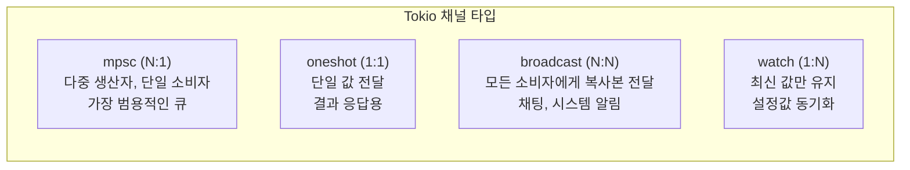

# 8. Tokio 심층 분석: 실전 활용 가이드 🟡

> **학습 목표:**
> - **멀티스레드**와 **현재 스레드** 런타임의 차이점과 적절한 사용 시점을 구분합니다.
> - `tokio::spawn`의 핵심 제약 조건인 **`'static`**과 **`Send`**의 의미를 파악합니다.
> - **`JoinHandle`**을 통한 태스크 관리 및 취소(Abort) 메커니즘을 익힙니다.
> - 비동기 환경에 최적화된 **동기화 도구**(Mutex, Semaphore)와 **4가지 채널**의 용도를 완벽히 정리합니다.

---

### 런타임 선택: 멀티스레드 vs 현재 스레드
Tokio는 필요에 따라 두 가지 모드로 운영할 수 있습니다.

| **종류** | **특징** | **주요 용도** |
| :--- | :--- | :--- |
| **Multi-thread** (기본값) | 워크 스틸링(Work-stealing) 방식의 스레드 풀 사용. 태스크가 여러 CPU 코어에 분산됨. | 고성능 서버(Axum 등), 병렬 처리가 중요한 앱 |
| **Current-thread** | 단일 스레드 내에서만 모든 비동기 태스크 실행. `Send` 제약이 없어 코드가 단순해짐. | CLI 도구, 가벼운 앱, WASM, 단위 테스트 |

---

### `tokio::spawn`: 비동기 태스크의 독립 선언
`tokio::spawn`은 퓨처를 런타임의 대기열(Queue)에 넣고 즉시 다음 코드로 넘어갑니다. 이때 두 가지 중요한 약속이 필요합니다.

1.  **`'static`**: 스폰된 태스크는 언제 끝날지 모릅니다. 따라서 태스크가 사용하는 모든 데이터는 소유권이 태스크 내부에 있거나, 영원히 살아있어야 합니다. (그래서 보통 `async move`를 씁니다.)
2.  **`Send`**: 멀티스레드 환경에서는 태스크가 실행 도중 다른 스레드로 옮겨갈 수 있습니다. 따라서 태스크 내부의 데이터는 스레드 간 이동이 안전해야 합니다. (`Rc` 대신 `Arc`를 써야 하는 이유입니다.)

---

### 태스크 관리: `JoinHandle`과 취소(Abort)
`tokio::spawn`이 반환하는 `JoinHandle`은 태스크와의 유일한 연결 고리입니다.

- **주의!**: 핸들을 드롭한다고 해서 태스크가 취소되지는 않습니다. 태스크는 백그라운드에서 계속 돌아갑니다.
- **취소하려면?**: 명시적으로 `handle.abort()`를 호출해야 합니다.

---

### 비동기 통신의 핵심: 채널(Channels) 4인방

| **채널 명칭** | **사용 사례** |
| :--- | :--- |
| **mpsc** | 여러 API 핸들러에서 백그라운드 처리기로 이벤트 전송 |
| **oneshot** | 특정 작업의 완료 여부나 결과를 한 번만 받아야 할 때 |
| **broadcast** | 서버 종료 신호를 모든 연결된 클라이언트에게 뿌릴 때 |
| **watch** | 런타임 중 변경되는 설정값을 여러 워커가 실시간으로 참조할 때 |

---

### 💡 실무 팁: `std::sync::Mutex`를 비동기 코드에서 쓰지 마세요
`.await` 지점을 넘어서 락(`MutexGuard`)을 들고 있으면, 해당 워커 스레드 자체가 블록되어 전체 시스템 성능이 급감하거나 교착 상태(Deadlock)에 빠질 수 있습니다. 반드시 **`tokio::sync::Mutex`**를 사용하거나, 락 범위를 최소화하여 `.await` 전에 해제되도록 설계하세요.

---

### 🏋️ 연습 문제: 동시성 제한하기
**도전 과제:** `tokio::sync::Semaphore`를 사용하여, 총 100개의 비동기 작업을 수행하되 **동시에 실행되는 작업은 딱 10개**로 제한하는 로직을 작성해 보세요.

🔑 정답 및 힌트 보기

`Arc<Semaphore>`를 생성하고, `tokio::spawn` 내부에서 작업을 시작하기 전에 `semaphore.acquire().await`를 통해 허가증(Permit)을 얻으면 됩니다. 작업이 끝나면 가드(`SemaphorePermit`)가 자동으로 드롭되면서 다음 대기 태스크에게 자리를 양보하게 됩니다.

---

### 📌 요약
- 서버 환경에선 **멀티스레드 런타임**이 기본이며, 태스크는 **`'static` + `Send`**여야 합니다.
- `JoinHandle`을 통해 태스크를 제어하되, 취소 시엔 **`abort()`**를 잊지 마세요.
- 상황에 맞는 **채널**(mpsc, oneshot 등) 선택이 깨끗한 비동기 아키텍처의 시작입니다.
- 비동기 전용 **Mutex**와 **Semaphore**를 활용해 안전하게 데이터를 공유하세요.

