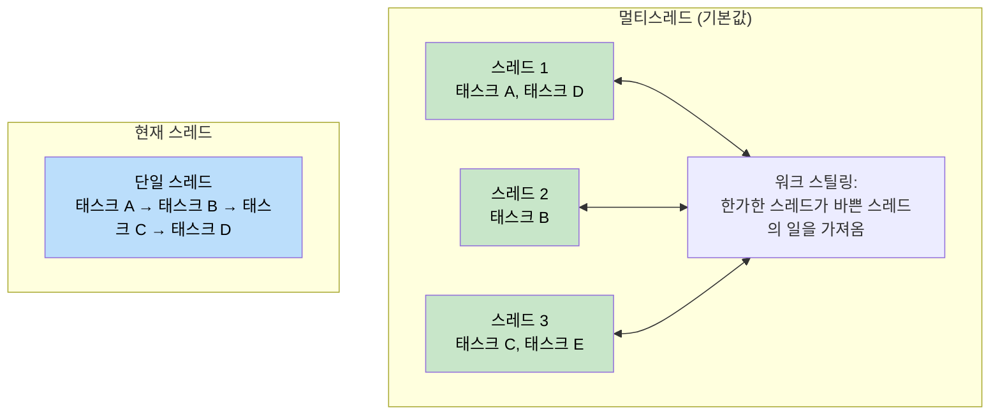
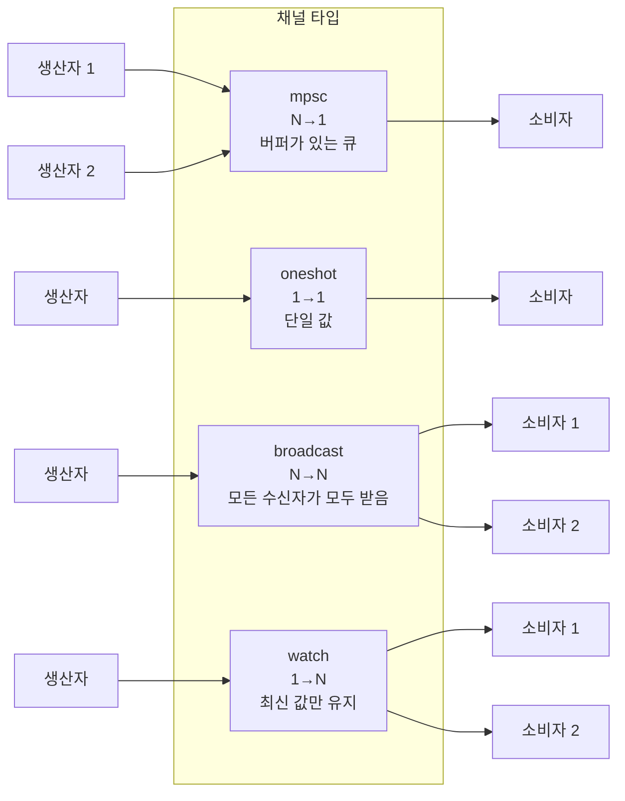
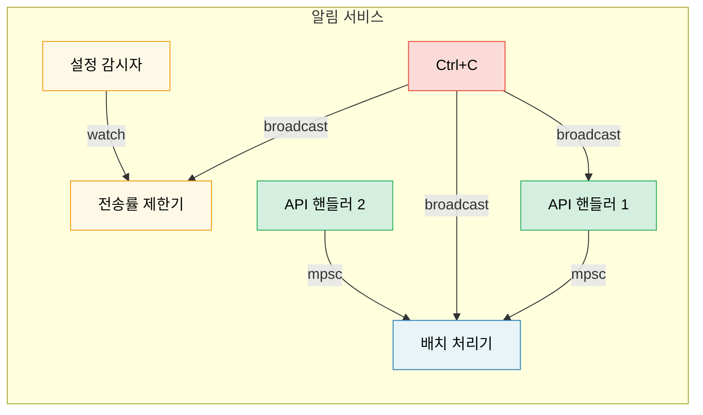

# 8. Tokio 심층 분석 🟡

> **학습 내용:**
> - 런타임 종류: 멀티스레드(multi-thread) vs 현재 스레드(current-thread) 및 각각의 사용 시점
> - `tokio::spawn`, `'static` 요구 사항, 그리고 `JoinHandle`
> - 태스크 취소 의미론 (드롭 시 취소)
> - 동기화 기본 요소: Mutex, RwLock, Semaphore 및 4가지 채널 타입

## 런타임 종류: 멀티스레드 vs 현재 스레드

Tokio는 두 가지 런타임 구성을 제공합니다:

```rust
// 멀티스레드 (#[tokio::main]의 기본값)
// 워크 스틸링(work-stealing) 스레드 풀을 사용 — 태스크가 스레드 간에 이동할 수 있음
#[tokio::main]
async fn main() {
    // N개의 워커 스레드 (기본값 = CPU 코어 수)
    // 태스크는 Send + 'static이어야 함
}

// 현재 스레드 (current-thread) — 모든 것이 하나의 스레드에서 실행됨
#[tokio::main(flavor = "current_thread")]
async fn main() {
    // 단일 스레드 — 태스크가 Send일 필요가 없음
    // 가볍고, 단순한 도구나 WASM에 적합함
}

// 수동 런타임 생성:
let rt = tokio::runtime::Builder::new_multi_thread()
    .worker_threads(4)
    .enable_all()
    .build()
    .unwrap();

rt.block_on(async {
    println!("커스텀 런타임에서 실행 중");
});
```



### tokio::spawn과 'static 요구 사항

`tokio::spawn`은 퓨처를 런타임의 태스크 큐에 넣습니다. 언제 어느 워커 스레드에서든 실행될 수 있기 때문에, 퓨처는 `Send + 'static`이어야 합니다:

```rust
use tokio::task;

async fn example() {
    let data = String::from("hello");

    // ✅ 작동함: 태스크 내부로 소유권을 이동시킴
    let handle = task::spawn(async move {
        println!("{data}");
        data.len()
    });

    let len = handle.await.unwrap();
    println!("길이: {len}");
}

async fn problem() {
    let data = String::from("hello");

    // ❌ 실패: data가 빌려졌으며 'static이 아님
    // task::spawn(async {
    //     println!("{data}"); // `data`를 빌림 — 'static이 아님
    // });

    // ❌ 실패: Rc는 Send가 아님
    // let rc = std::rc::Rc::new(42);
    // task::spawn(async move {
    //     println!("{rc}"); // Rc는 !Send — 스레드 경계를 넘을 수 없음
    // });
}
```

**왜 `'static`인가요?** 스폰된 태스크는 독립적으로 실행됩니다. 생성한 범위를 벗어나서 더 오래 살 수도 있습니다. 컴파일러는 참조가 계속 유효할지 증명할 수 없으므로 소유된 데이터를 요구합니다.

**왜 `Send`인가요?** 태스크가 중단된 지점이 아닌 다른 스레드에서 재개될 수 있습니다. `.await` 지점을 넘어서 유지되는 모든 데이터는 스레드 간에 안전하게 이동할 수 있어야 합니다.

```rust
// 일반적인 패턴: 공유 데이터를 태스크 내부로 클론함
let shared = Arc::new(config);

for i in 0..10 {
    let shared = Arc::clone(&shared); // 데이터가 아니라 Arc를 클론함
    tokio::spawn(async move {
        process_item(i, &shared).await;
    });
}
```

### JoinHandle과 태스크 취소

```rust
use tokio::task::JoinHandle;
use tokio::time::{sleep, Duration};

async fn cancellation_example() {
    let handle: JoinHandle<String> = tokio::spawn(async {
        sleep(Duration::from_secs(10)).await;
        "완료됨".to_string()
    });

    // 핸들을 드롭해서 태스크를 취소하나요? 아니요 — 태스크는 계속 실행됩니다!
    // drop(handle); // 태스크는 백그라운드에서 계속 진행됨

    // 실제로 취소하려면 abort()를 호출해야 합니다:
    handle.abort();

    // 중단된 태스크를 await하면 JoinError를 반환합니다.
    match handle.await {
        Ok(val) => println!("결과: {val}"),
        Err(e) if e.is_cancelled() => println!("태스크가 취소됨"),
        Err(e) => println!("태스크 패닉 발생: {e}"),
    }
}
```

> **중요**: tokio에서 `JoinHandle`을 드롭해도 태스크가 취소되지 않습니다.
> 태스크는 *분리(detached)*되어 계속 실행됩니다. 취소하려면 명시적으로
> `.abort()`를 호출해야 합니다. 이는 `Future`를 직접 드롭하는 것과는 다릅니다.
> `Future`를 드롭하면 해당 계산 자체가 즉시 중단되고 드롭됩니다.

### Tokio 동기화 기본 요소

Tokio는 비동기 환경을 고려한 동기화 기본 요소를 제공합니다. 핵심 원칙은 **`.await` 지점을 넘어서 `std::sync::Mutex`를 사용하지 마세요**입니다.

```rust
use tokio::sync::{Mutex, RwLock, Semaphore, mpsc, oneshot, broadcast, watch};

// --- Mutex ---
// 비동기 Mutex: lock() 메서드가 비동기이며 스레드를 블록하지 않습니다.
let data = Arc::new(Mutex::new(vec![1, 2, 3]));
{
    let mut guard = data.lock().await; // 비차단 락
    guard.push(4);
} // guard가 여기서 드롭됨 — 락 해제

// --- 채널 (Channels) ---
// mpsc: 다중 생산자, 단일 소비자 (Multiple producer, single consumer)
let (tx, mut rx) = mpsc::channel::<String>(100); // 버퍼 크기가 정해진 큐

tokio::spawn(async move {
    tx.send("안녕하세요".into()).await.unwrap();
});

let msg = rx.recv().await.unwrap();

// oneshot: 단일 값, 단일 소비자
let (tx, rx) = oneshot::channel::<i32>();
tx.send(42).unwrap(); // await 필요 없음 — 즉시 성공하거나 실패함
let val = rx.await.unwrap();

// broadcast: 다중 생산자, 다중 소비자 (모든 소비자가 모든 메시지를 받음)
let (tx, _) = broadcast::channel::<String>(100);
let mut rx1 = tx.subscribe();
let mut rx2 = tx.subscribe();

// watch: 단일 값, 다중 소비자 (오직 최신 값만 유지)
let (tx, rx) = watch::channel(0u64);
tx.send(42).unwrap();
println!("최신 값: {}", *rx.borrow());
```

> **참고:** 이 채널 예제들에서는 간결함을 위해 `.unwrap()`을 사용했습니다.
> 운영 환경에서는 에러를 우아하게 처리하세요. `.send()` 실패는 수신자가 드롭되었음을,
> `.recv()` 실패는 채널이 닫혔음을 의미합니다.



## 사례 연구: 알림 서비스를 위한 적절한 채널 선택

다음과 같은 요구 사항이 있는 알림 서비스를 구축한다고 가정해 봅시다:
- 여러 API 핸들러가 이벤트를 생성함
- 단일 백그라운드 태스크가 이들을 배치 처리하여 전송함
- 설정 감시자가 런타임에 전송률 제한(rate limits)을 업데이트함
- 종료 시그널이 모든 컴포넌트에 도달해야 함

**각각 어떤 채널을 사용할까요?**

| 요구 사항 | 채널 | 이유 |
|-------------|---------|-----|
| API 핸들러 → 배치 처리기 | `mpsc` (제한됨) | N명의 생산자, 1명의 소비자. 백프레셔(backpressure)를 위해 버퍼를 제한함 — 배치 처리기가 지연되면 메모리 부족(OOM) 대신 API 핸들러가 느려지게 함 |
| 설정 감시자 → 전송률 제한기 | `watch` | 최신 설정만 중요함. 여러 읽기 주체(각 워커)가 현재 값을 확인해야 함 |
| 종료 시그널 → 모든 컴포넌트 | `broadcast` | 모든 컴포넌트가 독립적으로 종료 알림을 받아야 함 |
| 단일 상태 확인(health-check) 응답 | `oneshot` | 요청/응답 패턴 — 하나의 값을 주고받으면 끝남 |



<details>
<summary><strong>🏋️ 연습 문제: 태스크 풀 구축하기</strong> (클릭하여 확장)</summary>

**도전 과제**: 비동기 클로저 리스트와 동시성 제한을 받아서, 최대 N개의 태스크를 동시에 실행하는 `run_with_limit` 함수를 구축하세요. `tokio::sync::Semaphore`를 사용하세요.

<details>
<summary>🔑 정답</summary>

```rust
use std::future::Future;
use std::sync::Arc;
use tokio::sync::Semaphore;

async fn run_with_limit<F, Fut, T>(tasks: Vec<F>, limit: usize) -> Vec<T>
where
    F: FnOnce() -> Fut + Send + 'static,
    Fut: Future<Output = T> + Send + 'static,
    T: Send + 'static,
{
    let semaphore = Arc::new(Semaphore::new(limit));
    let mut handles = Vec::new();

    for task in tasks {
        let permit = Arc::clone(&semaphore);
        let handle = tokio::spawn(async move {
            let _permit = permit.acquire().await.unwrap();
            // 태스크가 실행되는 동안 허가(permit)를 보유하고, 완료 후 드롭함
            task().await
        });
        handles.push(handle);
    }

    let mut results = Vec::new();
    for handle in handles {
        results.push(handle.await.unwrap());
    }
    results
}

// 사용 예시:
// let tasks: Vec<_> = urls.into_iter().map(|url| {
//     move || async move { fetch(url).await }
// }).collect();
// let results = run_with_limit(tasks, 10).await; // 최대 10개 동시 실행
```

**핵심 요약**: `Semaphore`는 tokio에서 동시성을 제한하는 표준 방법입니다. 각 태스크는 작업을 시작하기 전에 허가(permit)를 획득합니다. 세마포어가 꽉 차면, 새로운 태스크는 슬롯이 비기 전까지 비차단 방식으로 대기합니다.

</details>
</details>

> **핵심 요약 — Tokio 심층 분석**
> - 서버에는 `multi_thread`를(기본값), CLI 도구나 테스트, `!Send` 타입에는 `current_thread`를 사용하세요.
> - `tokio::spawn`은 `'static` 퓨처를 요구합니다. 데이터를 공유하려면 `Arc`나 채널을 사용하세요.
> - `JoinHandle`을 드롭해도 태스크가 취소되지 않습니다. 명시적으로 `.abort()`를 호출하세요.
> - 필요에 따라 동기화 요소를 선택하세요: 공유 상태에는 `Mutex`, 동시성 제한에는 `Semaphore`, 통신에는 `mpsc`/`oneshot`/`broadcast`/`watch`를 사용합니다.

> **참고:** spawn 대신 사용할 수 있는 대안들은 [9장 — Tokio가 적합하지 않은 경우](ch09-when-tokio-isnt-the-right-fit.md)를, await 지점에서의 MutexGuard 버그 등은 [12장 — 흔히 발생하는 함정들](ch12-common-pitfalls.md)을 참조하세요.

***
