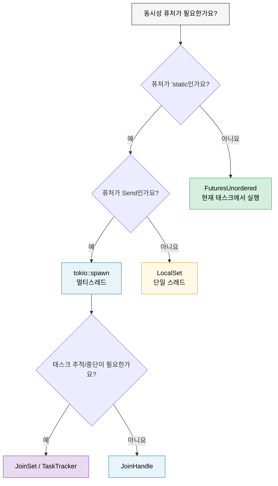

# 9. Tokio가 적합하지 않은 경우 🟡

> **학습 내용:**
> - `'static` 문제: `tokio::spawn` 때문에 곳곳에 `Arc`를 써야 하는 상황
> - `!Send` 퓨처를 위한 `LocalSet`
> - 빌려오기에 친화적인 동시성을 위한 `FuturesUnordered` (spawn 불필요)
> - 관리되는 태스크 그룹을 위한 `JoinSet`
> - 런타임 중립적인 라이브러리 작성하기



## 'static 퓨처 문제

Tokio의 `spawn`은 `'static` 퓨처를 요구합니다. 이는 스폰된 태스크 내에서 지역 데이터를 빌려올 수 없음을 의미합니다:

```rust
async fn process_items(items: &[String]) {
    // ❌ 이렇게 할 수 없습니다 — items는 빌려진 것이지 'static이 아닙니다.
    // for item in items {
    //     tokio::spawn(async {
    //         process(item).await;
    //     });
    // }

    // 😐 해결책 1: 모두 클론하기
    for item in items {
        let item = item.clone();
        tokio::spawn(async move {
            process(&item).await;
        });
    }

    // 😐 해결책 2: Arc 사용하기
    let items = Arc::new(items.to_vec());
    for i in 0..items.len() {
        let items = Arc::clone(&items);
        tokio::spawn(async move {
            process(&items[i]).await;
        });
    }
}
```

이것은 꽤 번거롭습니다! Go에서는 클로저와 함께 `go func() { use(item) }`를 그냥 쓸 수 있죠. Rust에서는 소유권 시스템 때문에 누가 무엇을 소유하고 얼마나 오래 사는지 생각해야만 합니다.

### 범위 내 태스크(Scoped Tasks) 및 대안들

`'static` 문제에 대한 몇 가지 해결책이 있습니다:

```rust
// 1. tokio::task::LocalSet — 현재 스레드에서 !Send 퓨처 실행하기
use tokio::task::LocalSet;

let local_set = LocalSet::new();
local_set.run_until(async {
    tokio::task::spawn_local(async {
        // 여기서 Rc, Cell 등 !Send 타입을 사용할 수 있습니다.
        let rc = std::rc::Rc::new(42);
        println!("{rc}");
    }).await.unwrap();
}).await;

// 2. FuturesUnordered — 스폰 없이 동시 실행하기
use futures::stream::{FuturesUnordered, StreamExt};

async fn process_items(items: &[String]) {
    let futures: FuturesUnordered<_> = items
        .iter()
        .map(|item| async move {
            // ✅ item을 빌려올 수 있음 — spawn도, 'static도 필요 없음!
            process(item).await
        })
        .collect();

    // 모든 퓨처를 완료될 때까지 구동
    futures.for_each(|result| async {
        println!("결과: {result:?}");
    }).await;
}

// 3. tokio JoinSet (tokio 1.21+) — 스폰된 태스크들의 관리 집합
use tokio::task::JoinSet;

async fn with_joinset() {
    let mut set = JoinSet::new();

    for i in 0..10 {
        set.spawn(async move {
            tokio::time::sleep(Duration::from_millis(100)).await;
            i * 2
        });
    }

    while let Some(result) = set.join_next().await {
        println!("태스크 완료: {:?}", result.unwrap());
    }
}
```

### 라이브러리를 위한 가벼운 런타임

라이브러리를 작성 중이라면 사용자가 반드시 tokio를 쓰도록 강제하지 마세요:

```rust
// ❌ 나쁨: 라이브러리가 사용자에게 tokio를 강제함
pub async fn my_lib_function() {
    tokio::time::sleep(Duration::from_secs(1)).await;
    // 이제 사용자는 반드시 tokio를 사용해야 합니다.
}

// ✅ 좋음: 라이브러리가 런타임 중립적임
pub async fn my_lib_function() {
    // std::future와 futures 크레이트의 타입만 사용함
    do_computation().await;
}

// ✅ 좋음: I/O 작업을 위해 제네릭 퓨처를 인자로 받음
pub async fn fetch_with_retry<F, Fut, T, E>(
    operation: F,
    max_retries: usize,
) -> Result<T, E>
where
    F: Fn() -> Fut,
    Fut: Future<Output = Result<T, E>>,
{
    for attempt in 0..max_retries {
        match operation().await {
            Ok(val) => return Ok(val),
            Err(e) if attempt == max_retries - 1 => return Err(e),
            Err(_) => continue,
        }
    }
    unreachable!()
}
```

**경험 법칙**: 라이브러리는 tokio가 아니라 `futures` 크레이트에 의존해야 합니다. 애플리케이션은 tokio(또는 선택한 런타임)에 의존해야 합니다. 이렇게 해야 생태계가 서로 조합될 수 있습니다.

<details>
<summary><strong>🏋️ 연습 문제: FuturesUnordered vs Spawn</strong> (click to expand)</summary>

**도전 과제**: 동일한 기능을 두 가지 방식으로 작성해 보세요. 한 번은 `tokio::spawn`을 사용하고(`'static` 필요), 한 번은 `FuturesUnordered`를 사용하세요(데이터 빌려오기). 함수는 `&[String]`을 받아서 시뮬레이션된 비동기 조회 후 각 문자열의 길이를 반환합니다.

비교해 보세요: 어떤 방식이 `.clone()`을 필요로 하나요? 어떤 방식이 입력 슬라이스를 빌려올 수 있나요?

<details>
<summary>🔑 정답</summary>

```rust
use futures::stream::{FuturesUnordered, StreamExt};
use tokio::time::{sleep, Duration};

// 버전 1: tokio::spawn — 'static 필요, 클론해야 함
async fn lengths_with_spawn(items: &[String]) -> Vec<usize> {
    let mut handles = Vec::new();
    for item in items {
        let owned = item.clone(); // 클론 필수 — spawn은 'static을 요구함
        handles.push(tokio::spawn(async move {
            sleep(Duration::from_millis(10)).await;
            owned.len()
        }));
    }

    let mut results = Vec::new();
    for handle in handles {
        results.push(handle.await.unwrap());
    }
    results
}

// 버전 2: FuturesUnordered — 데이터 빌려오기, 클론 불필요
async fn lengths_without_spawn(items: &[String]) -> Vec<usize> {
    let futures: FuturesUnordered<_> = items
        .iter()
        .map(|item| async move {
            sleep(Duration::from_millis(10)).await;
            item.len() // ✅ item을 빌려옴 — 클론 없음!
        })
        .collect();

    futures.collect().await
}

#[tokio::test]
async fn test_both_versions() {
    let items = vec!["안녕".into(), "세상아".into(), "rust".into()];

    let v1 = lengths_with_spawn(&items).await;
    // 참고: v1은 삽입 순서를 유지함 (순차적 join)

    let mut v2 = lengths_without_spawn(&items).await;
    v2.sort(); // FuturesUnordered는 완료 순서대로 반환함

    assert_eq!(v1, vec![2, 3, 4]);
    assert_eq!(v2, vec![2, 3, 4]);
}
```

**핵심 요약**: `FuturesUnordered`는 모든 퓨처를 현재 태스크에서 실행함으로써(스레드 이동 없음) `'static` 요구 사항을 피합니다. 트레이드 오프: 모든 퓨처가 하나의 태스크를 공유하므로, 하나가 블록되면 나머지도 멈춥니다. 별도의 스레드에서 실행되어야 하는 CPU 집약적 작업에는 `spawn`을 사용하세요.

</details>
</details>

> **핵심 요약 — Tokio가 적합하지 않은 경우**
> - `FuturesUnordered`는 현재 태스크에서 퓨처를 동시에 실행하며, `'static` 요구 사항이 없습니다.
> - `LocalSet`은 단일 스레드 실행기에서 `!Send` 퓨처를 실행할 수 있게 합니다.
> - `JoinSet` (tokio 1.21+)은 자동 정리 기능이 있는 관리되는 태스크 그룹을 제공합니다.
> - 라이브러리 제작 시: tokio에 직접 의존하지 말고 `std::future::Future`와 `futures` 크레이트만 사용하세요.

> **참고:** spawn이 적절한 도구인 경우는 [8장 — Tokio 심층 분석](ch08-tokio-deep-dive.md)을, 또 다른 동시성 제한 방법인 `buffer_unordered()`는 [11장 — 스트림](ch11-streams-and-asynciterator.md)을 참조하세요.

***
