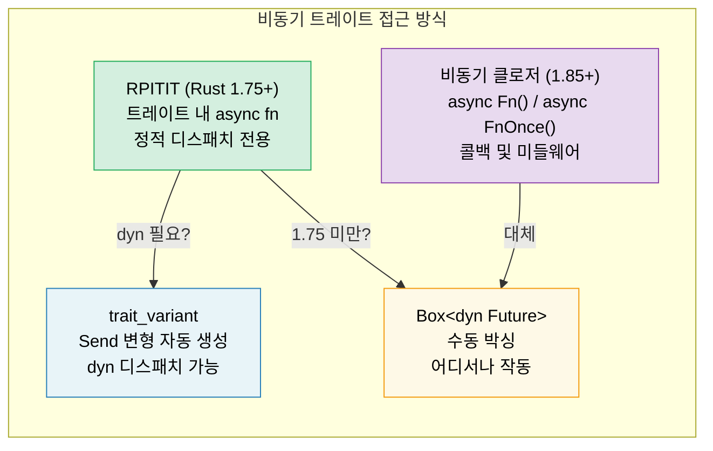

# 10. 비동기 트레이트 (Async Traits) 🟡

> **학습 내용:**
> - 트레이트 내의 비동기 메서드가 안정화되는 데 수년이 걸린 이유
> - RPITIT: 네이티브 비동기 트레이트 메서드 (Rust 1.75+)
> - 동적 디스패치(dyn dispatch)의 어려움과 `trait_variant` 해결책
> - 비동기 클로저 (Rust 1.85+): `async Fn()` 및 `async FnOnce()`



## 역사: 왜 그렇게 오래 걸렸을까요?

트레이트 내의 비동기 메서드는 수년간 Rust에서 가장 많이 요청된 기능이었습니다. 문제는 다음과 같았습니다:

```rust
// 이 코드는 Rust 1.75(2023년 12월) 전까지는 컴파일되지 않았습니다:
trait DataStore {
    async fn get(&self, key: &str) -> Option<String>;
}
// 왜일까요? async fn은 `impl Future<Output = T>`를 반환하는데,
// 당시에는 트레이트의 반환 위치에서 `impl Trait`을 지원하지 않았기 때문입니다.
```

근본적인 어려움은 다음과 같습니다: 트레이트 메서드가 `impl Future`를 반환할 때, 각 구현체(implementor)는 *서로 다른 구체적인 타입*을 반환합니다. 컴파일러는 반환 타입의 크기를 알아야 하지만, 트레이트 메서드는 동적으로 디스패치(dynamically dispatched)될 수 있기 때문입니다.

### RPITIT: 트레이트 내 반환 위치 impl Trait (Return Position Impl Trait in Trait)

Rust 1.75부터 정적 디스패치에 대해서는 이 기능이 자연스럽게 작동합니다:

```rust
trait DataStore {
    async fn get(&self, key: &str) -> Option<String>;
    // 다음과 같이 해석됩니다:
    // fn get(&self, key: &str) -> impl Future<Output = Option<String>>;
}

struct InMemoryStore {
    data: std::collections::HashMap<String, String>,
}

impl DataStore for InMemoryStore {
    async fn get(&self, key: &str) -> Option<String> {
        self.data.get(key).cloned()
    }
}

// ✅ 제네릭과 함께 작동함 (정적 디스패치):
async fn lookup<S: DataStore>(store: &S, key: &str) {
    if let Some(val) = store.get(key).await {
        println!("{key} = {val}");
    }
}
```

### dyn 디스패치와 Send 바운드

제한 사항: 컴파일러가 반환되는 퓨처의 크기를 알 수 없기 때문에 `dyn DataStore`를 직접 사용할 수 없습니다.

```rust
// ❌ 작동하지 않음:
// async fn lookup_dyn(store: &dyn DataStore, key: &str) { ... }
// 에러: `get` 메서드가 `async`이므로 `DataStore` 트레이트는 dyn-호환되지 않습니다.

// ✅ 해결책: 박싱된 퓨처 반환
trait DynDataStore {
    fn get(&self, key: &str) -> Pin<Box<dyn Future<Output = Option<String>> + Send + '_>>;
}

// 또는 trait_variant 매크로 사용 (아래 참조)
```

**Send 문제**: 멀티스레드 런타임에서 스폰된 태스크는 반드시 `Send`여야 합니다. 하지만 비동기 트레이트 메서드는 자동으로 `Send` 제약을 추가하지 않습니다:

```rust
trait Worker {
    async fn run(&self); // 퓨처가 Send일 수도, 아닐 수도 있음
}

struct MyWorker;

impl Worker for MyWorker {
    async fn run(&self) {
        // 만약 여기서 !Send 타입을 사용하면, 퓨처는 !Send가 됨
        let rc = std::rc::Rc::new(42);
        some_work().await;
        println!("{rc}");
    }
}

// ❌ 퓨처가 Send가 아니면 실패함:
// tokio::spawn(worker.run()); // Send + 'static을 요구함
```

### trait_variant 크레이트

(Rust 비동기 작업 그룹에서 만든) `trait_variant` 크레이트는 `Send` 변형을 자동으로 생성해줍니다:

```rust
// Cargo.toml: trait-variant = "0.1"

#[trait_variant::make(SendDataStore: Send)]
trait DataStore {
    async fn get(&self, key: &str) -> Option<String>;
    async fn set(&self, key: &str, value: String);
}

// 이제 두 개의 트레이트가 생깁니다:
// - DataStore: 퓨처에 Send 제약이 없음
// - SendDataStore: 모든 퓨처가 Send임
// 둘 다 동일한 메서드를 가지며, 구현체는 DataStore만 구현하면
// 해당 퓨처가 Send인 경우 SendDataStore를 자동으로 얻게 됩니다.

// 스폰(spawn)이 필요할 때 SendDataStore를 사용하세요:
async fn spawn_lookup(store: Arc<dyn SendDataStore>) {
    tokio::spawn(async move {
        store.get("key").await;
    });
}
```

### 빠른 참조: 비동기 트레이트

| 접근 방식 | 정적 디스패치 | 동적 디스패치 | Send | 구문 오버헤드 |
|----------|:---:|:---:|:---:|---|
| 네이티브 `async fn` | ✅ | ❌ | 암시적 | 없음 |
| `trait_variant` | ✅ | ✅ | 명시적 | `#[trait_variant::make]` |
| 수동 `Box::pin` | ✅ | ✅ | 명시적 | 높음 |
| `async-trait` 크레이트 | ✅ | ✅ | `#[async_trait]` | 중간 (proc 매크로) |

> **권장 사항**: 새로운 코드(Rust 1.75+)에서는 네이티브 비동기 트레이트를 사용하고,
> `dyn` 디스패치가 필요한 경우 `trait_variant`를 사용하세요. `async-trait` 크레이트는
> 여전히 널리 사용되지만 모든 퓨처를 박싱합니다. 네이티브 방식은 정적 디스패치에 대해 제로 비용입니다.

### 비동기 클로저 (Async Closures, Rust 1.85+)

Rust 1.85부터 `비동기 클로저`가 안정화되었습니다. 이는 환경을 캡처하고 퓨처를 반환하는 클로저입니다:

```rust
// 1.85 이전: 어색한 우회 방식
let urls = vec!["https://a.com", "https://b.com"];
let fetchers: Vec<_> = urls.iter().map(|url| {
    let url = url.to_string();
    // 비동기 블록을 반환하는 일반 클로저를 반환함
    move || async move { reqwest::get(&url).await }
}).collect();

// 1.85 이후: 비동기 클로저가 자연스럽게 작동함
let fetchers: Vec<_> = urls.iter().map(|url| {
    async move || { reqwest::get(url).await }
    // ↑ 이것이 비동기 클로저입니다 — url을 캡처하고 Future를 반환함
}).collect();
```

비동기 클로저는 `Fn`, `FnMut`, `FnOnce`와 대칭되는 새로운 `AsyncFn`, `AsyncFnMut`, `AsyncFnOnce` 트레이트를 구현합니다:

```rust
// 비동기 클로저를 인자로 받는 제네릭 함수
async fn retry<F>(max: usize, f: F) -> Result<String, Error>
where
    F: AsyncFn() -> Result<String, Error>,
{
    for _ in 0..max {
        if let Ok(val) = f().await {
            return Ok(val);
        }
    }
    f().await
}
```

> **이전 팁**: 만약 `Fn() -> impl Future<Output = T>`를 사용하는 코드가 있다면,
> 더 깔끔한 시그니처를 위해 `AsyncFn() -> T`로 전환하는 것을 고려해 보세요.

<details>
<summary><strong>🏋️ 연습 문제: 비동기 서비스 트레이트 설계하기</strong> (클릭하여 확장)</summary>

**도전 과제**: 비동기 `get` 및 `set` 메서드를 가진 `Cache` 트레이트를 설계하세요. 이를 두 번 구현해 보세요: 한 번은 `HashMap`을 사용한 방식(메모리 내)으로, 다른 한 번은 가상의 Redis 백엔드 방식으로 구현하세요 (네트워크 지연을 시뮬레이션하기 위해 `tokio::time::sleep`을 사용하세요). 두 방식 모두에서 작동하는 제네릭 함수를 작성하세요.

<details>
<summary>🔑 정답</summary>

```rust
use std::collections::HashMap;
use std::sync::Arc;
use tokio::sync::Mutex;
use tokio::time::{sleep, Duration};

trait Cache {
    async fn get(&self, key: &str) -> Option<String>;
    async fn set(&self, key: &str, value: String);
}

// --- 인메모리 구현 ---
struct MemoryCache {
    store: Mutex<HashMap<String, String>>,
}

impl MemoryCache {
    fn new() -> Self {
        MemoryCache {
            store: Mutex::new(HashMap::new()),
        }
    }
}

impl Cache for MemoryCache {
    async fn get(&self, key: &str) -> Option<String> {
        self.store.lock().await.get(key).cloned()
    }

    async fn set(&self, key: &str, value: String) {
        self.store.lock().await.insert(key.to_string(), value);
    }
}

// --- 가상 Redis 구현 ---
struct RedisCache {
    store: Mutex<HashMap<String, String>>,
    latency: Duration,
}

impl RedisCache {
    fn new(latency_ms: u64) -> Self {
        RedisCache {
            store: Mutex::new(HashMap::new()),
            latency: Duration::from_millis(latency_ms),
        }
    }
}

impl Cache for RedisCache {
    async fn get(&self, key: &str) -> Option<String> {
        sleep(self.latency).await; // 네트워크 왕복 시뮬레이션
        self.store.lock().await.get(key).cloned()
    }

    async fn set(&self, key: &str, value: String) {
        sleep(self.latency).await;
        self.store.lock().await.insert(key.to_string(), value);
    }
}

// --- 모든 Cache와 함께 작동하는 제네릭 함수 ---
async fn cache_demo<C: Cache>(cache: &C, label: &str) {
    cache.set("greeting", "Hello, async!".into()).await;
    let val = cache.get("greeting").await;
    println!("[{label}] greeting = {val:?}");
}

#[tokio::main]
async fn main() {
    let mem = MemoryCache::new();
    cache_demo(&mem, "memory").await;

    let redis = RedisCache::new(50);
    cache_demo(&redis, "redis").await;
}
```

**핵심 요약**: 동일한 제네릭 함수가 정적 디스패치를 통해 두 구현체 모두에서 작동합니다. 박싱이나 할당 오버헤드가 없습니다. 동적 디스패치의 경우, `trait_variant::make(SendCache: Send)`를 추가하세요.

</details>
</details>

> **핵심 요약 — 비동기 트레이트**
> - Rust 1.75부터 트레이트 내에 `async fn`을 직접 작성할 수 있습니다. (`#[async_trait]` 크레이트 불필요)
> - `trait_variant::make`는 동적 디스패치를 위한 `Send` 변형을 자동으로 생성해줍니다.
> - 비동기 클로저(`async Fn()`)는 1.85에서 안정화되었습니다. 콜백과 미들웨어에 사용하세요.
> - 성능이 중요한 코드에서는 `dyn`보다 정적 디스패치(`<S: Service>`)를 우선적으로 고려하세요.

> **참고:** Tower의 `Service` 트레이트에 대해서는 [13장 — 운영 패턴](ch13-production-patterns.md)을, 수동 트레이트 구현에 대해서는 [6장 — 수동으로 Future 구현하기](ch06-building-futures-by-hand.md)를 참조하세요.

***
