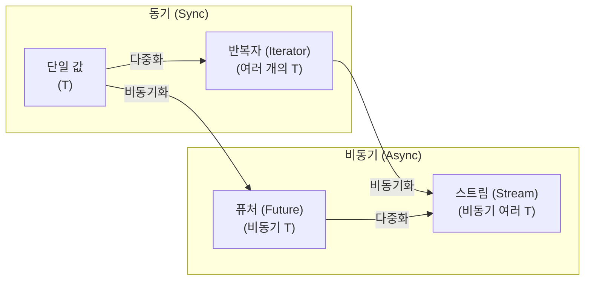

# 11. 스트림(Streams)과 비동기 I/O 🟡

> **학습 목표:**
> - 여러 값을 비동기적으로 생성하고 소비하는 **`Stream`** 트레이트를 이해합니다.
> - `stream!`, `unfold`, `iter` 등 다양한 방식으로 스트림을 생성하는 법을 배웁니다.
> - `buffer_unordered`를 활용해 스트림 아이템을 **동시에 처리**하여 성능을 높이는 기법을 익힙니다.
> - `AsyncRead`, `AsyncWrite` 등 비동기 I/O의 기반 트레이트와 확장 메서드를 파악합니다.

---

### 스트림: 비동기 반복자(Async Iterator)
`Stream`은 `Iterator`의 비동기 버전입니다. 한 번에 하나의 값을 내놓는 `Future`와 달리, 스트림은 끝날 때까지 여러 개의 값을 순차적으로 내보냅니다.



---

### 스트림 생성하고 활용하기

#### ① `async_stream`으로 우아하게 만들기
파이썬의 제너레이터(`yield`)처럼 비동기 스트림을 만들 수 있습니다.

```rust
// 0.5초마다 숫자를 하나씩 내보내는 스트림
use async_stream::stream;

fn countdown(n: u32) -> impl Stream<Item = u32> {
    stream! {
        for i in (0..=n).rev() {
            tokio::time::sleep(Duration::from_millis(500)).await;
            yield i;
        }
    }
}
```

#### ② `buffer_unordered` (동시 처리의 마법)
스트림의 강력함은 여기서 나옵니다. 100개의 URL을 순서대로 방문하는 게 아니라, **동시에 10개씩** 방문하도록 설정할 수 있습니다.

```rust
let results = stream::iter(urls)
    .map(|url| fetch(url))
    .buffer_unordered(10) // 최대 10개까지 동시에 실행!
    .collect::<Vec<_>>()
    .await;
```

---

### 비동기 I/O 트레이트: `AsyncRead` & `AsyncWrite`
파일이나 네트워크 소켓에서 데이터를 읽고 쓸 때 쓰이는 핵심 트레이트들입니다. (Tokio 런타임 기준)

- **`AsyncReadExt`**: `read_exact`, `read_to_end` 등 비동기 읽기 헬퍼 제공
- **`AsyncWriteExt`**: `write_all`, `flush` 등 비동기 쓰기 헬퍼 제공
- **`AsyncBufReadExt`**: `read_line`, `lines()` 등 줄 단위 읽기 기능 제공

```rust
// 파일에서 한 줄씩 읽는 예시
let file = tokio::fs::File::open("log.txt").await?;
let reader = BufReader::new(file);
let mut lines = reader.lines();

while let Some(line) = lines.next_line().await? {
    println!("로그: {line}");
}
```

---

### 💡 실무 팁: `Stream` vs `FuturesUnordered`
- **`Stream`**: 데이터가 유입되는 '통로' 느낌입니다. (예: 주식 시세 데이터, 네트워크 패킷)
- **`FuturesUnordered`**: 관리해야 할 '작업 뭉치' 느낌입니다. (예: 50개의 이미지 다운로드 작업)
상황에 따라 더 직관적인 도구를 선택하세요. 스트림 결합기(`map`, `filter` 등)가 필요하다면 `Stream`이 유리합니다.

---

### 🏋️ 연습 문제: 비동기 통계 계산기
**도전 과제:** 센서로부터 `f64` 값을 내보내는 스트림이 있습니다. 이 스트림을 소비하면서 **(데이터 개수, 합계, 평균값)**을 계산하는 비동기 함수를 작성해 보세요. (메모리 절약을 위해 모든 데이터를 `Vec`에 담지 말고 처리하세요.)

<details>
<summary>🔑 정답 및 힌트 보기</summary>
스트림의 `.fold()` 메서드를 사용하면 상태를 유지하며 데이터를 하나씩 처리할 수 있습니다. 초기 상태로 `(0, 0.0)`을 전달하고, 매 아이템마다 `count + 1`, `sum + value`를 수행한 뒤 마지막에 평균을 내면 됩니다.
</details>

---

### 📌 요약
- `Stream`은 비동기적으로 여러 데이터를 처리할 때 사용합니다.
- `buffer_unordered`는 동시성 제어를 위한 가장 강력한 도구 중 하나입니다.
- 비동기 I/O 코드를 짤 때는 특정 파일이나 소켓 타입 대신 **`AsyncRead` / `AsyncWrite`** 트레이트를 인자로 받아 범용성을 높이세요.

