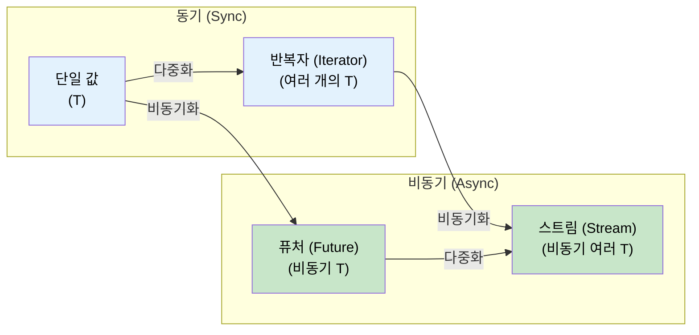

# 11. 스트림(Streams)과 AsyncIterator 🟡

> **학습 내용:**
> - `Stream` 트레이트: 여러 값에 대한 비동기 반복(iteration)
> - 스트림 생성하기: `stream::iter`, `async_stream`, `unfold`
> - 스트림 결합기(Combinators): `map`, `filter`, `buffer_unordered`, `fold`
> - 비동기 I/O 트레이트: `AsyncRead`, `AsyncWrite`, `AsyncBufRead`

## Stream 트레이트 개요

`Stream`은 `Iterator`와 `Future`의 관계와 같습니다. 즉, 비동기적으로 여러 개의 값을 생성합니다:

```rust
// std::iter::Iterator (동기식, 여러 개의 값)
trait Iterator {
    type Item;
    fn next(&mut self) -> Option<Self::Item>;
}

// futures::Stream (비동기식, 여러 개의 값)
trait Stream {
    type Item;
    fn poll_next(self: Pin<&mut Self>, cx: &mut Context<'_>) -> Poll<Option<Self::Item>>;
}
```



### 스트림 생성하기

```rust
use futures::stream::{self, StreamExt};
use tokio::time::{interval, Duration};
use tokio_stream::wrappers::IntervalStream;

// 1. 반복자로부터 생성
let s = stream::iter(vec![1, 2, 3]);

// 2. 비동기 생성기(generator)로부터 생성 (async-stream 크레이트 사용)
// Cargo.toml: async-stream = "0.3"
use async_stream::stream;

fn countdown(from: u32) -> impl futures::Stream<Item = u32> {
    stream! {
        for i in (0..=from).rev() {
            tokio::time::sleep(Duration::from_millis(500)).await;
            yield i;
        }
    }
}

// 3. tokio interval로부터 생성
let tick_stream = IntervalStream::new(interval(Duration::from_secs(1)));

// 4. 채널 수신자로부터 생성 (tokio_stream::wrappers)
let (tx, rx) = tokio::sync::mpsc::channel::<String>(100);
let rx_stream = tokio_stream::wrappers::ReceiverStream::new(rx);

// 5. unfold를 사용하여 생성 (비동기 상태로부터 생성)
let s = stream::unfold(0u32, |state| async move {
    if state >= 5 {
        None // 스트림 종료
    } else {
        let next = state + 1;
        Some((state, next)) // `state`를 산출(yield)하고, 새로운 상태는 `next`가 됨
    }
});
```

### 스트림 소비하기

```rust
use futures::stream::{self, StreamExt};

async fn stream_examples() {
    let s = stream::iter(vec![1, 2, 3, 4, 5]);

    // for_each — 각 아이템 처리
    s.for_each(|x| async move {
        println!("{x}");
    }).await;

    // map + collect
    let doubled: Vec<i32> = stream::iter(vec![1, 2, 3])
        .map(|x| x * 2)
        .collect()
        .await;

    // filter
    let evens: Vec<i32> = stream::iter(1..=10)
        .filter(|x| futures::future::ready(x % 2 == 0))
        .collect()
        .await;

    // buffer_unordered — N개의 아이템을 동시에 처리
    let results: Vec<_> = stream::iter(vec!["url1", "url2", "url3"])
        .map(|url| async move {
            // HTTP 페치(fetch) 시뮬레이션
            tokio::time::sleep(Duration::from_millis(100)).await;
            format!("{url}로부터의 응답")
        })
        .buffer_unordered(10) // 최대 10개까지 동시 페치
        .collect()
        .await;

    // take, skip, zip, chain — Iterator와 동일하게 사용 가능
    let first_three: Vec<i32> = stream::iter(1..=100)
        .take(3)
        .collect()
        .await;
}
```

### C# IAsyncEnumerable과의 비교

| 기능 | Rust `Stream` | C# `IAsyncEnumerable<T>` |
|---------|--------------|--------------------------|
| **구문** | `stream! { yield x; }` | `await foreach` / `yield return` |
| **취소** | 스트림 드롭(Drop) | `CancellationToken` |
| **백프레셔** | 소비자가 폴링 속도를 제어함 | 소비자가 `MoveNextAsync`를 제어함 |
| **기본 내장** | 아니요 (`futures` 크레이트 필요) | 예 (C# 8.0부터) |
| **결합기** | `.map()`, `.filter()`, `.buffer_unordered()` | LINQ + `System.Linq.Async` |
| **에러 처리** | `Stream<Item = Result<T, E>>` | 비동기 반복자 내부에서 Throw |

```rust
// Rust: 데이터베이스 행(row) 스트림
// 참고: 본문 내에서 ?를 사용하려면 (stream!이 아닌) try_stream!이 필요합니다.
// stream!은 에러를 전파하지 않지만, try_stream!은 Err(e)를 산출하고 종료합니다.
fn get_users(db: &Database) -> impl Stream<Item = Result<User, DbError>> + '_ {
    try_stream! {
        let mut cursor = db.query("SELECT * FROM users").await?;
        while let Some(row) = cursor.next().await {
            yield User::from_row(row?);
        }
    }
}

// 소비하기:
let mut users = pin!(get_users(&db));
while let Some(result) = users.next().await {
    match result {
        Ok(user) => println!("{}", user.name),
        Err(e) => eprintln!("에러: {e}"),
    }
}
```

```csharp
// C#에서의 해당 코드:
async IAsyncEnumerable<User> GetUsers() {
    await using var reader = await db.QueryAsync("SELECT * FROM users");
    while (await reader.ReadAsync()) {
        yield return User.FromRow(reader);
    }
}

// 소비하기:
await foreach (var user in GetUsers()) {
    Console.WriteLine(user.Name);
}
```

<details>
<summary><strong>🏋️ 연습 문제: 비동기 통계 집계기 구축하기</strong> (클릭하여 확장)</summary>

**도전 과제**: 센서 측정값 스트림 `Stream<Item = f64>`이 주어졌을 때, 스트림을 소비하고 `(개수, 최소값, 최대값, 평균값)`을 반환하는 비동기 함수를 작성하세요. `StreamExt` 결합기를 사용하고, 단순히 Vec으로 수집(collect)하지 마세요.

*힌트*: 스트림 전체에서 상태를 누적하려면 `.fold()`를 사용하세요.

<details>
<summary>🔑 정답</summary>

```rust
use futures::stream::{self, StreamExt};

#[derive(Debug)]
struct Stats {
    count: usize,
    min: f64,
    max: f64,
    sum: f64,
}

impl Stats {
    fn average(&self) -> f64 {
        if self.count == 0 { 0.0 } else { self.sum / self.count as f64 }
    }
}

async fn compute_stats<S: futures::Stream<Item = f64> + Unpin>(stream: S) -> Stats {
    stream
        .fold(
            Stats { count: 0, min: f64::INFINITY, max: f64::NEG_INFINITY, sum: 0.0 },
            |mut acc, value| async move {
                acc.count += 1;
                acc.min = acc.min.min(value);
                acc.max = acc.max.max(value);
                acc.sum += value;
                acc
            },
        )
        .await
}

#[tokio::test]
async fn test_stats() {
    let readings = stream::iter(vec![23.5, 24.1, 22.8, 25.0, 23.9]);
    let stats = compute_stats(readings).await;

    assert_eq!(stats.count, 5);
    assert!((stats.min - 22.8).abs() < f64::EPSILON);
    assert!((stats.max - 25.0).abs() < f64::EPSILON);
    assert!((stats.average() - 23.86).abs() < 0.01);
}
```

**핵심 요약**: `.fold()`와 같은 스트림 결합기는 아이템을 메모리에 한꺼번에 수집하지 않고 하나씩 처리합니다. 이는 대규모 또는 무한한 데이터 스트림을 처리하는 데 필수적입니다.

</details>
</details>

### 비동기 I/O 트레이트: AsyncRead, AsyncWrite, AsyncBufRead

`std::io::Read`/`Write`가 동기 I/O의 기초인 것처럼, 비동기 버전의 트레이트들은 비동기 I/O의 기초가 됩니다. 이 트레이트들은 `tokio::io`(또는 런타임 중립적인 코드의 경우 `futures::io`)에서 제공됩니다:

```rust
// tokio::io — std::io 트레이트의 비동기 버전

/// 소스로부터 비동기적으로 바이트를 읽음
pub trait AsyncRead {
    fn poll_read(
        self: Pin<&mut Self>,
        cx: &mut Context<'_>,
        buf: &mut ReadBuf<'_>,  // 초기화되지 않은 메모리를 안전하게 다루기 위한 Tokio의 래퍼
    ) -> Poll<io::Result<()>>;
}

/// 싱크(sink)로 비동기적으로 바이트를 씀
pub trait AsyncWrite {
    fn poll_write(
        self: Pin<&mut Self>,
        cx: &mut Context<'_>,
        buf: &[u8],
    ) -> Poll<io::Result<usize>>;

    fn poll_flush(self: Pin<&mut Self>, cx: &mut Context<'_>) -> Poll<io::Result<()>>;
    fn poll_shutdown(self: Pin<&mut Self>, cx: &mut Context<'_>) -> Poll<io::Result<()>>;
}

/// 라인(line) 지원 기능이 있는 버퍼링된 읽기
pub trait AsyncBufRead: AsyncRead {
    fn poll_fill_buf(self: Pin<&mut Self>, cx: &mut Context<'_>) -> Poll<io::Result<&[u8]>>;
    fn consume(self: Pin<&mut Self>, amt: usize);
}
```

**실무에서는** 이러한 `poll_*` 메서드들을 직접 호출하는 경우가 거의 없습니다. 대신 `.await` 친화적인 헬퍼 메서드들을 제공하는 확장 트레이트 `AsyncReadExt`와 `AsyncWriteExt`를 사용합니다:

```rust
use tokio::io::{AsyncReadExt, AsyncWriteExt, AsyncBufReadExt};
use tokio::net::TcpStream;
use tokio::io::BufReader;

async fn io_examples() -> tokio::io::Result<()> {
    let mut stream = TcpStream::connect("127.0.0.1:8080").await?;

    // AsyncWriteExt: write_all, write_u32, write_buf 등
    stream.write_all(b"GET / HTTP/1.0\r\n\r\n").await?;

    // AsyncReadExt: read, read_exact, read_to_end, read_to_string
    let mut response = Vec::new();
    stream.read_to_end(&mut response).await?;

    // AsyncBufReadExt: read_line, lines(), split()
    let file = tokio::fs::File::open("config.txt").await?;
    let reader = BufReader::new(file);
    let mut lines = reader.lines();
    while let Some(line) = lines.next_line().await? {
        println!("{line}");
    }

    Ok(())
}
```

**커스텀 비동기 I/O 구현** — 원시 TCP 위에 프로토콜 감싸기:

```rust
use tokio::io::{AsyncRead, AsyncWrite, ReadBuf};
use std::pin::Pin;
use std::task::{Context, Poll};

/// 길이 접두사 프로토콜: [u32 길이][페이로드 바이트]
struct FramedStream<T> {
    inner: T,
}

impl<T: AsyncRead + AsyncReadExt + Unpin> FramedStream<T> {
    /// 하나의 완전한 프레임 읽기
    async fn read_frame(&mut self) -> tokio::io::Result<Vec<u8>>
    {
        // 4바이트 길이 접두사 읽기
        let len = self.inner.read_u32().await? as usize;

        // 해당 길이만큼 정확히 읽기
        let mut payload = vec![0u8; len];
        self.inner.read_exact(&mut payload).await?;
        Ok(payload)
    }
}

impl<T: AsyncWrite + AsyncWriteExt + Unpin> FramedStream<T> {
    /// 하나의 완전한 프레임 쓰기
    async fn write_frame(&mut self, data: &[u8]) -> tokio::io::Result<()>
    {
        self.inner.write_u32(data.len() as u32).await?;
        self.inner.write_all(data).await?;
        self.inner.flush().await?;
        Ok(())
    }
}
```

| 동기 트레이트 | 비동기 트레이트 (tokio) | 비동기 트레이트 (futures) | 확장 트레이트 |
|-----------|--------------------|-----------------------|----------------|
| `std::io::Read` | `tokio::io::AsyncRead` | `futures::io::AsyncRead` | `AsyncReadExt` |
| `std::io::Write` | `tokio::io::AsyncWrite` | `futures::io::AsyncWrite` | `AsyncWriteExt` |
| `std::io::BufRead` | `tokio::io::AsyncBufRead` | `futures::io::AsyncBufRead` | `AsyncBufReadExt` |
| `std::io::Seek` | `tokio::io::AsyncSeek` | `futures::io::AsyncSeek` | `AsyncSeekExt` |

> **tokio vs futures I/O 트레이트**: 둘은 비슷하지만 완전히 동일하지는 않습니다. tokio의 `AsyncRead`는 `ReadBuf`를 사용하여 초기화되지 않은 메모리를 안전하게 처리하는 반면, `futures::AsyncRead`는 `&mut [u8]`를 사용합니다. 이들 간의 변환을 위해서는 `tokio_util::compat`을 사용하세요.

> **복사 유틸리티**: `tokio::io::copy(&mut reader, &mut writer)`는 `std::io::copy`의 비동기 버전입니다. 프록시 서버나 파일 전송에 유용합니다. `tokio::io::copy_bidirectional`은 양방향 동시 복사를 수행합니다.

<details>
<summary><strong>🏋️ 연습 문제: 비동기 라인 카운터 구축하기</strong> (클릭하여 확장)</summary>

**도전 과제**: 임의의 `AsyncBufRead` 소스를 받아서 비어 있지 않은 라인의 개수를 반환하는 비동기 함수를 작성하세요. 파일, TCP 스트림 또는 모든 버퍼링된 리더와 함께 작동해야 합니다.

*힌트*: `AsyncBufReadExt::lines()`를 사용하고 `!line.is_empty()`인 경우를 카운트하세요.

<details>
<summary>🔑 정답</summary>

```rust
use tokio::io::AsyncBufReadExt;

async fn count_non_empty_lines<R: tokio::io::AsyncBufRead + Unpin>(
    reader: R,
) -> tokio::io::Result<usize> {
    let mut lines = reader.lines();
    let mut count = 0;
    while let Some(line) = lines.next_line().await? {
        if !line.is_empty() {
            count += 1;
        }
    }
    Ok(count)
}

// 모든 AsyncBufRead와 함께 작동함:
// let file = tokio::io::BufReader::new(tokio::fs::File::open("data.txt").await?);
// let count = count_non_empty_lines(file).await?;
//
// let tcp = tokio::io::BufReader::new(TcpStream::connect("...").await?);
// let count = count_non_empty_lines(tcp).await?;
```

**핵심 요약**: 구체적인 타입 대신 `AsyncBufRead`를 대상으로 프로그래밍함으로써, 여러분의 I/O 코드는 파일, 소켓, 파이프, 심지어 메모리 내 버퍼(`tokio::io::BufReader::new(std::io::Cursor::new(data))`)에서도 재사용 가능해집니다.

</details>
</details>

> **핵심 요약 — 스트림과 AsyncIterator**
> - `Stream`은 `Iterator`의 비동기 버전입니다. `Poll::Ready(Some(item))` 또는 `Poll::Ready(None)`을 산출합니다.
> - `.buffer_unordered(N)`은 스트림 아이템 N개를 동시에 처리합니다. 스트림 동시성 제어의 핵심 도구입니다.
> - `async_stream::stream!`은 (yield를 사용하여) 커스텀 스트림을 만드는 가장 쉬운 방법입니다.
> - `AsyncRead`/`AsyncBufRead`를 사용하면 파일, 소켓, 파이프 전체에서 재사용 가능한 일반적인 I/O 코드를 작성할 수 있습니다.

> **참고:** 유사한 패턴인 `FuturesUnordered`에 대해서는 [9장 — Tokio가 적합하지 않은 경우](ch09-when-tokio-isnt-the-right-fit.md)를, 제한된 채널을 통한 백프레셔에 대해서는 [13장 — 운영 패턴](ch13-production-patterns.md)을 참조하세요.

***
