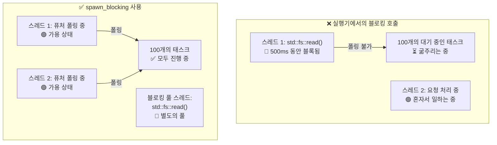

# 12. 흔히 발생하는 함정들 🔴

> **학습 내용:**
> - 비동기 Rust의 9가지 흔한 버그와 각각의 해결 방법
> - 실행기를 블록하는 것이 왜 치명적인 실수인가 (그리고 `spawn_blocking`이 이를 어떻게 해결하는가)
> - 취소 위험(Cancellation hazards): await 도중에 퓨처가 드롭되면 어떤 일이 발생하는가
> - 디버깅 도구: `tokio-console`, `tracing`, `#[instrument]`
> - 테스트 기법: `#[tokio::test]`, `time::pause()`, 트레이트 기반 모킹(mocking)

## 실행기 블록하기 (Blocking the Executor)

비동기 Rust에서 발생하는 제1의 실수는 비동기 실행기 스레드에서 블로킹 코드를 실행하는 것입니다. 이는 다른 태스크들을 굶주리게 만듭니다.

```rust
// ❌ 잘못됨: 전체 실행기 스레드를 블록함
async fn bad_handler() -> String {
    let data = std::fs::read_to_string("big_file.txt").unwrap(); // 블록됨!
    process(&data)
}

// ✅ 올바른 방식: 전용 스레드 풀로 블로킹 작업을 오프로드함
async fn good_handler() -> String {
    let data = tokio::task::spawn_blocking(|| {
        std::fs::read_to_string("big_file.txt").unwrap()
    }).await.unwrap();
    process(&data)
}

// ✅ 역시 올바른 방식: tokio의 비동기 fs 사용
async fn also_good_handler() -> String {
    let data = tokio::fs::read_to_string("big_file.txt").await.unwrap();
    process(&data)
}
```



### std::thread::sleep vs tokio::time::sleep

```rust
// ❌ 잘못됨: 실행기 스레드를 5초간 블록함
async fn bad_delay() {
    std::thread::sleep(Duration::from_secs(5)); // 스레드가 다른 것을 폴링할 수 없음!
}

// ✅ 올바른 방식: 실행기에게 양보하며 다른 태스크가 실행될 수 있게 함
async fn good_delay() {
    tokio::time::sleep(Duration::from_secs(5)).await; // 비차단 방식!
}
```

### .await 지점을 넘어서 MutexGuard 보유하기

```rust
use std::sync::Mutex; // std Mutex — 비동기를 인식하지 못함

// ❌ 잘못됨: .await 지점을 넘어서 MutexGuard를 보유함
async fn bad_mutex(data: &Mutex<Vec<String>>) {
    let mut guard = data.lock().unwrap();
    guard.push("아이템".into());
    some_io().await; // 💥 여기서 가드(guard)가 유지됨 — 다른 스레드의 락 획득을 차단함!
    guard.push("또 다른 아이템".into());
}
// 또한: std::sync::MutexGuard는 !Send이므로,
// tokio의 멀티스레드 런타임에서 컴파일되지 않습니다.

// ✅ 해결책 1: .await 전에 가드가 드롭되도록 범위를 제한함
async fn good_mutex_scoped(data: &Mutex<Vec<String>>) {
    {
        let mut guard = data.lock().unwrap();
        guard.push("아이템".into());
    } // 여기서 가드가 드롭됨
    some_io().await; // 안전함 — 락이 해제됨
    {
        let mut guard = data.lock().unwrap();
        guard.push("또 다른 아이템".into());
    }
}

// ✅ 해결책 2: tokio::sync::Mutex (비동기 인식) 사용
use tokio::sync::Mutex as AsyncMutex;

async fn good_async_mutex(data: &AsyncMutex<Vec<String>>) {
    let mut guard = data.lock().await; // 비동기 락 — 스레드를 블록하지 않음
    guard.push("아이템".into());
    some_io().await; // 괜찮음 — tokio Mutex 가드는 Send임
    guard.push("또 다른 아이템".into());
}
```

> **어떤 Mutex를 사용해야 할까요?**:
> - `std::sync::Mutex`: 내부에 `.await`가 없는 짧은 임계 구역(critical sections)
> - `tokio::sync::Mutex`: `.await` 지점을 넘어서 락을 유지해야 할 때
> - `parking_lot::Mutex`: `std`의 드롭인 대체재로, 더 빠르고 작지만 여전히 `.await`는 불가함

### 취소 위험 (Cancellation Hazards)

퓨처를 드롭하면 취소되지만, 이는 상태를 불일치하게 만들 수 있습니다:

```rust
// ❌ 위험: 취소 시 리소스 누수 발생
async fn transfer(from: &Account, to: &Account, amount: u64) {
    from.debit(amount).await;  // 여기서 취소된다면...
    to.credit(amount).await;   // ...돈이 증발합니다!
}

// ✅ 안전: 작업을 원자적(atomic)으로 만들거나 보상 작업을 사용함
async fn safe_transfer(from: &Account, to: &Account, amount: u64) -> Result<(), Error> {
    // 데이터베이스 트랜잭션 사용 (전부 아니면 전무)
    let tx = db.begin_transaction().await?;
    tx.debit(from, amount).await?;
    tx.credit(to, amount).await?;
    tx.commit().await?; // 모든 것이 성공했을 때만 커밋
    Ok(())
}

// ✅ 역시 안전: 취소를 인식하는 tokio::select! 사용
tokio::select! {
    result = transfer(from, to, amount) => {
        // 이체 완료
    }
    _ = shutdown_signal() => {
        // 이체 도중에 취소하지 말고 끝날 때까지 기다림
        // 또는 명시적으로 롤백함
    }
}
```

### 비동기 드롭(Drop) 부재

Rust의 `Drop` 트레이트는 동기식입니다. 따라서 `drop()` 내부에서 `.await`를 사용할 수 **없습니다**. 이는 자주 발생하는 혼란의 원인입니다:

```rust
struct DbConnection { /* ... */ }

impl Drop for DbConnection {
    fn drop(&mut self) {
        // ❌ 이렇게 할 수 없습니다 — drop()은 동기식입니다!
        // self.connection.shutdown().await;

        // ✅ 우회 방법 1: 정리 태스크를 스폰함 (fire-and-forget)
        let conn = self.connection.take();
        tokio::spawn(async move {
            let _ = conn.shutdown().await;
        });

        // ✅ 우회 방법 2: 동기식 닫기(close) 사용
        // self.connection.blocking_close();
    }
}
```

**권장 사항**: 명시적인 `async fn close(self)` 메서드를 제공하고 호출자가 이를 사용하도록 문서화하세요. `Drop`은 기본 정리 경로가 아니라 안전망으로만 사용하세요.

### select!의 공정성과 기아 현상 (Starvation)

```rust
use tokio::sync::mpsc;

// ❌ 불공정: busy_stream이 항상 이기고 slow_stream은 굶주림
async fn unfair(mut fast: mpsc::Receiver<i32>, mut slow: mpsc::Receiver<i32>) {
    loop {
        tokio::select! {
            Some(v) = fast.recv() => println!("빠름: {v}"),
            Some(v) = slow.recv() => println!("느림: {v}"),
            // 둘 다 준비된 경우 tokio는 무작위로 하나를 선택합니다.
            // 하지만 `fast`가 항상 준비되어 있다면 `slow`가 폴링될 기회는 거의 없습니다.
        }
    }
}

// ✅ 공정함: 편향된(biased) select를 사용하거나 배치로 처리함
async fn fair(mut fast: mpsc::Receiver<i32>, mut slow: mpsc::Receiver<i32>) {
    loop {
        tokio::select! {
            biased; // 명시적 우선순위에 따라 항상 순서대로 확인

            Some(v) = slow.recv() => println!("느림: {v}"),  // 우선순위!
            Some(v) = fast.recv() => println!("빠름: {v}"),
        }
    }
}
```

### 의도치 않은 순차 실행

```rust
// ❌ 순차적: 총 2초 소요
async fn slow() {
    let a = fetch("url_a").await; // 1초
    let b = fetch("url_b").await; // 1초 (a가 끝날 때까지 대기!)
}

// ✅ 동시 실행: 총 1초 소요
async fn fast() {
    let (a, b) = tokio::join!(
        fetch("url_a"), // 둘 다 즉시 시작
        fetch("url_b"),
    );
}

// ✅ 역시 동시 실행: let + join 사용
async fn also_fast() {
    let fut_a = fetch("url_a"); // 퓨처 생성 (지연 실행 — 아직 시작 안 함)
    let fut_b = fetch("url_b"); // 퓨처 생성
    let (a, b) = tokio::join!(fut_a, fut_b); // 이제 둘 다 동시에 실행됨
}
```

> **함정**: `let a = fetch(url).await; let b = fetch(url).await;`는 순차적입니다!
> 첫 번째 `.await`가 끝날 때까지 두 번째가 시작되지 않습니다. 동시성을 위해 `join!`이나 `spawn`을 사용하세요.

## 사례 연구: 중단된 운영 서비스 디버깅하기

실제 시나리오: 서비스가 10분 동안 잘 작동하다가 응답을 멈춥니다. 로그에 에러는 없고 CPU 점유율은 0%입니다.

**진단 단계:**

1. **`tokio-console` 연결** — 200개 이상의 태스크가 `Pending` 상태에 갇혀 있음을 확인
2. **태스크 세부 정보 확인** — 모두 동일한 `Mutex::lock().await`에서 대기 중
3. **근본 원인** — 한 태스크가 `.await`를 가로질러 `std::sync::MutexGuard`를 보유한 채 패닉이 발생하여 뮤텍스가 오염(poisoned)됨. 다른 모든 태스크가 `lock().unwrap()`에서 실패함

**수정 사항:**

| 이전 (고장남) | 이후 (수정됨) |
|-----------------|---------------|
| `std::sync::Mutex` | `tokio::sync::Mutex` |
| `.await`를 가로지르는 `.lock().unwrap()` | `.await` 전에 락 범위 제한 |
| 락 획득 시 타임아웃 없음 | `tokio::time::timeout(dur, mutex.lock())` |
| 오염된 뮤텍스에서 복구 불가 | `tokio::sync::Mutex`는 오염되지 않음 |

**방지 체크리스트:**
- [ ] 가드가 `.await`를 가로지르는 경우 `tokio::sync::Mutex` 사용
- [ ] 스팬(span) 추적을 위해 비동기 함수에 `#[tracing::instrument]` 추가
- [ ] 중단된 태스크를 조기에 잡기 위해 스테이징에서 `tokio-console` 실행
- [ ] 태스크 응답성을 확인하는 상태 확인(health check) 엔드포인트 추가

<details>
<summary><strong>🏋️ 연습 문제: 버그 찾기</strong> (클릭하여 확장)</summary>

**도전 과제**: 이 코드에서 비동기 함정들을 모두 찾아 수정하세요.

```rust
use std::sync::Mutex;

async fn process_requests(urls: Vec<String>) -> Vec<String> {
    let results = Mutex::new(Vec::new());
    
    for url in &urls {
        let response = reqwest::get(url).await.unwrap().text().await.unwrap();
        std::thread::sleep(std::time::Duration::from_millis(100)); // 속도 제한
        let mut guard = results.lock().unwrap();
        guard.push(response);
        expensive_parse(&guard).await; // 지금까지의 모든 결과 파싱
    }
    
    results.into_inner().unwrap()
}
```

<details>
<summary>🔑 정답</summary>

**발견된 버그:**

1. **순차적 페치** — URL들이 동시에 처리되지 않고 하나씩 처리됨
2. **`std::thread::sleep`** — 실행기 스레드를 블록함
3. **`.await`를 가로지르는 MutexGuard 보유** — `expensive_parse`가 await될 때 `guard`가 살아있음
4. **동시성 부재** — `join!`이나 `FuturesUnordered`를 사용해야 함

```rust
use tokio::sync::Mutex;
use std::sync::Arc;
use futures::stream::{self, StreamExt};

async fn process_requests(urls: Vec<String>) -> Vec<String> {
    // 수정 4: buffer_unordered를 사용하여 URL을 동시에 처리
    let results: Vec<String> = stream::iter(urls)
        .map(|url| async move {
            let response = reqwest::get(&url).await.unwrap().text().await.unwrap();
            // 수정 2: std::thread::sleep 대신 tokio::time::sleep 사용
            tokio::time::sleep(std::time::Duration::from_millis(100)).await;
            response
        })
        .buffer_unordered(10) // 최대 10개 동시 요청
        .collect()
        .await;

    // 수정 3: 수집 후 파싱 — 뮤텍스가 아예 필요 없음!
    for result in &results {
        expensive_parse(result).await;
    }

    results
}
```

**핵심 요약**: 비동기 코드를 재구성하여 뮤텍스를 완전히 제거할 수 있는 경우가 많습니다. 스트림/조인으로 결과를 수집한 후 처리하세요. 더 단순하고, 빠르며, 데드락 위험도 없습니다.

</details>
</details>

---

### 비동기 코드 디버깅하기

비동기 스택 추적은 논리적인 호출 체인이 아니라 실행기의 폴링 루프를 보여주기 때문에 암호처럼 보일 수 있습니다. 여기 필수적인 디버깅 도구들이 있습니다.

#### tokio-console: 실시간 태스크 검사기

[tokio-console](https://github.com/tokio-rs/console)은 스폰된 모든 태스크의 상태, 폴링 시간, 웨이커 활동, 리소스 사용량을 `htop`과 같은 뷰로 보여줍니다.

```toml
# Cargo.toml
[dependencies]
console-subscriber = "0.4"
tokio = { version = "1", features = ["full", "tracing"] }
```

```rust
#[tokio::main]
async fn main() {
    console_subscriber::init(); // 기본 tracing 수신자를 대체함
    // ... 나머지 애플리케이션 코드
}
```

그 다음 다른 터미널에서:

```bash
$ RUSTFLAGS="--cfg tokio_unstable" cargo run   # 필수 컴파일 타임 플래그
$ tokio-console                                # 127.0.0.1:6669에 연결
```

#### tracing + #[instrument]: 비동기용 구조적 로깅

[`tracing`](https://docs.rs/tracing) 크레이트는 `Future`의 수명을 이해합니다. 스팬(spans)은 `.await` 지점을 넘어서 유지되므로, OS 스레드가 바뀌어도 논리적인 호출 스택을 보여줍니다:

```rust
use tracing::{info, instrument};

#[instrument(skip(db_pool), fields(user_id = %user_id))]
async fn handle_request(user_id: u64, db_pool: &Pool) -> Result<Response> {
    info!("사용자 조회 중");
    let user = db_pool.get_user(user_id).await?;  // .await를 가로질러 스팬이 유지됨
    info!(email = %user.email, "사용자 발견");
    let orders = fetch_orders(user_id).await?;     // 여전히 동일한 스팬
    Ok(build_response(user, orders))
}
```

출력 (json 형식인 경우):

```json
{"timestamp":"...","level":"INFO","span":{"name":"handle_request","user_id":"42"},"message":"사용자 조회 중"}
{"timestamp":"...","level":"INFO","span":{"name":"handle_request","user_id":"42"},"fields":{"email":"a@b.com"},"message":"사용자 발견"}
```

#### 디버깅 체크리스트

| 증상 | 유력한 원인 | 도구 |
|---------|-------------|------|
| 태스크가 영원히 멈춤 | `.await` 누락 또는 `Mutex` 데드락 | `tokio-console` 태스크 뷰 |
| 낮은 처리량 | 비동기 스레드에서의 블로킹 호출 | `tokio-console` poll-time 히스토그램 |
| `Future is not Send` | `.await`를 가로질러 non-Send 타입 보유 | 컴파일러 에러 + 위치 파악을 위한 `#[instrument]` |
| 알 수 없는 취소 발생 | 부모 `select!`가 브랜치를 드롭함 | `tracing` 스팬 수명 주기 이벤트 |

> **팁**: tokio-console에서 태스크 수준의 메트릭을 얻으려면 `RUSTFLAGS="--cfg tokio_unstable"`을 활성화하세요. 이는 런타임 플래그가 아니라 컴파일 타임 플래그입니다.

### 비동기 코드 테스트하기

비동기 코드는 런타임, 시간 제어, 동시성 동작 테스트 전략 등 독특한 테스트 과제들을 안고 있습니다.

`#[tokio::test]`를 사용한 **기본 비동기 테스트**:

```rust
// Cargo.toml
// [dev-dependencies]
// tokio = { version = "1", features = ["full", "test-util"] }

#[tokio::test]
async fn test_basic_async() {
    let result = fetch_data().await;
    assert_eq!(result, "expected");
}

// 단일 스레드 테스트 (!Send 타입에 유용):
#[tokio::test(flavor = "current_thread")]
async fn test_single_threaded() {
    let rc = std::rc::Rc::new(42);
    let val = async { *rc }.await;
    assert_eq!(val, 42);
}

// 명시적 워커 수를 지정한 멀티스레드:
#[tokio::test(flavor = "multi_thread", worker_threads = 2)]
async fn test_concurrent_behavior() {
    // 실제 동시성을 통한 레이스 컨디션 테스트
    let counter = std::sync::Arc::new(std::sync::atomic::AtomicU32::new(0));
    let c1 = counter.clone();
    let c2 = counter.clone();
    let (a, b) = tokio::join!(
        tokio::spawn(async move { c1.fetch_add(1, std::sync::atomic::Ordering::SeqCst) }),
        tokio::spawn(async move { c2.fetch_add(1, std::sync::atomic::Ordering::SeqCst) }),
    );
    a.unwrap();
    b.unwrap();
    assert_eq!(counter.load(std::sync::atomic::Ordering::SeqCst), 2);
}
```

**시간 조작** — 실제로 기다리지 않고 타임아웃 테스트하기:

```rust
use tokio::time::{self, Duration, Instant};

#[tokio::test]
async fn test_timeout_behavior() {
    // 시간 일시 정지 — sleep()이 즉시 진행되며 실제 시간 지연은 없음
    time::pause();

    let start = Instant::now();
    time::sleep(Duration::from_secs(3600)).await; // 1시간을 "대기"하지만 0ms 소요
    assert!(start.elapsed() >= Duration::from_secs(3600));
    // 테스트는 1시간이 아니라 몇 밀리초 만에 실행됨!
}

#[tokio::test]
async fn test_retry_timing() {
    time::pause();

    // 재시도 로직이 예상한 기간만큼 대기하는지 테스트
    let start = Instant::now();
    let result = retry_with_backoff(|| async {
        Err::<(), _>("시뮬레이션된 실패")
    }, 3, Duration::from_secs(1))
    .await;

    assert!(result.is_err());
    // 1초 + 2초 + 4초 = 총 7초의 백오프 (지수적)
    assert!(start.elapsed() >= Duration::from_secs(7));
}

#[tokio::test]
async fn test_deadline_exceeded() {
    time::pause();

    let result = tokio::time::timeout(
        Duration::from_secs(5),
        async {
            // 느린 작업 시뮬레이션
            time::sleep(Duration::from_secs(10)).await;
            "완료"
        }
    ).await;

    assert!(result.is_err()); // 타임아웃 발생
}
```

**비동기 의존성 모킹(Mocking)** — 트레이트 객체 또는 제네릭 사용:

```rust
// 의존성을 위한 트레이트 정의:
trait Storage {
    async fn get(&self, key: &str) -> Option<String>;
    async fn set(&self, key: &str, value: String);
}

// 실제 운영 환경 구현:
struct RedisStorage { /* ... */ }
impl Storage for RedisStorage {
    async fn get(&self, key: &str) -> Option<String> {
        // 실제 Redis 호출
        todo!()
    }
    async fn set(&self, key: &str, value: String) {
        todo!()
    }
}

// 테스트용 모크(Mock):
struct MockStorage {
    data: std::sync::Mutex<std::collections::HashMap<String, String>>,
}

impl MockStorage {
    fn new() -> Self {
        MockStorage { data: std::sync::Mutex::new(std::collections::HashMap::new()) }
    }
}

impl Storage for MockStorage {
    async fn get(&self, key: &str) -> Option<String> {
        self.data.lock().unwrap().get(key).cloned()
    }
    async fn set(&self, key: &str, value: String) {
        self.data.lock().unwrap().insert(key.to_string(), value);
    }
}

// 테스트할 함수는 Storage에 대해 제네릭하게 작성:
async fn cache_lookup<S: Storage>(store: &S, key: &str) -> String {
    match store.get(key).await {
        Some(val) => val,
        None => {
            let val = "computed".to_string();
            store.set(key, val.clone()).await;
            val
        }
    }
}

#[tokio::test]
async fn test_cache_miss_then_hit() {
    let mock = MockStorage::new();

    // 첫 번째 호출: 미스 → 계산 후 저장
    let val = cache_lookup(&mock, "key1").await;
    assert_eq!(val, "computed");

    // 두 번째 호출: 히트 → 저장된 값 반환
    let val = cache_lookup(&mock, "key1").await;
    assert_eq!(val, "computed");
    assert!(mock.data.lock().unwrap().contains_key("key1"));
}
```

**채널과 태스크 간 통신 테스트하기**:

```rust
#[tokio::test]
async fn test_producer_consumer() {
    let (tx, mut rx) = tokio::sync::mpsc::channel(10);

    tokio::spawn(async move {
        for i in 0..5 {
            tx.send(i).await.unwrap();
        }
        // 여기서 tx가 드롭됨 — 채널이 닫힘
    });

    let mut received = Vec::new();
    while let Some(val) = rx.recv().await {
        received.push(val);
    }

    assert_eq!(received, vec![0, 1, 2, 3, 4]);
}
```

| 테스트 패턴 | 사용 시점 | 핵심 도구 |
|-------------|-------------|----------|
| `#[tokio::test]` | 모든 비동기 테스트 | `tokio = { features = ["macros", "rt"] }` |
| `time::pause()` | 타임아웃, 재시도, 주기적 태스크 테스트 | `tokio::time::pause()` |
| 트레이트 모킹 | I/O 없이 비즈니스 로직 테스트 | 제네릭 `<S: Storage>` |
| `current_thread` 유형 | `!Send` 타입 또는 결정론적 스케줄링 테스트 | `#[tokio::test(flavor = "current_thread")]` |
| `multi_thread` 유형 | 레이스 컨디션 테스트 | `#[tokio::test(flavor = "multi_thread")]` |

> **핵심 요약 — 흔히 발생하는 함정들**
> - 절대 실행기를 블록하지 마세요 — CPU/동기 작업에는 `spawn_blocking`을 사용하세요.
> - `.await`를 가로질러 `MutexGuard`를 보유하지 마세요 — 락 범위를 좁히거나 `tokio::sync::Mutex`를 사용하세요.
> - 취소 시 퓨처가 즉시 드롭됩니다 — 부분적인 작업에는 "취소 안전(cancel-safe)" 패턴을 사용하세요.
> - 비동기 코드 디버깅에는 `tokio-console`과 `#[tracing::instrument]`를 활용하세요.
> - 비동기 코드는 `#[tokio::test]`와 결정론적 타이밍을 위한 `time::pause()`로 테스트하세요.

> **참고:** 동기화 및 기본 요소에 대해서는 [8장 — Tokio 심층 분석](ch08-tokio-deep-dive.md)을, 우아한 종료 및 구조적 동시성에 대해서는 [13장 — 운영 패턴](ch13-production-patterns.md)을 참조하세요.

***
