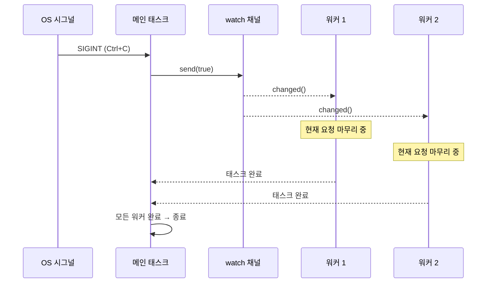

# 13. 운영 패턴 (Production Patterns) 🔴

> **학습 내용:**
> - `watch` 채널과 `select!`을 사용한 우아한 종료(Graceful shutdown)
> - 백프레셔(Backpressure): OOM 방지를 위한 제한된 채널 사용
> - 구조적 동시성(Structured concurrency): `JoinSet` 및 `TaskTracker`
> - 타임아웃, 재시도 및 지수적 백오프(exponential backoff)
> - 에러 처리: `thiserror` vs `anyhow`, 더블 `?` 패턴
> - Tower: axum, tonic, hyper에서 사용되는 미들웨어 패턴

## 우아한 종료 (Graceful Shutdown)

운영 환경의 서버는 깨끗하게 종료되어야 합니다. 진행 중인 요청을 완료하고, 버퍼를 비우고, 연결을 닫아야 합니다:

```rust
use tokio::signal;
use tokio::sync::watch;

async fn main_server() {
    // 종료 시그널 채널 생성
    let (shutdown_tx, shutdown_rx) = watch::channel(false);

    // 서버 스폰
    let server_handle = tokio::spawn(run_server(shutdown_rx.clone()));

    // Ctrl+C 대기
    signal::ctrl_c().await.expect("Ctrl+C 리스너 실행 실패");
    println!("종료 시그널 수신, 진행 중인 요청을 마무리합니다...");

    // 모든 태스크에 종료 알림
    // 참고: 간결함을 위해 .unwrap() 사용. 운영 코드에서는 모든 수신자가
    // 드롭된 경우를 처리해야 함.
    shutdown_tx.send(true).unwrap();

    // 서버 종료 대기 (타임아웃 설정)
    match tokio::time::timeout(
        std::time::Duration::from_secs(30),
        server_handle,
    ).await {
        Ok(Ok(())) => println!("서버가 우아하게 종료되었습니다"),
        Ok(Err(e)) => eprintln!("서버 에러: {e}"),
        Err(_) => eprintln!("서버 종료 시간 초과 — 강제 종료합니다"),
    }
}

async fn run_server(mut shutdown: watch::Receiver<bool>) {
    loop {
        tokio::select! {
            // 새로운 연결 수락
            conn = accept_connection() => {
                let shutdown = shutdown.clone();
                tokio::spawn(handle_connection(conn, shutdown));
            }
            // 종료 시그널 확인
            _ = shutdown.changed() => {
                if *shutdown.borrow() {
                    println!("새로운 연결 수락을 중단합니다");
                    break;
                }
            }
        }
    }
    // 진행 중인 연결들은 각자의 shutdown_rx 클론을
    // 가지고 있으므로 스스로 마무리될 것입니다.
}

async fn handle_connection(conn: Connection, mut shutdown: watch::Receiver<bool>) {
    loop {
        tokio::select! {
            request = conn.next_request() => {
                // 요청을 완전히 처리 — 중간에 중단하지 않음
                process_request(request).await;
            }
            _ = shutdown.changed() => {
                if *shutdown.borrow() {
                    // 현재 요청을 마무리하고 종료
                    break;
                }
            }
        }
    }
}
```



### 제한된 채널을 통한 백프레셔 (Backpressure)

제한이 없는(unbounded) 채널은 생산자가 소비자보다 빠를 경우 메모리 부족(OOM)을 일으킬 수 있습니다. 운영 환경에서는 항상 제한된(bounded) 채널을 사용하세요:

```rust
use tokio::sync::mpsc;

async fn backpressure_example() {
    // 제한된 채널: 버퍼에 최대 100개 아이템 저장 가능
    let (tx, mut rx) = mpsc::channel::<WorkItem>(100);

    // 생산자: 버퍼가 꽉 차면 자연스럽게 속도가 조절됨
    let producer = tokio::spawn(async move {
        for i in 0..1_000_000 {
            // send()는 비동기 — 버퍼가 꽉 차면 대기함
            // 이것이 자연스러운 백프레셔를 생성합니다!
            tx.send(WorkItem { id: i }).await.unwrap();
        }
    });

    // 소비자: 자신의 속도에 맞춰 아이템 처리
    let consumer = tokio::spawn(async move {
        while let Some(item) = rx.recv().await {
            process(item).await; // 처리가 늦어져도 괜찮음 — 생산자가 기다려줌
        }
    });

    let _ = tokio::join!(producer, consumer);
}

// 제한 없는 채널과 비교 — 위험함:
// let (tx, rx) = mpsc::unbounded_channel(); // 백프레셔 없음!
// 생산자가 메모리를 무한히 채울 수 있음
```

### 구조적 동시성: JoinSet 및 TaskTracker

`JoinSet`은 관련된 태스크들을 그룹화하고 모두 완료되도록 보장합니다:

```rust
use tokio::task::JoinSet;
use tokio::time::{sleep, Duration};

async fn structured_concurrency() {
    let mut set = JoinSet::new();

    // 태스크 묶음 스폰
    for url in get_urls() {
        set.spawn(async move {
            fetch_and_process(url).await
        });
    }

    // 모든 결과 수집 (순서 보장 안 됨)
    let mut results = Vec::new();
    while let Some(result) = set.join_next().await {
        match result {
            Ok(Ok(data)) => results.push(data),
            Ok(Err(e)) => eprintln!("태스크 에러: {e}"),
            Err(e) => eprintln!("태스크 패닉: {e}"),
        }
    }

    // 여기서 모든 태스크가 완료됨 — 백그라운드에 남은 작업이 없음
    println!("{}개 아이템 처리 완료", results.len());
}

// TaskTracker (tokio-util 0.7.9+) — 스폰된 모든 태스크 대기
use tokio_util::task::TaskTracker;

async fn with_tracker() {
    let tracker = TaskTracker::new();

    for i in 0..10 {
        tracker.spawn(async move {
            sleep(Duration::from_millis(100 * i)).await;
            println!("태스크 {i} 완료");
        });
    }

    tracker.close(); // 더 이상 태스크가 추가되지 않음
    tracker.wait().await; // 추적 중인 모든 태스크 대기
    println!("모든 태스크 종료됨");
}
```

### 타임아웃과 재시도 (Timeouts and Retries)

```rust
use tokio::time::{timeout, sleep, Duration};

// 단순 타임아웃
async fn with_timeout() -> Result<Response, Error> {
    match timeout(Duration::from_secs(5), fetch_data()).await {
        Ok(Ok(response)) => Ok(response),
        Ok(Err(e)) => Err(Error::Fetch(e)),
        Err(_) => Err(Error::Timeout),
    }
}

// 지수적 백오프 재시도
async fn retry_with_backoff<F, Fut, T, E>(
    max_attempts: u32,
    base_delay_ms: u64,
    operation: F,
) -> Result<T, E>
where
    F: Fn() -> Fut,
    Fut: std::future::Future<Output = Result<T, E>>,
    E: std::fmt::Display,
{
    let mut delay = Duration::from_millis(base_delay_ms);

    for attempt in 1..=max_attempts {
        match operation().await {
            Ok(result) => return Ok(result),
            Err(e) => {
                if attempt == max_attempts {
                    eprintln!("최종 시도({attempt}) 실패: {e}");
                    return Err(e);
                }
                eprintln!("시도({attempt}) 실패: {e}, {delay:?} 후에 재시도합니다.");
                sleep(delay).await;
                delay *= 2; // 지수적 백오프
            }
        }
    }
    unreachable!()
}

// 사용 예시:
// let result = retry_with_backoff(3, 100, || async {
//     reqwest::get("https://api.example.com/data").await
// }).await?;
```

> **운영 팁 — 지터(jitter) 추가**: 위의 함수는 순수 지수적 백오프를 사용합니다. 하지만 운영
> 환경에서는 많은 클라이언트가 동시에 실패할 경우 모두 동일한 간격으로 재시도하게 됩니다 (thundering herd).
> 랜덤한 *지터*를 추가하여 (예: `sleep(delay + rand_jitter)`) 재시도가 시간상으로 분산되게 하세요.

### 비동기 코드에서의 에러 처리

비동기 코드는 독특한 에러 전파 과제가 있습니다. 스폰된 태스크는 에러 경계를 만들고, 타임아웃 에러는 내부 에러를 감싸며, 퓨처가 태스크 경계를 넘을 때 `?` 연산자가 다르게 작동합니다.

**`thiserror` vs `anyhow`** — 적합한 도구 선택하기:

```rust
// thiserror: 라이브러리 및 공개 API를 위한 정형화된 에러 정의
// 모든 변형이 명시적임 — 호출자가 특정 에러에 대해 매칭 가능
use thiserror::Error;

#[derive(Error, Debug)]
enum DiagError {
    #[error("IPMI 명령 실패: {0}")]
    Ipmi(#[from] IpmiError),

    #[error("센서 {sensor} 범위 초과: {value}°C (최대 {max}°C)")]
    OverTemp { sensor: String, value: f64, max: f64 },

    #[error("작업 시간 초과 ({0:?})")]
    Timeout(std::time::Duration),

    #[error("태스크 패닉: {0}")]
    TaskPanic(#[from] tokio::task::JoinError),
}

// anyhow: 애플리케이션 및 프로토타입을 위한 빠른 에러 처리
// 모든 에러를 감싸줌 — 모든 경우에 대해 타입을 정의할 필요 없음
use anyhow::{Context, Result};

async fn run_diagnostics() -> Result<()> {
    let config = load_config()
        .await
        .context("진단 설정 로드 실패")?;  // 컨텍스트 추가

    let result = run_gpu_test(&config)
        .await
        .context("GPU 진단 실패")?;          // 컨텍스트 체이닝

    Ok(())
}
// anyhow는 다음과 같이 출력함: "GPU 진단 실패: IPMI 명령 실패: 타임아웃"
```

| 크레이트 | 사용 시점 | 에러 타입 | 매칭 방식 |
|-------|----------|-----------|----------|
| `thiserror` | 라이브러리 코드, 공개 API | `enum MyError { ... }` | `match err { MyError::Timeout => ... }` |
| `anyhow` | 애플리케이션, CLI 도구, 스크립트 | `anyhow::Error` (타입 소거됨) | `err.downcast_ref::<MyError>()` |
| 둘 다 사용 | 라이브러리는 thiserror 노출, 앱은 anyhow로 감쌈 | 최고의 조합 | 라이브러리 에러는 정형화되고 앱은 신경 쓰지 않음 |

`tokio::spawn`에서의 **더블 `?` 패턴**:

```rust
use thiserror::Error;
use tokio::task::JoinError;

#[derive(Error, Debug)]
enum AppError {
    #[error("HTTP 에러: {0}")]
    Http(#[from] reqwest::Error),

    #[error("태스크 패닉: {0}")]
    TaskPanic(#[from] JoinError),
}

async fn spawn_with_errors() -> Result<String, AppError> {
    let handle = tokio::spawn(async {
        let resp = reqwest::get("https://example.com").await?;
        Ok::<_, reqwest::Error>(resp.text().await?)
    });

    // 더블 ?: 첫 번째 ?는 JoinError(태스크 패닉)를 풀고, 두 번째 ?는 내부 Result를 풂
    let result = handle.await??;
    Ok(result)
}
```

**에러 경계 문제** — `tokio::spawn`은 컨텍스트를 소거함:

```rust
// ❌ 스폰 경계를 넘으면 에러 컨텍스트가 소실됨:
async fn bad_error_handling() -> Result<()> {
    let handle = tokio::spawn(async {
        some_fallible_work().await  // Result<T, SomeError> 반환
    });

    // handle.await는 Result<Result<T, SomeError>, JoinError> 반환
    // 내부 에러는 어떤 태스크가 실패했는지에 대한 정보가 없음
    let result = handle.await??;
    Ok(())
}

// ✅ 스폰 경계에서 컨텍스트 추가:
async fn good_error_handling() -> Result<()> {
    let handle = tokio::spawn(async {
        some_fallible_work()
            .await
            .context("워커 태스크 실패")  // 경계를 넘기 전에 컨텍스트 추가
    });

    let result = handle.await
        .context("워커 태스크 패닉")??;  // JoinError에 대해서도 컨텍스트 추가
    Ok(())
}
```

**타임아웃 에러** — 감싸기 vs 교체하기:

```rust
use tokio::time::{timeout, Duration};

async fn with_timeout_context() -> Result<String, DiagError> {
    let dur = Duration::from_secs(30);
    match timeout(dur, fetch_sensor_data()).await {
        Ok(Ok(data)) => Ok(data),
        Ok(Err(e)) => Err(e),                      // 내부 에러 보존
        Err(_) => Err(DiagError::Timeout(dur)),     // 타임아웃 → 정형화된 에러
    }
}
```

### Tower: 미들웨어 패턴

[Tower](https://docs.rs/tower) 크레이트는 조합 가능한 `Service` 트레이트를 정의합니다. 이는 Rust 비동기 미들웨어의 근간입니다 (`axum`, `tonic`, `hyper`에서 사용됨):

```rust
// Tower의 핵심 트레이트 (단순화됨):
pub trait Service<Request> {
    type Response;
    type Error;
    type Future: Future<Output = Result<Self::Response, Self::Error>>;

    fn poll_ready(&mut self, cx: &mut Context<'_>) -> Poll<Result<(), Self::Error>>;
    fn call(&mut self, req: Request) -> Self::Future;
}
```

미들웨어는 로깅, 타임아웃, 전송률 제한과 같은 횡단 관심사(cross-cutting behavior)를 내부 로직 수정 없이 추가하기 위해 `Service`를 감쌉니다:

```rust
use tower::{ServiceBuilder, timeout::TimeoutLayer, limit::RateLimitLayer};
use std::time::Duration;

let service = ServiceBuilder::new()
    .layer(TimeoutLayer::new(Duration::from_secs(10)))       // 가장 바깥쪽: 타임아웃
    .layer(RateLimitLayer::new(100, Duration::from_secs(1))) // 그 다음: 전송률 제한
    .service(my_handler);                                     // 가장 안쪽: 실제 코드
```

**이것이 중요한 이유**: ASP.NET이나 Express.js의 미들웨어를 사용해 보셨다면, Tower가 바로 그 Rust 버전입니다. 코드 중복 없이 운영 환경 Rust 서비스에 공통 기능을 추가하는 방식입니다.

### 연습 문제: 워커 풀을 이용한 우아한 종료

<details>
<summary><strong>🏋️ 연습 문제 (클릭하여 확장)</strong></summary>

**도전 과제**: 채널 기반의 작업 큐, N개의 워커 태스크, 그리고 Ctrl+C 발생 시 우아한 종료 기능을 갖춘 태스크 프로세서를 구축하세요. 워커는 종료 전 진행 중인 작업을 마무리해야 합니다.

<details>
<summary>🔑 정답</summary>

```rust
use tokio::sync::{mpsc, watch};
use tokio::time::{sleep, Duration};

struct WorkItem { id: u64, payload: String }

#[tokio::main]
async fn main() {
    let (work_tx, work_rx) = mpsc::channel::<WorkItem>(100);
    let (shutdown_tx, shutdown_rx) = watch::channel(false);
    let work_rx = std::sync::Arc::new(tokio::sync::Mutex::new(work_rx));

    let mut handles = Vec::new();
    for id in 0..4 {
        let rx = work_rx.clone();
        let mut shutdown = shutdown_rx.clone();
        handles.push(tokio::spawn(async move {
            loop {
                let item = {
                    let mut rx = rx.lock().await;
                    tokio::select! {
                        item = rx.recv() => item,
                        _ = shutdown.changed() => {
                            if *shutdown.borrow() { None } else { continue }
                        }
                    }
                };
                match item {
                    Some(work) => {
                        println!("워커 {id}: {} 처리 중", work.id);
                        sleep(Duration::from_millis(200)).await;
                    }
                    None => break,
                }
            }
        }));
    }

    // 작업 제출
    for i in 0..20 {
        let _ = work_tx.send(WorkItem { id: i, payload: format!("task-{i}") }).await;
        sleep(Duration::from_millis(50)).await;
    }

    // Ctrl+C 시: 종료 신호를 보내고 워커 대기
    // 참고: 간결함을 위해 .unwrap() 사용 — 운영 환경에서는 에러를 처리하세요.
    tokio::signal::ctrl_c().await.unwrap();
    shutdown_tx.send(true).unwrap();
    for h in handles { let _ = h.await; }
    println!("깨끗하게 종료되었습니다.");
}
```

</details>
</details>

> **핵심 요약 — 운영 패턴**
> - 조정된 우아한 종료를 위해 `watch` 채널과 `select!`을 사용하세요.
> - 제한된 채널(`mpsc::channel(N)`)은 버퍼가 꽉 찼을 때 송신자를 블록하여 **백프레셔**를 제공합니다.
> - `JoinSet`과 `TaskTracker`는 태스크 그룹을 추적, 중단, 대기할 수 있는 **구조적 동시성**을 제공합니다.
> - 네트워크 작업에는 항상 타임아웃을 추가하세요 — `tokio::time::timeout(dur, fut)`
> - Tower의 `Service` 트레이트는 운영 환경 Rust 서비스를 위한 표준 미들웨어 패턴입니다.

> **참고:** 채널 및 동기화 요소에 대해서는 [8장 — Tokio 심층 분석](ch08-tokio-deep-dive.md)을, 종료 중 취소 위험에 대해서는 [12장 — 흔히 발생하는 함정들](ch12-common-pitfalls.md)을 참조하세요.

***
