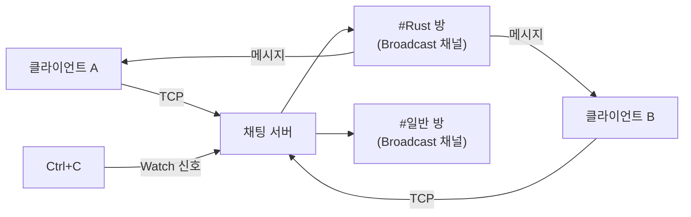

# 16. 캡스톤 프로젝트: 멀티룸 비동기 채팅 서버 🔴

> **프로젝트 목표:**
> - 지금까지 배운 모든 비동기 패턴(Tokio, 채널, 스트림, 에러 처리, 우아한 종료)을 하나의 완성된 서버 애플리케이션으로 통합합니다.
> - **멀티룸 채팅** 기능을 구현하며 실전 비동기 아키텍처 설계 능력을 배양합니다.

---

### 📋 프로젝트 개요
여러 클라이언트가 TCP로 접속하여 방(Room)을 만들거나 참여하고, 실시간으로 메시지를 주고받는 서버를 구축합니다.

- **예상 소요 시간**: 4 ~ 6시간
- **난이도**: ★★★ (심화)
- **핵심 기술**: `tokio::spawn`, `broadcast` 채널(메시지 전파), `mpsc` 채널(작업 전달), `watch` 채널(종료 신호), `tokio::select!`, `AsyncRead/Write` 스트림.

---

### 🛠️ 주요 기능 요구 사항
1.  **클라이언트 접속**: TCP를 통해 서버에 연결하고 닉네임을 설정합니다.
2.  **멀티룸 지원**: `/join <방이름>` 명령어로 특정 방에 들어가거나 옮길 수 있습니다.
3.  **메시지 전파**: 내가 보낸 메시지는 동일한 방에 있는 모든 사람에게 즉시 전달됩니다.
4.  **시스템 명령어**:
    - `/nick <이름>`: 닉네임 변경
    - `/rooms`: 활성화된 방 목록 보기
    - `/quit`: 접속 종료
5.  **우아한 종료**: 서버 종료 시 `Ctrl+C`를 감지하여 "서버가 종료됩니다"라고 공지하고 안전하게 닫습니다.

---

### 📐 시스템 아키텍처

---

### 🚀 단계별 구현 가이드

#### 1단계: 기본 서버 틀 잡기
`TcpListener`를 사용해 연결을 수락하고, 각 클라이언트를 `tokio::spawn`으로 독립된 태스크에서 처리하는 루프를 만듭니다.

#### 2단계: 채팅방 상태 관리 (Broadcast 채널)
각 채팅방은 고유한 `broadcast::Sender`를 가집니다. 클라이언트가 특정 방에 들어가면 해당 채널을 구독(`subscribe`)하게 됩니다. 방 목록은 `Arc<RwLock<HashMap<String, Sender>>>`로 관리하세요.

#### 3단계: `tokio::select!`를 활용한 클라이언트 핸들러
각 클라이언트 태스크는 다음 두 가지를 동시에 감시해야 합니다.
1.  **클라이언트가 보낸 데이터**: 명령어를 처리하거나 방에 메시지를 뿌립니다.
2.  **채팅방에서 온 데이터**: 다른 사람이 보낸 메시지를 내 화면에 출력합니다.

#### 4단계: 명령어 처리 및 예외 상황 대응
- `/join` 시 이전 방의 구독을 해지하고 새 방을 구독하는 로직을 구현합니다.
- 너무 느린 클라이언트(Lagging Client)에 대한 처리 로직을 추가하세요.

#### 5단계: 우아한 종료 구현
`tokio::signal::ctrl_c()`와 `watch` 채널을 조합하여, 서버가 예작 종료될 때 모든 클라이언트에게 작별 인사를 하고 안전하게 연결을 끊도록 만듭니다.

---

### ✅ 평가 및 자가 진단
- [ ] 여러 명의 클라이언트가 동시에 접속해도 서버가 멈추지 않는가?
- [ ] 내가 보낸 메시지가 같은 방 사람들에게만 정확히 전달되는가?
- [ ] `/quit` 입력 시 자원(메모리, 소켓)이 깔끔하게 정리되는가?
- [ ] 서버 종료 시 모든 클라이언트와의 연결이 안전하게 해제되는가?

---

### 🌟 심화 아이디어 (선택 사항)
- **메시지 기록(History)**: 방에 늦게 들어온 사람을 위해 최근 10개의 메시지를 보여주는 기능을 추가해 보세요.
- **WebSocket 지원**: 웹 브라우저에서도 접속할 수 있도록 `tokio-tungstenite`를 연동해 보세요.
- **TLS 보안**: `tokio-rustls`를 사용해 암호화된 채팅 터널을 만들어 보세요.

---

**축하합니다!** 이 프로젝트를 마쳤다면 여러분은 이제 비동기 Rust의 전문가로 거듭난 것입니다. 🥳

