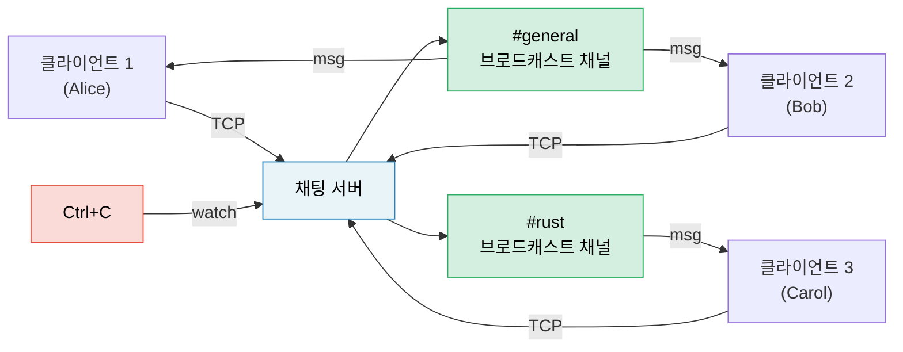

# 캡스톤 프로젝트: 비동기 채팅 서버

이 프로젝트는 책 전체에서 배운 패턴들을 하나의 운영 수준 애플리케이션으로 통합합니다. 여러분은 tokio, 채널, 스트림, 우아한 종료, 그리고 적절한 에러 처리를 사용하여 **멀티룸 비동기 채팅 서버**를 구축하게 됩니다.

**예상 소요 시간**: 4–6 시간 | **난이도**: ★★★

> **실습 내용:**
> - `tokio::spawn`과 `'static` 요구 사항 (8장)
> - 채널: 메시지용 `mpsc`, 채팅방용 `broadcast`, 종료용 `watch` (8장)
> - 스트림: TCP 연결로부터 라인 읽기 (11장)
> - 흔히 발생하는 함정: 취소 안전성, `.await`를 가로지르는 MutexGuard (12장)
> - 운영 패턴: 우아한 종료, 백프레셔 (13장)
> - 플러그형 백엔드를 위한 비동기 트레이트 (10장)

## 문제 정의

다음 기능을 갖춘 TCP 채팅 서버를 구축하세요:

1. **클라이언트**는 TCP를 통해 연결하고 이름이 있는 채팅방에 참여합니다.
2. **메시지**는 동일한 채팅방에 있는 모든 클라이언트에게 브로드캐스트됩니다.
3. **명령어**: `/join <room>`, `/nick <name>`, `/rooms`, `/quit`
4. 서버는 Ctrl+C 발생 시 진행 중인 메시지를 마무리하며 **우아하게 종료**됩니다.



## 1단계: 기본 TCP 수락 루프

연결을 수락하고 받은 라인을 그대로 돌려보내는 에코 서버부터 시작하세요:

```rust
use tokio::io::{AsyncBufReadExt, AsyncWriteExt, BufReader};
use tokio::net::TcpListener;

#[tokio::main]
async fn main() -> anyhow::Result<()> {
    let listener = TcpListener::bind("127.0.0.1:8080").await?;
    println!("채팅 서버가 :8080에서 실행 중입니다.");

    loop {
        let (socket, addr) = listener.accept().await?;
        println!("[{addr}] 연결됨");

        tokio::spawn(async move {
            let (reader, mut writer) = socket.into_split();
            let mut reader = BufReader::new(reader);
            let mut line = String::new();

            loop {
                line.clear();
                match reader.read_line(&mut line).await {
                    Ok(0) | Err(_) => break,
                    Ok(_) => {
                        let _ = writer.write_all(line.as_bytes()).await;
                    }
                }
            }
            println!("[{addr}] 연결 종료됨");
        });
    }
}
```

**할 일**: 이 코드가 컴파일되는지 확인하고 `telnet localhost 8080`으로 테스트해 보세요.

## 2단계: 브로드캐스트 채널을 이용한 채팅방 상태 관리

각 채팅방은 하나의 `broadcast::Sender`입니다. 채팅방에 있는 모든 클라이언트는 메시지를 받기 위해 이를 구독(subscribe)합니다.

```rust
use std::collections::HashMap;
use std::sync::Arc;
use tokio::sync::{broadcast, RwLock};

type RoomMap = Arc<RwLock<HashMap<String, broadcast::Sender<String>>>>;

fn get_or_create_room(rooms: &mut HashMap<String, broadcast::Sender<String>>, name: &str) -> broadcast::Sender<String> {
    rooms.entry(name.to_string())
        .or_insert_with(|| {
            let (tx, _) = broadcast::channel(100); // 100개 메시지 버퍼
            tx
        })
        .clone()
}
```

**할 일**: 다음과 같이 채팅방 상태를 구현하세요:
- 클라이언트는 `#general`에서 시작합니다.
- `/join <room>`은 채팅방을 전환합니다 (이전 방 구독 해지, 새 방 구독).
- 메시지는 발신자의 현재 채팅방에 있는 모든 클라이언트에게 브로드캐스트됩니다.

<details>
<summary>💡 힌트 — 클라이언트 태스크 구조</summary>

각 클라이언트 태스크는 동시에 실행되는 두 개의 루프가 필요합니다:
1. **TCP로부터 읽기** → 명령어 파싱 또는 방에 브로드캐스트
2. **브로드캐스트 수신자로부터 읽기** → TCP에 쓰기

둘을 동시에 실행하기 위해 `tokio::select!`를 사용하세요:

```rust
loop {
    tokio::select! {
        // 클라이언트가 우리에게 라인을 보냄
        result = reader.read_line(&mut line) => {
            match result {
                Ok(0) | Err(_) => break,
                Ok(_) => {
                    // 명령어 파싱 또는 메시지 브로드캐스트
                }
            }
        }
        // 방 브로드캐스트 수신
        result = room_rx.recv() => {
            match result {
                Ok(msg) => {
                    let _ = writer.write_all(msg.as_bytes()).await;
                }
                Err(_) => break,
            }
        }
    }
}
```

</details>

## 3단계: 명령어 처리

다음 명령어 프로토콜을 구현하세요:

| 명령어 | 동작 |
|---------|--------|
| `/join <room>` | 현재 방 퇴장, 새 방 입장, 양쪽 방에 알림 |
| `/nick <name>` | 표시 이름 변경 |
| `/rooms` | 모든 활성 방 목록과 참여자 수 출력 |
| `/quit` | 우아하게 연결 종료 |
| 기타 모든 것 | 채팅 메시지로 브로드캐스트 |

**할 일**: 입력 라인에서 명령어를 파싱하세요. `/rooms`의 경우 `RoomMap`에서 읽어와야 합니다 — 다른 클라이언트를 차단하지 않도록 `RwLock::read()`를 사용하세요.

## 4단계: 우아한 종료

Ctrl+C 처리를 추가하여 서버가 다음을 수행하도록 하세요:
1. 새로운 연결 수락 중단
2. 모든 방에 "서버가 종료됩니다..." 메시지 전송
3. 진행 중인 메시지들이 모두 처리될 때까지 대기
4. 깨끗하게 종료

```rust
use tokio::sync::watch;

let (shutdown_tx, shutdown_rx) = watch::channel(false);

// 수락 루프 내에서:
loop {
    tokio::select! {
        result = listener.accept() => {
            let (socket, addr) = result?;
            // shutdown_rx.clone()과 함께 클라이언트 태스크 스폰
        }
        _ = tokio::signal::ctrl_c() => {
            println!("종료 시그널 수신");
            shutdown_tx.send(true)?;
            break;
        }
    }
}
```

**할 일**: 각 클라이언트의 `select!` 루프에 `shutdown_rx.changed()`를 추가하여 종료 신호 발생 시 클라이언트가 종료되도록 하세요.

## 5단계: 에러 처리 및 예외 상황 대응

서버를 운영 환경에 적합하게 강화하세요:

1. **느린 수신자 (Lagging receivers)**: 느린 클라이언트가 메시지를 놓치면 `broadcast::recv()`는 `RecvError::Lagged(n)`를 반환합니다. 이를 우아하게 처리하세요 (로그 출력 후 계속 진행, 충돌 방지).
2. **닉네임 검증**: 빈 이름이나 너무 긴 닉네임은 거부하세요.
3. **백프레셔 (Backpressure)**: 브로드캐스트 채널 버퍼는 제한되어 있습니다(100). 클라이언트가 따라오지 못하면 `Lagged` 에러를 받게 됩니다.
4. **타임아웃**: 5분 이상 활동이 없는 클라이언트의 연결을 끊으세요.

```rust
use tokio::time::{timeout, Duration};

// 읽기 작업을 타임아웃으로 감싸기:
match timeout(Duration::from_secs(300), reader.read_line(&mut line)).await {
    Ok(Ok(0)) | Ok(Err(_)) | Err(_) => break, // EOF, 에러 또는 타임아웃
    Ok(Ok(_)) => { /* 라인 처리 */ }
}
```

## 6단계: 통합 테스트

서버를 시작하고, 두 클라이언트를 연결한 뒤, 메시지 전달을 확인하는 테스트를 작성하세요:

```rust
#[tokio::test]
async fn two_clients_can_chat() {
    // 백그라운드에서 서버 실행
    let server = tokio::spawn(run_server("127.0.0.1:0")); // 포트 0 = OS가 자동 할당

    // 두 클라이언트 연결
    let mut client1 = TcpStream::connect(addr).await.unwrap();
    let mut client2 = TcpStream::connect(addr).await.unwrap();

    // 클라이언트 1이 메시지 전송
    client1.write_all(b"Hello from client 1\n").await.unwrap();

    // 클라이언트 2가 이를 수신해야 함
    let mut buf = vec![0u8; 1024];
    let n = client2.read(&mut buf).await.unwrap();
    let msg = String::from_utf8_lossy(&buf[..n]);
    assert!(msg.contains("Hello from client 1"));
}
```

## 평가 기준

| 기준 | 목표 |
|-----------|--------|
| 동시성 | 여러 방에서 여러 클라이언트가 블록 없이 통신 |
| 정확성 | 메시지가 동일한 방의 클라이언트에게만 전달됨 |
| 우아한 종료 | Ctrl+C 발생 시 메시지를 소진하고 깨끗하게 종료 |
| 에러 처리 | 지연된 수신자, 연결 끊김, 타임아웃 처리 완료 |
| 코드 구조 | 수락 루프, 클라이언트 태스크, 방 상태의 명확한 분리 |
| 테스트 | 최소 2개의 통합 테스트 포함 |

## 확장 아이디어

기본 채팅 서버가 작동하면 다음 기능들을 추가해 보세요:

1. **지속성 있는 기록 (Persistent history)**: 각 방의 마지막 N개 메시지를 저장하여 새로 입장한 사용자에게 보여주기
2. **WebSocket 지원**: `tokio-tungstenite`를 사용하여 TCP와 WebSocket 클라이언트를 모두 수용
3. **속도 제한 (Rate limiting)**: `tokio::time::Interval`을 사용하여 클라이언트당 초당 메시지 수 제한
4. **메트릭 (Metrics)**: `prometheus` 크레이트를 통해 연결된 클라이언트 수, 초당 메시지 수, 방 개수 추적
5. **TLS**: 보안 연결을 위해 `tokio-rustls` 추가

***
