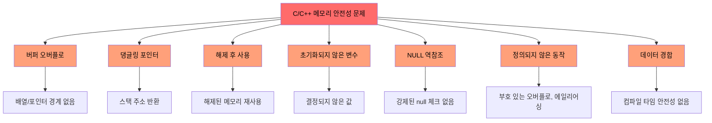
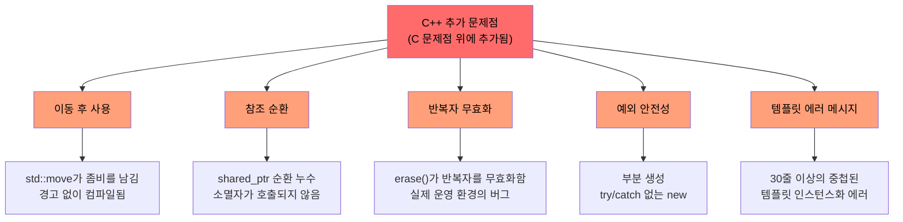
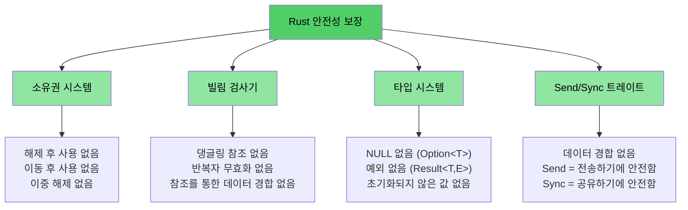

# C/C++ 개발자에게 Rust가 필요한 이유

> **학습 내용:**
> - Rust가 해결하는 문제들의 전체 목록 — 메모리 안전성, 정의되지 않은 동작(UB), 데이터 경합 등
> - `shared_ptr`, `unique_ptr` 및 기타 C++의 완화책들이 해결책이 아닌 임시방편인 이유
> - 안전한 Rust에서는 구조적으로 불가능한 실제 C 및 C++ 취약점 예시

> **코드로 바로 가고 싶으신가요?** [코드로 보여주세요](ch02-getting-started.md#enough-talk-already-show-me-some-code)로 이동하세요.

## Rust가 제거하는 문제들 — 전체 목록

예시를 살펴보기 전에 요약부터 확인해 보겠습니다. 안전한(Safe) Rust는 훈련, 도구 또는 코드 리뷰를 통해서가 아니라, 타입 시스템과 컴파일러를 통해 이 목록의 모든 문제를 **구조적으로 방지**합니다.

| **제거된 문제** | **C** | **C++** | **Rust의 방지 방법** |
|----------------------|:-----:|:-------:|--------------------------|
| 버퍼 오버플로 / 언더플로 | ✅ | ✅ | 모든 배열, 슬라이스, 문자열은 경계를 가집니다. 인덱싱은 런타임에 체크됩니다. |
| 메모리 누수 (GC 필요 없음) | ✅ | ✅ | `Drop` 트레이트 = 올바르게 구현된 RAII. 자동 정리, Rule of Five 불필요. |
| 댕글링 포인터 (Dangling pointers) | ✅ | ✅ | 수명(Lifetime) 시스템이 참조자가 대상보다 오래 생존함을 컴파일 타임에 증명합니다. |
| 해제 후 사용 (Use-after-free) | ✅ | ✅ | 소유권 시스템이 이를 컴파일 에러로 처리합니다. |
| 이동 후 사용 (Use-after-move) | — | ✅ | 이동은 **파괴적(destructive)**입니다. 원래의 바인딩은 존재하지 않게 됩니다. |
| 초기화되지 않은 변수 | ✅ | ✅ | 모든 변수는 사용 전에 초기화되어야 하며 컴파일러가 이를 강제합니다. |
| 정수 오버플로 / 언더플로 UB | ✅ | ✅ | 디버그 빌드에서는 패닉(panic)이 발생하며, 릴리스 빌드에서는 래핑(wrap)됩니다 (두 경우 모두 정의된 동작). |
| NULL 포인터 역참조 / SEGV | ✅ | ✅ | null 포인터가 없습니다. `Option<T>`가 명시적인 처리를 강제합니다. |
| 데이터 경합 (Data races) | ✅ | ✅ | `Send`/`Sync` 트레이트와 빌림 검사기(borrow checker)가 데이터 경합을 컴파일 에러로 처리합니다. |
| 통제되지 않는 부작용 (Side-effects) | ✅ | ✅ | 기본적으로 불변(immutability)이며, 변경하려면 명시적인 `mut`가 필요합니다. |
| 상속 없음 (유지보수성 향상) | — | ✅ | 트레이트와 조합(composition)이 클래스 계층 구조를 대체합니다. 결합도 없는 재사용을 장려합니다. |
| 예외 없음; 예측 가능한 제어 흐름 | — | ✅ | 에러는 값(`Result<T, E>`)입니다. 무시하기 불가능하며 숨겨진 `throw` 경로가 없습니다. |
| 반복자 무효화 (Iterator invalidation) | — | ✅ | 빌림 검사기가 반복하는 동안 컬렉션을 변경하는 것을 금지합니다. |
| 참조 순환 / 종료자 누수 | — | ✅ | 소유권은 트리 구조입니다. `Rc` 순환은 선택 사항이며 `Weak`으로 방지 가능합니다. |
| 뮤텍스 잠금 해제 누락 | ✅ | ✅ | `Mutex<T>`가 데이터를 감쌉니다. 락 가드(lock guard)가 데이터에 접근하는 유일한 방법입니다. |
| 정의되지 않은 동작 (일반 UB) | ✅ | ✅ | 안전한 Rust에는 정의되지 않은 동작이 **전혀** 없습니다. `unsafe` 블록은 명시적이고 감사 가능합니다. |

> **핵심:** 이것들은 코딩 표준으로 강제되는 희망 사항이 아닙니다. **컴파일 타임 보장** 사항입니다. 코드가 컴파일된다면, 이러한 버그들은 존재할 수 없습니다.

---

## C와 C++의 공통 문제점

> **예시를 건너뛰고 싶으신가요?** [Rust는 이 모든 것을 어떻게 해결하는가?](#how-rust-addresses-all-of-this)로 이동하거나 [코드로 보여주세요](ch02-getting-started.md#enough-talk-already-show-me-some-code)로 바로 가세요.

두 언어 모두 CVE(Common Vulnerabilities and Exposures)의 70% 이상을 차지하는 핵심 메모리 안전성 문제를 공유하고 있습니다.

### 버퍼 오버플로 (Buffer overflows)

C 배열, 포인터, 문자열에는 고유한 경계가 없습니다. 이를 초과하는 것은 너무나 쉽습니다.

```c
#include <stdlib.h>
#include <string.h>

void buffer_dangers() {
    char buffer[10];
    strcpy(buffer, "This string is way too long!");  // 버퍼 오버플로

    int arr[5] = {1, 2, 3, 4, 5};
    int *ptr = arr;           // 크기 정보를 잃음
    ptr[10] = 42;             // 경계 체크 없음 — 정의되지 않은 동작(UB)
}
```

C++에서도 `std::vector::operator[]`는 여전히 경계 체크를 수행하지 않습니다. `.at()`만이 체크를 수행하는데, 누가 그 예외를 잡나요?

### 댕글링 포인터 및 해제 후 사용 (Use-after-free)

```c
int *bar() {
    int i = 42;
    return &i;    // 스택 변수의 주소를 반환 — 댕글링!
}

void use_after_free() {
    char *p = (char *)malloc(20);
    free(p);
    *p = '\0';   // 해제 후 사용 — 정의되지 않은 동작(UB)
}
```

### 초기화되지 않은 변수 및 정의되지 않은 동작

C와 C++ 모두 초기화되지 않은 변수를 허용합니다. 그 결과 값은 정해지지 않으며, 이를 읽는 것은 정의되지 않은 동작입니다.

```c
int x;               // 초기화되지 않음
if (x > 0) { ... }  // UB — x는 무엇이든 될 수 있음
```

정수 오버플로는 C에서 부호 없는 타입에 대해서는 **정의되어** 있지만, 부호 있는 타입에 대해서는 **정의되어 있지 않습니다**. C++에서도 부호 있는 오버플로는 정의되지 않은 동작입니다. 두 컴파일러 모두 이를 이용해 프로그램을 예상치 못한 방식으로 망가뜨리는 "최적화"를 수행할 수 있고 실제로 수행합니다.

### NULL 포인터 역참조

```c
int *ptr = NULL;
*ptr = 42;           // SEGV — 하지만 컴파일러는 여러분을 막지 않습니다.
```

C++에서 `std::optional<T>`가 도움이 되지만 번거롭고 종종 예외를 던지는 `.value()`로 인해 무시되곤 합니다.

### 시각화: 공유된 문제점들



---

## C++에 추가된 추가 문제점들

> **C 사용자에게**: C++를 사용하지 않는다면 [Rust는 이러한 문제를 어떻게 해결하는가?](#how-rust-addresses-all-of-this)로 건너뛰셔도 됩니다.
>
> **코드로 바로 가고 싶으신가요?** [코드로 보여주세요](ch02-getting-started.md#enough-talk-already-show-me-some-code)로 이동하세요.

C++는 C의 문제를 해결하기 위해 스마트 포인터, RAII, 이동 의미론, 예외를 도입했습니다. 이것들은 **근본적인 해결책이 아니라 임시방편**입니다. 오류 모드를 "런타임 충돌"에서 "더 미묘한 런타임 버그"로 바꿀 뿐입니다.

### `unique_ptr` 및 `shared_ptr` — 해결책이 아닌 임시방편

C++ 스마트 포인터는 원시 `malloc`/`free`에 비해 상당한 개선을 이루었지만, 근본적인 문제를 해결하지는 못합니다.

| C++ 완화책 | 해결하는 것 | **해결하지 못하는 것** |
|----------------|---------------|------------------------|
| `std::unique_ptr` | RAII를 통한 누수 방지 | **이동 후 사용(Use-after-move)**이 여전히 컴파일됨; 좀비 nullptr를 남김 |
| `std::shared_ptr` | 공유 소유권 | **참조 순환(Reference cycles)**이 조용히 누수됨; `weak_ptr` 관리는 수동임 |
| `std::optional` | 일부 null 사용 대체 | 비어 있을 때 `.value()`가 **예외를 던짐** — 숨겨진 제어 흐름 |
| `std::string_view` | 복사 방지 | 원본 문자열이 해제되면 **댕글링** 발생 — 수명 체크 없음 |
| 이동 의미론 | 효율적인 전송 | 이동된 객체는 **"유효하지만 지정되지 않은 상태"**로 남음 — UB의 원인 |
| RAII | 자동 정리 | 올바르게 구현하려면 **Rule of Five**가 필요함; 한 번의 실수가 모든 것을 망침 |

```cpp
// unique_ptr: 이동 후 사용이 깔끔하게 컴파일됨
std::unique_ptr<int> ptr = std::make_unique<int>(42);
std::unique_ptr<int> ptr2 = std::move(ptr);
std::cout << *ptr;  // 컴파일됨! 런타임에 정의되지 않은 동작 발생.
                     // Rust에서는 "이동 후 사용된 값"이라며 컴파일 에러 발생
```

```cpp
// shared_ptr: 참조 순환으로 조용히 누수 발생
struct Node {
    std::shared_ptr<Node> next;
    std::shared_ptr<Node> parent;  // 순환 발생! 소멸자가 호출되지 않음.
};
auto a = std::make_shared<Node>();
auto b = std::make_shared<Node>();
a->next = b;
b->parent = a;  // 메모리 누수 — 참조 횟수가 0에 도달하지 않음
                 // Rust에서는 Rc<T> + Weak<T>를 통해 순환을 명시적으로 만들고 끊을 수 있음
```

### 이동 후 사용 — 조용한 살인자

C++의 `std::move`는 이동이 아니라 캐스트입니다. 원래 객체는 "유효하지만 지정되지 않은 상태"로 남습니다. 컴파일러는 이를 계속 사용하도록 허용합니다.

```cpp
auto vec = std::make_unique<std::vector<int>>({1, 2, 3});
auto vec2 = std::move(vec);
vec->size();  // 컴파일됨! 하지만 nullptr 역참조 — 런타임에 충돌
```

Rust에서 이동은 **파괴적**입니다. 원래의 바인딩은 사라집니다.

```rust
let vec = vec![1, 2, 3];
let vec2 = vec;           // 이동 — vec가 소비됨
// vec.len();             // 컴파일 에러: 이동 후 사용된 값
```

### 반복자 무효화 — 실제 C++ 운영 환경에서의 버그

이것들은 억지로 만든 예시가 아닙니다. 대규모 C++ 코드베이스에서 발견된 **실제 버그 패턴**입니다.

```cpp
// 버그 1: 반복자를 재할당하지 않고 삭제 (정의되지 않은 동작)
while (it != pending_faults.end()) {
    if (*it != nullptr && (*it)->GetId() == fault->GetId()) {
        pending_faults.erase(it);   // ← 반복자 무효화!
        removed_count++;            //   다음 루프에서 댕글링 반복자 사용
    } else {
        ++it;
    }
}
// 수정: it = pending_faults.erase(it);
```

```cpp
// 버그 2: 인덱스 기반 삭제 시 요소 건너뛰기
for (auto i = 0; i < entries.size(); i++) {
    if (config_status == ConfigDisable::Status::Disabled) {
        entries.erase(entries.begin() + i);  // ← 요소가 이동함
    }                                         //   i++가 이동된 요소를 건너뜀
}
```

```cpp
// 버그 3: 한 경로는 맞고 다른 경로는 틀림
while (it != incomplete_ids.end()) {
    if (current_action == nullptr) {
        incomplete_ids.erase(it);  // ← 버그: 반복자가 재할당되지 않음
        continue;
    }
    it = incomplete_ids.erase(it); // ← 올바른 경로
}
```

**이것들은 경고 없이 컴파일됩니다.** Rust에서는 빌림 검사기가 이 세 가지를 모두 컴파일 에러로 처리합니다. 반복하는 동안에는 컬렉션을 수정할 수 없기 때문입니다.

### 예외 안전성 및 `dynamic_cast`/`new` 패턴

현대적인 C++ 코드베이스도 여전히 컴파일 타임 안전성이 없는 패턴에 크게 의존합니다.

```cpp
// 일반적인 C++ 팩토리 패턴 — 모든 분기가 잠재적인 버그입니다.
DriverBase* driver = nullptr;
if (dynamic_cast<ModelA*>(device)) {
    driver = new DriverForModelA(framework);
} else if (dynamic_cast<ModelB*>(device)) {
    driver = new DriverForModelB(framework);
}
// driver가 여전히 nullptr라면? new가 예외를 던진다면? driver의 소유권은 누구에게 있나요?
```

일반적인 10만 라인 규모의 C++ 코드베이스에서는 수백 개의 `dynamic_cast` 호출(각각 잠재적인 런타임 실패), 수백 개의 원시 `new` 호출(각각 잠재적인 누수), 그리고 수백 개의 `virtual`/`override` 메서드(도처에 존재하는 vtable 오버헤드)를 발견할 수 있습니다.

### 댕글링 참조 및 람다 캡처

```cpp
int& get_reference() {
    int x = 42;
    return x;  // 댕글링 참조 — 컴파일됨, 런타임에 UB
}

auto make_closure() {
    int local = 42;
    return [&local]() { return local; };  // 댕글링 캡처!
}
```

### 시각화: C++의 추가 문제점들



---

## Rust는 이 모든 것을 어떻게 해결하는가?

C와 C++ 모두에서 발생하는 위에 나열된 모든 문제는 Rust의 컴파일 타임 보장을 통해 방지됩니다.

| 문제점 | Rust의 해결책 |
|---------|-----------------|
| 버퍼 오버플로 | 슬라이스는 길이를 가집니다. 인덱싱은 경계 체크가 수행됩니다. |
| 댕글링 포인터 / 해제 후 사용 | 수명 시스템이 컴파일 타임에 참조자의 유효성을 증명합니다. |
| 이동 후 사용 | 이동은 파괴적입니다 — 컴파일러가 원본에 접근하는 것을 거부합니다. |
| 메모리 누수 | `Drop` 트레이트 = Rule of Five 없는 RAII. 자동적이고 올바른 정리. |
| 참조 순환 | 소유권은 트리 구조입니다. `Rc` + `Weak`를 통해 순환을 명시적으로 만듭니다. |
| 반복자 무효화 | 빌림 검사기가 빌려온 동안 컬렉션을 수정하는 것을 금지합니다. |
| NULL 포인터 | null이 없습니다. `Option<T>`가 패턴 매칭을 통한 명시적 처리를 강제합니다. |
| 데이터 경합 | `Send`/`Sync` 트레이트가 데이터 경합을 컴파일 에러로 처리합니다. |
| 초기화되지 않은 변수 | 모든 변수는 초기화되어야 하며 컴파일러가 이를 강제합니다. |
| 정수 UB | 디버그에서는 오버플로 시 패닉이 발생하며, 릴리스에서는 래핑됩니다 (둘 다 정의된 동작). |
| 예외 | 예외가 없습니다. `Result<T, E>`는 타입 시그니처에 명시되며 `?`로 전파됩니다. |
| 상속 복잡성 | 트레이트 + 조합. 다이아몬드 문제나 vtable 취약성이 없습니다. |
| 뮤텍스 잠금 해제 누락 | `Mutex<T>`가 데이터를 감쌉니다. 락 가드가 유일한 접근 경로입니다. |

```rust
fn rust_prevents_everything() {
    // ✅ 버퍼 오버플로 없음 — 경계 체크됨
    let arr = [1, 2, 3, 4, 5];
    // arr[10];  // 런타임에 패닉 발생, UB 아님

    // ✅ 이동 후 사용 없음 — 컴파일 에러
    let data = vec![1, 2, 3];
    let moved = data;
    // data.len();  // 에러: 이동 후 사용된 값

    // ✅ 댕글링 포인터 없음 — 수명 에러
    // let r;
    // { let x = 5; r = &x; }  // 에러: x가 충분히 오래 살지 않음

    // ✅ null 없음 — Option이 처리를 강제함
    let maybe: Option<i32> = None;
    // maybe.unwrap();  // 패닉이 발생할 수 있지만, 대신 match나 if let을 사용함

    // ✅ 데이터 경합 없음 — 컴파일 에러
    // let mut shared = vec![1, 2, 3];
    // std::thread::spawn(|| shared.push(4));  // 에러: 클로저가 빌려온 값보다 오래 살 수 있음
    // shared.push(5);                         // 
}
```

### Rust의 안전성 모델 — 전체 그림



## 빠른 참조: C vs C++ vs Rust

| **개념** | **C** | **C++** | **Rust** | **주요 차이점** |
|-------------|-------|---------|----------|-------------------|
| 메모리 관리 | `malloc()/free()` | `unique_ptr`, `shared_ptr` | `Box<T>`, `Rc<T>`, `Arc<T>` | 자동적임, 순환 없음, 좀비 없음 |
| 배열 | `int arr[10]` | `std::vector<T>`, `std::array<T>` | `Vec<T>`, `[T; N]` | 기본적으로 경계 체크 수행 |
| 문자열 | `\0`으로 끝나는 `char*` | `std::string`, `string_view` | `String`, `&str` | UTF-8 보장, 수명 체크됨 |
| 참조 | `int*` (원시) | `T&`, `T&&` (이동) | `&T`, `&mut T` | 수명 + 빌림 체크 |
| 다형성 | 함수 포인터 | 가상 함수, 상속 | 트레이트, 트레이트 객체 | 상속보다 조합 강조 |
| 제네릭 | 매크로 / `void*` | 템플릿 | 제네릭 + 트레이트 경계 | 명확한 에러 메시지 |
| 에러 처리 | 리턴 코드, `errno` | 예외, `std::optional` | `Result<T, E>`, `Option<T>` | 숨겨진 제어 흐름 없음 |
| NULL 안전성 | `ptr == NULL` | `nullptr`, `std::optional<T>` | `Option<T>` | 강제된 null 체크 |
| 스레드 안전성 | 수동 (pthreads) | 수동 (`std::mutex` 등) | 컴파일 타임 `Send`/`Sync` | 데이터 경합 불가능 |
| 빌드 시스템 | Make, CMake | CMake, Make 등 | Cargo | 통합된 툴체인 |
| 정의되지 않은 동작 | 만연함 | 미묘함 (부호 있는 오버플로, 에일리어싱) | 안전한 코드에서는 제로 | 안전성 보장 |

***
