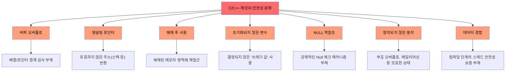
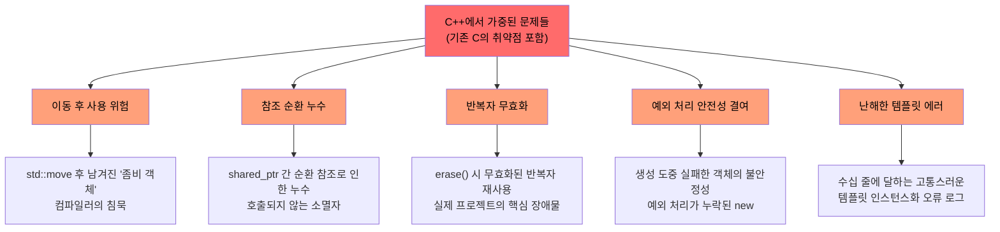
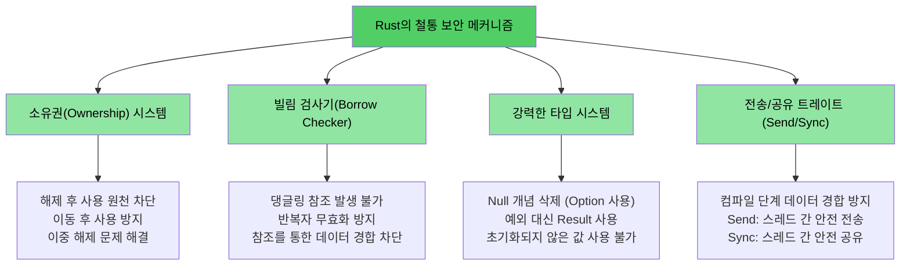

# C/C++ 개발자에게 Rust가 필요한 이유

> **학습 목표:**
> - Rust가 해결하는 고착화된 문제들(메모리 안전성, 정의되지 않은 동작, 데이터 경합 등)의 전체 목록을 살펴봅니다.
> - C++의 스마트 포인터(`shared_ptr`, `unique_ptr`)와 여러 완화책이 왜 근본적인 해결책이 될 수 없는지 분석합니다.
> - 안전한 Rust 환경에서는 구조적으로 발생할 수 없는 실제 C/C++ 취약점 사례를 확인합니다.

> **코드를 먼저 확인하고 싶으신가요?** [준비하기: 코드 예제](ch02-getting-started.md#enough-talk-already-show-me-some-code) 섹션으로 바로 이동해 보세요.

## Rust가 해결하는 문제들 (전체 목록)

안전한(Safe) Rust는 단순한 가이드라인이나 도구, 코드 리뷰에 의존하지 않습니다. 대신 강력한 타입 시스템과 컴파일러를 통해 아래 목록의 모든 문제를 **구조적으로 방지**합니다.

| **해결된 문제** | **C** | **C++** | **Rust의 해결 방식** |
| :--- | :---: | :---: | :--- |
| **버퍼 오버플로 / 언더플로** | ✅ | ✅ | 모든 배열, 슬라이스, 문자열은 경계 정보를 가집니다. 인덱스 접근 시 항상 런타임 검사가 수행됩니다. |
| **메모리 누수 (GC 없이 해결)** | ✅ | ✅ | `Drop` 트레이트를 통한 완벽한 RAII 구현. 자동 리소스 정리로 'Rule of Five'가 필요 없습니다. |
| **댕글링 포인터 (Dangling pointers)** | ✅ | ✅ | 수명(Lifetime) 시스템이 참조 대상보다 참조자가 더 오래 살 수 없음을 컴파일 단계에서 증명합니다. |
| **해제 후 사용 (Use-after-free)** | ✅ | ✅ | 소유권 시스템이 메모리 해제 후 재접근을 시도하면 컴파일 에러를 발생시킵니다. |
| **이동 후 사용 (Use-after-move)** | — | ✅ | 이동(Move)은 항상 **파괴적**입니다. 이동된 원본 변수는 더 이상 존재하지 않는 것으로 간주합니다. |
| **초기화되지 않은 변수** | ✅ | ✅ | 모든 변수는 사용 전 반드시 초기화되어야 하며, 컴파일러가 이를 엄격히 강제합니다. |
| **정수 오버플로 / 언더플로 UB** | ✅ | ✅ | 디버그 빌드에서는 패닉(Panic)을, 릴리스 빌드에서는 래핑(Wrapping)을 수행하여 항상 예측 가능한 동작을 보장합니다. |
| **NULL 포인터 역참조 / SEGV** | ✅ | ✅ | Null 개념 자체가 없습니다. 대신 `Option<T>` 타입을 통해 명시적인 처리를 강제합니다. |
| **데이터 경합 (Data races)** | ✅ | ✅ | `Send`/`Sync` 트레이트와 빌림 검사기가 멀티스레드 환경의 데이터 경합을 컴파일 에러로 차단합니다. |
| **통제되지 않는 부작용** | ✅ | ✅ | 모든 변수는 기본적으로 불변(Immutable)입니다. 변경이 필요한 경우에만 명시적으로 `mut`를 선언합니다. |
| **상속의 부작용 해결** | — | ✅ | 복잡한 클래스 상속 대신 트레이트와 조합(Composition)을 활용해 유지보수성이 뛰어난 구조를 지향합니다. |
| **예외 없는 예측 가능한 제어 흐름** | — | ✅ | 에러는 무시할 수 없는 값(`Result<T, E>`)으로 취급됩니다. 숨겨진 `throw` 경로 없이 흐름을 명확히 파악할 수 있습니다. |
| **반복자 무효화 (Iterator invalidation)** | — | ✅ | 빌림 검사기가 데이터를 순회하는 도중에는 원본 컬렉션을 수정하지 못하도록 원천 차단합니다. |
| **참조 순환 / 종료자 누수** | — | ✅ | 소유권은 엄격한 트리 구조를 따릅니다. 필요한 경우 `Rc`와 `Weak` 포인터로 순환 문제를 안전하게 관리합니다. |
| **뮤텍스 잠금 해제 누락** | ✅ | ✅ | 데이터가 `Mutex<T>` 내부에 캡슐화됩니다. 락 가드(Lock guard)를 통해서만 데이터에 접근할 수 있어 누락이 불가능합니다. |
| **정의되지 않은 동작 (UB)** | ✅ | ✅ | 안전한 Rust 영역에는 '정의되지 않은 동작'이 존재하지 않습니다. 저수준 제어가 필요한 `unsafe` 구문은 명시적으로 격리됩니다. |

> **핵심 포인트:** 이는 코딩 표준 준수를 요청하는 '권장 사항'이 아니라, **컴파일러가 보장하는 절대 원칙**입니다. 코드가 컴파일된다는 것은, 적어도 위 목록에 해당하는 버그는 존재하지 않음을 의미합니다.

---

## C와 C++가 공통으로 겪는 구조적 문제

> **실전 예제로 바로 가고 싶으신가요?** [Rust의 해결 방식](#how-rust-addresses-all-of-this)으로 이동하거나 [준비하기: 코드 예제](ch02-getting-started.md#enough-talk-already-show-me-some-code) 섹션을 확인해 보세요.

C와 C++는 전체 보안 취약점(CVE)의 70% 이상을 차지하는 핵심적인 메모리 안전성 문제를 여전히 해결하지 못하고 있습니다.

### 버퍼 오버플로 (Buffer overflows)
C의 배열, 포인터, 문자열은 자체적인 경계 정보를 가지고 있지 않습니다. 이로 인해 할당된 범위를 벗어나는 사고는 흔하게 발생합니다.

```c
#include <stdlib.h>
#include <string.h>

void buffer_dangers() {
    char buffer[10];
    // 버퍼 오버플로 발생: 공간보다 긴 문자열을 복사함
    strcpy(buffer, "This string is way too long!");

    int arr[5] = {1, 2, 3, 4, 5};
    int *ptr = arr;           // 배열의 크기 정보가 소실됨
    ptr[10] = 42;             // 경계 검사 없이 잘못된 메모리에 접근 (UB 발생)
}
```

C++의 `std::vector::operator[]` 역시 성능을 위해 경계 검사를 생략하는 경우가 많습니다. `.at()`을 사용해 검사할 수 있지만, 예외 처리를 누락하면 프로그램이 예기치 않게 종료되는 위험은 여전합니다.

### 댕글링 포인터와 해제 후 사용 (Use-after-free)

```c
int *bar() {
    int i = 42;
    return &i;    // 이미 사라진 스택 변수의 주소를 반환: 댕글링 발생!
}

void use_after_free() {
    char *p = (char *)malloc(20);
    free(p);
    *p = '\0';   // 이미 해제된 메모리를 사용하려 시도: UB 발생
}
```

### 초기화되지 않은 변수와 정의되지 않은 동작
C와 C++는 변수의 초기화를 강제하지 않습니다. 초기화되지 않은 변수의 값은 정의되지 않으며, 이를 읽는 행위는 즉시 '정의되지 않은 동작(UB)'으로 이어집니다.

```c
int x;               // 어떤 값이 들어있을지 알 수 없음
if (x > 0) { ... }  // x의 상태가 결정되지 않았으므로 조건문의 결과도 알 수 없음 (UB)
```

정수 오버플로의 경우, C에서는 부호 없는(unsigned) 타입은 정의되어 있는 반면, 부호 있는(signed) 타입은 **정의되어 있지 않습니다.** C++에서도 부호 있는 오버플로는 UB입니다. 최신 컴파일러는 이러한 정의되지 않은 상태를 근거로 프로그램을 예상치 못한 방식으로 변조하는 '최적화'를 수행하기도 합니다.

### NULL 포인터 역참조
```c
int *ptr = NULL;
*ptr = 42;           // 즉시 세그멘테이션 폴트(SEGV) 발생. 컴파일러는 이를 미리 경고하지 않습니다.
```
C++에서 `std::optional<T>`이 도입되었으나, 사용법이 번거롭고 여전히 예외를 던지는 `.value()` 호출 등으로 인해 안전성이 완벽히 보장되지는 않습니다.

### 시각화: C/C++가 직면한 고질적인 보안 이슈



---

## C++에서 가속화된 복잡성과 한계

> **C 언어 사용자분들께:** C++를 사용하지 않으신다면 바로 [Rust의 문제 해결 방식](#how-rust-addresses-all-of-this) 섹션으로 넘어가셔도 좋습니다.

C++는 스마트 포인터, RAII, 이동 의미론, 예외 처리 등을 통해 C의 약점을 보완하려 노력해 왔습니다. 하지만 이는 **근본적인 해결책이라기보다 문제의 심각성을 줄여주는 임시방편**에 가깝습니다. 오류의 양상이 '즉각적인 런타임 충돌'에서 '추적하기 더 힘든 미묘한 버그'로 변했을 뿐입니다.

### 스마트 포인터: 완벽한 해결책이 될 수 없는 이유
C++ 스마트 포인터는 원시 포인터에 비해 큰 진전을 이루었지만, 여전히 구멍이 존재합니다.

| C++ 보완책 | 해결하는 부분 | **여전한 리스크 (해결하지 못한 부분)** |
| :--- | :--- | :--- |
| **`std::unique_ptr`** | RAII를 통해 메모리 누수 방지 | **이동 후 사용(Use-after-move)**이 여전히 허용됨. 런타임에 null 역참조 위험. |
| **`std::shared_ptr`** | 공유 소유권 기반 관리 | **참조 순환(Reference cycles)** 발생 시 메모리 누수. 관리 실패 시 위험 증대. |
| **`std::optional`** | Null 포인터를 일부 대체 | 값이 없을 때 `.value()`를 호출하면 **예외 발생**. 숨겨진 제어 흐름 생성. |
| **`std::string_view`** | 불필요한 복사 방지 | 원본 데이터가 먼저 해제될 경우 **댕글링 발생**. 수명 검증 기능 없음. |
| **이동 의미론** | 리소스의 효율적 이동 | 이동 후 객체가 **"유효하지만 상태를 알 수 없는"** 채로 남음. 잠재적 UB의 온상. |
| **RAII 원칙** | 자원의 자동 수거 | 완벽한 구현을 위해 **'Rule of Five'** 준수 필요. 한 곳의 실수로 전체 안전성 붕괴. |

```cpp
// unique_ptr: 이동 후 사용이 아무런 경고 없이 컴파일됩니다.
std::unique_ptr<int> ptr = std::make_unique<int>(42);
std::unique_ptr<int> ptr2 = std::move(ptr);
std::cout << *ptr;  // 컴파일은 통과하지만, 실행 시 정의되지 않은 동작 발생!
                      // (Rust에서는 "이동 후 사용된 값"이라며 컴파일 에러 발생)
```

```cpp
// shared_ptr: 참조 순환으로 인한 소리 없는 메모리 누수
struct Node {
    std::shared_ptr<Node> next;
    std::shared_ptr<Node> parent;  // 순환 구조 발생! 소멸자가 절대 호출되지 않음.
};
auto a = std::make_shared<Node>();
auto b = std::make_shared<Node>();
a->next = b;
b->parent = a;  // 참조 횟수가 0에 도달하지 못해 메모리 누수 발생
                  // (Rust에서는 Rc<T>와 Weak<T>를 통해 순환을 명시적으로 관리하고 차단 가능)
```

### 이동 후 사용 (Use-after-move): 조용한 살인자
C++의 `std::move`는 실제로 데이터를 옮기는 것이 아니라 '이동 가능한 상태'로 캐스팅하는 것에 가깝습니다. 원래 객체는 "유효하지만 상태를 알 수 없는" 좀비처럼 변하며, 컴파일러는 이를 계속 사용하도록 내버려 둡니다.

```cpp
auto vec = std::make_unique<std::vector<int>>({1, 2, 3});
auto vec2 = std::move(vec);
vec->size();  // 컴파일 단계에서 걸러지지 않음. 런타임에 Null 역참조로 충돌 발생.
```

반면 Rust에서 이동은 **데이터의 소유권이 완전히 넘어가는 파괴적인 행위**입니다. 이동된 원본 변수는 즉시 무효화됩니다.

```rust
let vec = vec![1, 2, 3];
let vec2 = vec;           // 소유권 이동: vec은 여기서 소비됨
// vec.len();             // 컴파일 에러: 이미 이동한 값을 다시 사용하려 함
```

### 반복자 무효화: 실제 대규모 프로젝트의 골칫거리
반복자 무효화는 억지스러운 예시가 아닙니다. 실제로 수많은 대형 C++ 프로젝트의 발목을 잡는 **교활한 버그 패턴**입니다.

```cpp
// 버그 사례 1: 반복자를 업데이트하지 않고 요소를 삭제함 (UB 발생)
while (it != pending_faults.end()) {
    if (*it != nullptr && (*it)->GetId() == fault->GetId()) {
        pending_faults.erase(it);   // ← 여기서 반복자가 무효화됨!
        removed_count++;            // 다음 루프에서 이미 사라진 댕글링 반복자를 사용하게 됨
    } else {
        ++it;
    }
}
```

```cpp
// 버그 사례 2: 인덱스 기반 삭제 시 요소를 건너뛰는 문제
for (auto i = 0; i < entries.size(); i++) {
    if (config_status == ConfigDisable::Status::Disabled) {
        entries.erase(entries.begin() + i);  // ← 요소가 한 칸씩 당겨짐
    }                                         // i++가 실행되면서 당겨진 다음 요소를 건너뛰게 됨
}
```

위의 예시들은 **현대적인 C++ 컴파일러에서도 아무런 경고 없이 통과**됩니다. Rust에서는 '빌림 검사기'가 데이터 순회 중 컬렉션을 수정하는 행위 자체를 금지하여 이러한 버그를 원천 봉쇄합니다.

### 예외 안전성과 캐스팅 패턴의 위험성
C++는 여전히 컴파일 단계에서 안전을 보장하지 못하는 패턴에 많이 의존합니다.

```cpp
// 흔히 볼 수 있는 C++ 팩토리 패턴 - 곳곳에 버그 위험이 도사리고 있습니다.
DriverBase* driver = nullptr;
if (dynamic_cast<ModelA*>(device)) {
    driver = new DriverForModelA(framework);
} else if (dynamic_cast<ModelB*>(device)) {
    driver = new DriverForModelB(framework);
}
// driver가 끝까지 nullptr라면? new 연산에서 예외가 발생한다면? driver의 소유권은 누가 책임지나요?
```
수십만 줄 규모의 C++ 코드베이스에서는 수많은 `dynamic_cast`, 원시 포인터 `new`, 그리고 복잡한 `virtual/override` 구조를 발견할 수 있습니다. 이는 곧 잠재적인 런타임 실패와 vtable 오버헤드가 곳곳에 포진해 있음을 의미합니다.

### 시각화: C++에 쌓여가는 복잡성과 잠재적 위협



---

## 해결책: Rust는 어떻게 이 모든 것을 극복했는가?

C와 C++를 괴롭혀 온 수많은 고질적인 난제들은 Rust의 **강력한 컴파일 단계 보장 시스템**을 통해 완벽하게 차단됩니다.

| 문제 유형 | Rust의 혁신적인 해결책 |
| :--- | :--- |
| **버퍼 오버플로** | 슬라이스는 항상 길이를 알고 있습니다. 모든 인덱스 접근 시 경계 검사가 수행됩니다. |
| **댕글링 포인터 / UAF** | 수명(Lifetime) 시스템이 컴파일 단계에서 모든 참조의 유효성을 물리적으로 검증합니다. |
| **이동 후 사용** | 이동은 '파괴적'이며 단 한 번만 발생합니다. 컴파일러가 원본 변수의 재사용을 금지합니다. |
| **메모리 누수** | `Drop` 트레이트를 활용한 스마트한 RAII. 별도의 관리 없이도 자동적이고 올바르게 자원을 정리합니다. |
| **참조 순환** | 소유권을 엄격한 트리 형태로 강제합니다. 적극적인 `Weak` 포인터 활용으로 순환을 방지합니다. |
| **반복자 무효화** | 데이터를 빌려 쓰고 있는 동안(순회 중) 컬렉션의 구조적 수정을 타입 기반으로 금지합니다. |
| **NULL 포인터 스트레스** | 물리적인 Null이 존재하지 않습니다. `Option<T>`을 통해 안전한 패턴 매칭을 유도합니다. |
| **데이터 경합** | `Send`와 `Sync` 트레이트가 스레드 안전하지 않은 데이터 공유를 컴파일 단계에서 차단합니다. |
| **초기화 없는 변수** | 모든 변수는 사용 전 반드시 유효한 상태로 초기화되어야 하며, 이를 컴파일러가 보장합니다. |
| **정수 연산의 모호성** | 오버플로 시 동작을 명확히 정의(디버그 시 패닉, 릴리스 시 래핑)하여 UB를 제거했습니다. |
| **예외 처리의 불투명성** | 예외 대신 명시적인 `Result<T, E>`를 사용합니다. 에러 전파(`?`)와 처리가 코드에 투명하게 드러납니다. |
| **상속의 늪** | 복잡한 상속 대신 트레이트와 조합을 지향합니다. 다이아몬드 상속이나 vtable 공격 위험이 없습니다. |
| **뮤텍스 관리 실수** | 데이터 자체가 `Mutex<T>`에 종속됩니다. 잠금을 획득해야만 데이터 접근이 가능하므로 실수가 불가능합니다. |

```rust
fn rust_prevents_everything() {
    // ✅ 버퍼 오버플로 방지: 인덱스 경계 철저 검증
    let arr = [1, 2, 3, 4, 5];
    // arr[10];  // 런타임에 안전하게 패닉 발생 (UB 아님)

    // ✅ 이동 후 사용 차단: 컴파일 단계에서 검출
    let data = vec![1, 2, 3];
    let moved = data;
    // data.len();  // 컴파일 에러: 이미 이동한 데이터에 접근 시도

    // ✅ 댕글링 방지: 수명 시스템이 감시
    // let r;
    // { let x = 5; r = &x; }  // 컴파일 에러: 데이터(x)가 참조자(r)보다 더 짧게 존재함

    // ✅ Null 안전성: 명시적인 처리 강제
    let maybe: Option<i32> = None;
    // maybe.unwrap();  // 의도적인 패닉도 가능하지만, 주로 match나 if let으로 안전하게 처리함

    // ✅ 데이터 경합 금지: 컴파일 에러로 사전 차단
    // let mut shared = vec![1, 2, 3];
    // std::thread::spawn(|| shared.push(4));  // 컴파일 에러: 안전하지 않은 데이터 공유 및 수정 시도
}
```

### 시각화: 철저하게 설계된 Rust의 안전성 모델



## 빠른 참조 가이드: C vs C++ vs Rust 비교

| **학습 개념** | **C** | **C++** | **Rust** | **결정적 차이점** |
| :--- | :--- | :--- | :--- | :--- |
| **메모리 관리** | `malloc()/free()` | `unique_ptr`, `shared_ptr` | `Box<T>`, `Rc<T>`, `Arc<T>` | 완전 자동화, 순환 참조/좀비 객체 없음 |
| **배열 처리** | `int arr[10]` | `vector`, `array` | `Vec<T>`, `[T; N]` | 상시 경계 검사(Bounds Check)를 통한 안전 확보 |
| **문자열** | Null 종단 `char*` | `string`, `string_view` | `String`, `&str` | UTF-8 표준 강제, 수명 시스템 기반 검증 |
| **참조 시스템** | 원시 포인터 (`int*`) | 참조(`T&`), 이동(`T&&`) | 참조(`&T`, `&mut T`) | 엄격한 수명 및 빌림 검사 시스템 적용 |
| **다형성 구현** | 함수 포인터 활용 | 가상 함수, 상속 계층 | 트레이트, 트레이트 객체 | 상속보다 유연한 조합(Composition) 중심 설계 |
| **제네릭** | 매크로, `void*` 활용 | 템플릿(Template) | 제네릭과 트레이트 경계 | 명확한 타입 제약과 이해하기 쉬운 에러 메시지 |
| **에러 핸들링** | 반환 코드, `errno` | 예외 처리, `optional` | `Result<T, E>`, `Option<T>` | 불투명한 제어 흐름 삭제, 명시적 처리 강제 |
| **NULL 안전성** | `ptr == NULL` | `nullptr`, `optional` | `Option<T>` | 타입 시스템 차원에서 Null 체크를 상시 강제 |
| **스레드 안전성** | 수동 (pthreads 등) | 수동 동기화 객체 활용 | **컴파일 단계 Send/Sync** | 데이터 경합이 기술적으로 발생 불가능함 |
| **빌드 & 도구** | Make, CMake 등 | CMake 및 다수 도구 | **Cargo** | 프로젝트 관리와 빌드 시스템의 완벽한 통합 |
| **안전성 수준** | 개발자 역량에 의존 | 런타임 위험 상존 | **컴파일러가 안전 보장** | 안전한 영역 내 정의되지 않은 동작 제로 |
