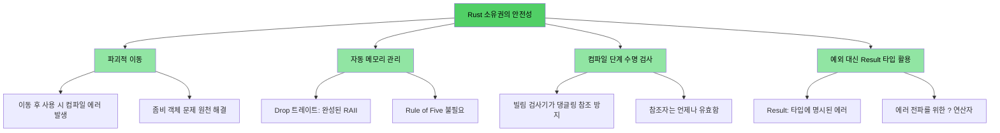
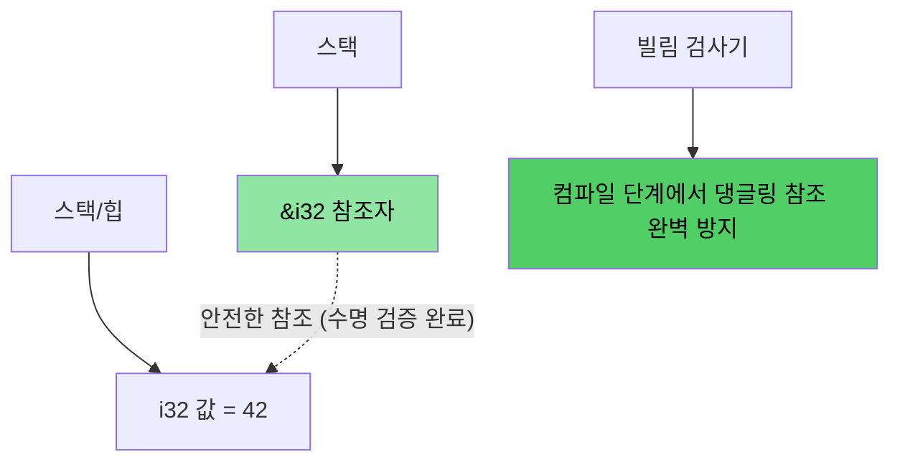
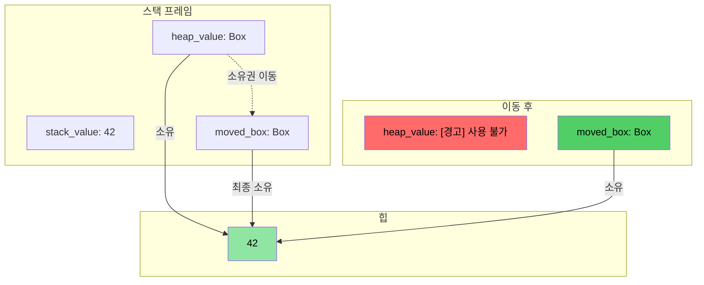
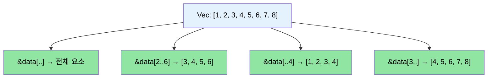

# 강사 소개와 학습 방법

> **학습 목표:** 본 교육 과정의 구조와 학습 방식을 알아보고, 익숙한 C/C++ 개념이 Rust에서는 어떻게 대응되는지 살펴봅니다. 또한 본문 전체를 꿰뚫는 로드맵과 학습 가이드를 제공합니다.

- **강사 소개**
    - Microsoft SCHIE(Silicon and Cloud Hardware Infrastructure Engineering) 팀의 수석 펌웨어 아키텍트입니다.
    - 보안, 시스템 프로그래밍(펌웨어, 운영 체제, 하이퍼바이저), CPU 및 플랫폼 설계, C++ 시스템 등 분야에서 활약해 온 업계 베테랑입니다.
    - 2017년(AWS EC2 재직 당시)부터 Rust 프로그래밍을 시작했으며, 지금까지 이 언어의 매력에 푹 빠져 있습니다.
- **본 교육은 활발한 소통과 대화를 지향합니다.**
    - 여러분이 C나 C++(또는 둘 다)에 익숙하다는 점을 전제로 합니다.
    - 모든 예제는 여러분에게 이미 익숙한 개념을 Rust에서 어떻게 대응하는지 자연스럽게 연결할 수 있도록 설계했습니다.
    - **학습 중 궁금한 점이 생기면 언제든 편하게 질문해 주시기 바랍니다.**
- 강사는 각 팀원과 지속적으로 소통하며 함께 성장하기를 기대하고 있습니다.

# Rust 도입 배경
> **코드를 먼저 확인하고 싶으신가요?** [준비하기: 코드 예제](ch02-getting-started.md#enough-talk-already-show-me-some-code) 섹션으로 바로 이동해 보세요.

C나 C++ 개발자 모두의 고민은 거의 비슷합니다. 컴파일은 문제 없이 통과하더라도, 실행 중에 발생하는 메모리 안전성 버그(런타임 충돌, 데이터 오염, 메모리 누수 등)가 바로 그것이죠.

- 보고된 취약점(CVE)의 **70% 이상**이 메모리 안전성 문제(버퍼 오버플로, 댕글링 포인터, 해제 후 사용 등)로 인해 발생합니다.
- C++의 `shared_ptr`, `unique_ptr`, RAII 및 이동 의미론(Move semantics)은 올바른 방향으로 가는 과정이지만, 이는 **근본적인 해결책이 아닌 차선책**일 뿐입니다. 객체 이동 후의 잘못된 사용, 참조 순환, 반복자 무효화, 예외 처리 중에 발생하는 안전성 공백은 여전히 해결해야 할 숙제로 남아 있습니다.
- Rust는 C/C++ 수준의 성능을 유지하면서도, 안전성을 **컴파일 단계에서 보장**하는 혁신적인 솔루션을 제공합니다.

> **📖 심층 분석:** 구체적인 취약점 예시와 Rust가 제거하는 문제 목록, 그리고 왜 C++ 스마트 포인터만으로는 충분하지 않은지 더 자세히 알고 싶다면 [C/C++ 개발자에게 Rust가 필요한 이유](ch01-1-why-c-cpp-developers-need-rust.md)를 참조하세요.

----

# Rust는 이러한 문제를 어떻게 해결하는가?

## 버퍼 오버플로와 경계 위반
- 모든 Rust 배열, 슬라이스, 문자열에는 명시적인 경계가 포함되어 있습니다. 컴파일러가 모든 경계 검사를 수행하여, 위반 사항 발생 시 즉시 **런타임 충돌**(Rust 용어로 '패닉')을 일으킵니다. 따라서 '정의되지 않은 동작(Undefined Behavior)'이 발생할 여지가 아예 없습니다.

## 댕글링 포인터와 참조자
- Rust는 **컴파일 단계**에서 댕글링 참조를 원천 봉쇄하기 위해 수명(Lifetimes)과 빌림 검사(Borrow checking)라는 개념을 도입했습니다.
- 컴파일러가 허용하지 않기에 댕글링 포인터나 '해제 후 사용(Use-after-free)' 문제는 기술적으로 발생할 수 없습니다.

## 이동 후 사용 (Use-after-move)
- Rust의 소유권(Ownership) 시스템에서는 이동이 **파괴적**입니다. 한 번 값을 옮기고 나면, 컴파일러는 원본 변수를 사용하는 것을 **거부**합니다. 소위 '좀비 객체'나 '유효하지만 상태를 알 수 없는' 객체는 존재하지 않습니다.

## 리소스 관리
- Rust의 `Drop` 트레이트는 RAII 원칙을 가장 완벽하게 구현한 형태입니다. 리소스가 범위를 벗어나면 컴파일러가 자동으로 해제해주며, C++ RAII로는 불가능했던 **이동 후 사용 방지**까지 수행합니다.
- 복사/이동 생성자와 대입 연산자를 일일이 정의해야 하는 'Rule of Five' 고민에서 완전히 해방됩니다.

## 에러 처리
- Rust에는 예외(Exception)가 없습니다. 모든 에러는 값(`Result<T, E>`)으로 취급되므로, 에러 처리가 명시적이며 함수의 타입 시그니처만 보고도 어떤 에러가 발생할지 알 수 있습니다.

## 반복자 무효화 (Iterator invalidation)
- Rust의 빌림 검사기는 **반복문 수행 중에 컬렉션을 수정하는 것을 엄격히 금지**합니다. C++ 코드에서 흔히 발생하는 골치 아픈 버그를 Rust에서는 애초에 작성할 수 없습니다.
```rust
// 반복 중 요소 삭제: Rust에서는 retain()을 사용합니다.
pending_faults.retain(|f| f.id != fault_to_remove.id);

// 또는 새로운 Vec으로 수집하는 함수형 스타일을 활용합니다.
let remaining: Vec<_> = pending_faults
    .into_iter()
    .filter(|f| f.id != fault_to_remove.id)
    .collect();
```

## 데이터 경합 (Data races)
- 타입 시스템의 `Send` 및 `Sync` 트레이트를 활용해 **컴파일 단계**에서 데이터 경합을 방지합니다.

## 메모리 안전성 시각화

### Rust 소유권: 설계부터 안전하게

```rust
fn safe_rust_ownership() {
    // 이동은 파괴적입니다: 원본 데이터의 소유권이 완전히 넘어갑니다.
    let data = vec![1, 2, 3];
    let data2 = data;           // 이동(Move) 발생
    // data.len();              // 컴파일 에러: 소유권이 이동된 값을 사용할 수 없습니다.
    
    // 빌림(Borrow): 안전하게 데이터를 공유합니다.
    let owned = String::from("Hello, World!");
    let slice: &str = &owned;  // 빌림: 추가 메모리 할당 없음
    println!("{}", slice);     // 언제나 안전하게 작동합니다.
    
    // 댕글링 참조가 설계상 불가능합니다.
    /*
    let dangling_ref;
    {
        let temp = String::from("temporary");
        dangling_ref = &temp;  // 컴파일 에러: temp의 수명보다 참조자가 더 길게 유지될 수 없습니다.
    }
    */
}
```



## 메모리 레이아웃: Rust 참조자



### `Box<T>` 힙 할당 시각화

```rust
fn box_allocation_example() {
    // 스택(Stack) 할당
    let stack_value = 42;
    
    // Box를 이용한 힙(Heap) 할당
    let heap_value = Box::new(42);
    
    // 소유권 이동(Move)
    let moved_box = heap_value;
    // 이제 heap_value 변수는 더 이상 사용할 수 없습니다.
}
```



## 슬라이스 연산 시각화

```rust
fn slice_operations() {
    let data = vec![1, 2, 3, 4, 5, 6, 7, 8];
    
    let full_slice = &data[..];        // 전체 요소 [1,2,3,4,5,6,7,8]
    let partial_slice = &data[2..6];   // 인덱스 2부터 5까지 [3,4,5,6]
    let from_start = &data[..4];       // 처음부터 인덱스 3까지 [1,2,3,4]
    let to_end = &data[3..];           // 인덱스 3부터 끝까지 [4,5,6,7,8]
}
```



# Rust의 핵심 강점과 특징
- **스레드 간 데이터 경합 원천 차단** (컴파일 단계의 `Send`/`Sync` 검사)
- **이동 후 사용 금지** (좀비 객체 문제가 발생하는 C++의 `std::move`와 차별화)
- **초기화되지 않은 변수 방지**
    - 모든 변수는 사용하기 전에 반드시 초기화되어야 합니다.
- **메모리 누수 최소화**
    - `Drop` 트레이트를 활용한 완벽한 RAII 구현으로 'Rule of Five'가 필요 없습니다.
    - 컴파일러가 범위를 벗어나는 즉시 메모리를 자동으로 회제합니다.
- **뮤텍스 잠금 해제 누락 방지**
    - '락 가드(Lock guard)'가 데이터에 접근할 수 있는 *유일한* 수단입니다. (데이터 자체가 `Mutex<T>` 안에 캡슐화되어 있기 때문입니다.)
- **일관된 에러 처리**
    - 예외 대신 `Result<T, E>`라는 값으로 에러를 다룹니다. 함수 시그니처에서 위험 요소를 즉시 파악할 수 있으며, `?` 연산자로 간결하게 전파할 수 있습니다.
- **강력한 언어 지원**
    - 타입 추론, 강력한 열거형과 패턴 매칭, 제로 비용 추상화 등을 완벽하게 제공합니다.
- **통합 툴체인 기본 제공**
    - 의존성 관리, 빌드, 테스트, 포맷팅, 린팅을 `cargo` 하나로 해결합니다. make/CMake, 별도의 테스트 프레임워크를 고민할 필요가 없습니다.

# 한눈에 보는 비교: Rust vs C/C++

| **항목** | **C** | **C++** | **Rust** | **핵심 차별화 포인트** |
|-------------|-------|---------|----------|-------------------|
| **메모리 관리** | `malloc()/free()` | `unique_ptr`, `shared_ptr` | `Box<T>`, `Rc<T>`, `Arc<T>` | 완전 자동화, 순환 참조 없음 |
| **배열** | `int arr[10]` | `std::vector`, `std::array` | `Vec<T>`, `[T; N]` | 상시 경계 검사(Bounds Check) 수행 |
| **문자열** | Null 종단 `char*` | `std::string`, `string_view` | `String`, `&str` | UTF-8 강제 준수, 수명 검증 |
| **참조** | 포인터 (`int*`) | 참조자(`T&`), 이동(`T&&`) | 참조자(`&T`, `&mut T`) | 빌림 검사와 수명 시스템 적용 |
| **다형성** | 함수 포인터 | 가상 함수, 상속 | 트레이트(Trait), 트레이트 객체 | 상속보다는 조합(Composition) 지향 |
| **제네릭** | 매크로, `void*` | 템플릿 | 제네릭과 트레이트 경계 | 명확한 타입 제약과 쉬운 에러 메시지 |
| **에러 처리** | 반환 값, `errno` | 예외(Exception), `std::optional` | `Result<T, E>`, `Option<T>` | 불투명한 제어 흐름 삭제, 명시적 처리 |
| **NULL 안전성** | `ptr == NULL` | `nullptr`, `std::optional` | `Option<T>` | 컴파일 단계에서 Null 체크 강제 |
| **스레드 안전성** | 수동 (pthreads 등) | 수동 동기화 | 컴파일 단계 보장 | 데이터 경합의 기술적 불가능화 |
| **빌드 시스템** | Make, CMake 등 | CMake 및 다양한 도구 | **Cargo** | 단일화된 최신 툴체인 |
| **정의되지 않은 동작(UB)** | 런타임 수렁 | 부호 있는 오버플로 등 잠재적 위험 | **컴파일 타임 에러** | 언어 차원의 안전성 보장 |
