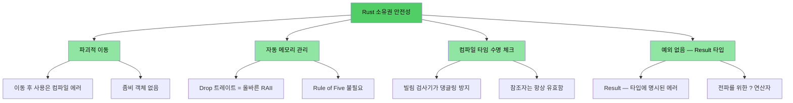
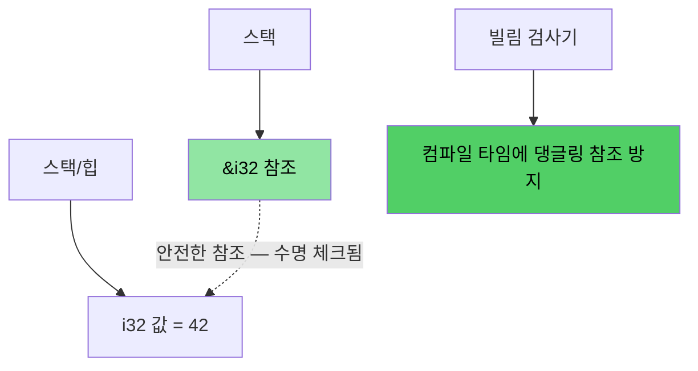
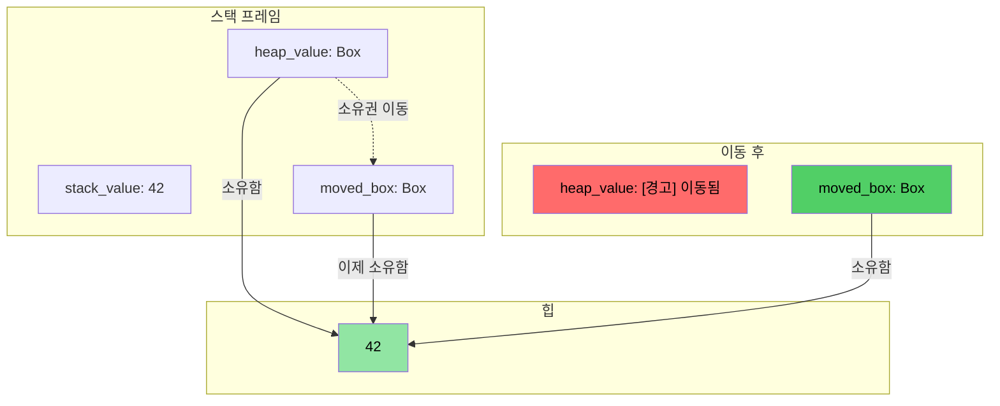
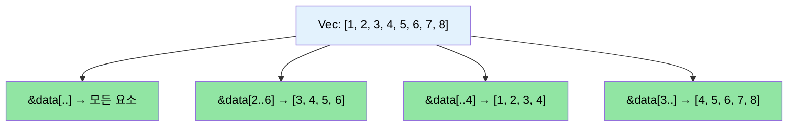

# 강사 소개 및 일반적인 접근 방식

> **학습 내용:** 과정 구조, 대화형 방식, 그리고 익숙한 C/C++ 개념이 Rust의 대응 개념과 어떻게 매핑되는지 설명합니다. 이 장에서는 기대 사항을 설정하고 책의 나머지 부분에 대한 로드맵을 제공합니다.

- 강사 소개
    - Microsoft SCHIE(Silicon and Cloud Hardware Infrastructure Engineering) 팀의 수석 펌웨어 아키텍트
    - 보안, 시스템 프로그래밍(펌웨어, 운영 체제, 하이퍼바이저), CPU 및 플랫폼 아키텍트, C++ 시스템 분야의 업계 베테랑
    - 2017년(@AWS EC2)부터 Rust로 프로그래밍을 시작했으며 그 이후로 이 언어와 사랑에 빠졌음
- 이 과정은 가능한 한 대화형으로 진행될 예정입니다.
    - 가정: 여러분은 C, C++ 또는 둘 다 알고 있습니다.
    - 예제들은 익숙한 개념을 Rust의 대응 개념으로 매핑하도록 의도적으로 설계되었습니다.
    - **언제든지 궁금한 점이 있으면 편하게 질문해 주세요.**
- 강사는 팀들과의 지속적인 소통을 기대하고 있습니다.

# Rust 도입 배경
> **코드로 바로 가고 싶으신가요?** [코드로 보여주세요](ch02-getting-started.md#enough-talk-already-show-me-some-code)로 이동하세요.

C에서 왔든 C++에서 왔든 핵심적인 고충은 동일합니다. 컴파일은 깔끔하게 되지만 런타임에 충돌, 손상 또는 누수가 발생하는 메모리 안전성 버그입니다.

- CVE의 **70% 이상**이 메모리 안전성 문제(버퍼 오버플로, 댕글링 포인터, 해제 후 사용)로 인해 발생합니다.
- C++의 `shared_ptr`, `unique_ptr`, RAII 및 이동 의미론은 올바른 방향으로 나아가는 단계이지만, 이것들은 **근본적인 해결책이 아니라 임시방편**입니다. 이동 후 사용, 참조 순환, 반복자 무효화 및 예외 안전성 공백을 그대로 남겨둡니다.
- Rust는 C/C++에서 의존하는 성능을 제공하면서도 안전성에 대한 **컴파일 타임 보장**을 제공합니다.

> **📖 심층 분석:** 구체적인 취약점 예시, Rust가 제거하는 항목의 전체 목록, 그리고 왜 C++ 스마트 포인터만으로는 충분하지 않은지에 대해 알아보려면 [C/C++ 개발자에게 Rust가 필요한 이유](ch01-1-why-c-cpp-developers-need-rust.md)를 참조하세요.

----

# Rust는 이러한 문제를 어떻게 해결하는가?

## 버퍼 오버플로 및 경계 위반
- 모든 Rust 배열, 슬라이스, 문자열에는 명시적인 경계가 연결되어 있습니다. 컴파일러는 모든 경계 위반이 **런타임 충돌**(Rust 용어로 패닉)로 이어지도록 체크를 삽입합니다. 정의되지 않은 동작은 절대 발생하지 않습니다.

## 댕글링 포인터 및 참조자
- Rust는 **컴파일 타임**에 댕글링 참조를 제거하기 위해 수명(Lifetimes)과 빌림 검사(Borrow checking)를 도입했습니다.
- 댕글링 포인터도, 해제 후 사용도 없습니다. 컴파일러가 허용하지 않기 때문입니다.

## 이동 후 사용 (Use-after-move)
- Rust의 소유권 시스템은 이동을 **파괴적**으로 만듭니다. 일단 값을 이동하면 컴파일러는 원본 사용을 **거부**합니다. 좀비 객체도, "유효하지만 지정되지 않은 상태"도 없습니다.

## 리소스 관리
- Rust의 `Drop` 트레이트는 올바르게 구현된 RAII입니다. 컴파일러는 리소스가 범위를 벗어날 때 자동으로 해제하며, C++ RAII가 할 수 없는 **이동 후 사용 방지** 기능을 수행합니다.
- Rule of Five가 필요하지 않습니다 (복사 생성자, 이동 생성자, 복사 대입, 이동 대입, 소멸자를 정의할 필요가 없음).

## 에러 처리
- Rust에는 예외가 없습니다. 모든 에러는 값(`Result<T, E>`)이며, 이로 인해 에러 처리가 명시적이고 타입 시그니처에 드러납니다.

## 반복자 무효화 (Iterator invalidation)
- Rust의 빌림 검사기는 **반복하는 동안 컬렉션을 수정하는 것을 금지**합니다. C++ 코드베이스를 괴롭히는 버그를 아예 작성할 수 없습니다.
```rust
// 반복 중 삭제에 해당하는 Rust의 방식: retain()
pending_faults.retain(|f| f.id != fault_to_remove.id);

// 또는: 새로운 Vec으로 수집 (함수형 스타일)
let remaining: Vec<_> = pending_faults
    .into_iter()
    .filter(|f| f.id != fault_to_remove.id)
    .collect();
```

## 데이터 경합 (Data races)
- 타입 시스템이 `Send` 및 `Sync` 트레이트를 통해 **컴파일 타임**에 데이터 경합을 방지합니다.

## 메모리 안전성 시각화

### Rust 소유권 — 설계부터 안전함

```rust
fn safe_rust_ownership() {
    // 이동은 파괴적입니다: 원본은 사라집니다
    let data = vec![1, 2, 3];
    let data2 = data;           // 이동 발생
    // data.len();              // 컴파일 에러: 이동 후 사용된 값
    
    // 빌림: 안전한 공유 접근
    let owned = String::from("Hello, World!");
    let slice: &str = &owned;  // 빌림 — 할당 없음
    println!("{}", slice);     // 항상 안전함
    
    // 댕글링 참조가 불가능함
    /*
    let dangling_ref;
    {
        let temp = String::from("temporary");
        dangling_ref = &temp;  // 컴파일 에러: temp가 충분히 오래 살지 않음
    }
    */
}
```



## 메모리 레이아웃: Rust 참조자



### `Box<T>` 힙 할당 시각화

```rust
fn box_allocation_example() {
    // 스택 할당
    let stack_value = 42;
    
    // Box를 사용한 힙 할당
    let heap_value = Box::new(42);
    
    // 소유권 이동
    let moved_box = heap_value;
    // heap_value는 더 이상 접근할 수 없음
}
```



## 슬라이스 연산 시각화

```rust
fn slice_operations() {
    let data = vec![1, 2, 3, 4, 5, 6, 7, 8];
    
    let full_slice = &data[..];        // [1,2,3,4,5,6,7,8]
    let partial_slice = &data[2..6];   // [3,4,5,6]
    let from_start = &data[..4];       // [1,2,3,4]
    let to_end = &data[3..];           // [4,5,6,7,8]
}
```



# Rust의 기타 강점 및 특징
- 스레드 간 데이터 경합 없음 (컴파일 타임 `Send`/`Sync` 체크)
- 이동 후 사용 없음 (좀비 객체를 남기는 C++ `std::move`와 다름)
- 초기화되지 않은 변수 없음
    - 모든 변수는 사용 전에 초기화되어야 함
- 사소한 메모리 누수 없음
    - `Drop` 트레이트 = 올바른 RAII, Rule of Five 불필요
    - 컴파일러가 범위를 벗어날 때 자동으로 메모리를 해제함
- 뮤텍스 잠금 해제 누락 없음
    - 락 가드가 데이터에 접근하는 *유일한* 방법임 (`Mutex<T>`는 접근이 아니라 데이터를 감쌈)
- 예외 처리의 복잡성 없음
    - 에러는 값(`Result<T, E>`)이며 함수 시그니처에 표시되고 `?`로 전파됨
- 타입 추론, 열거형, 패턴 매칭, 제로 코스트 추상화에 대한 뛰어난 지원
- 의존성 관리, 빌드, 테스트, 포맷팅, 린팅에 대한 기본 지원
    - `cargo`가 make/CMake + lint + test 프레임워크를 대체함

# 빠른 참조: Rust vs C/C++

| **개념** | **C** | **C++** | **Rust** | **주요 차이점** |
|-------------|-------|---------|----------|-------------------|
| 메모리 관리 | `malloc()/free()` | `unique_ptr`, `shared_ptr` | `Box<T>`, `Rc<T>`, `Arc<T>` | 자동적임, 순환 없음 |
| 배열 | `int arr[10]` | `std::vector<T>`, `std::array<T>` | `Vec<T>`, `[T; N]` | 기본적으로 경계 체크 수행 |
| 문자열 | `\0`으로 끝나는 `char*` | `std::string`, `string_view` | `String`, `&str` | UTF-8 보장, 수명 체크됨 |
| 참조 | `int* ptr` | `T&`, `T&&` (이동) | `&T`, `&mut T` | 빌림 체크, 수명 |
| 다형성 | 함수 포인터 | 가상 함수, 상속 | 트레이트, 트레이트 객체 | 상속보다 조합 강조 |
| 제네릭 프로그래밍 | 매크로 (`void*`) | 템플릿 | 제네릭 + 트레이트 경계 | 더 나은 에러 메시지 |
| 에러 처리 | 리턴 코드, `errno` | 예외, `std::optional` | `Result<T, E>`, `Option<T>` | 숨겨진 제어 흐름 없음 |
| NULL 안전성 | `ptr == NULL` | `nullptr`, `std::optional<T>` | `Option<T>` | 강제된 null 체크 |
| 스레드 안전성 | 수동 (pthreads) | 수동 동기화 | 컴파일 타임 보장 | 데이터 경합 불가능 |
| 빌드 시스템 | Make, CMake | CMake, Make 등 | Cargo | 통합된 툴체인 |
| 정의되지 않은 동작 | 런타임 충돌 | 미묘한 UB (부호 있는 오버플로 등) | 컴파일 타임 에러 | 안전성 보장 |
