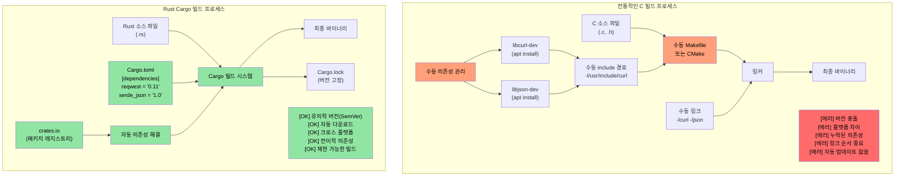
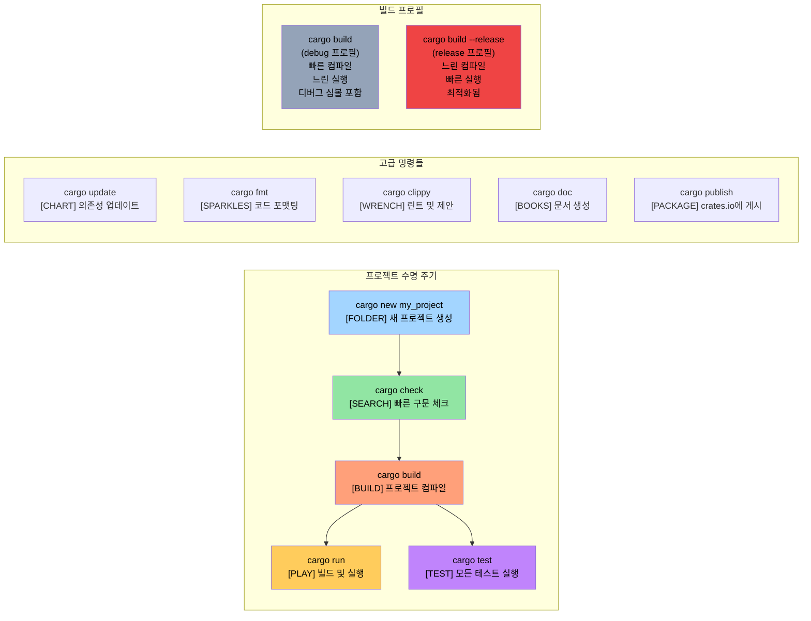

# 충분한 설명은 그만: 코드로 보여주세요

> **학습 내용:** 여러분의 첫 번째 Rust 프로그램 — `fn main()`, `println!()`, 그리고 Rust 매크로가 C/C++ 전처리기 매크로와 근본적으로 어떻게 다른지 알아봅니다. 이 장을 마치면 간단한 Rust 프로그램을 작성, 컴파일 및 실행할 수 있게 됩니다.

```rust
fn main() {
    println!("Hello world from Rust");
}
```
- 위의 구문은 C 스타일 언어에 익숙한 사람이라면 누구에게나 친숙할 것입니다.
    - Rust의 모든 함수는 ```fn``` 키워드로 시작합니다.
    - 실행 파일의 기본 진입점은 ```main()```입니다.
    - ```println!```은 함수처럼 보이지만 실제로는 **매크로**입니다. Rust의 매크로는 C/C++ 전처리기 매크로와 매우 다릅니다. 위생적(hygienic)이고 타입 안전하며 텍스트 치환이 아닌 구문 트리(syntax tree)에서 작동합니다.
- Rust 코드 조각을 빠르게 시도해 볼 수 있는 두 가지 좋은 방법:
    - **온라인**: [Rust Playground](https://play.rust-lang.org/) — 코드를 붙여넣고 Run을 누르고 결과를 공유하세요. 설치가 필요 없습니다.
    - **로컬 REPL**: 대화형 Rust REPL인 [`evcxr_repl`](https://github.com/evcxr/evcxr)을 설치하세요 (Python의 REPL과 비슷하지만 Rust용입니다):
```bash
cargo install --locked evcxr_repl
evcxr   # REPL을 시작하고 Rust 표현식을 대화식으로 입력하세요
```

### Rust 로컬 설치
- Rust는 다음 방법을 사용하여 로컬에 설치할 수 있습니다.
    - Windows: https://static.rust-lang.org/rustup/dist/x86_64-pc-windows-msvc/rustup-init.exe
    - Linux / WSL: ```curl --proto '=https' --tlsv1.2 -sSf https://sh.rustup.rs | sh```
- Rust 에코시스템은 다음과 같은 구성 요소로 이루어져 있습니다.
    - ```rustc```는 단독 컴파일러이지만 직접 사용되는 경우는 드뭅니다.
    - 선호되는 도구인 ```cargo```는 만능 도구(Swiss Army knife)로 의존성 관리, 빌드, 테스트, 포맷팅, 린팅 등에 사용됩니다.
    - Rust 툴체인에는 ```stable```, ```beta```, ```nightly```(실험용) 채널이 있지만 여기서는 ```stable```을 사용합니다. 6주마다 출시되는 ```stable``` 설치본을 업그레이드하려면 ```rustup update``` 명령을 사용하세요.
- 또한 VSCode용 ```rust-analyzer``` 플러그인을 설치할 것입니다.

# Rust 패키지 (crates)
- Rust 바이너리는 패키지(여기서는 크레이트라고 부름)를 사용하여 만들어집니다.
    - 크레이트는 독립적일 수도 있고 다른 크레이트에 의존할 수도 있습니다. 의존성 크레이트는 로컬 또는 원격에 있을 수 있습니다. 서드파티 크레이트는 일반적으로 ```crates.io```라는 중앙 저장소에서 다운로드됩니다.
    - ```cargo``` 도구는 크레이트와 그 의존성의 다운로드를 자동으로 처리합니다. 이것은 개념적으로 C 라이브러리에 링크하는 것과 같습니다.
    - 크레이트 의존성은 ```Cargo.toml```이라는 파일에 명시됩니다. 또한 독립 실행형 파일, 정적 라이브러리, 동적 라이브러리(드묾)와 같은 크레이트의 타겟 타입도 정의합니다.
    - 참고: https://doc.rust-lang.org/cargo/reference/cargo-targets.html

## Cargo vs 전통적인 C 빌드 시스템

### 의존성 관리 비교



### Cargo 프로젝트 구조

```text
my_project/
|-- Cargo.toml          # 프로젝트 설정 (package.json과 유사)
|-- Cargo.lock          # 정확한 의존성 버전 (자동 생성됨)
|-- src/
|   |-- main.rs         # 바이너리의 메인 진입점
|   |-- lib.rs          # 라이브러리 루트 (라이브러리 생성 시)
|   `-- bin/            # 추가적인 바이너리 타겟
|-- tests/              # 통합 테스트
|-- examples/           # 예제 코드
|-- benches/            # 벤치마크
`-- target/             # 빌드 결과물 (C의 build/ 또는 obj/와 유사)
    |-- debug/          # 디버그 빌드 (빠른 컴파일, 느린 실행)
    `-- release/        # 릴리스 빌드 (느린 컴파일, 빠른 실행)
```

### 일반적인 Cargo 명령들



# 예제: cargo 및 crates
- 이 예제에서는 다른 의존성이 없는 독립 실행형 실행 파일 크레이트를 다룹니다.
- 다음 명령을 사용하여 ```helloworld```라는 새 크레이트를 생성합니다.
```bash
cargo new helloworld
cd helloworld
cat Cargo.toml
```
- 기본적으로 ```cargo run```은 크레이트의 ```debug```(비최적화) 버전을 컴파일하고 실행합니다. ```release``` 버전을 실행하려면 ```cargo run --release```를 사용하세요.
- 실제 바이너리 파일은 ```target``` 폴더 아래의 ```debug``` 또는 ```release``` 폴더에 위치합니다.
- 소스와 같은 폴더에 ```Cargo.lock```이라는 파일이 있는 것을 보셨을 것입니다. 이 파일은 자동으로 생성되며 수동으로 수정해서는 안 됩니다.
    - ```Cargo.lock```의 구체적인 목적은 나중에 다시 살펴보겠습니다.
