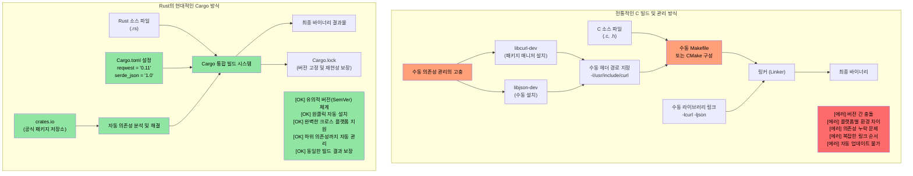
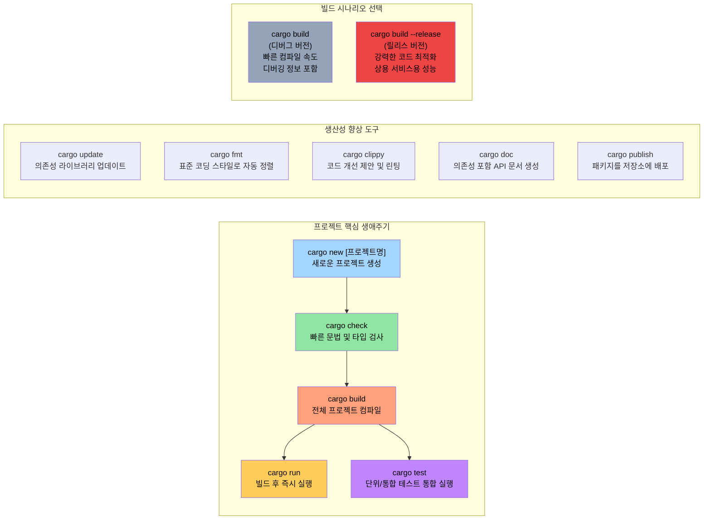

# 백문이 불여일견: 코드로 이해하는 Rust

> **학습 목표:** 여러분의 첫 번째 Rust 프로그램을 작성해 봅니다. `fn main()`, `println!()`의 기본 사용법과 함께, Rust의 매크로가 C/C++ 전처리기 매크로와 근본적으로 어떻게 다른지 살펴봅니다. 이 장을 마치면 직접 Rust 프로그램을 작성하고 컴파일하여 실행할 수 있게 됩니다.

```rust
fn main() {
    println!("Rust의 세계에 오신 것을 환영합니다!");
}
```
위의 코드는 C 시리즈 언어(C, C++, Java 등)에 익숙한 분이라면 매우 친숙하게 느껴질 것입니다.

- **기본 문법의 특징**
    - Rust의 모든 함수 선언은 `fn` 키워드로 시작합니다.
    - 실행 파일의 진입점(Entry point)은 언제나 `main()` 함수입니다.
    - `println!`은 함수처럼 보이지만, 실제로는 **매크로**입니다. Rust의 매크로는 C/C++의 단순 텍스트 치환 방식이 아닌, 구문 트리(Syntax tree) 단위에서 작동하는 '위생적(Hygienic)'이고 타입 안전한 시스템입니다.
- **Rust 코드를 빠르게 테스트하는 방법**
    - **온라인 환경**: [Rust Playground](https://play.rust-lang.org/)를 이용하면 별도의 설치 없이도 브라우저에서 바로 코드를 실행하고 결과를 공유할 수 있습니다.
    - **로컬 대화형 환경 (REPL)**: Python의 IDLE처럼 Rust 코드를 한 줄씩 실행해 볼 수 있는 [`evcxr_repl`](https://github.com/evcxr/evcxr)을 설치해 보세요.
    ```bash
    cargo install --locked evcxr_repl
    evcxr   # REPL 프로그램을 시작합니다.
    ```

### 로컬 환경에 Rust 설치하기
Rust는 `rustup`이라는 툴체인 관리자를 통해 매우 쉽게 설치하고 업데이트할 수 있습니다.

- **OS별 설치 방법**
    - **Windows**: [rustup-init.exe](https://static.rust-lang.org/rustup/dist/x86_64-pc-windows-msvc/rustup-init.exe) 파일을 다운로드하여 실행하세요.
    - **Linux / WSL / macOS**: 터미널에서 다음 명령어를 입력하세요.
      ```bash
      curl --proto '=https' --tlsv1.2 -sSf https://sh.rustup.rs | sh
      ```
- **Rust 생태계 구성 요소**
    - `rustc`: Rust 컴파일러 본체입니다. 하지만 개발자가 직접 호출하는 경우는 드뭅니다.
    - **`cargo`**: Rust의 '맥가이버 칼'입니다. 패키지 관리, 빌드, 테스트, 포맷팅, 린팅 등 모든 작업을 담당하는 핵심 도구입니다.
    - **툴체인 채널**: 실무에서는 가장 안정적인 `stable` 채널을 사용합니다. 6주마다 출시되는 최신 버전을 적용하려면 `rustup update` 명령어만 입력하면 됩니다.
- **추천 개발 환경**: VSCode를 사용한다면 필수 확장 프로그램인 **`rust-analyzer`**를 반드시 설치하시기 바랍니다.

---

# Rust의 패키지 단위: 크레이트(Crates)

Rust에서 실행 파일이나 라이브러리를 만드는 기초 단위는 '패키지'이며, 우리는 이를 **크레이트(Crate)**라고 부릅니다.

- **크레이트의 특징**
    - 독립적으로 존재하거나 다른 크레이트를 참조(의존)할 수 있습니다.
    - 외부 라이브러리는 주로 중앙 패키지 저장소인 [crates.io](https://crates.io/)에서 공유됩니다.
- **Cargo의 역할**
    - 하려고 하는 작업에 필요한 외부 라이브러리를 자동으로 다운로드하고 관리합니다. 이는 C 프로젝트에서 라이브러리를 수동으로 링크하는 과정과 개념적으로 비슷하지만 훨씬 편리합니다.
    - 의존성 정보와 프로젝트 설정은 **`Cargo.toml`** 파일에 명시합니다. 이 파일에서는 실행 파일, 정적 라이브러리, 동적 라이브러리 등 결과물의 형태(Target type)도 정의합니다.

## Cargo vs 전통적인 C 빌드 시스템 비교

### 의존성 관리의 혁신



### 표준 Cargo 프로젝트 구조
Cargo는 일관된 프로젝트 구조를 지향하여 협업 효율을 높입니다.

```text
my_project/
|-- Cargo.toml          # 프로젝트의 '설명서' (의존성 및 설정 등)
|-- Cargo.lock          # 의존성 버전의 '스냅샷' (시스템이 자동 관리)
|-- src/
|   |-- main.rs         # 실행 파일의 메인 진입점
|   |-- lib.rs          # 라이브러리 개발 시 루트 파일
|   `-- bin/            # 추가 실행 파일이 필요할 때 활용
|-- tests/              # 외부 통합 테스트 코드
|-- examples/           # 라이브러리 사용법 예제
|-- benches/            # 성능 측정을 위한 벤치마크
`-- target/             # 빌드 결과물이 저장되는 폴더
    |-- debug/          # 디버그 빌드 (빠른 컴파일, 디버깅 용이)
    `-- release/        # 릴리스 빌드 (최적화 적용, 빠른 실행 속도)
```

### 자주 사용하는 Cargo 명령어



---

# 실습 가이드: Cargo와 크레이트 체험하기
1.  새로운 프로젝트를 생성해 보겠습니다. 터미널에서 다음 명령어를 입력하세요.
    ```bash
    cargo new helloworld
    cd helloworld
    ls -p  # 생성된 파일 구조 확인
    cat Cargo.toml  # 설정 파일 내용 보기
    ```
2.  프로젝트를 실행해 봅니다.
    - 기본 명령인 `cargo run`은 개발용(`debug`) 버전을 만들고 바로 실행합니다.
    - 상용 환경처럼 최적화된 성능을 원한다면 `cargo run --release`를 사용하세요.
3.  빌드 결과물은 `target` 폴더 내의 각 빌드 프로필 폴더(`debug` 또는 `release`)에 생성됩니다.
4.  프로젝트 루트에 생성된 **`Cargo.lock`** 파일은 프로젝트가 사용하는 모든 라이브러리의 정확한 버전을 기록한 '스냅샷'입니다. 이 파일은 시스템이 관리하므로 수동으로 고칠 필요는 없으며, 나중에 상세히 다루게 될 핵심적인 파일 중 하나입니다.
