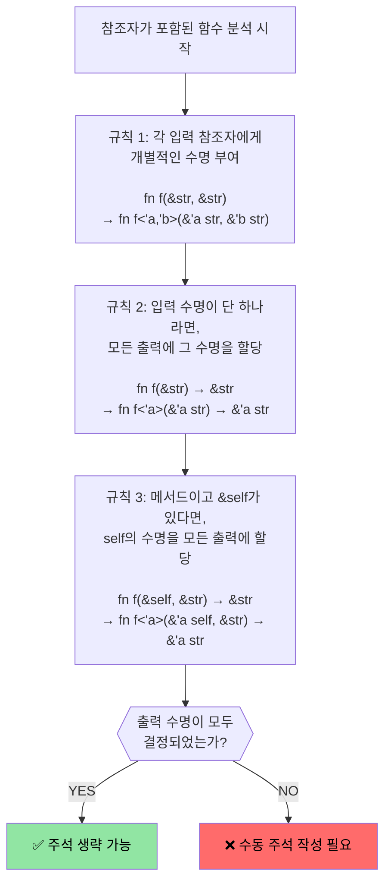

# 수명(Lifetimes)과 빌림(Borrowing) 심질 탐구

> **학습 목표:** Rust의 수명 시스템이 어떻게 참조자의 안전성을 물리적으로 보장하는지 깊이 있게 파헤칩니다. 암시적 수명 추론부터 명시적 수명 주석(Annotations), 그리고 복잡한 코드를 간결하게 만들어주는 '수명 생략 규칙(Lifetime Elision Rules)'까지 마스터합니다. 이 섹션은 스마트 포인터를 배우기 위한 필수 관문입니다.

---

### 참조자의 황금률: 수명의 안전성
Rust는 참조자가 가리키는 대상이 반드시 참조자보다 더 오래 살아남을 것을 보장합니다.

- **규칙 재확인**:
    - 하나의 가변 참조자(`&mut T`)만 허용하거나, 여러 개의 불변 참조자(`&T`)만 허용합니다.
    - 참조자의 수명은 원본 소유자의 수명 범위를 결코 벗어날 수 없습니다.
    - 대부분의 경우 컴파일러가 이를 자동으로 추론하지만, 구조가 복잡해지면 개발자의 명시적인 설명(주석)이 필요합니다.

```rust
fn update_value(val: &mut u32) {
    *val = 100;
}

fn main() {
    let mut data = 42;
    let b = &mut data; // 가변 빌림 시작
    update_value(b);   // b 사용 중
    
    let _r = &data;    // b가 더 이상 사용되지 않음을 컴파일러가 인지하므로 허용됨 (NLL 기술)
    // println!("{b}"); // 이 줄의 주석을 풀면 b와 _r이 충돌하여 컴파일 에러 발생
    
    let r2 = &data;    // 불변 빌림은 여러 개 가능
    println!("최종 값: {r2}");
}
```

---

# 수명 주석 (Lifetime Annotations)

함수가 여러 개의 참조자를 입력받아 그중 하나를 반환할 때, 컴파일러는 반환된 참조자가 어떤 입력값의 수명을 따르는지 알 수 없습니다. 이때 개발자가 `'a`와 같은 기호를 사용하여 관계를 명시해 주는 것이 수명 주석입니다.

- **구문**: `'` 뒤에 식별자를 붙입니다. (예: `'a`, `'b`, `'static`)
- **용도**: 여러 참조자 간의 '수명 상관관계'를 컴파일러에게 설명합니다.

```rust
#[derive(Debug)]
struct Point { x: u32, y: u32 }

// [실패 예시] 컴파일러는 반환된 참조자가 left의 것인지 right의 것인지 모릅니다.
// fn get_winner(left: &Point, right: &Point) -> &Point

// [성공 예시] 'a라는 공통 수명을 선언하여, 반환값은 입력된 값들이 살아있는 동안 유효함을 보장합니다.
fn get_winner<'a>(left: &'a Point, right: &'a Point) -> &'a Point {
    if left.x > right.x { left } else { right }
}

fn main() {
    let p1 = Point { x: 10, y: 20 };
    let res;
    {
        let p2 = Point { x: 50, y: 30 };
        res = get_winner(&p1, &p2);
        println!("승자: {res:?}"); // p2가 살아있으므로 안전하게 출력 가능
    }
    // println!("결과: {res:?}"); // 에러! p2가 사라졌으므로 res는 더 이상 안전하지 않습니다.
}
```

---

### 구조체에서의 수명 주석
구조체가 참조자를 필드로 가질 경우, 구조체 인스턴스 자체가 참조 대상보다 더 오래 살지 않도록 수명을 명시해야 합니다.

```rust
use std::collections::HashMap;

struct Cache<'a> {
    // 이 맵에 저장된 Point 참조자들은 최소한 'a만큼은 살아있어야 합니다.
    store: HashMap<u32, &'a Point>,
}

fn main() {
    let p_main = Point { x: 1, y: 2 };
    let mut cache = Cache { store: HashMap::new() };
    cache.store.insert(1, &p_main);
    
    {
        let p_inner = Point { x: 3, y: 4 };
        // cache.store.insert(2, &p_inner); // 에러! p_inner는 블록이 끝나면 사라지지만 cache는 더 오래 살기 때문입니다.
    }
}
```

---

# 💡 수명 생략 규칙 (Lifetime Elision Rules)

많은 Rust 함수에 수명 주석이 명시되어 있지 않은 이유는 컴파일러가 정해진 규칙에 따라 수명을 자동으로 추론해주기 때문입니다.

### 컴파일러의 3단계 추론 전략
컴파일러는 아래 규칙을 순서대로 적용해보고, 모든 참조자의 수명이 명확해지면 개발자에게 주석 작성을 요구하지 않습니다.



### 규칙 적용 사례 예시

- **사례 1 (단일 입력)**: `fn first_word(s: &str) -> &str`
    - 규칙 1: `fn first_word<'a>(s: &'a str) -> &str`
    - 규칙 2: `fn first_word<'a>(s: &'a str) -> &'a str` (결정 완료)
- **사례 2 (메서드)**: `impl Parser { fn next(&self) -> &str }`
    - 규칙 1: `fn next<'a>(&'a self) -> &str`
    - 규칙 3: `fn next<'a>(&'a self) -> &'a str` (결정 완료)
- **사례 3 (모호한 경우)**: `fn longest(a: &str, b: &str) -> &str`
    - 규칙 1: `fn longest<'a, 'b>(a: &'a str, b: &'b str) -> &str`
    - 규칙 2, 3 적용 불가 -> **컴파일 에러!** (어떤 입력에서 왔는지 알 수 없음)

---

# 정적 수명: `'static`

`'static`은 프로그램의 **시작부터 종료까지** 메모리에 상주하는 데이터에 부여되는 특별한 수명입니다.

- **주요 대상**
    - **문자열 리터럴**: 바이너리의 읽기 전용 데이터 영역에 저장됩니다.
    - **전역 변수 (`static`)**: 프로그램 전역에서 접근 가능합니다.
- **활용**: 스레드를 생성할 때, 넘겨주는 데이터가 지역 변수를 참조하지 않음을 보장하기 위해 `'static` 제약을 사용하곤 합니다.

```rust
// 문자열 리터럴은 언제나 'static입니다.
let s: &'static str = "Hello World"; 

// 전역 상수
static VERSION: &str = "1.0.0";
```

---

# 📝 실전 퀴즈: 수동 주석이 필요한 함수는?

아래 함수 시그니처 중 컴파일러가 스스로 수명을 알 수 없는 것은 무엇일까요?

1.  `fn trim(s: &str) -> &str`
2.  `fn pick(f: bool, a: &str, b: &str) -> &str`
3.  `fn split(s: &str) -> (&str, &str)`
4.  `impl Data { fn get_id(&self) -> &str }`

<details><summary>💡 정답 및 해설 보기</summary>

**정답: 2번**

-   **1번**: 입력이 하나이므로 규칙 2에 의해 자동 성공.
-   **2번**: 입력 참조자가 `a`, `b` 두 개입니다. 반환되는 `&str`이 `a`에서 온 것인지 `b`에서 온 것인지 추론할 수 없으므로 `'a` 주석이 필요합니다.
-   **3번**: 입력이 하나이므로, 반환되는 튜플 안의 두 슬라이스 모두 입력 `s`의 수명을 따르게 됩니다. 자동 성공.
-   **4번**: 메서드에서 `&self`가 존재하므로 규칙 3에 의해 자동 성공.

**2번 수정 예시:**
```rust
fn pick<'a>(f: bool, a: &'a str, b: &'a str) -> &'a str {
    if f { a } else { b }
}
```
</details>

---

# C++ 개발자를 위한 정신적 모델 비교

C++ 프로그래머는 포인터의 유효성을 머릿속으로만 추적하며 컴파일러를 믿지만, Rust는 그 추적 과정을 **코드로 명시하여 기계가 검증**하게 만듭니다.

| **상황** | **C/C++ 방식** | **Rust 방식** | **특징** |
| :--- | :--- | :--- | :--- |
| **단순 참조 반환** | `char* get() { return data; }` | `fn get(&self) -> &str` | 수명 생략 규칙 덕분에 거의 동일한 코드 작성 |
| **비교 후 반환** | `T* select(T* a, T* b)` | `fn select<'a>(a: &'a T, b: &'a T)` | 어떤 입력에서 유래했는지 컴파일러에 명시적 전달 |
| **구조체 보관** | `struct S { T* ptr; }` | `struct S<'a> { ptr: &'a T }` | 구조체가 파괴되기 전까지 포인터 유효성 절대 보장 |
| **전역 데이터** | `static const char* s` | `&'static str` | 메모리 상주 기간을 타입 시스템에 명확히 기록 |
