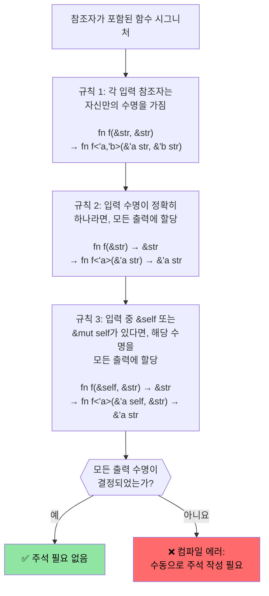

# Rust 수명(Lifetimes) 및 빌림(Borrowing)

> **학습 내용:** Rust의 수명 시스템이 참조자가 절대 댕글링(dangle)되지 않도록 보장하는 방법을 배웁니다 — 암시적 수명부터 명시적 주석, 그리고 대부분의 코드에서 주석을 생략할 수 있게 해주는 세 가지 생략 규칙까지 다룹니다. 다음 섹션의 스마트 포인터로 넘어가기 전에 수명을 이해하는 것이 필수적입니다.

- Rust는 단일 가변 참조자 또는 임의 개수의 불변 참조자를 강제합니다.
    - 모든 참조자의 수명은 최소한 원본 소유자의 수명만큼 길어야 합니다. 이것들은 암시적 수명이며 컴파일러에 의해 추론됩니다 (https://doc.rust-lang.org/nomicon/lifetime-elision.html 참조).
```rust
fn borrow_mut(x: &mut u32) {
    *x = 43;
}
fn main() {
    let mut x = 42;
    let y = &mut x;
    borrow_mut(y);
    let _z = &x; // 컴파일러가 y가 이후에 사용되지 않음을 알기 때문에 허용됩니다.
    //println!("{y}"); // 이 줄의 주석을 해제하면 컴파일되지 않습니다.
    borrow_mut(&mut x); // _z가 사용되지 않으므로 허용됩니다.
    let z = &x; // OK -- borrow_mut()가 반환된 후 x의 가변 빌림이 끝났습니다.
    println!("{z}");
}
```

# Rust 수명 주석(Lifetime annotations)
- 여러 수명을 다룰 때는 명시적인 수명 주석이 필요합니다.
    - 수명은 `'`로 표시되며 임의의 식별자(```'a```, ```'b```, ```'static``` 등)가 될 수 있습니다.
    - 컴파일러가 참조자가 얼마나 오래 살아야 하는지 스스로 파악할 수 없을 때 도움이 필요합니다.
- **일반적인 시나리오**: 함수가 참조자를 반환할 때, 그 참조자가 어떤 입력으로부터 왔는지 명시해야 합니다.
```rust
#[derive(Debug)]
struct Point {x: u32, y: u32}

// 수명 주석이 없으면 컴파일되지 않습니다:
// fn left_or_right(pick_left: bool, left: &Point, right: &Point) -> &Point

// 수명 주석 포함 - 모든 참조자가 동일한 수명 'a를 공유합니다.
fn left_or_right<'a>(pick_left: bool, left: &'a Point, right: &'a Point) -> &'a Point {
    if pick_left { left } else { right }
}

// 더 복잡한 예시: 입력마다 다른 수명을 가짐
fn get_x_coordinate<'a, 'b>(p1: &'a Point, _p2: &'b Point) -> &'a u32 {
    &p1.x  // 반환 값의 수명은 p2가 아니라 p1에 묶여 있습니다.
}

fn main() {
    let p1 = Point {x: 20, y: 30};
    let result;
    {
        let p2 = Point {x: 42, y: 50};
        result = left_or_right(true, &p1, &p2);
        // p2가 범위를 벗어나기 전에 result를 사용하므로 작동합니다.
        println!("선택됨: {result:?}");
    }
    // 아래 코드는 작동하지 않습니다 - result가 이미 사라진 p2를 참조하기 때문입니다:
    // println!("범위 밖에서 사용: {result:?}");
}
```

# Rust 수명 주석
- 데이터 구조체 내의 참조자에도 수명 주석이 필요합니다.
```rust
use std::collections::HashMap;
#[derive(Debug)]
struct Point {x: u32, y: u32}
struct Lookup<'a> {
    map: HashMap<u32, &'a Point>,
}
fn main() {
    let p = Point{x: 42, y: 42};
    let p1 = Point{x: 50, y: 60};
    let mut m = Lookup {map : HashMap::new()};
    m.map.insert(0, &p);
    m.map.insert(1, &p1);
    {
        let p3 = Point{x: 60, y:70};
        //m.map.insert(3, &p3); // 컴파일되지 않음
        // p3는 여기서 드롭되지만 m은 더 오래 생존합니다.
    }
    for (k, v) in m.map {
        println!("{v:?}");
    }
    // m은 여기서 드롭됨
    // p1과 p는 이 순서대로 여기서 드롭됨
} 
```

# 연습 문제: 수명을 이용한 첫 번째 단어 찾기

🟢 **초급** — 실제 수명 생략 규칙(lifetime elision)을 연습해 봅니다.

문자열에서 공백으로 구분된 첫 번째 단어를 반환하는 `fn first_word(s: &str) -> &str` 함수를 작성하세요. 왜 이 함수가 명시적인 수명 주석 없이도 컴파일되는지 생각해 보세요 (힌트: 생략 규칙 #1과 #2).

<details><summary>풀이 (클릭하여 확장)</summary>

```rust
fn first_word(s: &str) -> &str {
    // 컴파일러가 생략 규칙을 적용합니다:
    // 규칙 1: 입력 &str에 수명 'a를 부여 → fn first_word(s: &'a str) -> &str
    // 규칙 2: 입력 수명이 하나뿐이므로 출력에도 동일하게 부여 → fn first_word(s: &'a str) -> &'a str
    match s.find(' ') {
        Some(pos) => &s[..pos],
        None => s,
    }
}

fn main() {
    let text = "hello world foo";
    let word = first_word(text);
    println!("첫 번째 단어: {word}");  // "hello"
    
    let single = "onlyone";
    println!("첫 번째 단어: {}", first_word(single));  // "onlyone"
}
```

</details>

# 연습 문제: 수명을 사용한 슬라이스 저장

🟡 **중급** — 수명 주석과의 첫 만남
- ```&str```의 슬라이스에 대한 참조자를 저장하는 구조체를 만드세요.
    - 긴 ```&str```을 만들고 구조체 내부에 그 슬라이스 참조자들을 저장하세요.
    - 구조체를 받아 그 안에 포함된 슬라이스를 반환하는 함수를 작성하세요.
```rust
// TODO: 슬라이스 참조자를 저장할 구조체 생성
struct SliceStore {

}
fn main() {
    let s = "This is long string";
    let s1 = &s[0..];
    let s2 = &s[1..2];
    // let slice = struct SliceStore {...};
    // let slice2 = struct SliceStore {...};
}
```

<details><summary>풀이 (클릭하여 확장)</summary>

```rust
struct SliceStore<'a> {
    slice: &'a str,
}

impl<'a> SliceStore<'a> {
    fn new(slice: &'a str) -> Self {
        SliceStore { slice }
    }

    fn get_slice(&self) -> &'a str {
        self.slice
    }
}

fn main() {
    let s = "This is a long string";
    let store1 = SliceStore::new(&s[0..4]);   // "This"
    let store2 = SliceStore::new(&s[5..7]);   // "is"
    println!("store1: {}", store1.get_slice());
    println!("store2: {}", store2.get_slice());
}
// 출력:
// store1: This
// store2: is
```

</details>

---

## 수명 생략 규칙(Lifetime Elision Rules) 심층 분석

C 프로그래머들은 종종 묻습니다: "수명이 그렇게 중요하다면 왜 대부분의 Rust 함수에는 `'a` 주석이 없나요?" 그 답은 **수명 생략(lifetime elision)**에 있습니다. 컴파일러는 세 가지 결정론적 규칙을 적용하여 수명을 자동으로 추론합니다.

### 세 가지 생략 규칙

Rust 컴파일러는 함수 시그니처에 대해 다음 규칙들을 **순서대로** 적용합니다. 규칙 적용 후 모든 출력 수명이 결정된다면 주석은 필요하지 않습니다.



### 규칙별 예시

**규칙 1** — 각 입력 참조자는 자신만의 수명 매개변수를 갖습니다:
```rust
// 작성한 코드:
fn first_word(s: &str) -> &str { ... }

// 규칙 1 적용 후 컴파일러가 보는 코드:
fn first_word<'a>(s: &'a str) -> &str { ... }
// 입력 수명이 하나뿐임 → 규칙 2 적용
```

**규칙 2** — 단일 입력 수명이 모든 출력으로 전파됩니다:
```rust
// 규칙 2 적용 후:
fn first_word<'a>(s: &'a str) -> &'a str { ... }
// ✅ 모든 출력 수명이 결정됨 — 주석 불필요!
```

**규칙 3** — `&self` 수명이 출력으로 전파됩니다:
```rust
// 작성한 코드:
impl SliceStore<'_> {
    fn get_slice(&self) -> &str { self.slice }
}

// 규칙 1 + 3 적용 후 컴파일러가 보는 코드:
impl SliceStore<'_> {
    fn get_slice<'a>(&'a self) -> &'a str { self.slice }
}
// ✅ 주석 불필요 — &self의 수명이 출력에 사용됨
```

**생략이 실패할 때** — 직접 주석을 달아야 합니다:
```rust
// 입력 참조자가 둘이고 &self가 없음 → 규칙 2와 3이 적용되지 않음
// fn longest(a: &str, b: &str) -> &str  ← 컴파일되지 않음

// 해결책: 출력이 어떤 입력으로부터 빌려오는지 컴파일러에게 알려줍니다.
fn longest<'a>(a: &'a str, b: &'a str) -> &'a str {
    if a.len() >= b.len() { a } else { b }
}
```

### C 프로그래머의 정신적 모델

C에서 모든 포인터는 독립적입니다. 프로그래머는 각 포인터가 어떤 할당을 참조하는지 머릿속으로 추적하며, 컴파일러는 여러분을 전적으로 신뢰합니다. Rust에서 수명은 이러한 추적을 **명시적이고 컴파일러가 검증 가능하도록** 만듭니다.

| C | Rust | 일어나는 일 |
|---|------|-------------|
| `char* get_name(struct User* u)` | `fn get_name(&self) -> &str` | 규칙 3에 의해 생략됨: 출력이 `self`로부터 빌림 |
| `char* concat(char* a, char* b)` | `fn concat<'a>(a: &'a str, b: &'a str) -> &'a str` | 두 개의 입력이므로 반드시 주석 필요 |
| `void process(char* in, char* out)` | `fn process(input: &str, output: &mut String)` | 출력 참조자가 없으므로 수명 주석 필요 없음 |
| `char* buf; /* 소유자가 누구인가? */` | 수명이 잘못되면 컴파일 에러 | 컴파일러가 댕글링 포인터를 잡아냄 |

### `'static` 수명

`'static`은 참조자가 **프로그램 실행 전체 기간** 동안 유효함을 의미합니다. 이는 C의 전역 변수나 문자열 리터럴에 해당하는 Rust의 개념입니다.

```rust
// 문자열 리터럴은 항상 'static입니다 — 바이너리의 읽기 전용 섹션에 거주합니다.
let s: &'static str = "hello";  // C의 static const char* s = "hello";와 같습니다.

// 상수 또한 'static입니다.
static GREETING: &str = "hello";

// 스레드 생성 시 트레이트 경계에서 자주 보입니다:
fn spawn<F: FnOnce() + Send + 'static>(f: F) { /* ... */ }
// 여기서 'static은 "클로저가 어떠한 지역 변수도 빌려와서는 안 된다"는 의미입니다.
// (변수를 클로저 내부로 이동시키거나, 'static 데이터만 사용해야 함)
```

### 연습 문제: 생략 결과 예측하기

🟡 **중급**

아래 각 함수 시그니처에 대해 컴파일러가 수명을 생략할 수 있는지 예측해 보세요.
생략할 수 없다면 필요한 주석을 추가해 보세요.

```rust
// 1. 컴파일러가 생략할 수 있을까요?
fn trim_prefix(s: &str) -> &str { &s[1..] }

// 2. 컴파일러가 생략할 수 있을까요?
fn pick(flag: bool, a: &str, b: &str) -> &str {
    if flag { a } else { b }
}

// 3. 컴파일러가 생략할 수 있을까요?
struct Parser { data: String }
impl Parser {
    fn next_token(&self) -> &str { &self.data[..5] }
}

// 4. 컴파일러가 생략할 수 있을까요?
fn split_at(s: &str, pos: usize) -> (&str, &str) {
    (&s[..pos], &s[pos..])
}
```

<details><summary>풀이 (클릭하여 확장)</summary>

```rust,ignore
// 1. 예 — 규칙 1이 s에 'a를 부여하고, 규칙 2가 이를 출력으로 전파합니다.
fn trim_prefix(s: &str) -> &str { &s[1..] }

// 2. 아니요 — 입력 참조자가 둘이고 &self가 없습니다. 주석을 달아야 합니다:
fn pick<'a>(flag: bool, a: &'a str, b: &'a str) -> &'a str {
    if flag { a } else { b }
}

// 3. 예 — 규칙 1이 &self에 'a를 부여하고, 규칙 3이 이를 출력으로 전파합니다.
impl Parser {
    fn next_token(&self) -> &str { &self.data[..5] }
}

// 4. 예 — 규칙 1이 s에 'a를 부여하고 (입력 참조자가 하나뿐임),
//    규칙 2가 이를 두 출력 모두에 전파합니다. 두 슬라이스 모두 s로부터 빌려옵니다.
fn split_at(s: &str, pos: usize) -> (&str, &str) {
    (&s[..pos], &s[pos..])
}
```

</details>
