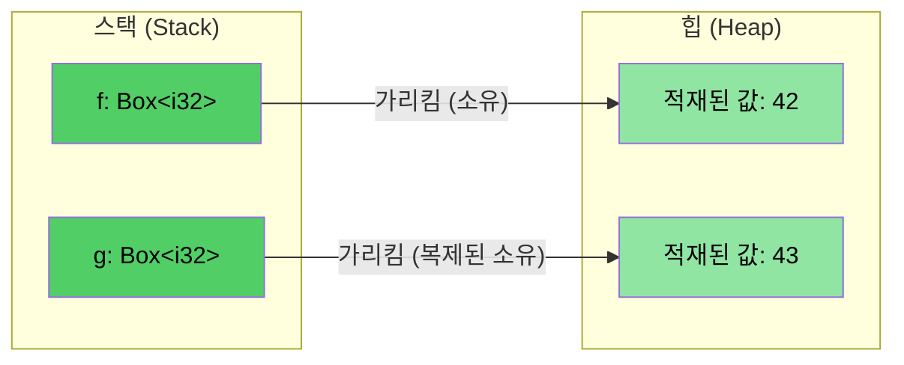

# 스마트 포인터와 내부 가변성

> **학습 목표:** Rust의 핵심 스마트 포인터 타입들(`Box<T>`, `Rc<T>`)과 특수한 상황에서 불변성을 우회하는 '내부 가변성(`Cell<T>`, `RefCell<T>`)' 패턴을 익힙니다. 이전 장에서 배운 소유권과 수명 개념이 실제 복잡한 데이터 구조에서 어떻게 구현되는지 인하고, 참조 순환을 차단하는 `Weak<T>`의 역할도 살펴봅니다.

---

### 1. 힙 할당의 정석: `Box<T>`

**왜 `Box<T>`가 필요한가?**
C에서는 `malloc`과 `free`를 사용해 힙 메모리를 직접 주물렀고, C++에서는 `std::unique_ptr<T>`가 그 역할을 대신합니다. Rust의 `Box<T>`는 힙에 데이터를 저장하고 그 주소를 스택에 보관하는 단일 소유자 포인터입니다.

- **장점**
    - **자동 해제**: 스코프를 벗어나면 `Drop` 트레이트가 작동하여 메모리를 즉시 수거합니다.
    - **이동 후 사용 방지**: C++와 달리 이동된 `Box`에 접근하는 코드는 컴파일 단계에서 차단됩니다.
- **주요 용도**
    - 컴파일 타임에 크기를 알 수 없는 '재귀적 타입'(예: 연결 리스트 노드) 정의 시
    - 큰 데이터를 스택 복사 없이 효율적으로 전달하고 싶을 때
    - 트레이트 객체(`Box<dyn Trait>`)를 사용하여 다형성을 구현할 때

```rust
fn main() {
    // 힙에 42라는 정수를 할당하고 가리킵니다.
    let f = Box::new(42);
    println!("역참조: {}, 단순 출력: {}", *f, f);
    
    // Box를 클론하면 힙 데이터 전체가 새롭게 복제됩니다.
    let mut g = f.clone();
    *g = 43;
    
    println!("원본: {f}, 복사본: {g}");
}
```



---

### 2. 내부 가변성 (Interior Mutability): `Cell<T>`와 `RefCell<T>`

Rust의 대원칙(불변성)을 유지하면서도, 특정 상황에서 객체 내부의 일부 필드만 수정하고 싶을 때가 있습니다. 이를 '내부 가변성'이라고 합니다.

- **`Cell<T>`**: `Copy` 트레이트를 구현한 타입(정수 등)에 적합합니다. 값을 통째로 뺏어오거나(`get`) 새로 쓰는(`set`) 방식으로 작동하며 런타임 오버헤드가 거의 없습니다.
- **`RefCell<T>`**: 참조자를 통해 데이터를 다룹니다. 빌림 규칙(1개 가변 또는 N개 불변)을 컴파일 타임이 아닌 **런타임**에 검사합니다. 규칙 위반 시 프로그램이 **패닉(Panic)**을 일으키므로 주의가 필요합니다.

### 선택 가이드

| **구분** | **`Cell<T>`** | **`RefCell<T>`** |
| :--- | :--- | :--- |
| **권장 대상** | `Copy` 타입 (정수, 불리언 등 소형 데이터) | 일반적인 모든 타입 (`String`, `Vec`, 구조체 등) |
| **접근 방식** | 값의 복사 및 덮어쓰기 (`get/set`) | 런타임 빌림 발생 (`borrow/borrow_mut`) |
| **실패 시 동작** | 실패 시나리오 없음 (언제나 안전) | 빌림 규칙 위반 시 **즉시 패닉 발생** |
| **용도** | 단순 상태 플래그, 카운팅 로직 | 불변 구조체 내의 복잡한 컬렉션 수정 등 |

---

### 3. 공유 소유권: `Rc<T>` (Reference Counted)

현실의 데이터 구조(그래프 등)에서는 하나의 데이터를 여러 곳에서 동시에 소유해야 하는 경우가 발생합니다. `Rc<T>`는 참조 카운팅을 통해 '공동 소유'를 가능하게 합니다.

- **특징**
    - 데이터를 복사하지 않고 소유권만 여러 개로 늘립니다 (`clone()` 시 카운트 증가).
    - 마지막 소유자가 사라져 카운트가 0이 되면 실제 데이터가 해제됩니다.
    - **단일 스레드 전용**입니다. 멀티 스레드 환경에서는 `Arc<T>`를 써야 합니다.

```rust
use std::rc::Rc;

struct Employee { id: u64 }

fn main() {
    let emp = Rc::new(Employee { id: 42 });
    
    // 데이터를 복사하는 게 아니라, 소유권 '지분'을 하나 더 늘리는 개념입니다.
    let team_a = Rc::clone(&emp);
    let team_b = Rc::clone(&emp);
    
    println!("팀 A 사원 ID: {}", team_a.id);
    println!("참조 카운트 상태: {}", Rc::strong_count(&emp)); // 3 (원본 + team_a + team_b)
}
```

---

### 4. 참조 순환 해결: `Weak<T>`

`Rc` 간에 서로를 가속화하여 참조하면 카운트가 영원히 0이 되지 않는 '메모리 누수(Memory Leak)'가 발생할 수 있습니다. 이를 방지하기 위해 부모-자식 관계나 순환 구조에서는 한쪽을 `Weak<T>`(약한 참조)로 설정합니다.

- **특징**: 참조 카운트를 올리지 않으며, 데이터가 살아있는지 확인(`upgrade`)한 후에만 접근 가능합니다.

```rust
use std::rc::{Rc, Weak};

struct Node {
    value: i32,
    parent: Option<Weak<Node>>, // 부모는 약한 참조로 (순환 방지)
}
```

---

### C++ 개발자를 위한 요약 매핑

| **C++ 스마트 포인터** | **Rust 대응 도구** | **핵심적인 차이** |
| :--- | :--- | :--- |
| `std::unique_ptr<T>` | **`Box<T>`** | 이동(Move)이 기본이며, 이동 후 사용을 언어 차원에서 차단 |
| `std::shared_ptr<T>` | **`Rc<T>` / `Arc<T>`** | 스레드 안전성 여부에 따라 `Rc`(단일)와 `Arc`(멀티)로 명확히 분리 |
| `std::weak_ptr<T>` | **`Weak<T>`** | 사용 시 반드시 유효성 검증(`upgrade`)을 거치도록 설계됨 |

> **실전 팁**: 실무에서는 `Rc<RefCell<T>>` 조합을 자주 보게 됩니다. 이는 "여러 곳에서 소유하면서(Rc), 특정 상황에서 데이터를 수정하겠다(RefCell)"는 의도의 표현입니다.

---

# 📝 필드 실습: 공유 사원 관리 시스템

🟡 **중급 과정** — 아래의 요구사항에 맞춰 코드를 완성해 보세요.

1.  사원의 휴가 여부(`on_vacation`)를 불변 참조 상태에서도 변경할 수 있도록 `Cell`을 활용하세요.
2.  사원의 이름(`name`)을 불변 참조 상태에서 수정할 수 있도록 `RefCell`을 활용하세요.
3.  사원 객체를 두 개의 프로젝트 그룹(`Vec`)에서 공유하도록 `Rc`를 활용하세요.

```rust
use std::cell::{Cell, RefCell};
use std::rc::Rc;

#[derive(Debug)]
struct Employee {
    id: u64,
    name: RefCell<String>,
    on_vacation: Cell<bool>,
}

fn update_profile(emp: &Employee) {
    // 1. 휴가 상태 뒤집기 (Cell 활용)
    emp.on_vacation.set(!emp.on_vacation.get());
    
    // 2. 이름 뒤에 직함 붙이기 (RefCell 활용)
    emp.name.borrow_mut().push_str(" (팀장)");
}

fn main() {
    let alice = Rc::new(Employee {
        id: 7,
        name: RefCell::new("Alice".to_string()),
        on_vacation: Cell::new(false),
    });

    // 소유권 공유
    let team_frontend = Rc::clone(&alice);
    let team_backend = Rc::clone(&alice);

    update_profile(&alice);

    println!("최종 상태: {:?}", alice);
    println!("참조 카운트: {}", Rc::strong_count(&alice));
}
```
> **성공 출력 결과**: Alice의 이름에 ' (팀장)'이 붙어 있고, 모든 팀 벡터에서 변경된 동일한 객체를 바라보고 있다면 성공입니다.
