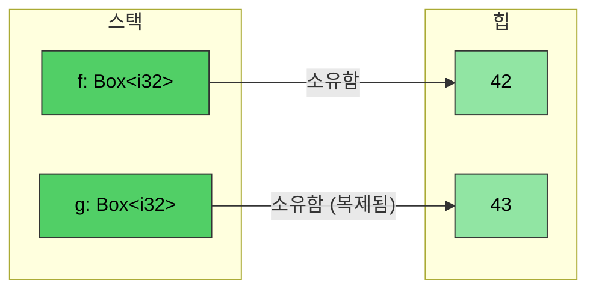
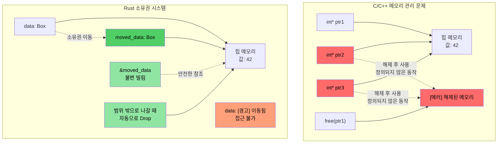
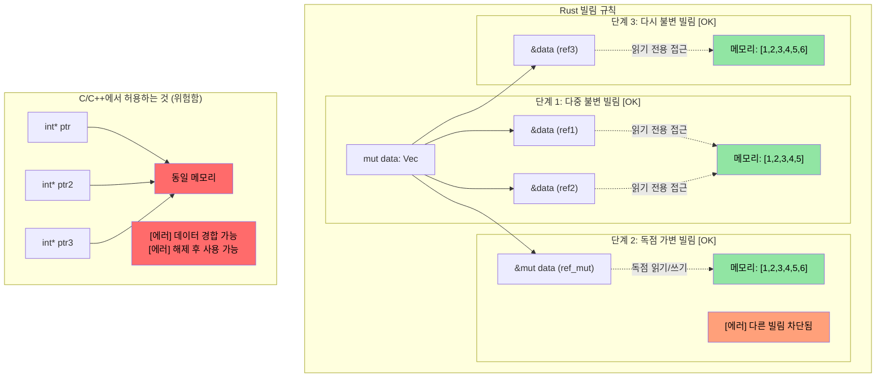

# Rust `Box<T>`

> **학습 내용:** Rust의 스마트 포인터 타입들 — 힙 할당을 위한 `Box<T>`, 공유 소유권을 위한 `Rc<T>`, 그리고 내부 가변성을 위한 `Cell<T>`/`RefCell<T>`을 배웁니다. 이것들은 이전 섹션의 소유권과 수명 개념을 바탕으로 합니다. 또한 참조 순환을 끊기 위한 `Weak<T>`에 대해서도 간략히 알아봅니다.

**왜 `Box<T>`인가?** C에서는 힙 할당을 위해 `malloc`/`free`를 사용합니다. C++에서는 `std::unique_ptr<T>`가 `new`/`delete`를 감쌉니다. Rust의 `Box<T>`는 그에 해당하는 개념으로, 힙에 할당되며 단일 소유자를 갖는 포인터입니다. 범위(scope)를 벗어나면 자동으로 해제됩니다. `malloc`과 달리 잊어버릴 만한 `free`가 없으며, `unique_ptr`과 달리 이동 후 사용(use-after-move)이 불가능합니다 — 컴파일러가 이를 완전히 방지하기 때문입니다.

**`Box` vs 스택 할당 선택 시기:**
- 보관하려는 타입의 크기가 커서 스택에 복사하고 싶지 않을 때
- 재귀적인 타입이 필요할 때 (예: 자신을 포함하는 연결 리스트 노드)
- 트레이트 객체(`Box<dyn Trait>`)가 필요할 때

- ```Box<T>```는 힙 할당된 타입에 대한 포인터를 만드는 데 사용될 수 있습니다. 포인터는 ```<T>```의 타입과 관계없이 항상 고정된 크기입니다.
```rust
fn main() {
    // 힙에 생성된 정수(값 42)에 대한 포인터를 생성합니다.
    let f = Box::new(42);
    println!("{} {}", *f, f);
    // Box를 클로닝하면 새로운 힙 할당이 생성됩니다.
    let mut g = f.clone();
    *g = 43;
    println!("{f} {g}");
    // g와 f는 여기서 범위를 벗어나며 자동으로 메모리가 해제됩니다.
}
```


## 소유권 및 빌림 시각화

### C/C++ vs Rust: 포인터 및 소유권 관리

```c
// C - 수동 메모리 관리, 잠재적 문제들
void c_pointer_problems() {
    int* ptr1 = malloc(sizeof(int));
    *ptr1 = 42;
    
    int* ptr2 = ptr1;  // 둘 다 같은 메모리를 가리킴
    int* ptr3 = ptr1;  // 세 개의 포인터가 같은 메모리를 가리킴
    
    free(ptr1);        // 메모리 해제
    
    *ptr2 = 43;        // 해제 후 사용(Use after free) - 정의되지 않은 동작!
    *ptr3 = 44;        // 해제 후 사용(Use after free) - 정의되지 않은 동작!
}
```

> **C++ 개발자라면:** 스마트 포인터가 도움이 되지만, 모든 문제를 막아주지는 못합니다:
>
> ```cpp
> // C++ - 스마트 포인터가 도움이 되지만, 모든 문제를 막지는 못함
> void cpp_pointer_issues() {
>     auto ptr1 = std::make_unique<int>(42);
>     
>     // auto ptr2 = ptr1;  // 컴파일 에러: unique_ptr은 복사 불가
>     auto ptr2 = std::move(ptr1);  // OK: 소유권 이전
>     
>     // 하지만 C++는 여전히 이동 후 사용을 허용함:
>     // std::cout << *ptr1;  // 컴파일됨! 하지만 정의되지 않은 동작!
>     
>     // shared_ptr 별칭(aliasing) 문제:
>     auto shared1 = std::make_shared<int>(42);
>     auto shared2 = shared1;  // 둘 다 데이터를 소유함
>     // 누가 "진짜" 소유자일까요? 둘 다 아닙니다. 도처에 참조 횟수 오버헤드가 발생합니다.
> }
> ```

```rust
// Rust - 소유권 시스템이 이러한 문제들을 방지함
fn rust_ownership_safety() {
    let data = Box::new(42);  // data가 힙 할당을 소유함
    
    let moved_data = data;    // 소유권이 moved_data로 이전됨
    // data는 더 이상 접근할 수 없음 - 사용 시 컴파일 에러 발생
    
    let borrowed = &moved_data;  // 불변 빌림
    println!("{}", borrowed);    // 안전하게 사용 가능
    
    // moved_data가 범위를 벗어날 때 자동으로 메모리 해제됨
}
```



### 빌림 규칙 시각화

```rust
fn borrowing_rules_example() {
    let mut data = vec![1, 2, 3, 4, 5];
    
    // 여러 개의 불변 빌림 - OK
    let ref1 = &data;
    let ref2 = &data;
    println!("{:?} {:?}", ref1, ref2);  // 둘 다 사용 가능
    
    // 가변 빌림 - 독점적 접근
    let ref_mut = &mut data;
    ref_mut.push(6);
    // ref_mut이 활성화된 동안 ref1과 ref2는 사용할 수 없음
    
    // ref_mut 사용이 끝나면, 다시 불변 빌림이 가능함
    let ref3 = &data;
    println!("{:?}", ref3);
}
```



---

## 내부 가변성(Interior Mutability): `Cell<T>` 및 `RefCell<T>`

Rust에서 변수는 기본적으로 불변임을 기억하세요. 때로는 대부분의 필드는 읽기 전용으로 두고 하나의 필드에 대해서만 쓰기 접근을 허용하고 싶을 때가 있습니다.

```rust
struct Employee {
    employee_id : u64,   // 불변이어야 함
    on_vacation: bool,   // employee_id는 불변으로 두되, 이 필드에 대해서만 쓰기 접근을 허용하려면 어떻게 해야 할까요?
}
```

- Rust는 한 변수에 대해 *단 하나의 가변* 참조자 또는 여러 개의 *불변* 참조자만을 허용하며, 이는 *컴파일 타임*에 강제됩니다.
- 만약 *불변* 사원 벡터를 전달하되, `employee_id`는 수정할 수 없게 보장하면서 `on_vacation` 필드는 업데이트할 수 있게 하고 싶다면 어떻게 해야 할까요?

### `Cell<T>` — Copy 타입을 위한 내부 가변성

- `Cell<T>`는 **내부 가변성**을 제공합니다. 즉, 읽기 전용인 참조자의 특정 요소에 대해 쓰기 접근을 가능하게 합니다.
- 값을 안팎으로 복사하는 방식으로 작동합니다 (`.get()`을 위해 `T: Copy`가 필요함).

### `RefCell<T>` — 런타임 빌림 체크를 동반한 내부 가변성

- `RefCell<T>`는 참조자와 함께 작동하는 변형을 제공합니다.
    - Rust의 빌림 체크를 컴파일 타임이 아닌 **런타임**에 강제합니다.
    - 단일 *가변* 빌림을 허용하지만, 다른 참조자가 이미 활성화되어 있다면 **패닉**을 발생시킵니다.
    - 불변 접근을 위해 `.borrow()`를, 가변 접근을 위해 `.borrow_mut()`를 사용합니다.

### `Cell` vs `RefCell` 선택 기준

| 기준 | `Cell<T>` | `RefCell<T>` |
|-----------|-----------|-------------|
| 대상 | `Copy` 타입 (정수, 불리언, 부동 소수점) | 모든 타입 (`String`, `Vec`, 구조체) |
| 접근 패턴 | 값을 복사하여 입출력 (`.get()`, `.set()`) | 제자리에서 빌림 (`.borrow()`, `.borrow_mut()`) |
| 실패 모드 | 실패할 수 없음 — 런타임 체크 없음 | 다른 빌림이 활성화된 상태에서 가변 빌림 시 **패닉** |
| 오버헤드 | 제로 — 바이트 복사만 수행 | 적음 — 런타임에 빌림 상태 추적 |
| 사용 시기 | 불변 구조체 내의 가변 플래그, 카운터 또는 작은 값이 필요할 때 | 불변 구조체 내의 `String`, `Vec` 또는 복잡한 타입을 수정해야 할 때 |

---

## 공유 소유권: `Rc<T>`

`Rc<T>`는 *불변* 데이터에 대해 참조 카운팅(reference-counted) 기반의 공유 소유권을 허용합니다. 같은 `Employee` 객체를 복사하지 않고 여러 곳에 저장하고 싶다면 어떻게 해야 할까요?

```rust
#[derive(Debug)]
struct Employee {
    employee_id: u64,
}
fn main() {
    let mut us_employees = vec![];
    let mut all_global_employees = Vec::<Employee>::new();
    let employee = Employee { employee_id: 42 };
    us_employees.push(employee);
    // 컴파일되지 않음 — employee가 이미 이동되었음
    //all_global_employees.push(employee);
}
```

`Rc<T>`는 공유된 *불변* 접근을 허용하여 이 문제를 해결합니다:
- 포함된 타입은 자동으로 역참조됩니다.
- 참조 횟수가 0이 되면 해당 타입은 드롭됩니다.

```rust
use std::rc::Rc;
#[derive(Debug)]
struct Employee {employee_id: u64}
fn main() {
    let mut us_employees = vec![];
    let mut all_global_employees = vec![];
    let employee = Employee { employee_id: 42 };
    let employee_rc = Rc::new(employee);
    us_employees.push(employee_rc.clone());
    all_global_employees.push(employee_rc.clone());
    let employee_one = all_global_employees.get(0); // 공유된 불변 참조
    for e in us_employees {
        println!("{}", e.employee_id);  // 공유된 불변 참조
    }
    println!("{employee_one:?}");
}
```

> **C++ 개발자라면: 스마트 포인터 매핑**
>
> | C++ 스마트 포인터 | Rust 대응 개념 | 주요 차이점 |
> |---|---|---|
> | `std::unique_ptr<T>` | `Box<T>` | Rust 버전이 기본입니다 — 이동은 언어 수준에서 지원되며 선택 사항이 아닙니다. |
> | `std::shared_ptr<T>` | `Rc<T>` (단일 스레드) / `Arc<T>` (멀티 스레드) | `Rc`에는 원자적(atomic) 오버헤드가 없습니다. 스레드 간 공유 시에만 `Arc`를 사용하세요. |
> | `std::weak_ptr<T>` | `Weak<T>` (`Rc::downgrade()` 또는 `Arc::downgrade()`로부터 생성) | 목적은 동일합니다: 참조 순환을 끊기 위함입니다. |
>
> **핵심 차이**: C++에서는 스마트 포인터를 사용할지 *선택*합니다. Rust에서는 소유한 값(`T`)과 빌림(`&T`)이 대부분의 사용 사례를 커버합니다. 힙 할당이나 공유 소유권이 꼭 필요한 경우에만 `Box`/`Rc`/`Arc`를 선택하세요.

### `Weak<T>`를 사용하여 참조 순환 끊기

`Rc<T>`는 참조 카운팅을 사용합니다. 만약 두 `Rc` 값이 서로를 가리킨다면, 참조 횟수가 결코 0이 되지 않아 드롭되지 않습니다(순환 참조). `Weak<T>`가 이를 해결합니다:

```rust
use std::rc::{Rc, Weak};

struct Node {
    value: i32,
    parent: Option<Weak<Node>>,  // 약한 참조 — 드롭을 방지하지 않음
}

fn main() {
    let parent = Rc::new(Node { value: 1, parent: None });
    let child = Rc::new(Node {
        value: 2,
        parent: Some(Rc::downgrade(&parent)),  // 부모에 대한 약한 참조
    });

    // Weak를 사용하려면 upgrade를 시도해야 함 — Option<Rc<T>>를 반환
    if let Some(parent_rc) = child.parent.as_ref().unwrap().upgrade() {
        println!("부모 노드 값: {}", parent_rc.value);
    }
    println!("부모 노드 강한 참조 횟수: {}", Rc::strong_count(&parent)); // 2가 아닌 1
}
```

> `Weak<T>`에 대해서는 [과도한 clone() 방지하기](ch17-1-avoiding-excessive-clone.md)에서 더 자세히 다룹니다. 지금 기억해야 할 핵심은 **메모리 누수를 피하기 위해 트리/그래프 구조에서 "역참조(back-reference)"에는 `Weak`를 사용한다**는 점입니다.

---

## `Rc`와 내부 가변성 결합하기

공유 소유권(`Rc<T>`)과 내부 가변성(`Cell<T>` 또는 `RefCell<T>`)을 결합할 때 진정한 위력이 발휘됩니다. 이를 통해 여러 소유자가 공유 데이터를 **읽고 수정**할 수 있게 됩니다:

| 패턴 | 사용 사례 |
|---------|----------|
| `Rc<RefCell<T>>` | 공유된 가변 데이터 (단일 스레드) |
| `Arc<Mutex<T>>` | 공유된 가변 데이터 (멀티 스레드 — [13장](ch13-concurrency.md) 참조) |
| `Rc<Cell<T>>` | 공유된 가변 Copy 타입 (단순 플래그, 카운터) |

---

# 연습 문제: 공유 소유권 및 내부 가변성

🟡 **중급**

- **부문 1 (Rc)**: `employee_id: u64`와 `name: String`을 가진 `Employee` 구조체를 만드세요. 이를 `Rc<Employee>`에 넣고 두 개의 별개 `Vec`(`us_employees` 및 `global_employees`)으로 클론하세요. 두 벡터에서 모두 출력하여 동일한 데이터를 공유하고 있음을 보여주세요.
- **부문 2 (Cell)**: `Employee`에 `on_vacation: Cell<bool>` 필드를 추가하세요. 불변 참조자인 `&Employee`를 함수에 전달하고, 참조자를 가변으로 만들지 않고도 함수 내부에서 `on_vacation`을 토글하세요.
- **부문 3 (RefCell)**: `name: String`을 `name: RefCell<String>`으로 바꾸고, `&Employee`(불변 참조)를 통해 사원 이름에 접미사를 추가하는 함수를 작성하세요.

**시작 코드:**
```rust
use std::cell::{Cell, RefCell};
use std::rc::Rc;

#[derive(Debug)]
struct Employee {
    employee_id: u64,
    name: RefCell<String>,
    on_vacation: Cell<bool>,
}

fn toggle_vacation(emp: &Employee) {
    // TODO: Cell::set()을 사용하여 on_vacation 뒤집기
}

fn append_title(emp: &Employee, title: &str) {
    // TODO: RefCell을 통해 이름을 가변으로 빌려와서 title을 push_str 하기
}

fn main() {
    // TODO: 사원을 생성하고, Rc로 감싸고, 두 개의 Vec으로 클론하고,
    // toggle_vacation과 append_title을 호출한 뒤 결과를 출력하세요.
}
```

<details><summary>풀이 (클릭하여 확장)</summary>

```rust
use std::cell::{Cell, RefCell};
use std::rc::Rc;

#[derive(Debug)]
struct Employee {
    employee_id: u64,
    name: RefCell<String>,
    on_vacation: Cell<bool>,
}

fn toggle_vacation(emp: &Employee) {
    emp.on_vacation.set(!emp.on_vacation.get());
}

fn append_title(emp: &Employee, title: &str) {
    emp.name.borrow_mut().push_str(title);
}

fn main() {
    let emp = Rc::new(Employee {
        employee_id: 42,
        name: RefCell::new("Alice".to_string()),
        on_vacation: Cell::new(false),
    });

    let mut us_employees = vec![];
    let mut global_employees = vec![];
    us_employees.push(Rc::clone(&emp));
    global_employees.push(Rc::clone(&emp));

    // 불변 참조를 통해 휴가 상태 토글
    toggle_vacation(&emp);
    println!("휴가 중: {}", emp.on_vacation.get()); // true

    // 불변 참조를 통해 직함 추가
    append_title(&emp, ", Sr. Engineer");
    println!("이름: {}", emp.name.borrow()); // "Alice, Sr. Engineer"

    // 두 Vec 모두 동일한 데이터를 바라봄 (Rc가 소유권 공유)
    println!("US: {:?}", us_employees[0].name.borrow());
    println!("Global: {:?}", global_employees[0].name.borrow());
    println!("Rc 강한 참조 횟수: {}", Rc::strong_count(&emp));
}
// 출력:
// 휴가 중: true
// 이름: Alice, Sr. Engineer
// US: "Alice, Sr. Engineer"
// Global: "Alice, Sr. Engineer"
// Rc 강한 참조 횟수: 3
```

</details>
