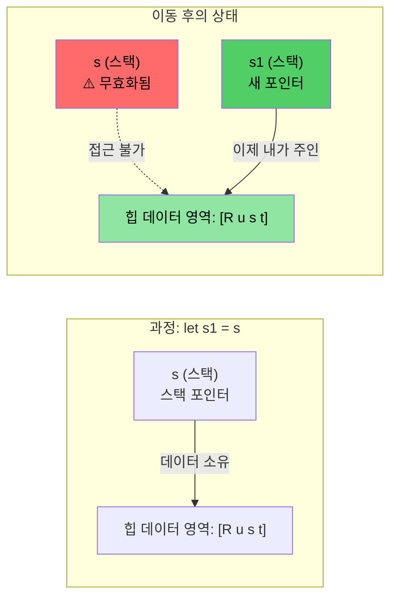

# Rust의 메모리 관리 철학

> **학습 목표:** Rust의 심장이라 할 수 있는 **'소유권(Ownership)'** 시스템을 완벽히 이해합니다. 이 장을 마치면 이동 의미론(Move semantics), 빌림 규칙(Borrowing rules), 그리고 `Drop` 트레이트의 작동 원리를 파악하게 됩니다. 이 개념만 제대로 정립한다면 Rust 학습의 8할을 끝낸 것이나 다름없습니다. C/C++ 개발자들에게 소유권은 다소 낯설 수 있으나, 두 번 세 번 반복해서 읽다 보면 그 명쾌함에 무릎을 치게 될 것입니다.

---

### 기존 메모리 관리 방식의 고질적 문제
C/C++의 메모리 관리는 성능을 얻는 대신 수많은 버그의 위험을 떠안고 있습니다.

- **C 언어**: `malloc()`과 `free()`를 수동으로 짝지어야 합니다. 댕글링 포인터(Dangling pointer), 해제 후 사용(Use-after-free), 이중 해제(Double-free) 등을 검증할 안전장치가 없습니다.
- **C++ 언어**: RAII와 스마트 포인터가 큰 도움을 주지만, `std::move(ptr)` 실행 후에도 해당 포인터에 접근이 가능하여 런타임에 정의되지 않은 동작(UB)이 발생할 여지가 여전합니다.

### Rust의 혁신: 완벽한 RAII 구현
Rust는 리소스 관리에 대한 권한을 개발자에게 온전히 주면서도, **컴파일 타임**에 철저한 안전성을 보장합니다.

- **파괴적 이동(Destructive move)**: 이동된 변수는 그 즉시 컴파일러에 의해 무효화되어 재사용이 절대적으로 금지됩니다. (좀비 객체 발생 불가)
- **Rule of Five 불필요**: 복사/이동 생성자나 대입 연산자를 일일이 정의할 필요가 없습니다. 컴파일러가 소유권 규칙에 따라 최적의 관리를 자동으로 수행합니다.
- **노 런타임 오버헤드**: 이 모든 검사는 컴파일 시점에 완료되므로 런타임 성능 저하가 전혀 없습니다.

---

### C++ 대비 스마트 포인터 매핑 가이드

| **C++의 도구** | **Rust의 대응 도구** | **안전성 향상 포인트** |
| :--- | :--- | :--- |
| `std::unique_ptr<T>` | **`Box<T>`** | 이동 후 원본 사용이 컴파일 단계에서 차단됨 |
| `std::shared_ptr<T>` | **`Rc<T>`** (단일 스레드) | 소유권 트리 구조 덕분에 순환 참조 발생 억제 |
| `std::shared_ptr<T>` | **`Arc<T>`** (멀티 스레드) | 원자적 참조 카운팅을 통한 명시적 스레드 안전성 확보 |
| `std::weak_ptr<T>` | **`Weak<T>`** | 사용 시 항상 유효성 체크 절차를 거치도록 강제 |
| **원시 포인터** (Raw Ptrs) | `*const T` / `*mut T` | 오직 `unsafe` 블록 내에서만 역참조 가능 |

> **C 개발자라면**: `Box<T>`는 수동 `malloc/free` 쌍의 안전한 대체제입니다. `Rc<T>`는 복잡한 참조 카운팅 로직을 자동화합니다.

---

# 소유권, 빌림, 그리고 수명 (Lifetimes)

Rust의 참조 규칙은 단순하지만 강력합니다: **한 시점에 단 하나의 가변 참조자만 있거나, 여러 개의 읽기 전용 참조자만 있거나.**

1.  **소유권(Ownership)**: 변수가 처음 선언될 때 메모리의 주인이 결정됩니다.
2.  **빌림(Borrowing)**: 소유자로부터 메모리 접근 권한을 임시로 빌려옵니다.
3.  **수명(Lifetime)**: 빌려온 사람(참조자)은 주인(소유자)보다 더 오래 살 수 없습니다.

```rust
fn main() {
    let a = 42; // 소유권 확립 (a가 주인)
    let b = &a; // 첫 번째 빌림 (공유 참조)
    {
        let aa = 100;
        let c = &a; // 두 번째 빌림 가능 (공유 참조는 여러 개 가능)
        // c와 aa는 이 블록이 끝나면 소멸합니다.
    }
    // let d = &aa; // 에러! aa는 이미 사라졌으므로 빌릴 수 없습니다.
    // a가 최종적으로 범위를 벗어나며 메모리가 정리됩니다.
}
```

### 함수 간 데이터 전달 방식
- **값 복사(Copy)**: `u32`, `i32`, `bool` 등 크기가 작고 단순한 타입은 값을 복사하여 전달합니다.
- **참조 전달(Borrowing)**: 원본을 그대로 두고 주소만 전달합니다. 읽기 전용(`&`)과 수정 가능(`&mut`)이 있습니다.
- **소유권 이전(Move)**: 데이터의 주인 자체를 함수로 넘깁니다. 호출한 쪽에서는 해당 데이터를 더 이상 쓸 수 없습니다.

```rust
fn print_val(x: &u32) { println!("읽기 전용 빌림: {x}"); }
fn modify_val(x: &mut u32) { *x += 1; }
fn consume_val(x: u32) { println!("소유권 획득 후 소비: {x}"); }

fn main() {
    let mut a = 42;
    print_val(&a);    // 빌려주기
    modify_val(&mut a); // 수정 권한까지 빌려주기
    consume_val(a);   // 소유권 넘기기 (이후 a는 사용 불가)
}
```

---

# 이동 의미론 (Move Semantics)

Rust의 기본 할당 동작은 '복사'가 아닌 '이동'입니다. 이는 성능상 이점과 안전성을 동시에 챙깁니다.

```rust
fn main() {
    let s = String::from("Rust"); // 힙 메모리 할당
    let s1 = s; // 소유권이 s에서 s1으로 이동. s는 이제 쓸모없는 상태가 됨.
    
    println!("s1: {s1}");
    // println!("{s}"); // 컴파일 에러: 이미 이동한(Moved) 값을 사용하려고 함.
}
```


*데이터의 실제 복사 없이 포인터(소유권)만 옮겨갑니다. 원본 변수 `s`는 컴파일러가 추적하여 재사용을 차단하므로 안전합니다.*

---

# 클론(Clone)과 복사(Copy)

### Clone: 명시적 데이터 복제
이동이 아닌 '새로운 독립된 복사본'이 필요할 때는 `clone()`을 사용합니다. 이때 힙 메모리의 전체 복사가 일어나므로 비용이 발생합니다.

```rust
fn main() {
    let s = String::from("Rust");
    let s1 = s.clone(); // 힙 메모리가 새롭게 할당되고 복제됩니다.
    
    println!("원본 s: {s}, 복사본 s1: {s1}"); // 둘 다 사용 가능
}
```

### Copy: 자동 값 복사
반면, 정수나 불리언처럼 값이 매우 작아 스택에서 순식간에 복제되는 타입들은 `Copy` 트레이트를 구현하고 있습니다. 이들은 이동이 아닌 자동 복사가 일어납니다.

```rust
#[derive(Copy, Clone, Debug)]
struct SimplePoint { x: u32, y: u32 }

fn main() {
    let p1 = SimplePoint { x: 10, y: 20 };
    let p2 = p1; // Copy가 구현되어 있어 이동이 아닌 '복사'가 일어남.
    println!("p1: {:?}, p2: {:?}", p1, p2); // 둘 다 건강하게 살아있음
}
```

---

# Drop 트레이트: 자원의 자동 반납

Rust는 변수의 수명이 다하면(스코프를 벗어나면) 자동으로 `drop()` 함수를 호출합니다.

- **안전한 RAII**: C 개발자가 수동으로 수행하던 `free()` 호출의 고통을 덜어줍니다.
- **소멸자(Destructor)**: `Drop` 트레이트를 직접 구현하여 파일 닫기, 네트워크 연결 해제 등 커스텀 정리 로직을 작성할 수 있습니다.
- **수동 드롭**: 시스템이 정한 시점보다 일찍 자원을 해제하고 싶다면 `drop(var)` 함수를 쓰면 됩니다. 이는 소유권을 빼앗아 소멸시킨 후 재사용을 막으므로 안전합니다.

### C++ 소멸자와의 결정적 차이 점검

| **구분** | **C++ 소멸자 (`~Name`)** | **Rust `Drop` (`drop`)** |
| :--- | :--- | :--- |
| **이동 의미론** | 이동 후에도 원본 객체에서 소멸자가 한 번 더 실행됨 (좀비 객체 주의) | 이동 시 소유권 자체가 사라지므로 **원본에선 소멸자가 호출되지 않음** |
| **수동 호출** | 명시적 호출이 위험하고 드문 경우임 | `drop(obj)`를 통해 안전하게 조기 해제 가능 (이후 사용 차단) |
| **Rule of Five** | 복사/이동 로직을 모두 일일이 설계해야 함 | `Drop` 로직만 작성하면 됨. 이동/복사 관리는 컴파일러의 몫. |
| **삭제 순서** | 선언된 역순으로 안전하게 해제 (공통 사항) | 동일하게 선언 역순으로 해제됨 |

```rust
struct Resource { name: String }

impl Drop for Resource {
    fn drop(&mut self) {
        println!("리소스 '{}' 반남 중...", self.name);
    }
}

fn main() {
    let r1 = Resource { name: "DB 연결".to_string() };
    {
        let r2 = Resource { name: "임시 파일".to_string() };
        println!("내부 스코프 진행 중");
    } // r2가 여기서 드롭됩니다.
    println!("메인 함수 종료 직전");
} // r1이 여기서 드롭됩니다.
```

---

# 📝 연습 문제: 직접 경험하는 소유권의 세계

🟡 **중급 과정** — 아래 코드로 실험하며 컴파일러의 에러 메시지와 친해지는 시간을 가져보세요.

1.  `Point` 구조체에 `#[derive(Copy, Clone)]`을 넣었을 때와 뺐을 때 `let p2 = p1;` 이후 `p1`의 상태가 어떻게 다른지 확인해 보세요.
2.  `Drop` 트레이트를 구현하여 드롭 시 로그를 남겨보세요. 데이터베이스 핸들이나 뮤텍스 락을 다루는 핵심 패턴을 익히는 데 큰 도움이 됩니다.

```rust
#[derive(Debug)]
struct Point { x: i32, y: i32 }

impl Drop for Point {
    fn drop(&mut self) {
        println!("Point({}, {})가 안전하게 해제되었습니다.", self.x, self.y);
    }
}

fn consume_point(p: Point) {
    println!("함수 내부에서 소비: {:?}", p);
} // 여기서 p가 드롭됩니다!

fn main() {
    let p1 = Point { x: 10, y: 10 };
    
    // 1. 소유권 이동 실험
    let p2 = p1; 
    // println!("{:?}", p1); // <-- 이 줄의 주석을 풀고 에러 메시지를 정독하세요.

    // 2. 함수 전달 실험
    consume_point(p2); 
    // println!("{:?}", p2); // <-- p2는 이제 영영 사라졌습니다. 왜일까요?
}
```
> **참고**: `Drop` 트레이트를 구현한 타입은 컴파일러가 수동 드가 아닌 자동 관리를 보장해야 하므로, 명시적으로 `Copy` 트레이트를 동시에 가질 수 없도록 설계되어 있습니다.
