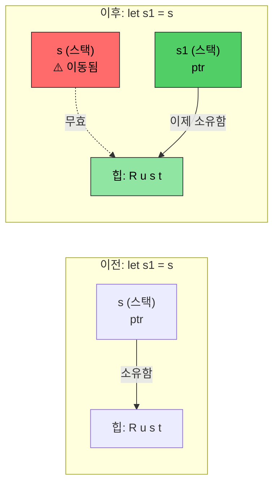
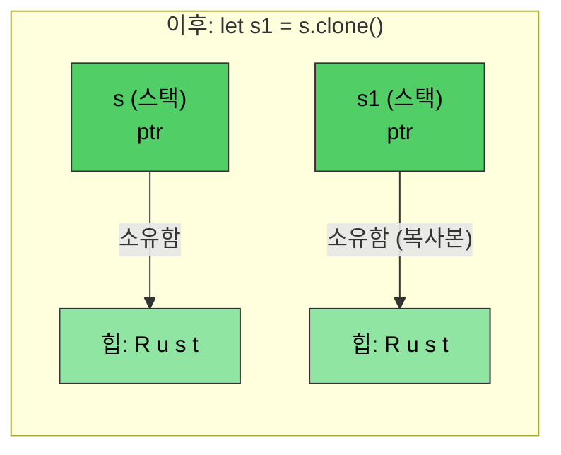

# Rust 메모리 관리

> **학습 내용:** Rust의 소유권(ownership) 시스템을 배웁니다. 이는 이 언어에서 가장 중요한 개념입니다. 이 장을 마치면 이동 의미론(move semantics), 빌림 규칙(borrowing rules), 그리고 `Drop` 트레이트를 이해하게 될 것입니다. 이 장을 이해한다면 나머지 Rust 내용은 자연스럽게 따라올 것입니다. 이해하기 어렵다면 다시 읽어보세요 — 대부분의 C/C++ 개발자들에게 소유권은 두 번째 읽을 때 비로소 이해되기 시작합니다.

- C/C++의 메모리 관리는 버그의 원인이 됩니다:
    - C: 메모리는 `malloc()`으로 할당되고 `free()`로 해제됩니다. 댕글링 포인터, 해제 후 사용, 이중 해제에 대한 체크가 없습니다.
    - C++: RAII(Resource Acquisition Is Initialization)와 스마트 포인터가 도움이 되지만, `std::move(ptr)`는 이동 후에도 컴파일이 가능하여 이동 후 사용(use-after-move)으로 인한 정의되지 않은 동작(UB)이 발생할 수 있습니다.
- Rust는 RAII를 **완벽하게** 만듭니다:
    - 이동은 **파괴적(destructive)**입니다 — 컴파일러가 이동된 변수에 접근하는 것을 거부합니다.
    - Rule of Five가 필요하지 않습니다 (복사 생성자, 이동 생성자, 복사 대입, 이동 대입, 소멸자를 정의할 필요가 없음).
    - Rust는 메모리 할당에 대한 완전한 제어권을 주면서도 **컴파일 타임**에 안전성을 강제합니다.
    - 이는 소유권, 빌림, 가변성, 수명을 포함한 메커니즘의 조합으로 이루어집니다.
    - Rust 런타임 할당은 스택과 힙 모두에서 발생할 수 있습니다.

> **C++ 개발자를 위한 스마트 포인터 매핑:**
>
> | **C++** | **Rust** | **안전성 향상** |
> |---------|----------|----------------------|
> | `std::unique_ptr<T>` | `Box<T>` | 이동 후 사용 불가능 |
> | `std::shared_ptr<T>` | `Rc<T>` (단일 스레드) | 기본적으로 참조 순환 없음 |
> | `std::shared_ptr<T>` (스레드 안전) | `Arc<T>` | 명시적인 스레드 안전성 |
> | `std::weak_ptr<T>` | `Weak<T>` | 유효성 체크 필수 |
> | 원시 포인터 | `*const T` / `*mut T` | `unsafe` 블록 내에서만 허용 |
>
> C 개발자를 위해: `Box<T>`는 `malloc`/`free` 쌍을 대체합니다. `Rc<T>`는 수동 참조 카운팅을 대체합니다. 원시 포인터는 존재하지만 `unsafe` 블록으로 제한됩니다.

# Rust 소유권, 빌림 및 수명(Lifetimes)
- Rust는 변수에 대해 오직 하나의 가변 참조자 또는 여러 개의 읽기 전용 참조자만 허용한다는 점을 기억하세요.
    - 변수의 초기 선언이 ```소유권(ownership)```을 확립합니다.
    - 이후의 참조자들은 원래 소유자로부터 ```빌려옵니다(borrow)```. 규칙은 빌림의 범위가 소유 범위를 절대 초과할 수 없다는 것입니다. 다시 말해, 빌림의 ```수명(lifetime)```은 소유 수명을 초과할 수 없습니다.
```rust
fn main() {
    let a = 42; // 소유자
    let b = &a; // 첫 번째 빌림
    {
        let aa = 42;
        let c = &a; // 두 번째 빌림; a는 여전히 범위 내에 있음
        // OK: c는 여기서 범위를 벗어남
        // aa는 여기서 범위를 벗어남
    }
    // let d = &aa; // aa를 외부 범위로 이동하지 않는 한 컴파일되지 않음
    // b는 a보다 먼저 암시적으로 범위를 벗어남
    // a가 마지막으로 범위를 벗어남
}
```

- Rust는 여러 가지 메커니즘을 사용하여 매개변수를 메서드에 전달할 수 있습니다.
    - 값에 의한 전달 (복사): 일반적으로 사소하게 복사할 수 있는 타입들 (예: u8, u32, i8, i32)
    - 참조에 의한 전달: 이는 실제 값에 대한 포인터를 전달하는 것과 같습니다. 이는 일반적으로 빌림(borrowing)으로 알려져 있으며, 참조는 불변(```&```) 또는 가변(```&mut```)일 수 있습니다.
    - 이동에 의한 전달: 이는 값의 "소유권"을 함수로 이전합니다. 호출자는 더 이상 원래 값을 참조할 수 없습니다.
```rust
fn foo(x: &u32) {
    println!("{x}");
}
fn bar(x: u32) {
    println!("{x}");
}
fn main() {
    let a = 42;
    foo(&a);    // 참조에 의한 전달
    bar(a);     // 값에 의한 전달 (복사)
}
```

- Rust는 메서드에서 댕글링 참조가 발생하는 것을 금지합니다.
    - 메서드에서 반환된 참조자는 여전히 범위 내에 있어야 합니다.
    - Rust는 참조자가 범위를 벗어날 때 자동으로 ```drop```합니다.
```rust
fn no_dangling() -> &u32 {
    // a의 수명이 여기서 시작됨
    let a = 42;
    // 컴파일되지 않음. a의 수명이 여기서 끝남
    &a
}

fn ok_reference(a: &u32) -> &u32 {
    // a의 수명이 항상 ok_reference()보다 길기 때문에 OK
    a
}
fn main() {
    let a = 42;     // a의 수명이 여기서 시작됨
    let b = ok_reference(&a);
    // b의 수명이 여기서 끝남
    // a의 수명이 여기서 끝남
}
```

# Rust 이동 의미론(Move semantics)
- 기본적으로 Rust 할당은 소유권을 이전합니다.
```rust
fn main() {
    let s = String::from("Rust");    // 힙에 문자열 할당
    let s1 = s; // 소유권을 s1으로 이전. 이 시점에서 s는 무효화됨
    println!("{s1}");
    // 아래 코드는 컴파일되지 않음
    //println!("{s}");
    // s1이 여기서 범위를 벗어나며 메모리가 해제됨
    // s가 여기서 범위를 벗어나지만, 아무것도 소유하지 않으므로 아무 일도 일어나지 않음
}
```

*`let s1 = s` 이후에 소유권이 `s1`으로 이전됩니다. 힙 데이터는 그대로 유지되고 스택 포인터만 이동합니다. `s`는 이제 무효합니다.*

----
# Rust 이동 의미론 및 빌림
```rust
fn foo(s : String) {
    println!("{s}");
    // s가 가리키는 힙 메모리가 여기서 해제됨
}
fn bar(s : &String) {
    println!("{s}");
    // 아무 일도 일어나지 않음 -- s는 빌려온 것임
}
fn main() {
    let s = String::from("Rust 문자열 이동 예제");    // 힙에 문자열 할당
    foo(s); // 소유권 이전; s는 이제 무효함
    // println!("{s}");  // 컴파일되지 않음
    let t = String::from("Rust 문자열 빌림 예제");
    bar(&t);    // t가 계속해서 소유권을 가짐
    println!("{t}"); 
}
```

# Rust 이동 의미론 및 소유권
- 이동을 통해 소유권을 이전하는 것이 가능합니다.
    - 이동이 완료된 후 남아있는 참조자를 참조하는 것은 불법입니다.
    - 이동이 바람직하지 않은 경우 빌림을 고려하세요.
```rust
struct Point {
    x: u32,
    y: u32,
}
fn consume_point(p: Point) {
    println!("{} {}", p.x, p.y);
}
fn borrow_point(p: &Point) {
    println!("{} {}", p.x, p.y);
}
fn main() {
    let p = Point {x: 10, y: 20};
    // 두 줄의 순서를 바꿔보세요
    borrow_point(&p);
    consume_point(p);
}
```

# Rust Clone
- ```clone()``` 메서드는 원본 메모리를 복사하는 데 사용될 수 있습니다. 원본 참조자는 계속 유효합니다 (단점은 할당량이 2배가 된다는 점입니다).
```rust
fn main() {
    let s = String::from("Rust");    // 힙에 문자열 할당
    let s1 = s.clone(); // 문자열 복사; 힙에 새로운 할당 생성
    println!("{s1}");  
    println!("{s}");
    // s1이 여기서 범위를 벗어나며 메모리가 해제됨
    // s가 여기서 범위를 벗어나며 메모리가 해제됨
}
```

*`clone()`은 **별도의** 힙 할당을 생성합니다. `s`와 `s1` 모두 유효하며, 각각 자신의 복사본을 소유합니다.*

# Rust Copy 트레이트
- Rust는 ```Copy``` 트레이트를 사용하여 내장 타입에 대해 복사 의미론을 구현합니다.
    - 예시로는 u8, u32, i8, i32 등이 있습니다. 복사 의미론은 "값에 의한 전달"을 사용합니다.
    - 사용자 정의 데이터 타입은 ```derive``` 매크로를 사용하여 ```Copy``` 트레이트를 자동으로 구현함으로써 복사 의미론을 선택적으로 채택할 수 있습니다.
    - 컴파일러는 새로운 할당에 따라 복사본을 위한 공간을 할당합니다.
```rust
// let p1 = p; 아래에서 변경 사항을 확인하려면 이 줄을 주석 처리해 보세요.
#[derive(Copy, Clone, Debug)]   // 이에 대해서는 나중에 더 자세히 다룹니다.
struct Point{x: u32, y:u32}
fn main() {
    let p = Point {x: 42, y: 40};
    let p1 = p;     // 이제 이동 대신 복사가 수행됩니다.
    println!("p: {p:?}");
    println!("p1: {p:?}");
    let p2 = p1.clone();    // 의미론적으로 복사와 동일합니다.
}
```

# Rust Drop 트레이트

- Rust는 범위가 끝날 때 자동으로 `drop()` 메서드를 호출합니다.
    - `drop`은 `Drop`이라는 제네릭 트레이트의 일부입니다. 컴파일러는 모든 타입에 대해 기본적으로 아무 일도 하지 않는(NOP) 구현을 제공하지만, 타입에서 이를 재정의(override)할 수 있습니다. 예를 들어, `String` 타입은 힙 할당된 메모리를 해제하도록 이를 재정의합니다.
    - C 개발자를 위해: 이는 수동 `free()` 호출의 필요성을 대체합니다 — 리소스는 범위를 벗어날 때 자동으로 해제됩니다(RAII).
- **핵심 안전성:** `drop()`을 직접 호출할 수 없습니다 (컴파일러가 이를 금지함). 대신 `drop(obj)`를 사용하세요. 이는 값을 함수 내부로 이동시키고, 소멸자를 실행하며, 이후의 사용을 방지하여 이중 해제(double-free) 버그를 제거합니다.

> **C++ 개발자를 위해:** `Drop`은 C++ 소멸자(`~ClassName()`)와 직접적으로 매핑됩니다:
>
> | | **C++ 소멸자** | **Rust `Drop`** |
> |---|---|---|
> | **구문** | `~MyClass() { ... }` | `impl Drop for MyType { fn drop(&mut self) { ... } }` |
> | **호출 시점** | 범위 종료 시 (RAII) | 범위 종료 시 (동일) |
> | **이동 시 호출** | 원본은 "유효하지만 지정되지 않은" 상태로 남음 — 이동된 객체에서도 소멸자가 실행됨 | 원본은 **사라짐** — 이동된 값에 대해서는 소멸자가 호출되지 않음 |
> | **수동 호출** | `obj.~MyClass()` (위험함, 드물게 사용됨) | `drop(obj)` (안전함 — 소유권을 가져가고, `drop`을 호출하며, 이후 사용을 방지함) |
> | **순서** | 선언 역순 | 선언 역순 (동일) |
> | **Rule of Five** | 복사 생성자, 이동 생성자, 복사 대입, 이동 대입, 소멸자를 관리해야 함 | `Drop`만 관리 — 컴파일러가 이동 의미론을 처리하며, `Clone`은 선택 사항임 |
> | **가상 소멸자 필요?** | 예, 기본 포인터를 통해 삭제하는 경우 | 아니요 — 상속이 없으므로 슬라이싱(slicing) 문제가 없음 |

```rust
struct Point {x: u32, y:u32}

// ~Point() { printf("Goodbye point x:%u, y:%u\n", x, y); } 에 해당함
impl Drop for Point {
    fn drop(&mut self) {
        println!("안녕히 가세요 포인트 x:{}, y:{}", self.x, self.y);
    }
}
fn main() {
    let p = Point{x: 42, y: 42};
    {
        let p1 = Point{x:43, y: 43};
        println!("내부 블록 나가는 중");
        // p1.drop()이 여기서 호출됨 — C++의 범위 종료 소멸자와 같음
    }
    println!("main 나가는 중");
    // p.drop()이 여기서 호출됨
}
```

# 연습 문제: 이동(Move), 복사(Copy) 및 드롭(Drop)

🟡 **중급** — 자유롭게 실험해 보세요. 컴파일러가 안내해 줄 것입니다.
- ```#[derive(Debug)]```에서 ```Copy```를 포함하거나 포함하지 않고 ```Point```로 직접 실험해 보고 그 차이를 이해했는지 확인하세요. 이동 vs 복사가 어떻게 작동하는지에 대한 확고한 이해를 얻는 것이 목적이므로 궁금한 점은 꼭 질문하세요.
- ```drop```에서 x와 y를 0으로 설정하는 커스텀 ```Drop```을 ```Point```에 구현해 보세요. 이는 예를 들어 락(lock)이나 기타 리소스를 해제하는 데 유용한 패턴입니다.
```rust
struct Point{x: u32, y: u32}
fn main() {
    // Point를 생성하고, 다른 변수에 할당하고, 새로운 범위를 만들고,
    // 포인트를 함수에 전달하는 등의 실험을 해보세요.
}
```

<details><summary>풀이 (클릭하여 확장)</summary>

```rust
#[derive(Debug)]
struct Point { x: u32, y: u32 }

impl Drop for Point {
    fn drop(&mut self) {
        println!("Point({}, {})를 드롭함", self.x, self.y);
        self.x = 0;
        self.y = 0;
        // 참고: drop에서 0으로 설정하는 것은 패턴을 보여주기 위함이지만,
        // drop이 완료된 후에는 이 값들을 확인할 수 없습니다.
    }
}

fn consume(p: Point) {
    println!("소비 중: {:?}", p);
    // p가 여기서 드롭됨
}

fn main() {
    let p1 = Point { x: 10, y: 20 };
    let p2 = p1;  // 이동 — p1은 더 이상 유효하지 않음
    // println!("{:?}", p1);  // 컴파일 에러: p1이 이동되었음

    {
        let p3 = Point { x: 30, y: 40 };
        println!("내부 범위의 p3: {:?}", p3);
        // p3이 여기서 드롭됨 (범위 종료)
    }

    consume(p2);  // p2가 consume 함수로 이동되어 거기서 드롭됨
    // println!("{:?}", p2);  // 컴파일 에러: p2가 이동되었음

    // 이제 Point에 #[derive(Copy, Clone)]을 추가하고 (Drop 구현은 제거한 뒤)
    // let p2 = p1; 이후에도 p1이 어떻게 유효하게 남아있는지 관찰해 보세요.
}
// 출력:
// 내부 범위의 p3: Point { x: 30, y: 40 }
// Point(30, 40)를 드롭함
// 소비 중: Point { x: 10, y: 20 }
// Point(10, 20)를 드롭함
```

</details>
