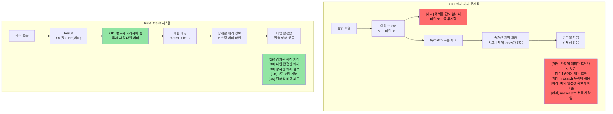
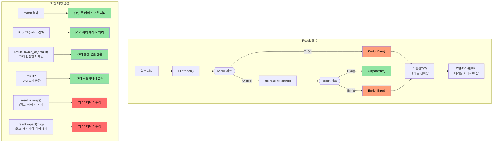

## 열거형을 Option 및 Result에 연결하기

> **학습 내용:** Rust가 null 포인터를 `Option<T>`로, 예외(exceptions)를 `Result<T, E>`로 어떻게 대체하는지, 그리고 `?` 연산자가 에러 전파를 어떻게 간결하게 만드는지 배웁니다. 이것은 Rust의 가장 독특한 패턴입니다 — 에러는 숨겨진 제어 흐름이 아니라 값(value)입니다.

- 앞서 배운 `enum` 타입을 기억하시나요? Rust의 `Option`과 `Result`는 단순히 표준 라이브러리에 정의된 열거형일 뿐입니다.
```rust
// std에 정의된 Option의 실제 모습:
enum Option<T> {
    Some(T),  // 값을 포함함
    None,     // 값이 없음
}

// 그리고 Result:
enum Result<T, E> {
    Ok(T),    // 성공 및 결과 값
    Err(E),   // 에러 및 세부 정보
}
```
- 즉, `match`를 사용한 패턴 매칭에 대해 배운 모든 내용이 `Option`과 `Result`에 그대로 적용됩니다.
- Rust에는 **null 포인터가 없습니다**. `Option<T>`가 그 역할을 대신하며, 컴파일러는 여러분이 `None` 케이스를 처리하도록 강제합니다.

### C++ 비교: 예외 vs Result
| **C++ 패턴** | **Rust 대응 개념** | **장점** |
|----------------|--------------------|--------------|
| `throw std::runtime_error(msg)` | `Err(MyError::Runtime(msg))` | 반환 타입에 에러가 명시됨 — 처리를 잊을 수 없음 |
| `try { } catch (...) { }` | `match result { Ok(v) => ..., Err(e) => ... }` | 숨겨진 제어 흐름이 없음 |
| `std::optional<T>` | `Option<T>` | 철저한 매칭이 요구됨 — None 처리를 잊을 수 없음 |
| `noexcept` 주석 | 기본값 — 모든 Rust 함수는 "noexcept"임 | 예외 자체가 존재하지 않음 |
| `errno` / 반환 코드 | `Result<T, E>` | 타입 안전하며 무시할 수 없음 |

# Rust Option 타입
- Rust ```Option``` 타입은 ```Some<T>```와 ```None```이라는 두 가지 변형만 가진 ```열거형(enum)```입니다.
    - 이는 ```nullable``` 타입을 나타내며, 해당 타입의 유효한 값(```Some<T>```)을 포함하거나 유효한 값이 없음(```None```)을 나타냅니다.
    - ```Option``` 타입은 작업 결과가 성공하여 유효한 값을 반환하거나 실패하지만 구체적인 에러 이유는 중요하지 않은 API에서 사용됩니다. 예를 들어, 문자열에서 정수 값을 찾는 경우를 생각해 보세요.
```rust
fn main() {
    // Option<usize>를 반환합니다.
    let a = "1234".find("1");
    match a {
        Some(a) => println!("인덱스 {a}에서 1을 찾았습니다."),
        None => println!("1을 찾을 수 없습니다.")
    }
}
```

# Rust Option 타입
- Rust ```Option```은 다양한 방식으로 처리될 수 있습니다.
    - ```unwrap()```은 ```Option<T>```가 ```None```일 경우 패닉을 일으키고, 그렇지 않으면 ```T```를 반환합니다. 가장 권장되지 않는 방식입니다.
    - ```or()```는 대체 값을 반환하는 데 사용될 수 있습니다.
    - ```if let```을 사용하면 ```Some<T>```인 경우를 테스트할 수 있습니다.

> **실무 패턴**: 실제 운영되는 Rust 코드의 예시는 [unwrap_or를 이용한 안전한 값 추출](ch17-2-avoiding-unchecked-indexing.md#safe-value-extraction-with-unwrap_or) 및 [함수형 변환: map, map_err, find_map](ch17-2-avoiding-unchecked-indexing.md#functional-transforms-map-map_err-find_map)을 참조하세요.
```rust
fn main() {
  // Option<usize>를 반환합니다.
  let a = "1234".find("1");
  println!("{a:?} {}", a.unwrap());
  let a = "1234".find("5").or(Some(42));
  println!("{a:?}");
  if let Some(a) = "1234".find("1") {
      println!("{a}");
  } else {
    println!("문자열에서 찾을 수 없습니다.");
  }
  // 아래 코드는 패닉을 일으킵니다.
  // "1234".find("5").unwrap();
}
```

# Rust Result 타입
- Result는 ```Option```과 유사하게 ```Ok<T>``` 또는 ```Err<E>``` 두 가지 변형을 가진 ```열거형(enum)``` 타입입니다.
    - ```Result```는 실패할 수 있는 Rust API에서 광범위하게 사용됩니다. 함수가 성공하면 ```Ok<T>```를 반환하고, 실패하면 구체적인 에러인 ```Err<T>```를 반환한다는 개념입니다.
```rust
  use std::num::ParseIntError;
  fn main() {
  let a : Result<i32, ParseIntError>  = "1234z".parse();
  match a {
      Ok(n) => println!("파싱 성공: {n}"),
      Err(e) => println!("파싱 실패: {e:?}"),
  }
  let a : Result<i32, ParseIntError>  = "1234z".parse().or(Ok(-1));
  println!("{a:?}");
  if let Ok(a) = "1234".parse::<i32>() {
    println!("Let OK {a}");  
  }
  // 아래 코드는 패닉을 일으킵니다.
  //"1234z".parse().unwrap();
}
```

## Option과 Result: 동전의 양면

`Option`과 `Result`는 깊게 연관되어 있습니다 — `Option<T>`는 본질적으로 `Result<T, ()>` (에러 정보가 없는 결과)와 같습니다.

| `Option<T>` | `Result<T, E>` | 의미 |
|-------------|---------------|---------|
| `Some(value)` | `Ok(value)` | 성공 — 값이 존재함 |
| `None` | `Err(error)` | 실패 — 값이 없음(Option) 또는 에러 세부 정보(Result) |

**상호 변환:**

```rust
fn main() {
    let opt: Option<i32> = Some(42);
    let res: Result<i32, &str> = opt.ok_or("값이 None입니다");  // Option → Result
    
    let res: Result<i32, &str> = Ok(42);
    let opt: Option<i32> = res.ok();  // Result → Option (에러 정보 버림)
    
    // 두 타입은 많은 메서드를 공유합니다:
    // .map(), .and_then(), .unwrap_or(), .unwrap_or_else(), .is_some()/is_ok()
}
```

> **판단 기준**: 부재(absence)가 정상적인 상황일 때는 `Option`을 사용하세요 (예: 키 찾기). 실패에 대한 설명이 필요할 때는 `Result`를 사용하세요 (예: 파일 I/O, 파싱).

# 연습 문제: Option을 사용한 log() 함수 구현

🟢 **초급**

- ```Option<&str>``` 매개변수를 받는 ```log()``` 함수를 구현하세요. 매개변수가 ```None```이면 기본 문자열을 출력해야 합니다.
- 함수는 성공과 에러 모두에 대해 ```()```를 사용하는 ```Result```를 반환해야 합니다 (이 경우에는 에러가 발생하지 않습니다).

<details><summary>풀이 (클릭하여 확장)</summary>

```rust
fn log(message: Option<&str>) -> Result<(), ()> {
    match message {
        Some(msg) => println!("LOG: {msg}"),
        None => println!("LOG: (제공된 메시지 없음)"),
    }
    Ok(())
}

fn main() {
    let _ = log(Some("시스템 초기화됨"));
    let _ = log(None);
    
    // unwrap_or를 사용한 대안:
    let msg: Option<&str> = None;
    println!("LOG: {}", msg.unwrap_or("(기본 메시지)"));
}
// 출력:
// LOG: 시스템 초기화됨
// LOG: (제공된 메시지 없음)
// LOG: (기본 메시지)
```

</details>

----
# Rust 에러 처리
 - Rust 에러는 복구 불가능한 것(치명적)과 복구 가능한 것으로 나뉩니다. 치명적인 에러는 ```패닉(panic)```을 일으킵니다.
    - 일반적으로 ```패닉```을 일으키는 상황은 피해야 합니다. ```패닉```은 인덱스 범위 초과, ```None```인 ```Option```에 대해 ```unwrap()``` 호출 등 프로그램의 버그로 인해 발생합니다.
    - 절대 일어나지 않아야 할 조건에 대해 명시적으로 ```패닉```을 발생시키는 것은 괜찮습니다. ```panic!```이나 ```assert!``` 매크로는 무결성 체크(sanity checks)를 위해 사용될 수 있습니다.
```rust
fn main() {
   let x : Option<u32> = None;
   // println!("{x}", x.unwrap()); // 패닉 발생
   println!("{}", x.unwrap_or(0));  // OK -- 0 출력
   let x = 41;
   //assert!(x == 42); // 패닉 발생
   //panic!("무언가 잘못되었습니다"); // 무조건 패닉 발생
   let _a = vec![0, 1];
   // println!("{}", a[2]); // 범위 초과 패닉; Option<T>를 반환하는 a.get(2)를 사용하세요.
}
```

## 에러 처리: C++ vs Rust

### C++ 예외 기반 에러 처리의 문제점

```cpp
// C++ 에러 처리 - 예외는 숨겨진 제어 흐름을 만듭니다.
#include <fstream>
#include <stdexcept>

std::string read_config(const std::string& path) {
    std::ifstream file(path);
    if (!file.is_open()) {
        throw std::runtime_error("열 수 없음: " + path);
    }
    std::string content;
    // 만약 getline이 예외를 던진다면? 파일이 제대로 닫힐까요?
    // RAII를 쓰면 그렇겠지만, 다른 리소스들은 어떨까요?
    std::getline(file, content);
    return content;  // 호출자가 try/catch를 하지 않는다면?
}

int main() {
    // 에러: try/catch로 감싸는 것을 잊었습니다!
    auto config = read_config("nonexistent.txt");
    // 예외가 조용히 전파되어 프로그램이 충돌합니다.
    // 함수 시그니처만 봐서는 경고를 얻을 수 없습니다.
    return 0;
}
```



### `Result<T, E>` 시각화

```rust
// Rust 에러 처리 - 포괄적이고 강제적임
use std::fs::File;
use std::io::Read;

fn read_file_content(filename: &str) -> Result<String, std::io::Error> {
    let mut file = File::open(filename)?;  // ?는 자동으로 에러를 전파함
    let mut contents = String::new();
    file.read_to_string(&mut contents)?;
    Ok(contents)  // 성공 케이스
}

fn main() {
    match read_file_content("example.txt") {
        Ok(content) => println!("파일 내용: {}", content),
        Err(error) => println!("파일 읽기 실패: {}", error),
        // 컴파일러가 두 케이스를 모두 처리하도록 강제합니다!
    }
}
```



# Rust 에러 처리
- Rust는 복구 가능한 에러 처리를 위해 ```enum Result<T, E>``` 열거형을 사용합니다.
    - ```Ok<T>``` 변형은 성공 시의 결과를 포함하고, ```Err<E>```는 에러 정보를 포함합니다.
```rust
fn main() {
    let x = "1234x".parse::<u32>();
    match x {
        Ok(x) => println!("파싱된 숫자: {x}"),
        Err(e) => println!("파싱 에러: {e:?}"),
    }
    let x  = "1234".parse::<u32>();
    // 위와 같지만 유효한 숫자인 경우
    if let Ok(x) = &x {
        println!("파싱된 숫자: {x}")
    } else if let Err(e) = &x {
        println!("에러: {e:?}");
    }
}
```

# Rust 에러 처리
- try-연산자 ```?```는 ```match``` ```Ok``` / ```Err``` 패턴에 대한 편리한 단축어입니다.
    - ```?```를 사용하려면 해당 메서드가 ```Result<T, E>```를 반환해야 합니다.
    - ```Result<T, E>```의 타입은 변경될 수 있습니다. 아래 예시에서는 ```str::parse()```가 반환하는 것과 동일한 에러 타입(```std::num::ParseIntError```)을 반환합니다.
```rust
fn double_string_number(s : &str) -> Result<u32, std::num::ParseIntError> {
   let x = s.parse::<u32>()?; // 에러 발생 시 즉시 반환됩니다.
   Ok(x*2)
}
fn main() {
    let result = double_string_number("1234");
    println!("{result:?}");
    let result = double_string_number("1234x");
    println!("{result:?}");
}
```

# Rust 에러 처리
- 에러를 다른 타입으로 매핑하거나 기본값으로 매핑할 수 있습니다 (https://doc.rust-lang.org/std/result/enum.Result.html#method.unwrap_or_default 참조).
```rust
// 에러 발생 시 에러 타입을 ()로 변경합니다.
fn double_string_number(s : &str) -> Result<u32, ()> {
   let x = s.parse::<u32>().map_err(|_|())?; // 에러 발생 시 즉시 반환됩니다.
   Ok(x*2)
}
```
```rust
fn double_string_number(s : &str) -> Result<u32, ()> {
   let x = s.parse::<u32>().unwrap_or_default(); // 파싱 에러 시 기본값 0을 사용합니다.
   Ok(x*2)
}
```
```rust
fn double_optional_number(x : Option<u32>) -> Result<u32, ()> {
    // 아래에서 ok_or는 Option<None>을 Result<u32, ()>로 변환합니다.
    x.ok_or(()).map(|x|x*2) // .map()은 Ok(u32)인 경우에만 적용됩니다.
}
```

# 연습 문제: 에러 처리

🟡 **중급**
- 하나의 u32 매개변수를 가진 ```log()``` 함수를 구현하세요. 매개변수가 42가 아니면 에러를 반환합니다. 성공과 에러 타입 모두 ```Result<(), ()>```를 사용합니다.
- ```log()```가 에러를 반환하면 동일한 ```Result<>``` 타입으로 종료하는 ```call_log()``` 함수를 작성하세요. 그렇지 않으면 로그가 성공적으로 호출되었다는 메시지를 출력합니다.

```rust
fn log(x: u32) -> ?? {

}

fn call_log(x: u32) -> ?? {
    // log(x)를 호출하고, 에러를 반환하면 즉시 종료합니다.
    println!("로그가 성공적으로 호출되었습니다.");
}

fn main() {
    call_log(42);
    call_log(43);
}
``` 

<details><summary>풀이 (클릭하여 확장)</summary>

```rust
fn log(x: u32) -> Result<(), ()> {
    if x == 42 {
        Ok(())
    } else {
        Err(())
    }
}

fn call_log(x: u32) -> Result<(), ()> {
    log(x)?;  // log()가 에러를 반환하면 즉시 종료합니다.
    println!("로그가 {x}와 함께 성공적으로 호출되었습니다.");
    Ok(())
}

fn main() {
    let _ = call_log(42);  // 출력: 로그가 42와 함께 성공적으로 호출되었습니다.
    let _ = call_log(43);  // Err(())를 반환하며, 아무것도 출력되지 않습니다.
}
// 출력:
// 로그가 42와 함께 성공적으로 호출되었습니다.
```

</details>
