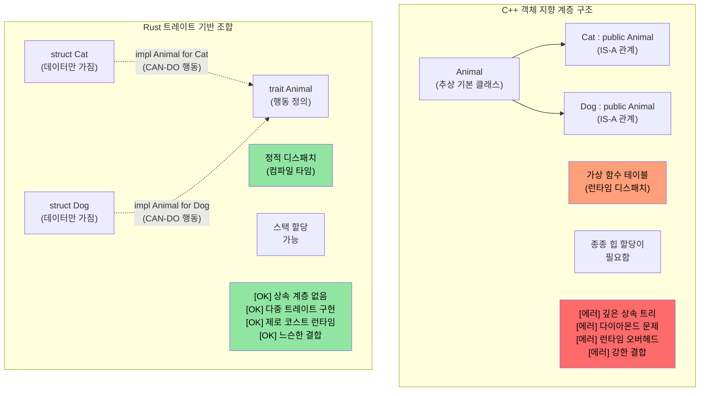
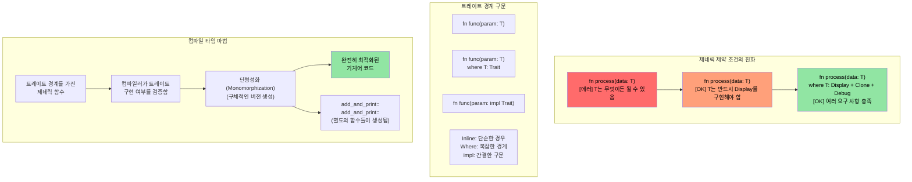

# Rust 트레이트(Traits)

> **학습 내용:** 트레이트 — 인터페이스, 추상 기본 클래스, 그리고 연산자 오버로딩에 대한 Rust의 해답을 배웁니다. 트레이트를 정의하고 타입에 구현하는 방법, 그리고 동적 디스패치(`dyn Trait`)와 정적 디스패치(제네릭)의 차이를 알아봅니다. C++ 개발자에게 트레이트는 가상 함수, CRTP, 컨셉(concepts)을 대체합니다. C 개발자에게 트레이트는 다형성을 구현하는 구조화된 방식입니다.

- Rust 트레이트는 다른 언어의 인터페이스와 유사합니다.
    - 트레이트는 해당 트레이트를 구현하는 타입들이 반드시 정의해야 하는 메서드들을 명시합니다.
```rust
fn main() {
    trait Pet {
        fn speak(&self);
    }
    struct Cat;
    struct Dog;
    impl Pet for Cat {
        fn speak(&self) {
            println!("야옹");
        }
    }
    impl Pet for Dog {
        fn speak(&self) {
            println!("멍멍!")
        }
    }
    let c = Cat{};
    let d = Dog{};
    c.speak();  // Cat과 Dog 사이에는 "is-a" 관계가 없습니다.
    d.speak(); // Cat과 Dog 사이에는 "is-a" 관계가 없습니다.
}
```

## 트레이트 vs C++ 컨셉 및 인터페이스

### 전통적인 C++ 상속 vs Rust 트레이트

```cpp
// C++ - 상속 기반 다형성
class Animal {
public:
    virtual void speak() = 0;  // 순수 가상 함수
    virtual ~Animal() = default;
};

class Cat : public Animal {  // "Cat은 Animal이다 (IS-A)"
public:
    void speak() override {
        std::cout << "Meow" << std::endl;
    }
};

void make_sound(Animal* animal) {  // 런타임 다형성
    animal->speak();  // 가상 함수 호출
}
```

```rust
// Rust - 트레이트를 이용한 상속보다 조합(Composition) 선호
trait Animal {
    fn speak(&self);
}

struct Cat;  // Cat은 Animal이 아니지만, Animal 행동을 구현(IMPLEMENTS)함

impl Animal for Cat {  // "Cat은 Animal 행동을 할 수 있다 (CAN-DO)"
    fn speak(&self) {
        println!("야옹");
    }
}

fn make_sound<T: Animal>(animal: &T) {  // 정적 다형성
    animal.speak();  // 직접 함수 호출 (제로 코스트)
}
```



### 트레이트 경계(Trait Bounds) 및 제네릭 제약 조건

```rust
use std::fmt::Display;
use std::ops::Add;

// C++ 템플릿 대응 개념 (제약이 적음)
// template<typename T>
// T add_and_print(T a, T b) {
//     // T가 +나 출력을 지원한다는 보장이 없음
//     return a + b;  // 컴파일 타임에 실패할 수 있음
// }

// Rust - 명시적인 트레이트 경계
fn add_and_print<T>(a: T, b: T) -> T 
where 
    T: Display + Add<Output = T> + Copy,
{
    println!("더하기: {} + {}", a, b);  // Display 트레이트
    a + b  // Add 트레이트
}
```



### C++ 연산자 오버로딩 → Rust `std::ops` 트레이트

C++에서는 특수한 이름의 함수(`operator+`, `operator<<`, `operator[]` 등)를 작성하여 연산자를 오버로딩합니다. Rust에서는 모든 연산자가 `std::ops` (출력의 경우 `std::fmt`)의 트레이트와 매핑됩니다. 마법 같은 이름의 함수를 만드는 대신 **트레이트를 구현**합니다.

#### 비교 예시: `+` 연산자

```cpp
// C++: 멤버 함수 또는 전역 함수로 연산자 오버로딩
struct Vec2 {
    double x, y;
    Vec2 operator+(const Vec2& rhs) const {
        return {x + rhs.x, y + rhs.y};
    }
};

Vec2 a{1.0, 2.0}, b{3.0, 4.0};
Vec2 c = a + b;  // a.operator+(b) 호출
```

```rust
use std::ops::Add;

#[derive(Debug, Clone, Copy)]
struct Vec2 { x: f64, y: f64 }

impl Add for Vec2 {
    type Output = Vec2;                     // 연관 타입 — +의 결과 타입
    fn add(self, rhs: Vec2) -> Vec2 {
        Vec2 { x: self.x + rhs.x, y: self.y + rhs.y }
    }
}

let a = Vec2 { x: 1.0, y: 2.0 };
let b = Vec2 { x: 3.0, y: 4.0 };
let c = a + b;  // <Vec2 as Add>::add(a, b) 호출
println!("{c:?}"); // Vec2 { x: 4.0, y: 6.0 }
```

#### C++와의 주요 차이점

| 관점 | C++ | Rust |
|--------|-----|------|
| **메커니즘** | 마법 같은 함수 이름 (`operator+`) | 트레이트 구현 (`impl Add for T`) |
| **발견 방법** | `operator+`를 검색하거나 헤더 확인 | 트레이트 구현 확인 — IDE 지원 우수 |
| **반환 타입** | 자유롭게 선택 가능 | `Output` 연관 타입에 의해 고정됨 |
| **수신자** | 보통 `const T&`를 받음 (빌림) | 기본적으로 `self`를 값으로 받음 (이동!) |
| **대칭성** | `impl operator+(int, Vec2)` 작성 가능 | `impl Add<Vec2> for i32` 추가 필요 (고아 규칙 적용) |
| **출력용 `<<`** | `operator<<(ostream&, T)` — 모든 스트림에 대해 오버로딩 | `impl fmt::Display for T` — 하나의 표준 `to_string` 표현 |

#### 값에 의한 `self` 주의 사항

Rust에서 `Add::add(self, rhs)`는 `self`를 **값으로** 받습니다. `Copy` 타입(위의 `Vec2`처럼 `Copy`를 파생시킨 경우)은 컴파일러가 복사하므로 괜찮습니다. 하지만 `Copy`가 아닌 타입의 경우, `+` 연산은 피연산자를 **소비**합니다:

```rust
let s1 = String::from("hello ");
let s2 = String::from("world");
let s3 = s1 + &s2;  // s1이 s3로 이동(MOVE)되었습니다!
// println!("{s1}");  // ❌ 컴파일 에러: 이동된 후 사용된 값
println!("{s2}");     // ✅ s2는 빌려주기만 함 (&s2)
```

이것이 `String + &str`은 작동하지만 `&str + &str`은 작동하지 않는 이유입니다 — `Add`는 `String + &str`에 대해서만 구현되어 있어, 왼쪽의 `String`을 소비하여 그 버퍼를 재사용합니다. 이는 C++에는 없는 방식입니다. `std::string::operator+`는 항상 새로운 문자열을 생성합니다.

#### 전체 매핑: C++ 연산자 → Rust 트레이트

| C++ 연산자 | Rust 트레이트 | 비고 |
|-------------|-----------|-------|
| `operator+` | `std::ops::Add` | `Output` 연관 타입 |
| `operator-` | `std::ops::Sub` | |
| `operator*` | `std::ops::Mul` | 포인터 역참조가 아님 — 그것은 `Deref`임 |
| `operator/` | `std::ops::Div` | |
| `operator%` | `std::ops::Rem` | |
| `operator-` (단항) | `std::ops::Neg` | |
| `operator!` / `operator~` | `std::ops::Not` | Rust는 논리 및 비트 NOT 모두에 `!` 사용 (`~` 연산자 없음) |
| `operator&`, `\|`, `^` | `BitAnd`, `BitOr`, `BitXor` | |
| `operator<<`, `>>` (쉬프트) | `Shl`, `Shr` | 스트림 I/O가 아님! |
| `operator+=` | `std::ops::AddAssign` | `self`가 아닌 `&mut self`를 받음 |
| `operator[]` | `std::ops::Index` / `IndexMut` | `&Output` / `&mut Output` 반환 |
| `operator()` | `Fn` / `FnMut` / `FnOnce` | 클로저가 이를 구현함; 직접 구현 불가 |
| `operator==` | `PartialEq` (+ `Eq`) | `std::ops`가 아닌 `std::cmp`에 있음 |
| `operator<` | `PartialOrd` (+ `Ord`) | `std::cmp`에 있음 |
| `operator<<` (스트림) | `fmt::Display` | `println!("{}", x)` |
| `operator<<` (디버그) | `fmt::Debug` | `println!("{:?}", x)` |
| `operator bool` | 직접적인 대응 없음 | `impl From<T> for bool` 또는 `.is_empty()` 같은 명명된 메서드 사용 |
| `operator T()` (암시적 변환) | 암시적 변환 없음 | `From`/`Into` 트레이트 사용 (명시적) |

#### 안전 가드레일: Rust가 방지하는 것

1. **암시적 변환 없음**: C++의 `operator int()`는 조용하고 놀라운 형변환을 일으킬 수 있습니다. Rust에는 암시적 변환 연산자가 없습니다 — `From`/`Into`를 사용하고 명시적으로 `.into()`를 호출해야 합니다.
2. **`&&` / `||` 오버로딩 불가**: C++는 허용하지만(단락 평가 의미론을 깨뜨림!), Rust는 허용하지 않습니다.
3. **`=` 오버로딩 불가**: 대입은 항상 이동 또는 복사이며, 결코 사용자 정의될 수 없습니다. 복합 대입(`+=` 등)은 `AddAssign` 등을 통해 오버로딩이 가능합니다.
4. **`,` 오버로딩 불가**: C++는 악명 높은 `operator,()`를 허용하지만, Rust는 허용하지 않습니다.
5. **`&` (주소값) 오버로딩 불가**: 또 다른 C++의 위험 요소입니다 (`std::addressof`가 이를 우회하기 위해 존재함). Rust의 `&`는 항상 "빌림"을 의미합니다.
6. **고아 규칙(Coherence rules)**: `Add<외부타입>`은 여러분의 타입에 대해서만 구현하거나, 외부 타입에 대해 여러분의 `Add<여러분의타입>`을 구현할 수 있습니다. `외부타입`에 대해 `Add<외부타입>`을 구현하는 것은 절대 불가능합니다. 이는 크레이트 간의 연산자 정의 충돌을 방지합니다.

> **핵심**: C++에서 연산자 오버로딩은 강력하지만 통제되지 않습니다 — 콤마나 주소값 연산자를 포함해 거의 모든 것을 오버로딩할 수 있고 암시적 변환이 조용히 일어날 수 있습니다. Rust는 트레이트를 통해 산술 및 비교 연산자에 대해 동일한 표현력을 제공하면서도, **역사적으로 위험했던 오버로딩들을 차단**하고 모든 변환이 명시적으로 이루어지도록 강제합니다.

----
# Rust 트레이트
- Rust는 이 예제와 같이 u32와 같은 내장 타입에 대해서도 사용자 정의 트레이트를 구현하는 것을 허용합니다. 하지만 트레이트나 타입 중 하나는 반드시 해당 크레이트에 속해야 합니다.
```rust
trait IsSecret {
  fn is_secret(&self);
}
// IsSecret 트레이트가 이 크레이트에 속하므로 구현이 가능합니다.
impl IsSecret for u32 {
  fn is_secret(&self) {
      if *self == 42 {
          println!("생명의 비밀입니다");
      }
  }
}

fn main() {
  42u32.is_secret();
  43u32.is_secret();
}
```


# Rust 트레이트
- 트레이트는 인터페이스 상속과 기본 구현을 지원합니다.
```rust
trait Animal {
  // 기본 구현
  fn is_mammal(&self) -> bool {
    true
  }
}
trait Feline : Animal {
  // 기본 구현
  fn is_feline(&self) -> bool {
    true
  }
}

struct Cat;
// 기본 구현을 사용합니다. 상위 트레이트(supertrait)인 Animal도 개별적으로 구현해야 함에 유의하세요.
impl Feline for Cat {}
impl Animal for Cat {}
fn main() {
  let c = Cat{};
  println!("{} {}", c.is_mammal(), c.is_feline());
}
```
----
# 연습 문제: Logger 트레이트 구현

🟡 **중급**

- u64를 인자로 받는 log()라는 단일 메서드를 가진 ```Log 트레이트```를 구현하세요.
    - ```Log 트레이트```를 구현하는 두 가지 다른 로거인 ```SimpleLogger```와 ```ComplexLogger```를 구현하세요. 하나는 "Simple logger"와 함께 ```u64``` 값을 출력하고, 다른 하나는 "Complex logger"와 함께 ```u64``` 값을 출력해야 합니다.

<details><summary>풀이 (클릭하여 확장)</summary>

```rust
trait Log {
    fn log(&self, value: u64);
}

struct SimpleLogger;
struct ComplexLogger;

impl Log for SimpleLogger {
    fn log(&self, value: u64) {
        println!("Simple logger: {value}");
    }
}

impl Log for ComplexLogger {
    fn log(&self, value: u64) {
        println!("Complex logger: {value} (16진수: 0x{value:x}, 2진수: {value:b})");
    }
}

fn main() {
    let simple = SimpleLogger;
    let complex = ComplexLogger;
    simple.log(42);
    complex.log(42);
}
// 출력:
// Simple logger: 42
// Complex logger: 42 (16진수: 0x2a, 2진수: 101010)
```

</details>

----
# Rust 트레이트 연관 타입(Associated types)
```rust
#[derive(Debug)]
struct Small(u32);
#[derive(Debug)]
struct Big(u32);
trait Double {
    type T;
    fn double(&self) -> Self::T;
}

impl Double for Small {
    type T = Big;
    fn double(&self) -> Self::T {
        Big(self.0 * 2)
    }
}
fn main() {
    let a = Small(42);
    println!("{:?}", a.double());
}
```

# Rust trait impl
- ```impl``` 키워드를 트레이트와 함께 사용하여 특정 트레이트를 구현하는 모든 타입을 인자로 받을 수 있습니다.
```rust
trait Pet {
    fn speak(&self);
}
struct Dog {}
struct Cat {}
impl Pet for Dog {
    fn speak(&self) {println!("멍멍!")}
}
impl Pet for Cat {
    fn speak(&self) {println!("야옹")}
}
fn pet_speak(p: &impl Pet) {
    p.speak();
}
fn main() {
    let c = Cat {};
    let d = Dog {};
    pet_speak(&c);
    pet_speak(&d);
}
```

# Rust trait impl
- ```impl```은 반환 값에서도 사용될 수 있습니다.
```rust
trait Pet {}
struct Dog;
struct Cat;
impl Pet for Cat {}
impl Pet for Dog {}
fn cat_as_pet() -> impl Pet {
    let c = Cat {};
    c
}
fn dog_as_pet() -> impl Pet {
    let d = Dog {};
    d
}
fn main() {
    let p = cat_as_pet();
    let d = dog_as_pet();
}
```
----
# Rust 동적 트레이트(Dynamic traits)
- 동적 트레이트는 실제 타입을 알지 못해도 트레이트 기능을 호출하는 데 사용될 수 있습니다. 이를 ```타입 지우기(type erasure)```라고 합니다.
```rust
trait Pet {
    fn speak(&self);
}
struct Dog {}
struct Cat {x: u32}
impl Pet for Dog {
    fn speak(&self) {println!("멍멍!")}
}
impl Pet for Cat {
    fn speak(&self) {println!("야옹")}
}
fn pet_speak(p: &dyn Pet) {
    p.speak();
}
fn main() {
    let c = Cat {x: 42};
    let d = Dog {};
    pet_speak(&c);
    pet_speak(&d);
}
```
----

## `impl Trait`, `dyn Trait`, 그리고 열거형 중 선택하기

이 세 가지 접근 방식은 모두 다형성을 구현하지만 서로 다른 트레이드오프가 있습니다:

| 방식 | 디스패치 | 성능 | 서로 다른 타입의 컬렉션 가능 여부 | 사용 시기 |
|----------|----------|-------------|---------------------------|-------------|
| `impl Trait` / 제네릭 | 정적 (단형성화) | 제로 코스트 — 컴파일 타임 인라이닝 | 아니요 — 각 슬롯은 하나의 구체적 타입만 가짐 | 기본 선택지. 함수 인자, 반환 타입 |
| `dyn Trait` | 동적 (vtable) | 호출당 적은 오버헤드 (~1 포인터 간접 참조) | 예 — `Vec<Box<dyn Trait>>` | 컬렉션에 섞인 타입이 필요하거나 플러그인 방식의 확장이 필요할 때 |
| `enum` (열거형) | 매치(Match) | 제로 코스트 — 컴파일 타임에 변형을 알고 있음 | 예 — 하지만 알려진 변형들만 가능 | 변형의 집합이 **닫혀 있고** 컴파일 타임에 알 수 있을 때 |

```rust
trait Shape {
    fn area(&self) -> f64;
}
struct Circle { radius: f64 }
struct Rect { w: f64, h: f64 }
impl Shape for Circle { fn area(&self) -> f64 { std::f64::consts::PI * self.radius * self.radius } }
impl Shape for Rect   { fn area(&self) -> f64 { self.w * self.h } }

// 정적 디스패치 — 컴파일러가 각 타입에 대해 별도의 코드를 생성함
fn print_area(s: &impl Shape) { println!("{}", s.area()); }

// 동적 디스패치 — 하나의 함수가 포인터 뒤의 모든 Shape에 대해 작동함
fn print_area_dyn(s: &dyn Shape) { println!("{}", s.area()); }

// 열거형 — 닫힌 집합, 트레이트가 필요 없음
enum ShapeEnum { Circle(f64), Rect(f64, f64) }
impl ShapeEnum {
    fn area(&self) -> f64 {
        match self {
            ShapeEnum::Circle(r) => std::f64::consts::PI * r * r,
            ShapeEnum::Rect(w, h) => w * h,
        }
    }
}
```

> **C++ 개발자에게:** `impl Trait`은 C++ 템플릿과 같습니다 (단형성화, 제로 코스트). `dyn Trait`은 C++ 가상 함수와 같습니다 (vtable 디스패치). Rust 열거형과 `match`는 `std::variant`와 `std::visit`의 조합과 같지만, 철저한 매칭이 컴파일러에 의해 강제됩니다.

> **판단 기준**: `impl Trait`(정적 디스패치)으로 시작하세요. 서로 다른 타입이 섞인 컬렉션이 필요하거나 컴파일 타임에 구체적인 타입을 알 수 없는 경우에만 `dyn Trait`을 사용하세요. 모든 변형을 직접 소유하고 있다면 `enum`을 사용하세요.
