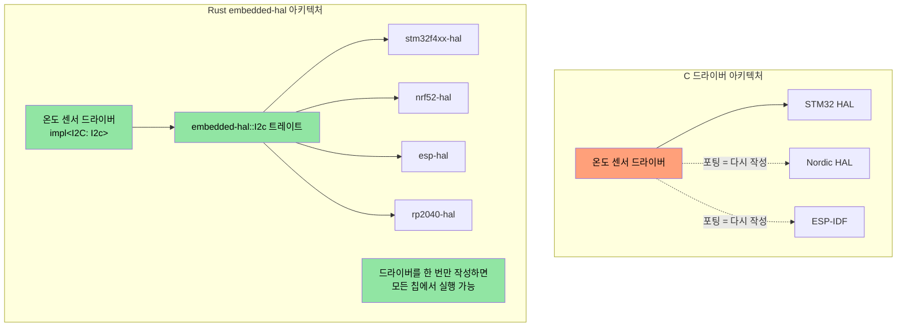
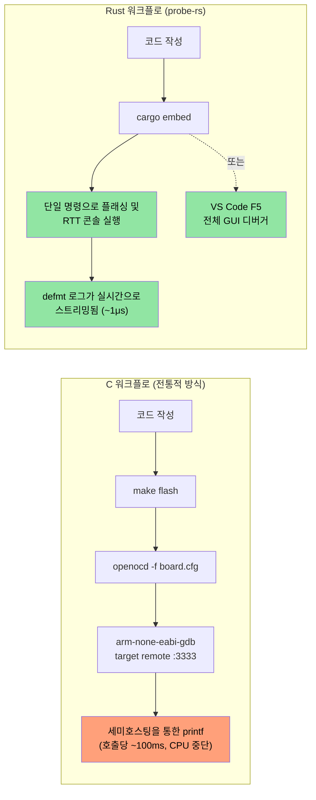

## MMIO 및 Volatile 레지스터 접근

> **학습 내용:** 임베디드 Rust에서의 타입 안전한 하드웨어 레지스터 접근 — 휘발성(volatile) MMIO 패턴, 레지스터 추상화 크레이트, 그리고 C의 `volatile` 키워드가 할 수 없는 레지스터 권한 인코딩을 Rust의 타입 시스템으로 구현하는 방법을 배웁니다.

C 펌웨어에서는 특정 메모리 주소에 대한 `volatile` 포인터를 통해 하드웨어 레지스터에 접근합니다. Rust도 동일한 메커니즘을 제공하지만, 타입 안전성이 추가되었습니다.

### C volatile 대 Rust volatile

```c
// C — 일반적인 MMIO 레지스터 접근
#define GPIO_BASE     0x40020000
#define GPIO_MODER    (*(volatile uint32_t*)(GPIO_BASE + 0x00))
#define GPIO_ODR      (*(volatile uint32_t*)(GPIO_BASE + 0x14))

void toggle_led(void) {
    GPIO_ODR ^= (1 << 5);  // 5번 핀 토글
}
```

```rust
// Rust — 원시 휘발성 접근 (저수준, 직접 사용되는 경우는 드묾)
use core::ptr;

const GPIO_BASE: usize = 0x4002_0000;
const GPIO_ODR: *mut u32 = (GPIO_BASE + 0x14) as *mut u32;

/// # Safety
/// 호출자는 GPIO_BASE가 유효한 매핑된 주변장치 주소임을 보장해야 합니다.
unsafe fn toggle_led() {
    // SAFETY: GPIO_ODR은 유효한 메모리 매핑 레지스터 주소입니다.
    let current = unsafe { ptr::read_volatile(GPIO_ODR) };
    unsafe { ptr::write_volatile(GPIO_ODR, current ^ (1 << 5)) };
}
```

### svd2rust — 타입 안전한 레지스터 접근 (Rust 방식)

실무에서는 원시 휘발성 포인터를 **직접 작성하지 않습니다**. 대신, `svd2rust`가 칩의 SVD 파일(IDE의 디버그 뷰에서 사용하는 것과 동일한 XML 파일)로부터 **주변장치 접근 크레이트(PAC, Peripheral Access Crate)**를 생성합니다.

```rust
// 생성된 PAC 코드 (여러분이 작성하는 것이 아니라 svd2rust가 생성함)
// PAC는 유효하지 않은 레지스터 접근을 컴파일 에러로 처리합니다.

// PAC 사용 예시:
use stm32f4::stm32f401;  // 사용 중인 칩의 PAC 크레이트

fn configure_gpio(dp: stm32f401::Peripherals) {
    // GPIOA 클록 활성화 — 타입 안전하며 매직 넘버가 없음
    dp.RCC.ahb1enr.modify(|_, w| w.gpioaen().enabled());

    // 5번 핀을 출력으로 설정 — 읽기 전용 필드에 실수로 쓰는 것이 불가능함
    dp.GPIOA.moder.modify(|_, w| w.moder5().output());

    // 5번 핀 토글 — 타입 체크가 이루어지는 필드 접근
    dp.GPIOA.odr.modify(|r, w| {
        // SAFETY: 유효한 레지스터 필드의 단일 비트를 토글함.
        unsafe { w.bits(r.bits() ^ (1 << 5)) }
    });
}
```

| C 레지스터 접근 | Rust PAC 대응 방식 |
|-------------------|---------------------|
| `#define REG (*(volatile uint32_t*)ADDR)` | `svd2rust`로 생성된 PAC 크레이트 사용 |
| `REG |= BITMASK;` | `periph.reg.modify(\|_, w\| w.field().variant())` |
| `value = REG;` | `let val = periph.reg.read().field().bits()` |
| 잘못된 레지스터 필드 → 조용한 UB | 컴파일 에러 — 필드가 존재하지 않음 |
| 잘못된 레지스터 너비 → 조용한 UB | 타입 체크 수행 — u8 vs u16 vs u32 |

## 인터럽트 처리 및 임계 영역(Critical Sections)

C 펌웨어는 `__disable_irq()` / `__enable_irq()` 및 `void` 시그니처를 가진 ISR 함수를 사용합니다. Rust는 이에 대한 타입 안전한 대응 기능을 제공합니다.

### C 대 Rust 인터럽트 패턴

```c
// C — 전통적인 인터럽트 핸들러
volatile uint32_t tick_count = 0;

void SysTick_Handler(void) {   // 명명 규칙이 매우 중요함 — 틀리면 HardFault 발생
    tick_count++;
}

uint32_t get_ticks(void) {
    __disable_irq();
    uint32_t t = tick_count;   // 임계 영역 내부에서 읽기
    __enable_irq();
    return t;
}
```

```rust
// Rust — cortex-m 및 임계 영역 사용
use core::cell::Cell;
use cortex_m::interrupt::{self, Mutex};

// 임계 영역 Mutex로 보호되는 공유 상태
static TICK_COUNT: Mutex<Cell<u32>> = Mutex::new(Cell::new(0));

#[cortex_m_rt::exception]     // 속성이 올바른 벡터 테이블 배치를 보장함
fn SysTick() {                // 이름이 유효한 예외와 일치하지 않으면 컴파일 에러
    interrupt::free(|cs| {    // cs = 임계 영역 토큰 (IRQ가 비활성화되었음을 증명)
        let count = TICK_COUNT.borrow(cs).get();
        TICK_COUNT.borrow(cs).set(count + 1);
    });
}

fn get_ticks() -> u32 {
    interrupt::free(|cs| TICK_COUNT.borrow(cs).get())
}
```

### RTIC — 실시간 인터럽트 기반 동시성

여러 인터럽트 우선순위가 있는 복잡한 펌웨어의 경우, RTIC(Real-Time Interrupt-driven Concurrency)는 **제로 오버헤드 컴파일 타임 작업 스케줄링**을 제공합니다.

```rust
#[rtic::app(device = stm32f4xx_hal::pac, dispatchers = [USART1])]
mod app {
    use stm32f4xx_hal::prelude::*;

    #[shared]
    struct Shared {
        temperature: f32,   // 작업 간에 공유됨 — RTIC가 잠금을 관리함
    }

    #[local]
    struct Local {
        led: stm32f4xx_hal::gpio::Pin<'A', 5, stm32f4xx_hal::gpio::Output>,
    }

    #[init]
    fn init(cx: init::Context) -> (Shared, Local) {
        let dp = cx.device;
        let gpioa = dp.GPIOA.split();
        let led = gpioa.pa5.into_push_pull_output();
        (Shared { temperature: 25.0 }, Local { led })
    }

    // 하드웨어 작업: SysTick 인터럽트에서 실행됨
    #[task(binds = SysTick, shared = [temperature], local = [led])]
    fn tick(mut cx: tick::Context) {
        cx.local.led.toggle();
        cx.shared.temperature.lock(|temp| {
            // RTIC가 여기서 독점적 접근을 보장함 — 수동 잠금 불필요
            *temp += 0.1;
        });
    }
}
```

**C 펌웨어 개발자에게 RTIC가 중요한 이유:**
- `#[shared]` 어노테이션이 수동 뮤텍스 관리를 대체합니다.
- 우선순위 기반 선점(preemption)이 컴파일 타임에 구성되므로 런타임 오버헤드가 없습니다.
- 구조적으로 데드락(deadlock)이 발생하지 않음을 프레임워크가 컴파일 타임에 증명합니다.
- ISR 이름 오류는 런타임 HardFault가 아닌 컴파일 에러로 처리됩니다.

## 패닉 핸들러(Panic Handler) 전략

C에서는 펌웨어에 문제가 생기면 보통 리셋하거나 LED를 깜박입니다. Rust의 패닉 핸들러는 구조화된 제어를 제공합니다.

```rust
// 전략 1: 중단 (디버깅용 — 디버거를 연결하여 상태 검사)
use panic_halt as _;  // 패닉 시 무한 루프

// 전략 2: MCU 리셋
use panic_reset as _;  // 시스템 리셋 트리거

// 전략 3: 프로브를 통한 로깅 (개발용)
use panic_probe as _;  // 디버그 프로브를 통해 패닉 정보 전송 (defmt 사용)

// 전략 4: defmt 로깅 후 중단
use defmt_panic as _;  // ITM/RTT를 통한 풍부한 패닉 메시지 전송

// 전략 5: 커스텀 핸들러 (운영 펌웨어용)
use core::panic::PanicInfo;

#[panic_handler]
fn panic(info: &PanicInfo) -> ! {
    // 1. 추가 손상을 방지하기 위해 인터럽트 비활성화
    cortex_m::interrupt::disable();

    // 2. 패닉 정보를 예약된 RAM 영역에 기록 (리셋 후에도 생존)
    // SAFETY: PANIC_LOG는 링커 스크립트에 정의된 예약된 메모리 영역입니다.
    unsafe {
        let log = 0x2000_0000 as *mut [u8; 256];
        // 잘린 패닉 메시지 기록
        use core::fmt::Write;
        let mut writer = FixedWriter::new(&mut *log);
        let _ = write!(writer, "{}", info);
    }

    // 3. 워치독 리셋 트리거 (또는 에러 LED 깜박임)
    loop {
        cortex_m::asm::wfi();  // 인터럽트 대기 (중단된 동안 저전력 모드)
    }
}
```

## 링커 스크립트 및 메모리 레이아웃

C 펌웨어 개발자는 링커 스크립트를 작성하여 FLASH/RAM 영역을 정의합니다. Rust 임베디드는 `memory.x`를 통해 동일한 개념을 사용합니다.

```ld
/* memory.x — 크레이트 루트에 위치하며 cortex-m-rt에서 사용함 */
MEMORY
{
  /* MCU에 맞게 조정 — 다음은 STM32F401 값임 */
  FLASH : ORIGIN = 0x08000000, LENGTH = 512K
  RAM   : ORIGIN = 0x20000000, LENGTH = 96K
}

/* 선택 사항: 패닉 로그를 위한 공간 예약 (위의 패닉 핸들러 참조) */
_panic_log_start = ORIGIN(RAM);
_panic_log_size  = 256;
```

```toml
# .cargo/config.toml — 타겟 및 링커 플래그 설정
[target.thumbv7em-none-eabihf]
runner = "probe-rs run --chip STM32F401RE"  # 디버그 프로브를 통한 플래싱 및 실행
rustflags = [
    "-C", "link-arg=-Tlink.x",              # cortex-m-rt 링커 스크립트
]

[build]
target = "thumbv7em-none-eabihf"            # 하드웨어 FPU가 있는 Cortex-M4F
```

| C 링커 스크립트 | Rust 대응 방식 |
|-----------------|-----------------|
| `MEMORY { FLASH ..., RAM ... }` | 크레이트 루트의 `memory.x` |
| `__attribute__((section(".data")))` | `#[link_section = ".data"]` |
| Makefile의 `-T linker.ld` | `.cargo/config.toml`의 `-C link-arg=-Tlink.x` |
| `__bss_start__`, `__bss_end__` | `cortex-m-rt`가 자동으로 처리 |
| 시작 어셈블리 (`startup.s`) | `cortex-m-rt`의 `#[entry]` 매크로 |

## `embedded-hal` 드라이버 작성하기

`embedded-hal` 크레이트는 SPI, I2C, GPIO, UART 등에 대한 트레이트를 정의합니다. 이 트레이트를 기반으로 작성된 드라이버는 **모든 MCU**에서 작동합니다. 이는 임베디드 재사용을 위한 Rust의 가장 강력한 기능입니다.

### C 대 Rust: 온도 센서 드라이버

```c
// C — STM32 HAL에 강하게 결합된 드라이버
#include "stm32f4xx_hal.h"

float read_temperature(I2C_HandleTypeDef* hi2c, uint8_t addr) {
    uint8_t buf[2];
    HAL_I2C_Mem_Read(hi2c, addr << 1, 0x00, I2C_MEMADD_SIZE_8BIT,
                     buf, 2, HAL_MAX_DELAY);
    int16_t raw = ((int16_t)buf[0] << 4) | (buf[1] >> 4);
    return raw * 0.0625;
}
// 문제점: 이 드라이버는 STM32 HAL에서만 작동합니다. Nordic으로 포팅하려면 다시 작성해야 합니다.
```

```rust
// Rust — embedded-hal을 구현하는 모든 MCU에서 작동하는 드라이버
use embedded_hal::i2c::I2c;

pub struct Tmp102<I2C> {
    i2c: I2C,
    address: u8,
}

impl<I2C: I2c> Tmp102<I2C> {
    pub fn new(i2c: I2C, address: u8) -> Self {
        Self { i2c, address }
    }

    pub fn read_temperature(&mut self) -> Result<f32, I2C::Error> {
        let mut buf = [0u8; 2];
        self.i2c.write_read(self.address, &[0x00], &mut buf)?;
        let raw = ((buf[0] as i16) << 4) | ((buf[1] as i16) >> 4);
        Ok(raw as f32 * 0.0625)
    }
}

// STM32, Nordic nRF, ESP32, RP2040 등 embedded-hal I2C 구현이 있는 모든 칩에서 작동합니다.
```



## 글로벌 할당자(Global Allocator) 설정

`alloc` 크레이트는 `Vec`, `String`, `Box` 등을 제공하지만, 힙 메모리가 어디서 오는지 Rust에게 알려주어야 합니다. 이는 해당 플랫폼을 위해 `malloc()`을 구현하는 것과 같습니다.

```rust
#![no_std]
extern crate alloc;

use alloc::vec::Vec;
use alloc::string::String;
use embedded_alloc::LlffHeap as Heap;

#[global_allocator]
static HEAP: Heap = Heap::empty();

#[cortex_m_rt::entry]
fn main() -> ! {
    // 메모리 영역으로 할당자 초기화
    // (보통 스택이나 정적 데이터에서 사용하지 않는 RAM의 일부)
    {
        const HEAP_SIZE: usize = 4096;
        static mut HEAP_MEM: [u8; HEAP_SIZE] = [0; HEAP_SIZE];
        // SAFETY: HEAP_MEM은 초기화 중에만, 어떤 할당도 일어나기 전에 접근됩니다.
        unsafe { HEAP.init(HEAP_MEM.as_ptr() as usize, HEAP_SIZE) }
    }

    // 이제 힙 타입을 사용할 수 있습니다!
    let mut log_buffer: Vec<u8> = Vec::with_capacity(256);
    let name: String = String::from("sensor_01");
    // ...

    loop {}
}
```

| C 힙 설정 | Rust 대응 방식 |
|-------------|-----------------|
| `_sbrk()` / 커스텀 `malloc()` | `#[global_allocator]` + `Heap::init()` |
| `configTOTAL_HEAP_SIZE` (FreeRTOS) | `HEAP_SIZE` 상수 |
| `pvPortMalloc()` | `alloc::vec::Vec::new()` — 자동 수행 |
| 힙 고갈 → 정의되지 않은 동작 | `alloc_error_handler` → 제어된 패닉 발생 |

## `no_std` + `std` 혼합 워크스페이스

실제 프로젝트(예: 대규모 Rust 워크스페이스)는 종종 다음과 같이 구성됩니다:
- 하드웨어 이식 가능한 로직을 위한 `no_std` 라이브러리 크레이트
- Linux 애플리케이션 레이어를 위한 `std` 바이너리 크레이트

```text
workspace_root/
├── Cargo.toml              # [workspace] members = [...]
├── protocol/               # no_std — 통신 프로토콜, 파싱
│   ├── Cargo.toml          # default-features 비활성화, no std
│   └── src/lib.rs          # #![no_std]
├── driver/                 # no_std — 하드웨어 추상화
│   ├── Cargo.toml
│   └── src/lib.rs          # #![no_std], embedded-hal 트레이트 사용
├── firmware/               # no_std — MCU 바이너리
│   ├── Cargo.toml          # protocol, driver에 의존
│   └── src/main.rs         # #![no_std] #![no_main]
└── host_tool/              # std — Linux CLI 도구
    ├── Cargo.toml          # protocol에 의존 (동일한 크레이트!)
    └── src/main.rs         # std::fs, std::net 등 사용
```

핵심 패턴: `protocol` 크레이트는 `#![no_std]`를 사용하므로 MCU 펌웨어와 Linux 호스트 도구 **모두**에 대해 컴파일됩니다. 코드 공유가 가능하며 중복이 발생하지 않습니다.

```toml
# protocol/Cargo.toml
[package]
name = "protocol"

[features]
default = []
std = []  # 선택 사항: 호스트용 빌드 시 std 전용 기능 활성화

[dependencies]
serde = { version = "1", default-features = false, features = ["derive"] }
# 참고: default-features = false는 serde의 std 의존성을 제거함
```

```rust
// protocol/src/lib.rs
#![cfg_attr(not(feature = "std"), no_std)]

#[cfg(feature = "std")]
extern crate std;

extern crate alloc;
use alloc::vec::Vec;
use serde::{Serialize, Deserialize};

#[derive(Debug, Serialize, Deserialize)]
pub struct DiagPacket {
    pub sensor_id: u16,
    pub value: i32,
    pub fault_code: u16,
}

// 이 함수는 no_std 및 std 컨텍스트 모두에서 작동합니다.
pub fn parse_packet(data: &[u8]) -> Result<DiagPacket, &'static str> {
    if data.len() < 8 {
        return Err("패킷이 너무 짧음");
    }
    Ok(DiagPacket {
        sensor_id: u16::from_le_bytes([data[0], data[1]]),
        value: i32::from_le_bytes([data[2], data[3], data[4], data[5]]),
        fault_code: u16::from_le_bytes([data[6], data[7]]),
    })
}
```

## 연습 문제: 하드웨어 추상화 계층(HAL) 드라이버

SPI를 통해 통신하는 가상의 LED 컨트롤러를 위한 `no_std` 드라이버를 작성하십시오. 드라이버는 `embedded-hal`을 사용하는 모든 SPI 구현에 대해 제네릭해야 합니다.

**요구 사항:**
1. `LedController<SPI>` 구조체 정의
2. `new()`, `set_brightness(led: u8, brightness: u8)`, `all_off()` 구현
3. SPI 프로토콜: `[led_index, brightness_value]`를 2바이트 트랜잭션으로 전송
4. 모의(mock) SPI 구현을 사용하여 테스트 작성

```rust
// 시작 코드
#![no_std]
use embedded_hal::spi::SpiDevice;

pub struct LedController<SPI> {
    spi: SPI,
    num_leds: u8,
}

// TODO: new(), set_brightness(), all_off() 구현
// TODO: 테스트를 위한 MockSpi 생성
```

<details><summary>풀이 (클릭하여 확장)</summary>

```rust
#![no_std]
use embedded_hal::spi::SpiDevice;

pub struct LedController<SPI> {
    spi: SPI,
    num_leds: u8,
}

impl<SPI: SpiDevice> LedController<SPI> {
    pub fn new(spi: SPI, num_leds: u8) -> Self {
        Self { spi, num_leds }
    }

    pub fn set_brightness(&mut self, led: u8, brightness: u8) -> Result<(), SPI::Error> {
        if led >= self.num_leds {
            return Ok(()); // 범위를 벗어난 LED는 조용히 무시
        }
        self.spi.write(&[led, brightness])
    }

    pub fn all_off(&mut self) -> Result<(), SPI::Error> {
        for led in 0..self.num_leds {
            self.spi.write(&[led, 0])?;
        }
        Ok(())
    }
}

#[cfg(test)]
mod tests {
    use super::*;

    // 모든 트랜잭션을 기록하는 모의 SPI
    struct MockSpi {
        transactions: Vec<Vec<u8>>,
    }

    // 모의 객체를 위한 최소한의 에러 타입
    #[derive(Debug)]
    struct MockError;
    impl embedded_hal::spi::Error for MockError {
        fn kind(&self) -> embedded_hal::spi::ErrorKind {
            embedded_hal::spi::ErrorKind::Other
        }
    }

    impl embedded_hal::spi::ErrorType for MockSpi {
        type Error = MockError;
    }

    impl SpiDevice for MockSpi {
        fn write(&mut self, buf: &[u8]) -> Result<(), Self::Error> {
            self.transactions.push(buf.to_vec());
            Ok(())
        }
        fn read(&mut self, _buf: &mut [u8]) -> Result<(), Self::Error> { Ok(()) }
        fn transfer(&mut self, _r: &mut [u8], _w: &[u8]) -> Result<(), Self::Error> { Ok(()) }
        fn transfer_in_place(&mut self, _buf: &mut [u8]) -> Result<(), Self::Error> { Ok(()) }
        fn transaction(&mut self, _ops: &mut [embedded_hal::spi::Operation<'_, u8>]) -> Result<(), Self::Error> { Ok(()) }
    }

    #[test]
    fn test_set_brightness() {
        let mock = MockSpi { transactions: vec![] };
        let mut ctrl = LedController::new(mock, 4);
        ctrl.set_brightness(2, 128).unwrap();
        assert_eq!(ctrl.spi.transactions, vec![vec![2, 128]]);
    }

    #[test]
    fn test_all_off() {
        let mock = MockSpi { transactions: vec![] };
        let mut ctrl = LedController::new(mock, 3);
        ctrl.all_off().unwrap();
        assert_eq!(ctrl.spi.transactions, vec![
            vec![0, 0], vec![1, 0], vec![2, 0],
        ]);
    }

    #[test]
    fn test_out_of_range_led() {
        let mock = MockSpi { transactions: vec![] };
        let mut ctrl = LedController::new(mock, 2);
        ctrl.set_brightness(5, 255).unwrap(); // 범위를 벗어남 — 무시됨
        assert!(ctrl.spi.transactions.is_empty());
    }
}
```

</details>

## 임베디드 Rust 디버깅 — probe-rs, defmt, 그리고 VS Code

C 펌웨어 개발자는 일반적으로 OpenOCD + GDB 또는 벤더 전용 IDE(Keil, IAR, Segger Ozone)를 사용하여 디버깅합니다. Rust 임베디드 에코시스템은 **probe-rs**를 통합 디버그 프로브 인터페이스로 사용하여, OpenOCD + GDB 스택을 단일 Rust 네이티브 도구로 대체했습니다.

### probe-rs — 올인원 디버그 프로브 도구

`probe-rs`는 OpenOCD + GDB 조합을 대체합니다. CMSIS-DAP, ST-Link, J-Link 및 기타 디버그 프로브를 기본적으로 지원합니다.

```bash
# probe-rs 설치 (cargo-flash 및 cargo-embed 포함)
cargo install probe-rs-tools

# 펌웨어 플래싱 및 실행
cargo flash --chip STM32F401RE --release

# 플래싱, 실행 및 RTT(Real-Time Transfer) 콘솔 열기
cargo embed --chip STM32F401RE
```

**probe-rs 대 OpenOCD + GDB**:

| 항목 | OpenOCD + GDB | probe-rs |
|--------|--------------|----------|
| 설치 | 2개의 별도 패키지 + 스크립트 | `cargo install probe-rs-tools` |
| 설정 | 보드/프로브별 `.cfg` 파일 | `--chip` 플래그 또는 `Embed.toml` |
| 콘솔 출력 | 세미호스팅 (매우 느림) | RTT (~10배 빠름) |
| 로그 프레임워크 | `printf` | `defmt` (구조화됨, 제로 코스트) |
| 플래시 알고리즘 | XML 팩 파일 | 1000개 이상의 칩에 대해 내장됨 |
| GDB 지원 | 네이티브 | `probe-rs gdb` 어댑터 |

### `Embed.toml` — 프로젝트 설정

`.cfg` 및 `.gdbinit` 파일을 관리하는 대신, probe-rs는 단일 설정 파일을 사용합니다.

```toml
# Embed.toml — 프로젝트 루트에 배치
[default.general]
chip = "STM32F401RETx"

[default.rtt]
enabled = true           # Real-Time Transfer 콘솔 활성화
channels = [
    { up = 0, mode = "BlockIfFull", name = "Terminal" },
]

[default.flashing]
enabled = true           # 실행 전 플래싱
restore_unwritten_bytes = false

[default.reset]
halt_afterwards = false  # 플래싱 + 리셋 후 바로 실행

[default.gdb]
enabled = false          # :1337 포트로 GDB 서버 노출 시 true로 설정
gdb_connection_string = "127.0.0.1:1337"
```

```bash
# Embed.toml이 있으면 다음만 실행하면 됩니다:
cargo embed              # 플래싱 + RTT 콘솔 — 플래그 불필요
cargo embed --release    # 릴리스 빌드
```

### defmt — 임베디드 로깅을 위한 지연 포맷팅

`defmt`(deferred formatting)는 `printf` 디버깅을 대체합니다. 포맷 문자열은 플래시가 아닌 ELF 파일에 저장되므로, 타겟에서의 로그 호출은 인덱스와 인수 바이트만 전송합니다. 이로 인해 로깅이 `printf`보다 **10~100배 빨라지며** 플래시 공간도 거의 차지하지 않습니다.

```rust
#![no_std]
#![no_main]

use defmt::{info, warn, error, debug, trace};
use defmt_rtt as _; // RTT 전송 — defmt 출력을 probe-rs에 연결

#[cortex_m_rt::entry]
fn main() -> ! {
    info!("부팅 완료, 펌웨어 버전 {}", env!("CARGO_PKG_VERSION"));

    let sensor_id: u16 = 0x4A;
    let temperature: f32 = 23.5;

    // 포맷 문자열은 플래시가 아닌 ELF에 보관됨 — 오버헤드 거의 없음
    debug!("센서 {:#06X}: {:.1}°C", sensor_id, temperature);

    if temperature > 80.0 {
        warn!("센서 {:#06X} 과열: {:.1}°C", sensor_id, temperature);
    }

    loop {
        cortex_m::asm::wfi(); // 인터럽트 대기
    }
}

// 커스텀 타입 — Debug 대신 defmt::Format 파생
#[derive(defmt::Format)]
struct SensorReading {
    id: u16,
    value: i32,
    status: SensorStatus,
}

#[derive(defmt::Format)]
enum SensorStatus {
    Ok,
    Warning,
    Fault(u8),
}

// 사용 예시:
// info!("측정값: {:?}", reading);  // <-- std Debug가 아닌 defmt::Format 사용
```

**defmt 대 `printf` 대 `log`**:

| 기능 | C `printf` (세미호스팅) | Rust `log` 크레이트 | `defmt` |
|---------|-------------------------|-------------------|---------|
| 속도 | 호출당 ~100ms | N/A (`std` 필요) | 호출당 ~1μs |
| 플래시 사용량 | 전체 포맷 문자열 포함 | 전체 포맷 문자열 포함 | 인덱스만 포함 (바이트 단위) |
| 전송 방식 | 세미호스팅 (CPU 중단) | 시리얼/UART | RTT (비차단형) |
| 구조화된 출력 | 아니요 | 텍스트만 가능 | 타입 정보 포함, 바이너리 인코딩 |
| `no_std` | 세미호스팅을 통해 가능 | 파사드(facade)만 가능 | ✅ 네이티브 지원 |
| 필터 레벨 | 수동 `#ifdef` | `RUST_LOG=debug` | `defmt::println` + 기능 플래그 |

### VS Code 디버그 설정

`probe-rs` VS Code 확장을 사용하면 중단점, 변수 검사, 콜 스택, 레지스터 뷰를 포함한 전체 그래픽 디버깅이 가능합니다.

```jsonc
// .vscode/launch.json
{
    "version": "0.2.0",
    "configurations": [
        {
            "type": "probe-rs-debug",
            "request": "launch",
            "name": "플래싱 및 디버그 (probe-rs)",
            "chip": "STM32F401RETx",
            "coreConfigs": [
                {
                    "programBinary": "target/thumbv7em-none-eabihf/debug/${workspaceFolderBasename}",
                    "rttEnabled": true,
                    "rttChannelFormats": [
                        {
                            "channelNumber": 0,
                            "dataFormat": "Defmt",
                            "showTimestamps": true
                        }
                    ]
                }
            ],
            "connectUnderReset": true,
            "speed": 4000
        }
    ]
}
```

확장 설치:
```rust
ext install probe-rs.probe-rs-debugger
```

### C 디버거 워크플로 대 Rust 임베디드 디버깅



| C 디버그 동작 | Rust 대응 방식 |
|---------------|-----------------|
| `openocd -f board/st_nucleo_f4.cfg` | `probe-rs info` (프로브 및 칩 자동 감지) |
| `arm-none-eabi-gdb -x .gdbinit` | `probe-rs gdb --chip STM32F401RE` |
| `target remote :3333` | GDB가 `localhost:1337`에 연결됨 |
| `monitor reset halt` | `probe-rs reset --chip ...` |
| `load firmware.elf` | `cargo flash --chip ...` |
| `printf("debug: %d\n", val)` (세미호스팅) | `defmt::info!("debug: {}", val)` (RTT) |
| Keil/IAR GUI 디버거 | VS Code + `probe-rs-debugger` 확장 |
| Segger SystemView | `defmt` + `probe-rs` RTT 뷰어 |

> **참조**: 임베디드 드라이버에서 사용되는 고급 unsafe 패턴(핀 프로젝션, 커스텀 아레나/슬랩 할당자)에 대해서는 자매 가이드인 *Rust Patterns*의 "Pin Projections — Structural Pinning" 및 "Custom Allocators — Arena and Slab Patterns" 섹션을 참조하십시오.

---
