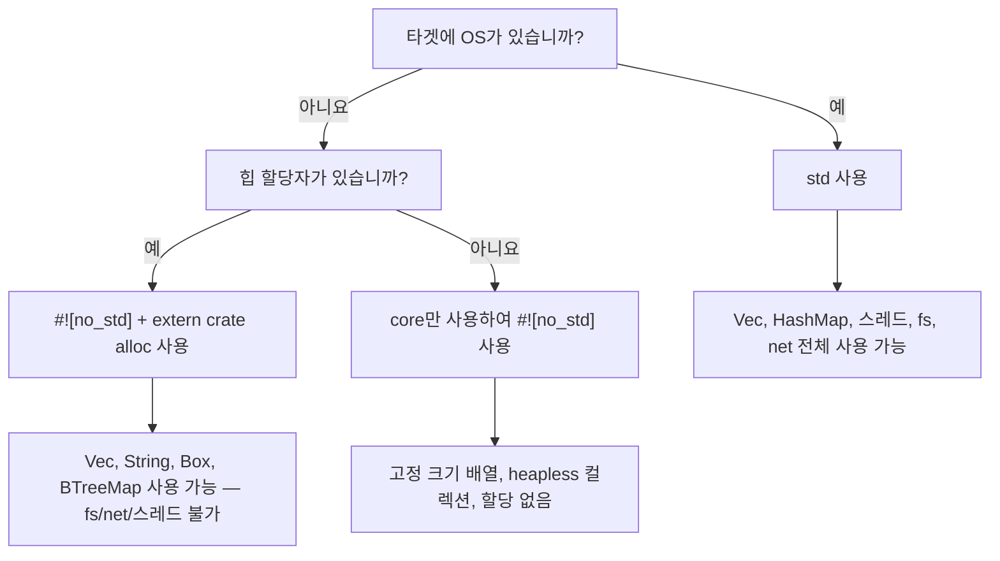

# `no_std` — 표준 라이브러리 없는 Rust

> **학습 내용:** `#![no_std]`를 사용하여 베어메탈(bare-metal) 및 임베디드 타겟을 위한 Rust를 작성하는 방법 — `core`와 `alloc` 크레이트의 분리, 패닉 핸들러(panic handlers), 그리고 이것이 `libc`가 없는 임베디드 C와 어떻게 비교되는지 배웁니다.

임베디드 C 분야에서 오셨다면, `libc` 없이 작업하거나 최소한의 런타임만 사용하는 것에 이미 익숙하실 것입니다. Rust에는 그와 동등한 일급(first-class) 기능인 **`#![no_std]`** 속성이 있습니다.

## `no_std`란 무엇인가?

크레이트 루트에 `#![no_std]`를 추가하면, 컴파일러는 암시적인 `extern crate std;`를 제거하고 오직 **`core`**(필요에 따라 **`alloc`** 포함)에만 링크합니다.

| 레이어 | 제공 기능 | OS / 힙(heap) 필요 여부 |
|-------|-----------------|---------------------|
| `core` | 기본 타입, `Option`, `Result`, `Iterator`, 수학, `slice`, `str`, 원자적 타입(atomics), `fmt` | **아니요** — 베어메탈에서 실행됨 |
| `alloc` | `Vec`, `String`, `Box`, `Rc`, `Arc`, `BTreeMap` | 글로벌 할당자가 필요하지만, **OS는 필요 없음** |
| `std` | `HashMap`, `fs`, `net`, `thread`, `io`, `env`, `process` | **예** — OS가 필요함 |

> **임베디드 개발자를 위한 팁:** 만약 여러분의 C 프로젝트가 `-lc`에 링크하고 `malloc`을 사용한다면, 아마도 `core` + `alloc`을 사용할 수 있을 것입니다. 만약 `malloc` 없이 베어메탈에서 실행된다면 `core`만 사용하십시오.

## `no_std` 선언하기

```rust
// src/lib.rs (또는 #![no_main]을 사용하는 바이너리의 경우 src/main.rs)
#![no_std]

// 여전히 `core`에 있는 모든 것을 사용할 수 있습니다:
use core::fmt;
use core::result::Result;
use core::option::Option;

// 할당자가 있다면 힙 타입을 선택할 수 있습니다:
extern crate alloc;
use alloc::vec::Vec;
use alloc::string::String;
```

베어메탈 바이너리의 경우 `#![no_main]`과 패닉 핸들러도 필요합니다:

```rust
#![no_std]
#![no_main]

use core::panic::PanicInfo;

#[panic_handler]
fn panic(_info: &PanicInfo) -> ! {
    loop {} // 패닉 시 대기 — 보드의 리셋 또는 LED 깜박임으로 교체하세요
}

// 진입점은 HAL / 링커 스크립트에 따라 달라집니다
```

## 잃게 되는 것들 (및 대안)

| `std` 기능 | `no_std` 대안 |
|---------------|---------------------|
| `println!` | UART로 보내는 `core::write!` 또는 `defmt` |
| `HashMap` | `heapless::FnvIndexMap`(고정 용량) 또는 `BTreeMap`(`alloc` 사용 시) |
| `Vec` | `heapless::Vec`(스택 할당, 고정 용량) |
| `String` | `heapless::String` 또는 `&str` |
| `std::io::Read/Write` | `embedded_io::Read/Write` |
| `thread::spawn` | 인터럽트 핸들러, RTIC 작업(tasks) |
| `std::time` | 하드웨어 타이머 주변장치 |
| `std::fs` | 플래시 / EEPROM 드라이버 |

## 주목할 만한 임베디드용 `no_std` 크레이트

| 크레이트 | 용도 | 참고 |
|-------|---------|-------|
| [`heapless`](https://crates.io/crates/heapless) | 고정 용량 `Vec`, `String`, `Queue`, `Map` | 할당자 불필요 — 모두 스택에 위치 |
| [`defmt`](https://crates.io/crates/defmt) | probe/ITM을 통한 효율적인 로깅 | `printf`와 비슷하지만 호스트에서 지연 포맷팅 수행 |
| [`embedded-hal`](https://crates.io/crates/embedded-hal) | 하드웨어 추상화 트레이트 (SPI, I²C, GPIO, UART) | 한 번 구현하면 어떤 MCU에서도 실행 가능 |
| [`cortex-m`](https://crates.io/crates/cortex-m) | ARM Cortex-M 인트린직(intrinsics) 및 레지스터 접근 | CMSIS와 유사한 저수준 |
| [`cortex-m-rt`](https://crates.io/crates/cortex-m-rt) | Cortex-M용 런타임 / 시작 코드 | `startup.s`를 대체 |
| [`rtic`](https://crates.io/crates/rtic) | 실시간 인터럽트 기반 동시성 | 컴파일 타임 작업 스케줄링, 제로 오버헤드 |
| [`embassy`](https://crates.io/crates/embassy-executor) | 임베디드용 비동기 실행기 | 베어메탈에서의 `async/await` |
| [`postcard`](https://crates.io/crates/postcard) | `no_std`용 serde 직렬화 (바이너리) | 문자열을 사용할 여유가 없을 때 `serde_json` 대체 |
| [`thiserror`](https://crates.io/crates/thiserror) | `Error` 트레이트용 파생 매크로 | v2부터 `no_std` 지원; `anyhow`보다 권장됨 |
| [`smoltcp`](https://crates.io/crates/smoltcp) | `no_std`용 TCP/IP 스택 | OS 없이 네트워킹이 필요할 때 |

## C 대 Rust: 베어메탈 비교

일반적인 임베디드 C blinky 예제:

```c
// C — 베어메탈, 벤더 HAL
#include "stm32f4xx_hal.h"

void SysTick_Handler(void) {
    HAL_GPIO_TogglePin(GPIOA, GPIO_PIN_5);
}

int main(void) {
    HAL_Init();
    __HAL_RCC_GPIOA_CLK_ENABLE();
    GPIO_InitTypeDef gpio = { .Pin = GPIO_PIN_5, .Mode = GPIO_MODE_OUTPUT_PP };
    HAL_GPIO_Init(GPIOA, &gpio);
    HAL_SYSTICK_Config(HAL_RCC_GetHCLKFreq() / 1000);
    while (1) {}
}
```

동등한 Rust 코드 (`embedded-hal` + 보드 크레이트 사용):

```rust
#![no_std]
#![no_main]

use cortex_m_rt::entry;
use panic_halt as _; // 패닉 핸들러: 무한 루프
use stm32f4xx_hal::{pac, prelude::*};

#[entry]
fn main() -> ! {
    let dp = pac::Peripherals::take().unwrap();
    let gpioa = dp.GPIOA.split();
    let mut led = gpioa.pa5.into_push_pull_output();

    let rcc = dp.RCC.constrain();
    let clocks = rcc.cfgr.freeze();
    let mut delay = dp.TIM2.delay_ms(&clocks);

    loop {
        led.toggle();
        delay.delay_ms(500u32);
    }
}
```

**C 개발자를 위한 주요 차이점:**
- `Peripherals::take()`는 `Option`을 반환합니다 — 컴파일 타임에 싱글톤 패턴을 보장합니다 (이중 초기화 버그 없음).
- `.split()`은 개별 핀의 소유권을 이전합니다 — 두 모듈이 동일한 핀을 구동할 위험이 없습니다.
- 모든 레지스터 접근은 타입 체크가 이루어집니다 — 실수로 읽기 전용 레지스터에 쓰는 일이 없습니다.
- 빌림 검사기(borrow checker)가 `main`과 인터럽트 핸들러 간의 데이터 경합을 방지합니다 (RTIC 사용 시).

## `no_std` 대 `std` 사용 시기



# 연습 문제: `no_std` 링 버퍼(Ring Buffer)

🔴 **도전** — `no_std` 컨텍스트에서 제네릭, `MaybeUninit`, `#[cfg(test)]` 결합

임베디드 시스템에서는 할당을 전혀 하지 않는 고정 크기 링 버퍼(원형 버퍼)가 필요한 경우가 많습니다. `core`만 사용하여 이를 구현해 보세요 (`alloc`, `std` 사용 금지).

**요구 사항:**
- 요소 타입 `T: Copy`에 대해 제네릭일 것
- 고정 용량 `N` (상수 제네릭)
- `push(&mut self, item: T)` — 가득 찼을 때 가장 오래된 요소를 덮어씀
- `pop(&mut self) -> Option<T>` — 가장 오래된 요소를 반환함
- `len(&self) -> usize`
- `is_empty(&self) -> bool`
- `#![no_std]`와 함께 컴파일되어야 함

```rust
// 시작 코드
#![no_std]

use core::mem::MaybeUninit;

pub struct RingBuffer<T: Copy, const N: usize> {
    buf: [MaybeUninit<T>; N],
    head: usize,  // 다음 쓰기 위치
    tail: usize,  // 다음 읽기 위치
    count: usize,
}

impl<T: Copy, const N: usize> RingBuffer<T, N> {
    pub const fn new() -> Self {
        todo!()
    }
    pub fn push(&mut self, item: T) {
        todo!()
    }
    pub fn pop(&mut self) -> Option<T> {
        todo!()
    }
    pub fn len(&self) -> usize {
        todo!()
    }
    pub fn is_empty(&self) -> bool {
        todo!()
    }
}
```

<details>
<summary>풀이</summary>

```rust
#![no_std]

use core::mem::MaybeUninit;

pub struct RingBuffer<T: Copy, const N: usize> {
    buf: [MaybeUninit<T>; N],
    head: usize,
    tail: usize,
    count: usize,
}

impl<T: Copy, const N: usize> RingBuffer<T, N> {
    pub const fn new() -> Self {
        Self {
            // SAFETY: MaybeUninit은 초기화를 요구하지 않음
            buf: unsafe { MaybeUninit::uninit().assume_init() },
            head: 0,
            tail: 0,
            count: 0,
        }
    }

    pub fn push(&mut self, item: T) {
        self.buf[self.head] = MaybeUninit::new(item);
        self.head = (self.head + 1) % N;
        if self.count == N {
            // 버퍼가 가득 참 — 가장 오래된 것을 덮어쓰고 tail을 전진시킴
            self.tail = (self.tail + 1) % N;
        } else {
            self.count += 1;
        }
    }

    pub fn pop(&mut self) -> Option<T> {
        if self.count == 0 {
            return None;
        }
        // SAFETY: 이전에 push()를 통해 기록된 위치만 읽음
        let item = unsafe { self.buf[self.tail].assume_init() };
        self.tail = (self.tail + 1) % N;
        self.count -= 1;
        Some(item)
    }

    pub fn len(&self) -> usize {
        self.count
    }

    pub fn is_empty(&self) -> bool {
        self.count == 0
    }
}

#[cfg(test)]
mod tests {
    use super::*;

    #[test]
    fn basic_push_pop() {
        let mut rb = RingBuffer::<u32, 4>::new();
        assert!(rb.is_empty());

        rb.push(10);
        rb.push(20);
        rb.push(30);
        assert_eq!(rb.len(), 3);

        assert_eq!(rb.pop(), Some(10));
        assert_eq!(rb.pop(), Some(20));
        assert_eq!(rb.pop(), Some(30));
        assert_eq!(rb.pop(), None);
    }

    #[test]
    fn overwrite_on_full() {
        let mut rb = RingBuffer::<u8, 3>::new();
        rb.push(1);
        rb.push(2);
        rb.push(3);
        // 버퍼 가득 참: [1, 2, 3]

        rb.push(4); // 1을 덮어씀 → [4, 2, 3], tail 전진
        assert_eq!(rb.len(), 3);
        assert_eq!(rb.pop(), Some(2)); // 살아남은 가장 오래된 요소
        assert_eq!(rb.pop(), Some(3));
        assert_eq!(rb.pop(), Some(4));
        assert_eq!(rb.pop(), None);
    }
}
```

**임베디드 C 개발자에게 이것이 중요한 이유:**
- `MaybeUninit`은 C의 `char buf[N];`과 같이 컴파일러가 0으로 채우지 않는, 초기화되지 않은 메모리에 대한 Rust의 대응 방식입니다.
- `unsafe` 블록은 최소화(2줄)되었으며, 각각 `// SAFETY:` 주석이 달려 있습니다.
- `const fn new()`는 런타임 생성자 없이 `static` 변수에서 링 버퍼를 생성할 수 있음을 의미합니다.
- 코드가 `no_std`이더라도 호스트에서 `cargo test`를 통해 테스트를 실행할 수 있습니다.

</details>
