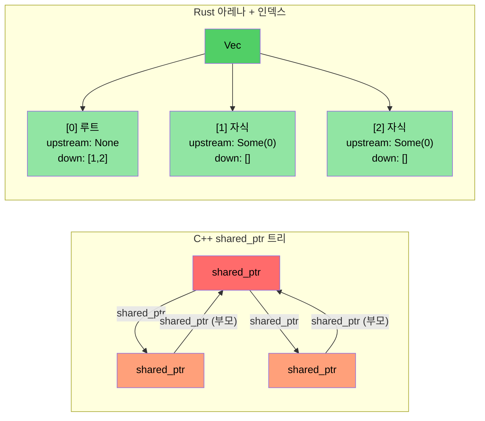

# 사례 연구 개요: C++에서 Rust로의 전환

> **학습 내용:** 약 10만 라인의 C++ 코드를 약 20개의 크레이트에 걸친 9만 라인의 Rust 코드로 전환한 실제 사례를 통해 배운 교훈을 살펴봅니다. 다섯 가지 핵심 전환 패턴과 그 뒤에 숨겨진 아키텍처 결정 사항을 다룹니다.

- 우리는 대규모 C++ 진단 시스템(약 10만 라인)을 Rust 구현체(약 20개의 크레이트, 약 9만 라인)로 전환했습니다.
- 이 섹션에서는 장난감 같은 예제가 아니라, 실제 운영 환경 코드에서 사용된 **실제 패턴**들을 보여줍니다.
- 다섯 가지 핵심 전환 내용:

| **#** | **C++ 패턴** | **Rust 패턴** | **효과** |
|-------|----------------|-----------------|-----------|
| 1 | 클래스 계층 구조 + `dynamic_cast` | 열거형(Enum) 디스패치 + `match` | 약 400개 → 0개의 dynamic_casts |
| 2 | `shared_ptr` / `enable_shared_from_this` 트리 | 아레나(Arena) + 인덱스 연결 | 참조 순환(Reference cycles) 없음 |
| 3 | 모든 모듈의 `Framework*` 원시 포인터 | 수명 빌림을 사용하는 `DiagContext<'a>` | 컴파일 타임 유효성 보장 |
| 4 | 거대 객체(God object) | 조합 가능한 상태 구조체들 | 테스트 용이성, 모듈화 향상 |
| 5 | 도처에 널린 `vector<unique_ptr<Base>>` | 필요한 곳에만 트레이트 객체 사용 (약 25개) | 기본적으로 정적 디스패치 사용 |

### 전환 전후 지표 비교

| **지표** | **C++ (기존)** | **Rust (개편)** |
|------------|---------------------|------------------------|
| `dynamic_cast` / 타입 다운캐스트 | 약 400개 | 0개 |
| `virtual` / `override` 메서드 | 약 900개 | 약 25개 (`Box<dyn Trait>`) |
| 원시 `new` 할당 | 약 200개 | 0개 (모두 소유형 타입) |
| `shared_ptr` / 참조 카운팅 | 약 10개 (토폴로지 라이브러리) | 0개 (FFI 경계에서만 `Arc` 사용) |
| `enum class` 정의 | 약 60개 | 약 190개 `pub enum` |
| 패턴 매칭 표현식 | 해당 없음 | 약 750개 `match` |
| 거대 객체(5천 라인 이상) | 2개 | 0개 |

----

# 사례 연구 1: 상속 계층 구조 → 열거형 디스패치

## C++ 패턴: 이벤트 클래스 계층 구조
```cpp
// C++ 기존 코드: 모든 GPU 이벤트 타입은 GpuEventBase를 상속받는 클래스임
class GpuEventBase {
public:
    virtual ~GpuEventBase() = default;
    virtual void Process(DiagFramework* fw) = 0;
    uint16_t m_recordId;
    uint8_t  m_sensorType;
    // ... 공통 필드들
};

class GpuPcieDegradeEvent : public GpuEventBase {
public:
    void Process(DiagFramework* fw) override;
    uint8_t m_linkSpeed;
    uint8_t m_linkWidth;
};

class GpuPcieFatalEvent : public GpuEventBase { /* ... */ };
class GpuBootEvent : public GpuEventBase { /* ... */ };
// ... GpuEventBase를 상속받는 10개 이상의 이벤트 클래스들

// 처리 시 dynamic_cast가 필요함:
void ProcessEvents(std::vector<std::unique_ptr<GpuEventBase>>& events,
                   DiagFramework* fw) {
    for (auto& event : events) {
        if (auto* degrade = dynamic_cast<GpuPcieDegradeEvent*>(event.get())) {
            // degrade 처리...
        } else if (auto* fatal = dynamic_cast<GpuPcieFatalEvent*>(event.get())) {
            // fatal 처리...
        }
        // ... 10개 이상의 분기
    }
}
```

## Rust 솔루션: 열거형(Enum) 디스패치
```rust
// 예시: types.rs — 상속 없음, vtable 없음, dynamic_cast 없음
#[derive(Debug, Clone, PartialEq, Eq, Serialize, Deserialize)]
pub enum GpuEventKind {
    PcieDegrade,
    PcieFatal,
    PcieUncorr,
    Boot,
    BaseboardState,
    EccError,
    OverTemp,
    PowerRail,
    ErotStatus,
    Unknown,
}
```

```rust
// 예시: manager.rs — 타입별로 분리된 Vec들, 다운캐스팅 불필요
pub struct GpuEventManager {
    sku: SkuVariant,
    degrade_events: Vec<GpuPcieDegradeEvent>,   // Box<dyn>이 아닌 구체 타입
    fatal_events: Vec<GpuPcieFatalEvent>,
    uncorr_events: Vec<GpuPcieUncorrEvent>,
    boot_events: Vec<GpuBootEvent>,
    baseboard_events: Vec<GpuBaseboardEvent>,
    ecc_events: Vec<GpuEccEvent>,
    // ... 각 이벤트 타입마다 별도의 Vec을 가짐
}

// 접근자(Accessors)는 타입이 지정된 슬라이스를 반환함 — 모호성 제로
impl GpuEventManager {
    pub fn degrade_events(&self) -> &[GpuPcieDegradeEvent] {
        &self.degrade_events
    }
    pub fn fatal_events(&self) -> &[GpuPcieFatalEvent] {
        &self.fatal_events
    }
}
```

### 왜 `Vec<Box<dyn GpuEvent>>`를 사용하지 않았는가?
- **잘못된 접근 방식** (문자 그대로의 번역): 모든 이벤트를 하나의 이기종 컬렉션에 넣은 다음 다운캐스트하는 방식 — 이것이 C++가 `vector<unique_ptr<Base>>`로 하는 일입니다.
- **올바른 접근 방식**: 타입별로 분리된 Vec을 사용하면 *모든* 다운캐스팅이 사라집니다. 각 소비자는 자신이 정확히 필요로 하는 이벤트 타입을 요청합니다.
- **성능**: 분리된 Vec은 더 나은 캐시 지역성(locality)을 제공합니다 (동일한 타입의 모든 이벤트가 메모리상에 연속적으로 배치됨).

----

# 사례 연구 2: shared_ptr 트리 → 아레나(Arena)/인덱스 패턴

## C++ 패턴: 참조 카운팅 트리
```cpp
// C++ 토폴로지 라이브러리: 부모와 자식 노드가 서로를 참조해야 하므로
// PcieDevice는 enable_shared_from_this를 사용함
class PcieDevice : public std::enable_shared_from_this<PcieDevice> {
public:
    std::shared_ptr<PcieDevice> m_upstream;
    std::vector<std::shared_ptr<PcieDevice>> m_downstream;
    // ... 장치 데이터
    
    void AddChild(std::shared_ptr<PcieDevice> child) {
        child->m_upstream = shared_from_this();  // 부모 ↔ 자식 순환 발생!
        m_downstream.push_back(child);
    }
};
// 문제점: 부모→자식 및 자식→부모 참조가 순환 참조를 만듦
// 순환을 끊으려면 weak_ptr이 필요하지만, 잊어버리기 쉬움
```

## Rust 솔루션: 인덱스 연결을 사용한 아레나
```rust
// 예시: components.rs — 평탄한 Vec이 모든 장치를 소유함
pub struct PcieDevice {
    pub base: PcieDeviceBase,
    pub kind: PcieDeviceKind,

    // 인덱스를 통한 트리 연결 — 참조 카운팅 없음, 순환 없음
    pub upstream_idx: Option<usize>,      // 아레나 Vec에 대한 인덱스
    pub downstream_idxs: Vec<usize>,      // 아레나 Vec에 대한 인덱스들
}

// "아레나"는 단순히 트리에 의해 소유되는 Vec<PcieDevice>입니다:
pub struct DeviceTree {
    devices: Vec<PcieDevice>,  // 단일 소유권 — 하나의 Vec이 모든 것을 소유함
}

impl DeviceTree {
    pub fn parent(&self, device_idx: usize) -> Option<&PcieDevice> {
        self.devices[device_idx].upstream_idx
            .map(|idx| &self.devices[idx])
    }
    
    pub fn children(&self, device_idx: usize) -> Vec<&PcieDevice> {
        self.devices[device_idx].downstream_idxs
            .iter()
            .map(|&idx| &self.devices[idx])
            .collect()
    }
}
```

### 핵심 통찰
- **`shared_ptr`, `weak_ptr`, `enable_shared_from_this`가 전혀 없음**
- **순환 참조가 발생할 수 없음** — 인덱스는 단순히 `usize` 값일 뿐입니다.
- **더 나은 캐시 성능** — 모든 장치가 연속된 메모리에 위치합니다.
- **단순한 추론** — 하나의 소유자(Vec)와 많은 관찰자(인덱스) 구조입니다.



----
