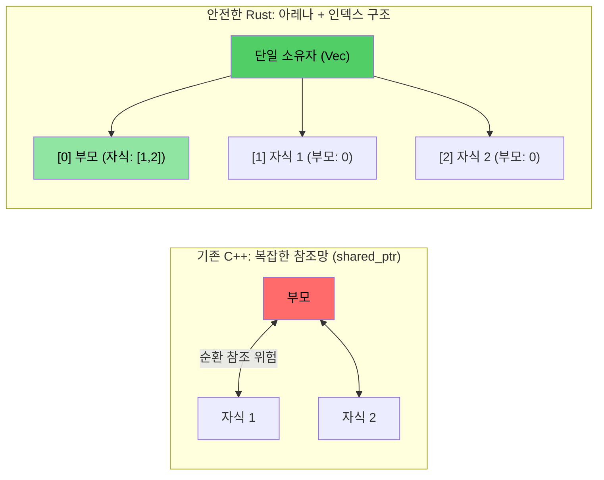

# 16. 사례 연구: C++에서 Rust로의 대규모 전환 (Real-world Migration) 🔴

> **학습 목표:**
> - 약 10만 라인의 C++ 진단 시스템을 9만 라인의 Rust 코드로 성공적으로 전환한 실제 사례를 분석합니다.
> - 아키텍처 수준에서의 5가지 핵심 패턴 변화를 살펴봅니다.
> - 전환에 따른 성능 및 유지보수성 지표의 변화를 수치로 확인합니다.
> - 기계적 번역이 아닌, 'Rust다운' 아키텍처 설계의 중요성을 깨닫습니다.

---

### 📊 전환 전후 주요 지표 변화
장난감 예제가 아닌, 20여 개의 크레이트로 구성된 복잡한 운영 환경 시스템에서의 실제 데이터입니다.

| **지표 항목** | **기존 C++ 시스템** | **개편된 Rust 시스템** | **성과 및 의미** |
| :--- | :--- | :--- | :--- |
| **`dynamic_cast` (다운캐스팅)** | 약 400개 | **0개** | 타입 불안정성 및 런타임 비용 제거 |
| **가상 함수 (`virtual` / `override`)** | 약 900개 | **약 25개** | 정적 디스패치 위주로 성능 최적화 |
| **수동 할당 (`new`)** | 약 200개 | **0개** | 소유권 기반으로 메모리 누수 원천 차단 |
| **참조 카운팅 (`shared_ptr`)** | 다수 (복잡한 트리 구조) | **0개** (FFI 제외) | 순환 참조 및 성능 저하 고민 해결 |
| **거대 객체 (God Object, 5k+ LOC)** | 2개 | **0개** | 단일 책임 원칙 준수, 모듈화 성공 |

---

### 1. 상속 계층 구조를 열거형(Enum)으로 대체
C++에서는 공통 베이스 클래스를 상속받고 `dynamic_cast`로 타입을 확인하던 패턴을, Rust에서는 데이터가 포함된 **열거형(Sum Types)**과 **패턴 매칭**으로 깔끔하게 해결했습니다.

- **C++ 방식**: `vector<unique_ptr<Base>>`에 담고 루프에서 타입을 수동으로 체크함 (느리고 위험함).
- **Rust 방식**: 각 타입별로 분할된 `Vec<T>`를 운영하거나, 하나의 열거형으로 묶어 `match` 문으로 처리함 (안전하고 빠름).

```rust
// Rust: 강력한 열거형 디스패치 패턴
pub enum GpuEvent {
    PcieDegrade(PcieDetails),
    EccError(EccDetails),
    TemperatureExceeded(f32),
}

fn process_events(events: &[GpuEvent]) {
    for event in events {
        match event {
            GpuEvent::PcieDegrade(details) => println!("PCIe 성능 저하: {:?}", details),
            GpuEvent::EccError(info) => println!("메모리 오류 감지: {:?}", info),
            GpuEvent::TemperatureExceeded(t) => println!("온도 경보: {}도", t),
        }
    }
}
```

---

### 2. 순환 참조 트리를 아레나(Arena) 패턴으로 해결
부모와 자식이 서로 `shared_ptr`로 가리키는 구조는 C++에서 메모리 누수(`weak_ptr` 누락 시)의 주범입니다.

- **전환 전략**: 모든 객체를 하나의 평탄한 `Vec<T>`(**아레나**)에 소유시키고, 서로를 가리킬 때는 포인터가 아닌 **인덱스(`usize`)**를 사용합니다.
- **효과**: 소유권 구조가 명확해지며, 데이터가 메모리에 인접하게 배치되어 **캐시 적중률(Cache Locality)**이 급격히 향상됩니다.



---

### 3. '갓 오브젝트(God Object)'의 해체
모든 상태를 거대한 클래스 하나에 몰아넣던 습관을 버리고, Rust의 트레이트 조합(Composition)을 활용했습니다.

- **결과**: 테스트가 불가능하던 5,000라인 이상의 클래스들이 독립적으로 검증 가능한 수십 개의 작은 구조체와 트레이트로 분리되었습니다.
- **이점**: 컴파일 시간이 단축되고, 시스템의 특정 부분만 따로 떼어내어 단위 테스트(Unit Test)를 수행하기가 훨씬 수월해졌습니다.

---

### 📌 결론: 아키텍처의 승리
단순히 연산자를 바꾸는 식의 기계적 번역은 실패하기 쉽습니다. **Rust의 소유권 모델과 타입 시스템의 강점을 극대화하는 방향**으로 아키텍처를 재설계했을 때, 비로소 진정한 성능 향상과 코드 안전성을 얻을 수 있습니다.

---

### 💡 요약
- 상속 계층 대신 **데이터를 품은 열거형**을 활용하세요.
- 복잡한 포인터 네트워크 대신 **아레나 패턴**을 고려하세요.
- 거대 클래스를 **작고 독립적인 트레이트 조합**으로 분해하세요.
- 성능 지표는 정적 디스패치와 캐시 최적화에서 나옵니다.

