# C# 프로그래머를 위한 Rust 교육 (Rust Training for C# Programmers)

C# 경험이 있는 개발자를 대상으로, 두 언어 간의 개념적 변화와 실질적인 차이점에 초점을 맞춘 포괄적인 Rust 학습 가이드입니다.

## 목차 (Table of Contents)

### 1. 서론 및 철학 (Introduction and Philosophy)
- [언어 철학 비교](#언어-철학-비교)
- [메모리 관리: GC vs RAII](#메모리-관리-gc-vs-raii)
- [성능 특성](#성능-특성)

### 2. 타입 시스템의 차이 (Type System Differences)
- [널 안전성: Nullable<T> vs Option<T>](#널-안전성-nullablet-vs-optiont)
- [값 타입 vs 참조 타입 vs 소유권](#값-타입-vs-참조-타입-vs-소유권)
- [대수적 데이터 타입 vs C# 공용체](#대수적-데이터-타입-vs-c-공용체)
- [철저한 패턴 매칭: 컴파일러 보장 vs 런타임 에러](#철저한-패턴-매칭-컴파일러-보장-vs-런타임-에러)
- [진정한 불변성 vs 레코드의 환상](#진정한-불변성-vs-레코드의-환상)
- [메모리 안전성: 런타임 체크 vs 컴파일 타임 증명](#메모리-안전성-런타임-체크-vs-컴파일-타임-증명)

### 3. 객체 지향 vs 함수형 패러다임 (Object-Oriented vs Functional Paradigms)
- [상속 vs 구성](#상속-vs-구성)
- [인터페이스 vs 트레이트](#인터페이스-vs-트레이트)
- [가상 메서드 vs 정적 디스패치](#가상-메서드-vs-정적-디스패치)
- [Sealed 클래스 vs Rust 불변성](#sealed-클래스-vs-rust-불변성)

### 4. 에러 처리 철학 (Error Handling Philosophy)
- [예외 vs Result<T, E>](#예외-vs-resultt-e)
- [Try-Catch vs 패턴 매칭](#try-catch-vs-패턴-매칭)
- [에러 전파 패턴](#에러-전파-패턴)

### 5. 동시성 및 안전성 (Concurrency and Safety)
- [스레드 안전성: 관례 vs 타입 시스템 보장](#스레드-안전성-관례-vs-타입-시스템-보장)
- [async/await 비교](#asyncawait-비교)
- [데이터 경합(Data Race) 예방](#데이터-경합-예방)

### 6. 컬렉션 및 반복자 (Collections and Iterators)
- [LINQ vs Rust 반복자](#linq-vs-rust-반복자)
- [컬렉션 소유권](#컬렉션-소유권)
- [지연 평가 패턴](#지연-평가-패턴)

### 7. 제네릭 및 제약 조건 (Generics and Constraints)
- [제네릭 제약 조건: where vs 트레이트 바운드](#제네릭-제약-조건-where-vs-트레이트-바운드)
- [제네릭 가변성(Variance)](#제네릭-가변성)
- [고차 타입(Higher-Kinded Types)](#고차-타입)

### 8. 실전 마이그레이션 패턴 (Practical Migration Patterns)
- [단계적 도입 전략](#단계적-도입-전략)
- [C#에서 Rust로의 개념 매핑](#c에서-rust로의-개념-매핑)
- [팀 도입 타임라인](#팀-도입-타임라인)
- [Rust에서의 일반적인 C# 패턴 구현](#rust에서의-일반적인-c-패턴-구현)
- [생태계 비교](#생태계-비교)
- [테스트 및 문서화](#테스트 및-문서화)

### 9. 성능 및 도입 (Performance and Adoption)
- [성능 비교: 관리형 vs 네이티브](#성능-비교-관리형-vs-네이티브)
- [언어 선택 기준](#언어-선택-기준)

### 10. 고급 주제 (Advanced Topics)
- [Unsafe 코드: 시기와 이유](#unsafe-코드-시기와-이유)
- [상호 운용성(Interop) 고려 사항](#상호-운용성-고려-사항)
- [성능 최적화](#성능-최적화)

### 11. C# 개발자를 위한 권장 사례 (Best Practices for C# Developers)
- [C# 개발자를 위한 관용적(Idiomatic) Rust](#c-개발자를-위한-관용적-rust)
- [흔한 실수와 해결책](#흔한-실수와-해결책)
- [C# 개발자를 위한 필수 크레이트](#c-개발자를-위한-필수-크레이트)

***

## 언어 철학 비교 (Language Philosophy Comparison)

### C# 철학
- **생산성 우선**: 풍부한 도구, 방대한 프레임워크, "성공의 구덩이(pit of success)"
- **관리형 런타임**: 가비지 컬렉션(GC)이 메모리를 자동으로 관리
- **엔터프라이즈 중심**: 리플렉션을 활용한 강력한 타입 시스템, 방대한 표준 라이브러리
- **객체 지향**: 클래스, 상속, 인터페이스를 주요 추상화 수단으로 사용

### Rust 철학
- **희생 없는 성능**: 제로 비용 추상화(zero-cost abstractions), 런타임 오버헤드 없음
- **메모리 안전성**: 컴파일 타임 보장을 통해 크래시와 보안 취약점 예방
- **시스템 프로그래밍**: 고수준 추상화를 유지하면서 하드웨어에 직접 접근 가능
- **함수형 + 시스템**: 기본적으로 불변성 지향, 소유권 기반 리소스 관리

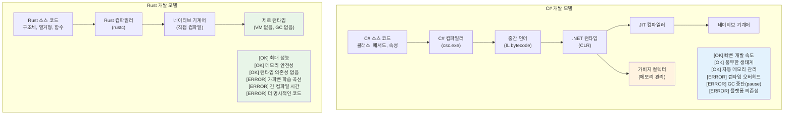

***

## 메모리 관리: GC vs RAII (Memory Management: GC vs RAII)

### C# 가비지 컬렉션 (Garbage Collection)
```csharp
// C# - 자동 메모리 관리
public class Person
{
    public string Name { get; set; }
    public List<string> Hobbies { get; set; } = new List<string>();
    
    public void AddHobby(string hobby)
    {
        Hobbies.Add(hobby);  // 메모리가 자동으로 할당됨
    }
    
    // 명시적인 정리가 필요 없음 - GC가 처리함
    // 단, 리소스 관리를 위해 IDisposable 패턴 사용
}

using var file = new FileStream("data.txt", FileMode.Open);
// 'using'은 Dispose() 호출을 보장함
```

### Rust 소유권 및 RAII (Ownership and RAII)
```rust
// Rust - 컴파일 타임 메모리 관리
pub struct Person {
    name: String,
    hobbies: Vec<String>,
}

impl Person {
    pub fn add_hobby(&mut self, hobby: String) {
        self.hobbies.push(hobby);  // 컴파일 타임에 메모리 관리가 추적됨
    }
    
    // Drop 트레이트가 자동 구현됨 - 확실한 정리가 보장됨
}

// RAII - 리소스 획득은 초기화 (Resource Acquisition Is Initialization)
{
    let file = std::fs::File::open("data.txt")?;
    // 'file'이 범위를 벗어날 때 파일이 자동으로 닫힘
    // 'using' 문이 필요 없음 - 타입 시스템에 의해 처리됨
}
```

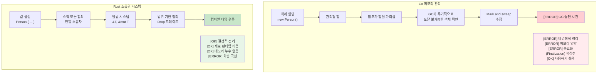

***

## 널 안전성: Nullable<T> vs Option<T> (Null Safety)

### C# 널 처리의 진화 (C# Null Handling Evolution)
```csharp
// C# - 전통적인 널 처리 (에러 발생 가능성이 높음)
public class User
{
    public string Name { get; set; }  // null일 수 있음!
    public string Email { get; set; } // null일 수 있음!
}

public string GetUserDisplayName(User user)
{
    if (user?.Name != null)  // 널 조건부 연산자
    {
        return user.Name;
    }
    return "Unknown User";
}

// C# 8+ Nullable 참조 타입
public class User
{
    public string Name { get; set; }    // Non-nullable
    public string? Email { get; set; }  // 명시적 nullable
}

// C# 값 타입을 위한 Nullable<T>
int? maybeNumber = GetNumber();
if (maybeNumber.HasValue)
{
    Console.WriteLine(maybeNumber.Value);
}
```

### Rust Option<T> 시스템
```rust
// Rust - Option<T>를 사용한 명시적 널 처리
#[derive(Debug)]
pub struct User {
    name: String,           // 절대 null일 수 없음
    email: Option<String>,  // 명시적으로 선택적임
}

impl User {
    pub fn get_display_name(&self) -> &str {
        &self.name  // 널 체크 불필요 - 존재함이 보장됨
    }
    
    pub fn get_email_or_default(&self) -> String {
        self.email
            .as_ref()
            .map(|e| e.clone())
            .unwrap_or_else(|| "no-email@example.com".to_string())
    }
}

// 패턴 매칭은 None 케이스의 처리를 강제함
fn handle_optional_user(user: Option<User>) {
    match user {
        Some(u) => println!("사용자: {}", u.get_display_name()),
        None => println!("사용자를 찾을 수 없음"),
        // None 케이스를 처리하지 않으면 컴파일 에러 발생!
    }
}
```

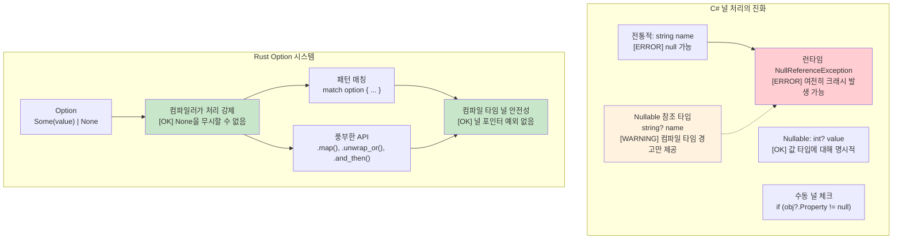

***

## 대수적 데이터 타입 vs C# 공용체 (Algebraic Data Types vs C# Unions)

### C# 판별 공용체 (상속을 이용한 제한적 지원)
```csharp
// C# - 상속을 이용한 제한적 공용체 지원
public abstract class Result
{
    public abstract T Match<T>(Func<Success, T> onSuccess, Func<Error, T> onError);
}

public class Success : Result
{
    public string Value { get; }
    public Success(string value) => Value = value;
    
    public override T Match<T>(Func<Success, T> onSuccess, Func<Error, T> onError)
        => onSuccess(this);
}

public class Error : Result
{
    public string Message { get; }
    public Error(string message) => Message = message;
    
    public override T Match<T>(Func<Success, T> onSuccess, Func<Error, T> onError)
        => onError(this);
}

// C# 9+ 레코드와 패턴 매칭 (더 나은 방식)
public abstract record Shape;
public record Circle(double Radius) : Shape;
public record Rectangle(double Width, double Height) : Shape;

public static double Area(Shape shape) => shape switch
{
    Circle(var radius) => Math.PI * radius * radius,
    Rectangle(var width, var height) => width * height,
    _ => throw new ArgumentException("알 수 없는 모양")  // [ERROR] 런타임 에러 가능성
};
```

### Rust 대수적 데이터 타입 (열거형)
```rust
// Rust - 철저한 패턴 매칭을 지원하는 진정한 대수적 데이터 타입
#[derive(Debug, Clone)]
pub enum Result<T, E> {
    Ok(T),
    Err(E),
}

#[derive(Debug, Clone)]
pub enum Shape {
    Circle { radius: f64 },
    Rectangle { width: f64, height: f64 },
    Triangle { base: f64, height: f64 },
}

impl Shape {
    pub fn area(&self) -> f64 {
        match self {
            Shape::Circle { radius } => std::f64::consts::PI * radius * radius,
            Shape::Rectangle { width, height } => width * height,
            Shape::Triangle { base, height } => 0.5 * base * height,
            // [OK] 변형(variant) 중 하나라도 누락되면 컴파일 에러 발생!
        }
    }
}

// 심화: 열거형은 서로 다른 타입을 가질 수 있음
#[derive(Debug)]
pub enum Value {
    Integer(i64),
    Float(f64),
    Text(String),
    Boolean(bool),
    List(Vec<Value>),  // 재귀적 타입!
}

impl Value {
    pub fn type_name(&self) -> &'static str {
        match self {
            Value::Integer(_) => "integer",
            Value::Float(_) => "float",
            Value::Text(_) => "text",
            Value::Boolean(_) => "boolean",
            Value::List(_) => "list",
        }
    }
}
```

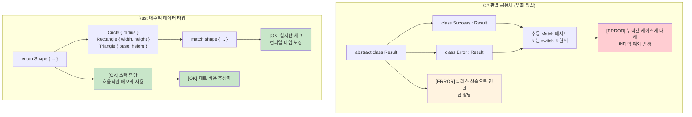

***

## 철저한 패턴 매칭: 컴파일러 보장 vs 런타임 에러 (Exhaustive Pattern Matching)

### C# Switch 표현식 - 여전히 불완전함
```csharp
// C# switch 표현식은 철저해 보이지만 보장되지 않음
public enum HttpStatus { Ok, NotFound, ServerError, Unauthorized }

public string HandleResponse(HttpStatus status) => status switch
{
    HttpStatus.Ok => "성공",
    HttpStatus.NotFound => "리소스를 찾을 수 없음",
    HttpStatus.ServerError => "내부 에러",
    // Unauthorized 케이스 누락 - 정상적으로 컴파일됨!
    // 런타임: 실행 시 System.InvalidOperationException 발생
};

// nullable 경고가 켜져 있어도 다음 코드는 컴파일됨:
public class User 
{
    public string Name { get; set; }
    public bool IsActive { get; set; }
}

public string ProcessUser(User? user) => user switch
{
    { IsActive: true } => $"활성: {user.Name}",
    { IsActive: false } => $"비활성: {user.Name}",
    // null 케이스 누락 - 경고만 발생하고 에러는 아님
    // 런타임: NullReferenceException 발생 가능
};

// 열거형 값을 추가하면 기존 코드가 소리 없이 깨짐
public enum HttpStatus 
{ 
    Ok, 
    NotFound, 
    ServerError, 
    Unauthorized,
    Forbidden  // 이걸 추가해도 HandleResponse() 컴파일은 깨지지 않음!
}
```

### Rust 패턴 매칭 - 진정한 철저함 (True Exhaustiveness)
```rust
#[derive(Debug)]
enum HttpStatus {
    Ok,
    NotFound, 
    ServerError,
    Unauthorized,
}

fn handle_response(status: HttpStatus) -> &'static str {
    match status {
        HttpStatus::Ok => "성공",
        HttpStatus::NotFound => "리소스를 찾을 수 없음", 
        HttpStatus::ServerError => "내부 에러",
        HttpStatus::Unauthorized => "인증 필요",
        // 하나라도 누락되면 컴파일 에러 발생!
        // 아예 컴파일이 되지 않음
    }
}

// 새로운 변형을 추가하면 해당 열거형을 사용하는 모든 곳의 컴파일이 깨짐
#[derive(Debug)]
enum HttpStatus {
    Ok,
    NotFound,
    ServerError, 
    Unauthorized,
    Forbidden,  // 이걸 추가하면 handle_response()에서 컴파일 에러 발생
}
// 컴파일러가 모든 케이스를 처리하도록 강제함

// Option<T> 패턴 매칭도 철저함
fn process_optional_value(value: Option<i32>) -> String {
    match value {
        Some(n) => format!("값 발견: {}", n),
        None => "값 없음".to_string(),
        // 둘 중 하나라도 잊으면 컴파일 에러
    }
}
```

```mermaid
graph TD
    subgraph "C# 패턴 매칭의 한계"
        CS_SWITCH["switch 표현식"]
        CS_WARNING["⚠️ 컴파일러 경고만 발생"]
        CS_COMPILE["✅ 컴파일 성공"]
        CS_RUNTIME["💥 런타임 예외"]
        CS_DEPLOY["❌ 버그가 운영 환경에 도달"]
        CS_SILENT["😰 열거형 변경 시 소리 없는 실패"]
        
        CS_SWITCH --> CS_WARNING
        CS_WARNING --> CS_COMPILE
        CS_COMPILE --> CS_RUNTIME
        CS_RUNTIME --> CS_DEPLOY
        CS_SWITCH --> CS_SILENT
    end
    
    subgraph "Rust 철저한 매칭"
        RUST_MATCH["match 표현식"]
        RUST_ERROR["🛑 컴파일 실패"]
        RUST_FIX["✅ 모든 케이스 처리 필수"]
        RUST_SAFE["✅ 런타임 예기치 못한 상황 제로"]
        RUST_EVOLUTION["🔄 열거형 변경 시 컴파일 깨짐"]
        RUST_REFACTOR["🛠️ 강제 리팩토링"]
        
        RUST_MATCH --> RUST_ERROR
        RUST_ERROR --> RUST_FIX
        RUST_FIX --> RUST_SAFE
        RUST_MATCH --> RUST_EVOLUTION
        RUST_EVOLUTION --> RUST_REFACTOR
    end
    
    style CS_RUNTIME fill:#ffcdd2
    style CS_DEPLOY fill:#ffcdd2
    style CS_SILENT fill:#ffcdd2
    style RUST_SAFE fill:#c8e6c9
    style RUST_REFACTOR fill:#c8e6c9
```

***

## 진정한 불변성 vs 레코드의 환상 (True Immutability vs Record Illusions)

### C# 레코드 - 불변성 흉내 (Immutability Theater)
```csharp
// C# 레코드는 불변처럼 보이지만 탈출구가 있음
public record Person(string Name, int Age, List<string> Hobbies);

var person = new Person("John", 30, new List<string> { "reading" });

// 새로운 인스턴스를 생성하는 것처럼 보임:
var older = person with { Age = 31 };  // 새 레코드
var renamed = person with { Name = "Jonathan" };  // 새 레코드

// 하지만 참조 타입은 여전히 가변적임!
person.Hobbies.Add("gaming");  // 원본을 수정함!
Console.WriteLine(older.Hobbies.Count);  // 2 - older 객체도 영향을 받음!
Console.WriteLine(renamed.Hobbies.Count); // 2 - renamed 객체도 영향을 받음!

// Init-only 속성도 리플렉션을 통해 설정 가능
typeof(Person).GetProperty("Age")?.SetValue(person, 25);

// 컬렉션 표현식이 도움이 되지만 근본적인 문제는 해결 못 함
public record BetterPerson(string Name, int Age, IReadOnlyList<string> Hobbies);

var betterPerson = new BetterPerson("Jane", 25, new List<string> { "painting" });
// 캐스팅을 통해 여전히 수정 가능: 
((List<string>)betterPerson.Hobbies).Add("시스템 해킹");

// 심지어 "불변" 컬렉션도 진정한 불변은 아님
using System.Collections.Immutable;
public record SafePerson(string Name, int Age, ImmutableList<string> Hobbies);
// 이 방식이 더 낫지만, 규율이 필요하고 성능 오버헤드가 있음
```

### Rust - 기본적으로 진정한 불변성 (True Immutability)
```rust
#[derive(Debug, Clone)]
struct Person {
    name: String,
    age: u32,
    hobbies: Vec<String>,
}

let person = Person {
    name: "John".to_string(),
    age: 30,
    hobbies: vec!["reading".to_string()],
};

// 다음 코드는 컴파일되지 않음:
// person.age = 31;  // ERROR: 불변 필드에 할당할 수 없음
// person.hobbies.push("gaming".to_string());  // ERROR: 가변으로 빌릴 수 없음

// 수정하려면 'mut'을 사용하여 명시적으로 허용해야 함:
let mut older_person = person.clone();
older_person.age = 31;  // 이제 이것이 수정임을 명확히 알 수 있음

// 또는 함수형 업데이트 패턴 사용:
let renamed = Person {
    name: "Jonathan".to_string(),
    ..person  // 다른 필드 복사 (이동 의미론 적용)
};

// 원본은 (이동되지 않는 한) 변경되지 않음이 보장됨:
println!("{:?}", person.hobbies);  // 항상 ["reading"] - 불변
```

```mermaid
graph TD
    subgraph "C# 레코드 - 얕은 불변성"
        CS_RECORD["record Person(...)"]
        CS_WITH["with 표현식"]
        CS_SHALLOW["⚠️ 최상위 수준만 불변"]
        CS_REF_MUT["❌ 참조 타입은 여전히 가변적"]
        CS_REFLECTION["❌ 리플렉션으로 우회 가능"]
        CS_RUNTIME["❌ 런타임 예기치 못한 상황"]
        CS_DISCIPLINE["😓 팀원들의 규율에 의존"]
        
        CS_RECORD --> CS_WITH
        CS_WITH --> CS_SHALLOW
        CS_SHALLOW --> CS_REF_MUT
        CS_RECORD --> CS_REFLECTION
        CS_REF_MUT --> CS_RUNTIME
        CS_RUNTIME --> CS_DISCIPLINE
    end
    
    subgraph "Rust - 진정한 불변성"
        RUST_STRUCT["struct Person { ... }"]
        RUST_DEFAULT["✅ 기본적으로 불변"]
        RUST_COMPILE["✅ 컴파일 타임 강제"]
        RUST_MUT["🔒 명시적 'mut' 필요"]
        RUST_MOVE["🔄 이동 의미론"]
        RUST_ZERO["⚡ 제로 런타임 오버헤드"]
        RUST_SAFE["🛡️ 메모리 안전함"]
        
        RUST_STRUCT --> RUST_DEFAULT
        RUST_DEFAULT --> RUST_COMPILE
        RUST_COMPILE --> RUST_MUT
        RUST_MUT --> RUST_MOVE
        RUST_MOVE --> RUST_ZERO
        RUST_ZERO --> RUST_SAFE
    end
    
    style CS_REF_MUT fill:#ffcdd2
    style CS_REFLECTION fill:#ffcdd2
    style CS_RUNTIME fill:#ffcdd2
    style RUST_COMPILE fill:#c8e6c9
    style RUST_ZERO fill:#c8e6c9
    style RUST_SAFE fill:#c8e6c9
```

***

## 메모리 안전성: 런타임 체크 vs 컴파일 타임 증명 (Memory Safety)

### C# - 런타임 안전망 (Runtime Safety Net)
```csharp
// C#은 런타임 체크와 GC에 의존함
public class Buffer
{
    private byte[] data;
    
    public Buffer(int size)
    {
        data = new byte[size];
    }
    
    public void ProcessData(int index)
    {
        // 런타임 범위 체크
        if (index >= data.Length)
            throw new IndexOutOfRangeException();
            
        data[index] = 42;  // 안전하지만 런타임에 체크됨
    }
    
    // 이벤트나 정적 참조로 인해 메모리 누수가 발생할 수 있음
    public static event Action<string> GlobalEvent;
    
    public void Subscribe()
    {
        GlobalEvent += HandleEvent;  // 메모리 누수 유발 가능
        // Unsubscribe를 잊으면 객체가 수집되지 않음
    }
    
    private void HandleEvent(string message) { /* ... */ }
    
    // 널 참조 예외가 여전히 발생할 수 있음
    public void ProcessUser(User user)
    {
        Console.WriteLine(user.Name.ToUpper());  // user.Name이 null이면 NullReferenceException
    }
}
```

### Rust - 컴파일 타임 보장 (Compile-Time Guarantees)
```rust
struct Buffer {
    data: Vec<u8>,
}

impl Buffer {
    fn new(size: usize) -> Self {
        Buffer {
            data: vec![0; size],
        }
    }
    
    fn process_data(&mut self, index: usize) {
        // 안전함이 증명되면 컴파일러가 범위 체크를 최적화하여 제거할 수 있음
        if let Some(item) = self.data.get_mut(index) {
            *item = 42;  // 컴파일 타임에 증명된 안전한 접근
        }
    }
    
    // 소유권 시스템이 메모리 누수를 예방함
    fn process_with_closure<F>(&mut self, processor: F) 
    where F: FnOnce(&mut Vec<u8>)
    {
        processor(&mut self.data);
        // 클로저가 범위를 벗어나면 자동으로 정리됨
        // 댕글링 참조(dangling reference)나 메모리 누수를 만들 방법이 없음
    }
    
    // 널 포인터 역참조가 불가능함 - 널 포인터 자체가 없기 때문!
    fn process_user(&self, user: &User) {
        println!("{}", user.name.to_uppercase());  // user.name은 null일 수 없음
    }
}

// 소유권은 use-after-free를 방지함
fn ownership_example() {
    let data = vec![1, 2, 3, 4, 5];
    let reference = &data[0];  // data 빌림
    
    // drop(data);  // ERROR: 빌려준 상태에서는 drop할 수 없음
    println!("{}", reference);  // 이 코드는 안전함이 보장됨
}

// 빌림(Borrowing)은 데이터 경합을 방지함
fn borrowing_example(data: &mut Vec<i32>) {
    let first = &data[0];  // 불변 빌림
    // data.push(6);  // ERROR: 불변으로 빌려준 상태에서 가변으로 빌릴 수 없음
    println!("{}", first);  // 데이터 경합 없음이 보장됨
}
```

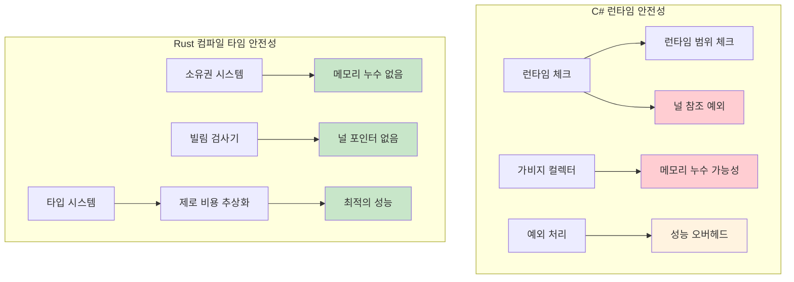

***

## 상속 vs 구성 (Inheritance vs Composition)

### C# - 클래스 기반 상속
```csharp
// C# - 클래스 기반 상속
public abstract class Animal
{
    public string Name { get; protected set; }
    public abstract void MakeSound();
    
    public virtual void Sleep()
    {
        Console.WriteLine($"{Name}가 잠을 잡니다");
    }
}

public class Dog : Animal
{
    public Dog(string name) { Name = name; }
    
    public override void MakeSound()
    {
        Console.WriteLine("멍멍!");
    }
}
```

### Rust 구성 모델 (Composition Model)
```rust
// Rust - 트레이트를 이용한 상속보다 구성 우선
pub trait Animal {
    fn name(&self) -> &str;
    fn make_sound(&self);
    
    // 기본 구현 (C# 가상 메서드와 유사)
    fn sleep(&self) {
        println!("{}가 잠을 잡니다", self.name());
    }
}

pub trait Flyable {
    fn fly(&self);
}

// 데이터와 동작을 분리
#[derive(Debug)]
pub struct Dog {
    name: String,
}

#[derive(Debug)]
pub struct Bird {
    name: String,
    wingspan: f64,
}

// 타입에 대한 동작 구현
impl Animal for Dog {
    fn name(&self) -> &str {
        &self.name
    }
    
    fn make_sound(&self) {
        println!("멍멍!");
    }
}

impl Dog {
    pub fn new(name: String) -> Self {
        Dog { name }
    }
}

impl Animal for Bird {
    fn name(&self) -> &str {
        &self.name
    }
    
    fn make_sound(&self) {
        println!("짹짹!");
    }
}

impl Flyable for Bird {
    fn fly(&self) {
        println!("{}가 {:.1}m의 날개로 날아갑니다", self.name, self.wingspan);
    }
}

// 다중 트레이트 바운드 (다중 인터페이스와 유사)
fn make_flying_animal_sound<T>(animal: &T) 
where 
    T: Animal + Flyable,
{
    animal.make_sound();
    animal.fly();
}
```

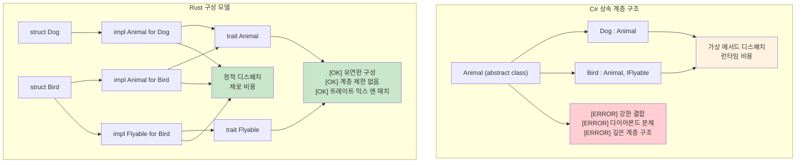

***

## 예외 vs Result<T, E> (Exceptions vs Result)

### C# 예외 기반 에러 처리
```csharp
// C# - 예외 기반 에러 처리
public class UserService
{
    public User GetUser(int userId)
    {
        if (userId <= 0)
        {
            throw new ArgumentException("사용자 ID는 양수여야 합니다");
        }
        
        var user = database.FindUser(userId);
        if (user == null)
        {
            throw new UserNotFoundException($"사용자 {userId}를 찾을 수 없음");
        }
        
        return user;
    }
}
```

### Rust Result 기반 에러 처리
```rust
#[derive(Debug)]
pub enum UserError {
    InvalidId(i32),
    NotFound(i32),
    NoEmail,
}

impl UserService {
    pub fn get_user(&self, user_id: i32) -> Result<User, UserError> {
        if user_id <= 0 {
            return Err(UserError::InvalidId(user_id));
        }
        
        self.database_find_user(user_id)
            .ok_or(UserError::NotFound(user_id))
    }
    
    pub fn get_user_email(&self, user_id: i32) -> Result<String, UserError> {
        let user = self.get_user(user_id)?; // ? 연산자가 에러를 전파함
        
        user.email
            .ok_or(UserError::NoEmail)
    }
}
```

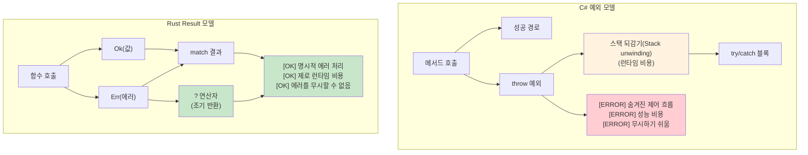

***

## LINQ vs Rust 반복자 (LINQ vs Rust Iterators)

### C# LINQ (Language Integrated Query)
```csharp
// C# LINQ - 선언적 데이터 처리
var numbers = new[] { 1, 2, 3, 4, 5, 6, 7, 8, 9, 10 };

var result = numbers
    .Where(n => n % 2 == 0)           // 짝수 필터링
    .Select(n => n * n)               // 제곱
    .Where(n => n > 10)               // 10보다 큰 것 필터링
    .OrderByDescending(n => n)        // 내림차순 정렬
    .Take(3)                          // 상위 3개 선택
    .ToList();                        // 실체화(Materialize)
```

### Rust 반복자 (Rust Iterators)
```rust
// Rust 반복자 - 지연 평가, 제로 비용 추상화
let numbers = vec![1, 2, 3, 4, 5, 6, 7, 8, 9, 10];

let result: Vec<i32> = numbers
    .iter()
    .filter(|&&n| n % 2 == 0)        // 짝수 필터링
    .map(|&n| n * n)                 // 제곱
    .filter(|&n| n > 10)             // 10보다 큰 것 필터링
    .collect::<Vec<_>>()             // Vec으로 수집
    .into_iter()
    .rev()                           // 반전 (내림차순 정렬 대용)
    .take(3)                         // 상위 3개 선택
    .collect();                      // 실체화
```

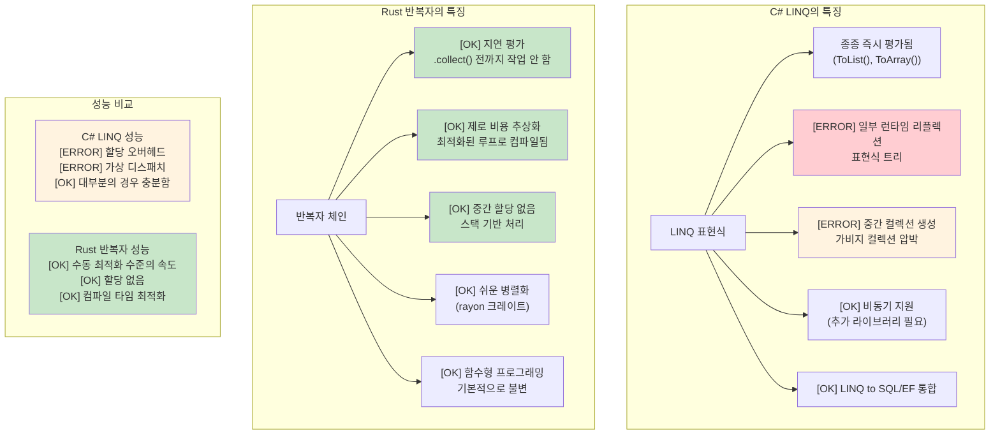

***

## 제네릭 제약 조건: where vs 트레이트 바운드 (Generic Constraints)

### C# 제네릭 제약 조건
```csharp
// C# where 절을 이용한 제네릭 제약 조건
public class Repository<T> where T : class, IEntity, new()
{
    public T Create()
    {
        return new T();  // new() 제약 조건으로 매개변수 없는 생성자 허용
    }
}
```

### Rust 트레이트 바운드를 이용한 제약 조건
```rust
// Rust 트레이트 바운드
pub struct Repository<T> 
where 
    T: Clone + Debug + Default,
{
    items: Vec<T>,
}

impl<T> Repository<T> 
where 
    T: Clone + Debug + Default,
{
    pub fn create(&self) -> T {
        T::default()  // Default 트레이트가 기본값 제공
    }
}
```

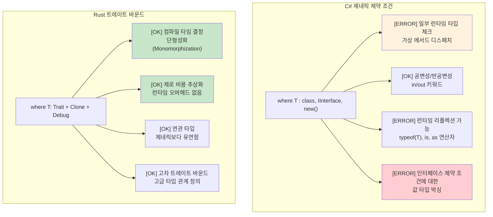

***

## 스레드 안전성: 관례 vs 타입 시스템 보장 (Thread Safety)

### C# - 관례에 따른 스레드 안전성
```csharp
// C# 컬렉션은 기본적으로 스레드 안전하지 않음
public class UserService
{
    private readonly List<string> items = new();

    // 데이터 경합 유발 가능:
    public void AddItem(string item)
    {
        items.Add(item);  // 스레드 안전하지 않음!
    }

    // 수동으로 락을 사용해야 함:
    private readonly object lockObject = new();

    public void SafeAddItem(string item)
    {
        lock (lockObject)
        {
            items.Add(item);  // 안전하지만 런타임 오버헤드 발생
        }
        // 다른 곳에서 락을 잊기 쉬움
    }
}
```

### Rust - 타입 시스템에 의해 보장되는 스레드 안전성
```rust
use std::sync::{Arc, Mutex, RwLock};
use std::thread;
use std::collections::HashMap;

// Rust는 컴파일 타임에 데이터 경합을 방지함
pub struct UserService {
    items: Arc<Mutex<Vec<String>>>,
    cache: Arc<RwLock<HashMap<i32, User>>>,
}

impl UserService {
    pub fn add_item(&self, item: String) {
        let mut items = self.items.lock().unwrap();
        items.push(item);
        // `items`가 범위를 벗어나면 자동으로 락이 해제됨
    }
    
    // 다중 읽기, 단일 쓰기 - 자동으로 강제됨
    pub async fn get_user(&self, user_id: i32) -> Option<User> {
        let cache = self.cache.read().unwrap();
        cache.get(&user_id).cloned()
    }
}

// 다음 코드는 컴파일되지 않음 - Rust는 안전하지 않은 가변 데이터 공유를 차단함:
fn impossible_data_race() {
    let mut items = vec![1, 2, 3];
    
    // items를 여러 클로저로 이동(move)시킬 수 없음
    /*
    thread::spawn(move || {
        items.push(4);  // ERROR: 이미 이동된 값 사용
    });
    */
}
```

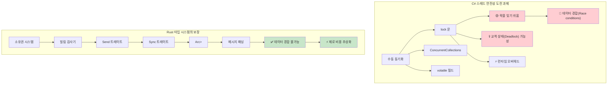

***

## 단계적 도입 전략 (Incremental Adoption Strategy)

### 1단계: 학습 및 실험 (1~4주 차)
커맨드 라인 도구(CLI)나 유틸리티부터 시작해 보세요. 예: 로그 파일 분석기.

### 2단계: 성능이 중요한 컴포넌트 교체 (5~8주 차)
CPU 집약적인 데이터 처리 로직을 Rust로 교체해 보세요. 예: 이미지 처리 마이크로서비스.

### 3단계: 새로운 마이크로서비스 구축 (9~12주 차)
처음부터 Rust로 새로운 서비스를 구축해 보세요. 예: 인증 서비스.

***

## C#에서 Rust로의 개념 매핑 (C# to Rust Concept Mapping)

### 의존성 주입(DI) → 생성자 주입 + 트레이트
C#의 DI 컨테이너 대신 Rust에서는 트레이트를 활용한 생성자 주입을 주로 사용합니다.

### LINQ → 반복자 체인
Rust의 반복자 체인은 C#의 LINQ에 대응하며, 제로 비용 추상화 덕분에 더 효율적입니다.

### Entity Framework → SQLx + 마이그레이션
SQLx는 컴파일 타임에 쿼리를 검증하며, EF와 유사한 개발 경험을 제공합니다.

### 설정(Configuration) → Config 크레이트
C#의 IConfiguration 대신 Rust에서는 `config`와 `serde`를 결합하여 설정을 관리합니다.

***

## 팀 도입 타임라인 (Team Adoption Timeline)

### 1개월 차: 기초 다지기
- 구문 및 소유권 이해
- 에러 처리 및 타입 시스템 익히기

### 2개월 차: 실전 적용
- 트레이트 및 제네릭 활용
- 비동기 프로그래밍 및 동시성 제어

### 3개월 차 이상: 운영 환경 통합
- 실제 프로젝트 적용
- 성능 프로파일링 및 최적화

***

## 성능 비교: 관리형 vs 네이티브 (Performance Comparison)

### 실제 성능 특성

| **항목** | **C# (.NET)** | **Rust** | **성능 영향** |
|------------|---------------|----------|------------------------|
| **시작 시간** | 100-500ms (JIT 컴파일) | 1-10ms (네이티브 바이너리) | 🚀 **50-500배 빠름** |
| **메모리 사용량** | +30-100% (GC 오버헤드 + 메타데이터) | 기준점 (최소한의 런타임) | 💾 **30-50% 적은 RAM 사용** |
| **GC 중단** | 1-100ms 주기적 중단 | 없음 (GC 없음) | ⚡ **일관된 지연 시간** |
| **바이너리 크기** | 30-200MB (런타임 포함) | 1-20MB (정적 바이너리) | 📦 **10배 작은 배포 크기** |

### 마이그레이션 전략 결정 트리

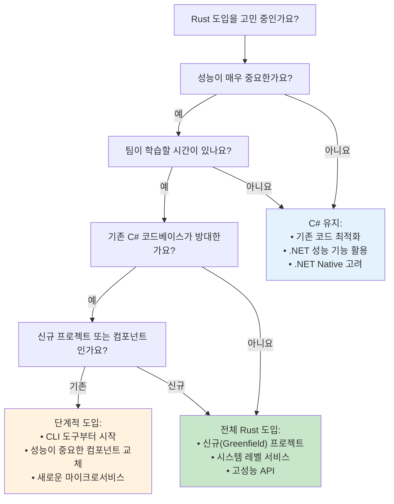

***

## C# 개발자를 위한 권장 사례 (Best Practices for C# Developers)

### 1. 사고방식의 전환 (Mindset Shifts)
- **GC에서 소유권으로**: 누가 데이터를 소유하고 언제 해제되는지 생각하세요.
- **예외에서 Result로**: 에러 처리를 명시적이고 시각적으로 만드세요.
- **상속에서 구성으로**: 트레이트를 사용하여 동작을 조합하세요.
- **Null에서 Option으로**: 값이 없음을 타입 시스템에서 명시적으로 표현하세요.

### 2. 흔히 저지르는 실수 피하기
- **상속을 구현하려고 하지 마세요**: Rust에는 클래스 상속이 없습니다. 대신 트레이트 구성을 사용하세요.
- **모든 곳에 unwrap()을 사용하지 마세요**: 이는 예외를 무시하는 것과 같습니다. 에러를 제대로 처리하세요.
- **모든 것을 clone() 하지 마세요**: 불필요한 객체 복사는 피하고, 가능한 경우 빌림(Borrowing)을 사용하세요.
- **모든 곳에 RefCell을 사용하지 마세요**: 내부 가변성은 꼭 필요한 경우에만 신중하게 사용하세요.

이 가이드는 C# 개발자들이 기존 지식을 Rust로 어떻게 전환할 수 있는지에 대한 포괄적인 이해를 돕습니다. Rust의 제약 조건(소유권 등)은 초기 학습 난이도가 높을 수 있지만, C#에서 발생할 수 있는 수많은 버그를 컴파일 타임에 차단하기 위해 설계된 강력한 도구임을 이해하는 것이 중요합니다.
