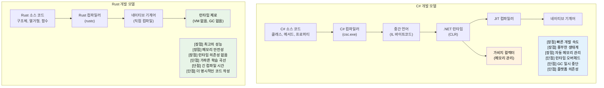

## 강연자 소개 및 일반적인 접근 방식

- 강연자 소개
    - Microsoft SCHIE(Silicon and Cloud Hardware Infrastructure Engineering) 팀의 수석 펌웨어 아키텍트
    - 보안, 시스템 프로그래밍(펌웨어, 운영체제, 하이퍼바이저), CPU 및 플랫폼 아키텍처, C++ 시스템 분야의 업계 베테랑
    - 2017년(@AWS EC2)부터 Rust로 프로그래밍을 시작했으며, 그 이후로 줄곧 이 언어의 매력에 빠져 있음
- 본 과정은 최대한 대화식으로 진행될 예정입니다.
    - 가정: 여러분은 C# 및 .NET 개발에 익숙합니다.
    - 예제들은 의도적으로 C# 개념을 그에 대응하는 Rust 개념으로 매핑하여 설명합니다.
    - **궁금한 점이 생기면 언제든 질문해 주시기 바랍니다.**

---

## C# 개발자에게 Rust가 필요한 이유

> **학습 목표:** C# 개발자에게 Rust가 왜 중요한지 알아봅니다. 매니지드(Managed) 코드와 네이티브(Native) 코드 사이의 성능 격차, Rust가 컴파일 타임에 null 참조 예외와 숨겨진 제어 흐름을 제거하는 방법, 그리고 Rust가 C#을 보완하거나 대체할 수 있는 주요 시나리오를 살펴봅니다.
>
> **난이도:** 🟢 초급

### 런타임 비용 없는 성능
```csharp
// C# - 생산성은 훌륭하지만 런타임 오버헤드가 있음
public class DataProcessor
{
    private List<int> data = new List<int>();
    
    public void ProcessLargeDataset()
    {
        // 할당 시 가비지 컬렉션(GC) 발생
        for (int i = 0; i < 10_000_000; i++)
        {
            data.Add(i * 2); // GC 압박 발생
        }
        // 처리 중 예측 불가능한 GC 일시 중단 발생 가능
    }
}
// 실행 시간: 가변적 (GC로 인해 50-200ms)
// 메모리: ~80MB (GC 오버헤드 포함)
// 예측 가능성: 낮음 (GC 일시 중단 때문)
```

```rust
// Rust - 표현력은 동일하면서 런타임 오버헤드는 제로
struct DataProcessor {
    data: Vec<i32>,
}

impl DataProcessor {
    fn process_large_dataset(&mut self) {
        // 제로 비용 추상화(Zero-cost abstraction)
        for i in 0..10_000_000 {
            self.data.push(i * 2); // GC 압박 없음
        }
        // 결정론적인 성능
    }
}
// 실행 시간: 일관적 (~30ms)
// 메모리: ~40MB (정확한 할당량)
// 예측 가능성: 높음 (GC 없음)
```

### 런타임 체크 없는 메모리 안전성
```csharp
// C# - 오버헤드가 수반되는 런타임 안전성
public class RuntimeCheckedOperations
{
    public string? ProcessArray(int[] array)
    {
        // 모든 접근 시마다 런타임 경계 검사(Bounds checking) 수행
        if (array.Length > 0)
        {
            return array[0].ToString(); // 안전함 — int는 값 타입이므로 절대 null이 아님
        }
        return null; // Null 허용 반환 (C# 8+의 null 허용 참조 타입 사용 시 string?)
    }
    
    public void ProcessConcurrently()
    {
        var list = new List<int>();
        
        // 데이터 경합(Data race) 가능성 있음, 주의 깊은 락(Lock) 처리 필요
        Parallel.For(0, 1000, i =>
        {
            lock (list) // 런타임 오버헤드 발생
            {
                list.Add(i);
            }
        });
    }
}
```

```rust
// Rust - 런타임 비용 없이 컴파일 타임에 보장되는 안전성
struct SafeOperations;

impl SafeOperations {
    // 컴파일 타임 null 안전성, 런타임 체크 없음
    fn process_array(array: &[i32]) -> Option<String> {
        array.first().map(|x| x.to_string())
        // null 참조 발생 불가능
        // 안전함이 증명될 경우 경계 검사는 최적화되어 제거됨
    }
    
    fn process_concurrently() {
        use std::sync::{Arc, Mutex};
        use std::thread;
        
        let data = Arc::new(Mutex::new(Vec::new()));
        
        // 데이터 경합을 컴파일 타임에 방지
        let handles: Vec<_> = (0..1000).map(|i| {
            let data = Arc::clone(&data);
            thread::spawn(move || {
                data.lock().unwrap().push(i);
            })
        }).collect();
        
        for handle in handles {
            handle.join().unwrap();
        }
    }
}
```

***

## Rust가 해결하는 C#의 일반적인 고충들

### 1. 10억 달러짜리 실수: Null 참조
```csharp
// C# - Null 참조 예외는 런타임의 시한폭탄과 같습니다.
public class UserService
{
    public string GetUserDisplayName(User user)
    {
        // 이 중 어느 것이든 NullReferenceException을 던질 수 있습니다.
        return user.Profile.DisplayName.ToUpper();
        //     ^^^^^ ^^^^^^^ ^^^^^^^^^^^ ^^^^^^^
        //     런타임에 null일 가능성 있음
    }
    
    // Null 허용 참조 타입(C# 8+)을 사용하더라도
    public string GetDisplayName(User? user)
    {
        return user?.Profile?.DisplayName?.ToUpper() ?? "Unknown";
        // 여전히 런타임에 null이 발생할 가능성이 존재합니다.
    }
}
```

```rust
// Rust - 컴파일 타임에 보장되는 null 안전성
struct UserService;

impl UserService {
    fn get_user_display_name(user: &User) -> Option<String> {
        user.profile.as_ref()?
            .display_name.as_ref()
            .map(|name| name.to_uppercase())
        // 컴파일러가 None 케이스를 반드시 처리하도록 강제함
        // Null 포인터 예외 발생 자체가 불가능함
    }
    
    fn get_display_name_safe(user: Option<&User>) -> String {
        user.and_then(|u| u.profile.as_ref())
            .and_then(|p| p.display_name.as_ref())
            .map(|name| name.to_uppercase())
            .unwrap_or_else(|| "Unknown".to_string())
        // 명시적인 처리, 예상치 못한 상황 없음
    }
}
```

### 2. 숨겨진 예외와 제어 흐름
```csharp
// C# - 예외는 어디서든 던져질 수 있습니다.
public async Task<UserData> GetUserDataAsync(int userId)
{
    // 각 호출마다 서로 다른 예외가 발생할 수 있습니다.
    var user = await userRepository.GetAsync(userId);        // SqlException 발생 가능
    var permissions = await permissionService.GetAsync(user); // HttpRequestException 발생 가능
    var preferences = await preferenceService.GetAsync(user); // TimeoutException 발생 가능
    
    return new UserData(user, permissions, preferences);
    // 호출자는 어떤 예외를 기대해야 할지 알기 어렵습니다.
}
```

```rust
// Rust - 모든 에러가 함수 시그니처에 명시됨
#[derive(Debug)]
enum UserDataError {
    DatabaseError(String),
    NetworkError(String),
    Timeout,
    UserNotFound(i32),
}

async fn get_user_data(user_id: i32) -> Result<UserData, UserDataError> {
    // 모든 에러가 명시적이며 처리됨
    let user = user_repository.get(user_id).await
        .map_err(UserDataError::DatabaseError)?;
    
    let permissions = permission_service.get(&user).await
        .map_err(UserDataError::NetworkError)?;
    
    let preferences = preference_service.get(&user).await
        .map_err(|_| UserDataError::Timeout)?;
    
    Ok(UserData::new(user, permissions, preferences))
    // 호출자는 발생 가능한 에러를 정확히 알 수 있습니다.
}
```

### 3. 정확성: 증명 엔진으로서의 타입 시스템

Rust의 타입 시스템은 C#이 런타임에만 잡을 수 있거나 아예 잡지 못하는 로직 버그들을 컴파일 타임에 포착합니다.

#### ADT(대수적 데이터 타입) vs Sealed Class 우회책
```csharp
// C# — 구별된 공용체(Discriminated Union)를 구현하려면 Sealed Class 보일러플레이트가 필요합니다.
// 컴파일러는 catch-all 패턴(_)이 없을 때만 누락된 케이스에 대해 경고(CS8524)를 보냅니다.
// 실제로 대부분의 C# 코드는 _를 기본값으로 사용하여 경고를 무시하게 만듭니다.
public abstract record Shape;
public sealed record Circle(double Radius)   : Shape;
public sealed record Rectangle(double W, double H) : Shape;
public sealed record Triangle(double A, double B, double C) : Shape;

public static double Area(Shape shape) => shape switch
{
    Circle c    => Math.PI * c.Radius * c.Radius,
    Rectangle r => r.W * r.H,
    // Triangle을 잊으셨나요? _ 패턴이 컴파일러 경고를 숨겨버립니다.
    _           => throw new ArgumentException("Unknown shape")
};
// 6개월 후에 새로운 도형을 추가하면 — _ 패턴이 누락된 케이스를 숨깁니다.
// 업데이트가 필요한 47개의 switch 표현식에 대해 컴파일러는 아무런 말도 해주지 않습니다.
```

```rust
// Rust — ADT + 철저한 매칭 = 컴파일 타임 증명
enum Shape {
    Circle { radius: f64 },
    Rectangle { w: f64, h: f64 },
    Triangle { a: f64, b: f64, c: f64 },
}

fn area(shape: &Shape) -> f64 {
    match shape {
        Shape::Circle { radius }    => std::f64::consts::PI * radius * radius,
        Shape::Rectangle { w, h }   => w * h,
        // Triangle을 누락했나요? 에러 발생: non-exhaustive pattern
        Shape::Triangle { a, b, c } => {
            let s = (a + b + c) / 2.0;
            (s * (s - a) * (s - b) * (s - c)).sqrt()
        }
    }
}
// 새로운 변형을 추가하면 → 컴파일러가 업데이트가 필요한 모든 match 문을 알려줍니다.
```

#### 기본 불변성 vs 선택적 불변성
```csharp
// C# — 기본적으로 모든 것이 가변적입니다.
public class Config
{
    public string Host { get; set; }   // 기본적으로 가변적
    public int Port { get; set; }
}

// "readonly"나 "record"가 도움이 되지만, 깊은 수준의 변경(Deep mutation)을 막지는 못합니다:
public record ServerConfig(string Host, int Port, List<string> AllowedOrigins);

var config = new ServerConfig("localhost", 8080, new List<string> { "*.example.com" });
// Record는 "불변"이지만 참조 타입 필드는 그렇지 않습니다:
config.AllowedOrigins.Add("*.evil.com"); // 컴파일이 되고 상태가 변경됨! ← 버그 발생
// 컴파일러는 어떠한 경고도 주지 않습니다.
```

```rust
// Rust — 기본적으로 불변이며, 변경은 명시적이고 눈에 보입니다.
struct Config {
    host: String,
    port: u16,
    allowed_origins: Vec<String>,
}

let config = Config {
    host: "localhost".into(),
    port: 8080,
    allowed_origins: vec!["*.example.com".into()],
};

// config.allowed_origins.push("*.evil.com".into()); // 에러: 가변으로 빌릴 수 없음

// 변경을 위해서는 명시적인 선택이 필요합니다:
let mut config = config;
config.allowed_origins.push("*.safe.com".into()); // 확인 가능 — 명시적으로 가변임

// 시그니처의 "mut"은 모든 독자에게 "이 함수는 데이터를 수정함"을 알려줍니다.
fn add_origin(config: &mut Config, origin: String) {
    config.allowed_origins.push(origin);
}
```

#### 함수형 프로그래밍: 일등 시민 vs 사후 도입
```csharp
// C# — FP가 나중에 추가됨; LINQ는 표현력이 좋지만 언어 구조와 충돌할 때가 있습니다.
public IEnumerable<Order> GetHighValueOrders(IEnumerable<Order> orders)
{
    return orders
        .Where(o => o.Total > 1000)   // Func<Order, bool> — 힙에 할당되는 델리게이트
        .Select(o => new OrderSummary  // 익명 타입 또는 추가 클래스 필요
        {
            Id = o.Id,
            Total = o.Total
        })
        .OrderByDescending(o => o.Total);
    // 결과에 대한 철저한 매칭 불가
    // 파이프라인 어디에서든 null이 스며들 수 있음
    // 순수성(Purity) 강제 불가 — 모든 람다가 사이드 이펙트를 가질 수 있음
}
```

```rust
// Rust — FP는 일등 시민(First-class citizen)입니다.
fn get_high_value_orders(orders: &[Order]) -> Vec<OrderSummary> {
    orders.iter()
        .filter(|o| o.total > 1000)      // 제로 비용 클로저, 힙 할당 없음
        .map(|o| OrderSummary {           // 타입 체크가 되는 구조체
            id: o.id,
            total: o.total,
        })
        .sorted_by(|a, b| b.total.cmp(&a.total)) // itertools 사용
        .collect()
    // 파이프라인 어디에도 null이 없음
    // 클로저는 단형성화(Monomorphized)됨 — 직접 짠 루프와 오버헤드 차이 없음
    // 순수성 강제: &[Order]는 함수가 orders를 수정할 수 없음을 의미함
}
```

#### 상속: 이론적으로는 우아하지만 실제로는 취약함
```csharp
// C# — 취약한 기반 클래스(Fragile Base Class) 문제
public class Animal
{
    public virtual string Speak() => "...";
    public void Greet() => Console.WriteLine($"I say: {Speak()}");
}

public class Dog : Animal
{
    public override string Speak() => "Woof!";
}

public class RobotDog : Dog
{
    // Greet()은 어떤 Speak()를 호출할까요? Dog이 변경되면 어떻게 될까요?
    // 인터페이스 + 기본 메서드 사용 시 다이아몬드 문제 발생
    // 강한 결합: Animal을 변경하면 RobotDog이 소리 없이 망가질 수 있음
}

// 일반적인 C# 안티 패턴:
// - 20개의 가상 메서드를 가진 거대한 기반 클래스
// - 아무도 추론할 수 없는 깊은 계층 구조 (5단계 이상)
// - 숨겨진 결합을 만드는 "protected" 필드
// - 파생 클래스의 동작을 소리 없이 바꾸는 기반 클래스의 변경
```

```rust
// Rust — 상속 대신 구성을 사용하며, 언어 차원에서 이를 강제합니다.
trait Speaker {
    fn speak(&self) -> &str;
}

trait Greeter: Speaker {
    fn greet(&self) {
        println!("I say: {}", self.speak());
    }
}

struct Dog;
impl Speaker for Dog {
    fn speak(&self) -> &str { "Woof!" }
}
impl Greeter for Dog {} // 기본 greet() 사용

struct RobotDog {
    voice: String, // 구성(Composition): 자신의 데이터를 직접 소유함
}
impl Speaker for RobotDog {
    fn speak(&self) -> &str { &self.voice }
}
impl Greeter for RobotDog {} // 명확하고 명시적인 동작

// 취약한 기반 클래스 문제 없음 — 기반 클래스 자체가 존재하지 않음
// 숨겨진 결합 없음 — 트레이트는 명시적인 계약임
// 다이아몬드 문제 없음 — 트레이트 일관성 규칙이 모호성을 방지함
// Speaker에 메서드를 추가하면? 컴파일러가 이를 구현해야 할 모든 곳을 알려줍니다.
```

> **핵심 통찰**: C#에서 정확성은 일종의 규율입니다. 개발자가 관습을 따르고, 테스트를 작성하며, 코드 리뷰에서 에지 케이스를 잡아내기를 바라야 합니다. 반면 Rust에서 정확성은 **타입 시스템의 속성**입니다. null 역참조, 누락된 변형 처리, 실수로 인한 상태 변경, 데이터 경합과 같은 범주의 버그들은 구조적으로 발생이 불가능합니다.

***

### 4. 가비지 컬렉션(GC)으로 인한 예측 불가능한 성능
```csharp
// C# - GC는 언제든 작동할 수 있습니다.
public class HighFrequencyTrader
{
    private List<Trade> trades = new List<Trade>();
    
    public void ProcessMarketData(MarketTick tick)
    {
        // 최악의 타이밍에 할당으로 인해 GC가 트리거될 수 있음
        var analysis = new MarketAnalysis(tick);
        trades.Add(new Trade(analysis.Signal, tick.Price));
        
        // 중요한 시장 변화 순간에 GC가 일시 중단될 수 있음
        // 중단 시간: 힙 크기에 따라 1-100ms 발생
    }
}
```

```rust
// Rust - 예측 가능하고 결정론적인 성능
struct HighFrequencyTrader {
    trades: Vec<Trade>,
}

impl HighFrequencyTrader {
    fn process_market_data(&mut self, tick: MarketTick) {
        // 할당 제로, 예측 가능한 성능
        let analysis = MarketAnalysis::from(tick);
        self.trades.push(Trade::new(analysis.signal(), tick.price));
        
        // GC 중단 없음, 일관된 마이크로초 미만 지연 시간
        // 타입 시스템에 의해 성능이 보장됨
    }
}
```

***

## C# 대신 Rust를 선택해야 할 때

### ✅ 다음과 같은 경우 Rust를 선택하세요:
- **정확성이 중요할 때**: 상태 머신, 프로토콜 구현, 금융 로직 등 케이스 하나를 놓치는 것이 테스트 실패가 아닌 운영 사고로 이어지는 경우
- **성능이 결정적일 때**: 실시간 시스템, 고주파 매매(HFT), 게임 엔진
- **메모리 사용량이 중요할 때**: 임베디드 시스템, 클라우드 비용 절감, 모바일 애플리케이션
- **예측 가능성이 요구될 때**: 의료 기기, 자동차, 금융 시스템
- **보안이 최우선일 때**: 암호학, 네트워크 보안, 시스템 레벨 코드
- **장시간 실행되는 서비스**: GC 일시 중단이 문제가 되는 경우
- **리소스가 제한된 환경**: IoT, 에지 컴퓨팅
- **시스템 프로그래밍**: CLI 도구, 데이터베이스, 웹 서버, 운영체제

### ✅ 다음과 같은 경우 C#을 유지하세요:
- **빠른 애플리케이션 개발**: 비즈니스 앱, CRUD 애플리케이션
- **거대한 기존 코드베이스**: 마이그레이션 비용이 너무 클 때
- **팀의 전문성**: Rust 학습 곡선을 감수할 만큼의 이점이 없을 때
- **엔터프라이즈 통합**: .NET Framework/Windows 의존성이 강할 때
- **GUI 애플리케이션**: WPF, WinUI, Blazor 생태계 활용 시
- **출시 속도(Time to Market)**: 성능보다 개발 속도가 더 중요할 때

### 🔄 하이브리드 접근 방식 고려:
- **성능이 중요한 컴포넌트는 Rust로**: P/Invoke를 통해 C#에서 호출
- **비즈니스 로직은 C#으로**: 익숙하고 생산적인 개발 환경 유지
- **점진적 마이그레이션**: 새로운 서비스부터 Rust로 시작

***

## 실제 사례: 기업들이 Rust를 선택하는 이유

### Dropbox: 스토리지 인프라
- **이전 (Python)**: 높은 CPU 사용률, 메모리 오버헤드 발생
- **이후 (Rust)**: 성능 10배 향상, 메모리 50% 절감
- **결과**: 인프라 비용 수백만 달러 절감

### Discord: 음성/영상 백엔드  
- **이전 (Go)**: GC 일시 중단으로 인한 오디오 끊김 발생
- **이후 (Rust)**: 일관된 저지연 성능 확보
- **결과**: 사용자 경험 개선 및 서버 비용 절감

### Microsoft: Windows 컴포넌트
- **Windows에서의 Rust**: 파일 시스템, 네트워킹 스택 컴포넌트에 적용
- **이점**: 성능 손실 없는 메모리 안전성 확보
- **영향**: 보안 취약점 감소, 성능은 동일하게 유지

### C# 개발자에게 이것이 중요한 이유:
1. **보완적 기술**: Rust와 C#은 서로 다른 문제를 해결합니다.
2. **커리어 성장**: 시스템 프로그래밍 전문 지식의 가치가 점점 높아지고 있습니다.
3. **성능에 대한 이해**: 제로 비용 추상화에 대해 배울 수 있습니다.
4. **안전성 마인드셋**: 소유권 사고방식을 어떤 언어에든 적용할 수 있습니다.
5. **클라우드 비용**: 성능은 인프라 지출에 직접적인 영향을 미칩니다.

***

## 언어 철학 비교

### C# 철학
- **생산성 우선**: 풍부한 도구, 방대한 프레임워크, "성공의 구덩이(Pit of Success)" 지향
- **매니지드 런타임**: 가비지 컬렉터가 메모리를 자동으로 관리함
- **엔터프라이즈 중심**: 리플렉션을 포함한 강한 타입 시스템, 방대한 표준 라이브러리
- **객체 지향**: 클래스, 상속, 인터페이스를 주요 추상화 수단으로 사용

### Rust 철학
- **희생 없는 성능**: 제로 비용 추상화, 런타임 오버헤드 없음
- **메모리 안전성**: 컴파일 타임 보장을 통해 크래시와 보안 취약점 방지
- **시스템 프로그래밍**: 고수준 추상화와 하드웨어 직접 제어의 공존
- **함수형 + 시스템**: 기본 불변성, 소유권 기반의 리소스 관리



***

## 빠른 참조: Rust vs C#

| **개념** | **C#** | **Rust** | **주요 차이점** |
|-------------|--------|----------|-------------------|
| 메모리 관리 | 가비지 컬렉터 | 소유권 시스템 | 비용 없는 결정론적 정리 |
| Null 참조 | 어디에나 `null` 존재 | `Option<T>` | 컴파일 타임 null 안전성 |
| 에러 핸들링 | 예외 (Exceptions) | `Result<T, E>` | 명시적 처리, 숨겨진 흐름 없음 |
| 가변성 | 기본적으로 가변적 | 기본적으로 불변적 | 변경 시 명시적 선택 필요 |
| 타입 시스템 | 참조/값 타입 | 소유권 기반 타입 | 이동 의미론, 빌림(Borrowing) |
| 어셈블리 | GAC, AppDomain | 크레이트 (Crates) | 정적 링크, 런타임 없음 |
| 네임스페이스 | `using System.IO` | `use std::fs` | 모듈 시스템 |
| 인터페이스 | `interface IFoo` | `trait Foo` | 기본 구현 포함 가능 |
| 제네릭 | `List<T> where T : class` | `Vec<T> where T: Clone` | 제로 비용 추상화 |
| 스레딩 | lock, async/await | 소유권 + Send/Sync | 데이터 경합 방지 |
| 성능 | JIT 컴파일 | AOT 컴파일 | 예측 가능, GC 중단 없음 |

***
