## 진정한 불변성 vs Record의 환상

> **학습 목표:** C#의 `record` 타입이 왜 진정한 의미의 불변이 아닌지(가변 필드, 리플렉션을 통한 우회 등) 알아보고, Rust가 컴파일 타임에 어떻게 실질적인 불변성을 강제하는지, 그리고 내부 가변성(Interior mutability) 패턴은 언제 사용하는지 배웁니다.
>
> **Difficulty:** 🟡 중급

### C# Record - 불변성 시늉(Immutability Theater)
```csharp
// C# record는 불변처럼 보이지만 탈출구가 존재합니다.
public record Person(string Name, int Age, List<string> Hobbies);

var person = new Person("홍길동", 30, new List<string> { "독서" });

// 이 코드들은 모두 새로운 인스턴스를 생성하는 것처럼 "보입니다":
var older = person with { Age = 31 };  // 새로운 record
var renamed = person with { Name = "고길동" };  // 새로운 record

// 하지만 참조 타입 필드는 여전히 가변적입니다!
person.Hobbies.Add("게임");  // 원본 객체가 수정됨!
Console.WriteLine(older.Hobbies.Count);  // 2 - 나이가 든 홍길동도 영향을 받음!
Console.WriteLine(renamed.Hobbies.Count); // 2 - 이름이 바뀐 홍길동도 영향을 받음!

// Init-only 프로퍼티조차 리플렉션을 통해 설정될 수 있습니다.
typeof(Person).GetProperty("Age")?.SetValue(person, 25);

// 컬렉션 표현식을 써도 근본적인 문제는 해결되지 않습니다.
public record BetterPerson(string Name, int Age, IReadOnlyList<string> Hobbies);

var betterPerson = new BetterPerson("성춘향", 25, new List<string> { "그림" });
// 캐스팅을 통해 여전히 수정 가능합니다: 
((List<string>)betterPerson.Hobbies).Add("시스템 해킹");

// 심지어 "Immutable" 컬렉션도 진정한 의미의 불변은 아닙니다.
using System.Collections.Immutable;
public record SafePerson(string Name, int Age, ImmutableList<string> Hobbies);
// 이것이 더 낫긴 하지만, 팀 차원의 규율이 필요하며 성능 오버헤드가 따릅니다.
```

### Rust - 기본적으로 적용되는 진정한 불변성
```rust
#[derive(Debug, Clone)]
struct Person {
    name: String,
    age: u32,
    hobbies: Vec<String>,
}

let person = Person {
    name: "홍길동".to_string(),
    age: 30,
    hobbies: vec!["독서".to_string()],
};

// 다음 코드는 컴파일조차 되지 않습니다:
// person.age = 31;  // 에러: 불변 필드에 값을 할당할 수 없음
// person.hobbies.push("게임".to_string());  // 에러: 가변으로 빌릴 수 없음

// 값을 수정하려면 'mut'을 통해 명시적으로 선택해야 합니다:
let mut older_person = person.clone();
older_person.age = 31;  // 이제 이것이 상태 변경(Mutation)임이 명확해집니다.

// 또는 함수형 업데이트 패턴을 사용합니다:
let renamed = Person {
    name: "고길동".to_string(),
    ..person  // 다른 필드들을 복사함 (이동 의미론이 적용됨)
};

// 원본은 (이동되지 않는 한) 절대 변하지 않음을 보장받습니다:
println!("{:?}", person.hobbies);  // 항상 ["독서"] - 불변 유지

// 효율적인 불변 데이터 구조를 통한 구조적 공유(Structural sharing)
use std::rc::Rc;

#[derive(Debug, Clone)]
struct EfficientPerson {
    name: String,
    age: u32,
    hobbies: Rc<Vec<String>>,  // 공유되는 불변 참조
}

// 새로운 버전을 생성할 때 데이터를 효율적으로 공유합니다.
let person1 = EfficientPerson {
    name: "앨리스".to_string(),
    age: 30,
    hobbies: Rc::new(vec!["독서".to_string(), "자전거".to_string()]),
};

let person2 = EfficientPerson {
    name: "밥".to_string(),
    age: 25,
    hobbies: Rc::clone(&person1.hobbies),  // 깊은 복사 없이 참조만 공유
};
```



```mermaid
graph TD
    subgraph "C# Record - 얕은 불변성(Shallow Immutability)"
        CS_RECORD["record Person(...)"]
        CS_WITH["with 표현식"]
        CS_SHALLOW["⚠️ 최상위 레벨만 불변"]
        CS_REF_MUT["❌ 참조 타입은 여전히 가변적"]
        CS_REFLECTION["❌ 리플렉션으로 우회 가능"]
        CS_RUNTIME["❌ 런타임의 예상치 못한 동작"]
        CS_DISCIPLINE["😓 팀의 엄격한 규율 필요"]
        
        CS_RECORD --> CS_WITH
        CS_WITH --> CS_SHALLOW
        CS_SHALLOW --> CS_REF_MUT
        CS_RECORD --> CS_REFLECTION
        CS_REF_MUT --> CS_RUNTIME
        CS_RUNTIME --> CS_DISCIPLINE
    end
    
    subgraph "Rust - 진정한 불변성"
        RUST_STRUCT["struct Person { ... }"]
        RUST_DEFAULT["✅ 기본적으로 불변"]
        RUST_COMPILE["✅ 컴파일 타임에 강제"]
        RUST_MUT["🔒 명시적인 'mut' 필요"]
        RUST_MOVE["🔄 이동 의미론(Move semantics)"]
        RUST_ZERO["⚡ 런타임 오버헤드 제로"]
        RUST_SAFE["🛡️ 메모리 안전성 확보"]
        
        RUST_STRUCT --> RUST_DEFAULT
        RUST_DEFAULT --> RUST_COMPILE
        RUST_COMPILE --> RUST_MUT
        RUST_MUT --> RUST_MOVE
        RUST_MOVE --> RUST_ZERO
        RUST_ZERO --> RUST_SAFE
    end
    
    style CS_REF_MUT fill:#ffcdd2,color:#000
    style CS_REFLECTION fill:#ffcdd2,color:#000
    style CS_RUNTIME fill:#ffcdd2,color:#000
    style RUST_COMPILE fill:#c8e6c9,color:#000
    style RUST_ZERO fill:#c8e6c9,color:#000
    style RUST_SAFE fill:#c8e6c9,color:#000
```

---

## 연습 문제

<details>
<summary><strong>🏋️ 실습: 불변성 증명하기</strong> (펼치기)</summary>

C# 동료가 자신의 `record`는 불변이라고 주장합니다. 다음 C# 코드를 Rust로 번역하고, 왜 Rust 버전이 진정으로 불변인지 설명해 보세요:

```csharp
public record Config(string Host, int Port, List<string> AllowedOrigins);

var config = new Config("localhost", 8080, new List<string> { "example.com" });
// "불변" record지만...
config.AllowedOrigins.Add("evil.com"); // 컴파일이 됨! List는 가변적임.
```

1. **진정으로** 불변인 대응 구조체를 Rust로 만드세요.
2. `allowed_origins`를 수정하려는 시도가 **컴파일 에러**를 발생시킴을 보여주세요.
3. 상태 변경(Mutation) 없이 수정된 복사본(새로운 호스트)을 생성하는 함수를 작성하세요.

<details>
<summary>🔑 해답</summary>

```rust
#[derive(Debug, Clone)]
struct Config {
    host: String,
    port: u16,
    allowed_origins: Vec<String>,
}

impl Config {
    fn with_host(&self, host: impl Into<String>) -> Self {
        Config {
            host: host.into(),
            ..self.clone()
        }
    }
}

fn main() {
    let config = Config {
        host: "localhost".into(),
        port: 8080,
        allowed_origins: vec!["example.com".into()],
    };

    // config.allowed_origins.push("evil.com".into());
    // ❌ 에러: `config.allowed_origins`를 가변으로 빌릴 수 없음

    let production = config.with_host("prod.example.com");
    println!("개발 환경: {:?}", config);       // 원본은 변경되지 않음
    println!("운영 환경: {:?}", production);  // 호스트가 다른 새로운 복사본
}
```

**핵심 통찰**: Rust에서 `let config = ...` (`mut` 없음)는 내포된 `Vec`을 포함하여 *전체 값 트리*를 불변으로 만듭니다. C# record는 *참조* 자체만 불변으로 만들 뿐, 그 내용물까지 보호하지는 못합니다.

</details>
</details>

***
