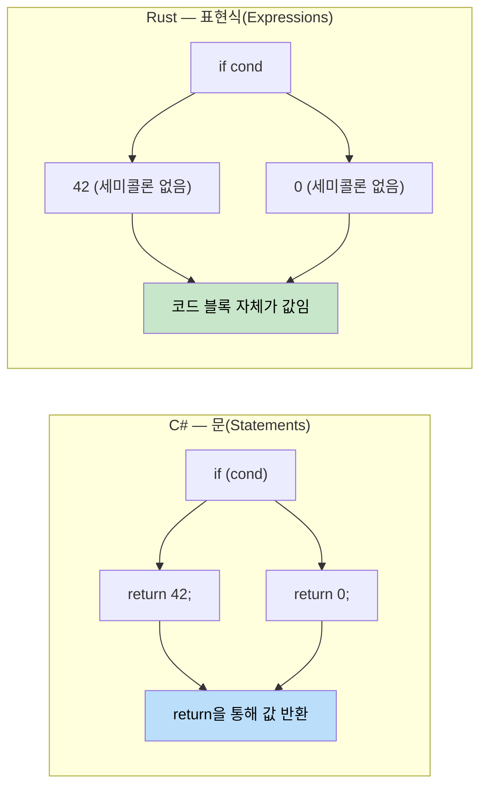

## 함수(Function) vs 메서드(Method)

> **학습 목표:** Rust와 C#의 함수 및 메서드를 비교하고, 표현식(Expression)과 문(Statement)의 핵심적인 차이를 이해합니다. `if`, `match`, `loop`, `while`, `for` 구문을 익히며, Rust의 표현식 중심 설계가 어떻게 삼항 연산자를 대체하는지 배웁니다.
>
> **난이도:** 🟢 초급

### C# 함수 선언
```csharp
// C# - 클래스 내의 메서드
public class Calculator
{
    // 인스턴스 메서드
    public int Add(int a, int b)
    {
        return a + b;
    }
    
    // 정적(Static) 메서드
    public static int Multiply(int a, int b)
    {
        return a * b;
    }
    
    // ref 매개변수를 가진 메서드
    public void Increment(ref int value)
    {
        value++;
    }
}
```

### Rust 함수 선언
```rust
// Rust - 독립 함수(Standalone function)
fn add(a: i32, b: i32) -> i32 {
    a + b  // 마지막 표현식에는 'return'이 필요 없습니다.
}

fn multiply(a: i32, b: i32) -> i32 {
    return a * b;  // 명시적으로 return을 사용해도 괜찮습니다.
}

// 가변 참조를 사용하는 함수
fn increment(value: &mut i32) {
    *value += 1;
}

fn main() {
    let result = add(5, 3);
    println!("5 + 3 = {}", result);
    
    let mut x = 10;
    increment(&mut x);
    println!("증가 후: {}", x);
}
```

### 표현식(Expression) vs 문(Statement) (중요!)



```csharp
// C# - 문 vs 표현식
public int GetValue()
{
    if (condition)
    {
        return 42;  // 문(Statement)
    }
    return 0;       // 문(Statement)
}
```

```rust
// Rust - 모든 것이 표현식이 될 수 있음
fn get_value(condition: bool) -> i32 {
    if condition {
        42  // 표현식 (세미콜론 없음)
    } else {
        0   // 표현식 (세미콜론 없음)
    }
    // if-else 블록 자체가 값을 반환하는 표현식입니다.
}

// 더 간단하게 표현하면
fn get_value_ternary(condition: bool) -> i32 {
    if condition { 42 } else { 0 }
}
```

### 함수 매개변수와 반환 타입
```rust
// 매개변수와 반환값이 없음 (유닛 타입 () 반환)
fn say_hello() {
    println!("안녕하세요!");
}

// 여러 매개변수
fn greet(name: &str, age: u32) {
    println!("{}님은 {}살입니다", name, age);
}

// 튜플을 사용한 다중 반환값
fn divide_and_remainder(dividend: i32, divisor: i32) -> (i32, i32) {
    (dividend / divisor, dividend % divisor)
}

fn main() {
    let (quotient, remainder) = divide_and_remainder(10, 3);
    println!("10 ÷ 3 = {} 나머지 {}", quotient, remainder);
}
```

***

## 제어 흐름 기초

### 조건문
```csharp
// C# if 문
int x = 5;
if (x > 10)
{
    Console.WriteLine("큰 수");
}
else if (x > 5)
{
    Console.WriteLine("중간 수");
}
else
{
    Console.WriteLine("작은 수");
}

// C# 삼항 연산자
string message = x > 10 ? "큼" : "작음";
```

```rust
// Rust if 표현식
let x = 5;
if x > 10 {
    println!("큰 수");
} else if x > 5 {
    println!("중간 수");
} else {
    println!("작은 수");
}

// 표현식으로서의 Rust if (삼항 연산자 대체)
let message = if x > 10 { "큼" } else { "작음" };

// 다중 조건 표현식
let message = if x > 10 {
    "큼"
} else if x > 5 {
    "중간"
} else {
    "작음"
};
```

### 루프(Loops)
```csharp
// C# 루프
// For 루프
for (int i = 0; i < 5; i++)
{
    Console.WriteLine(i);
}

// Foreach 루프
var numbers = new[] { 1, 2, 3, 4, 5 };
foreach (var num in numbers)
{
    Console.WriteLine(num);
}

// While 루프
int count = 0;
while (count < 3)
{
    Console.WriteLine(count);
    count++;
}
```

```rust
// Rust 루프
// 범위 기반 for 루프
for i in 0..5 {  // 0부터 4까지 (마지막 값 제외)
    println!("{}", i);
}

// 컬렉션 반복
let numbers = vec![1, 2, 3, 4, 5];
for num in numbers {  // 소유권이 이동됨
    println!("{}", num);
}

// 참조 반복 (더 일반적인 방식)
let numbers = vec![1, 2, 3, 4, 5];
for num in &numbers {  // 요소를 빌려옴
    println!("{}", num);
}

// While 루프
let mut count = 0;
while count < 3 {
    println!("{}", count);
    count += 1;
}

// break를 사용한 무한 루프
let mut counter = 0;
loop {
    if counter >= 3 {
        break;
    }
    println!("{}", counter);
    counter += 1;
}
```

### 루프 제어
```csharp
// C# 루프 제어
for (int i = 0; i < 10; i++)
{
    if (i == 3) continue;
    if (i == 7) break;
    Console.WriteLine(i);
}
```

```rust
// Rust 루프 제어
for i in 0..10 {
    if i == 3 { continue; }
    if i == 7 { break; }
    println!("{}", i);
}

// 루프 라벨 (중첩 루프용)
'outer: for i in 0..3 {
    'inner: for j in 0..3 {
        if i == 1 && j == 1 {
            break 'outer;  // 바깥쪽 루프 탈출
        }
        println!("i: {}, j: {}", i, j);
    }
}
```

***


<details>
<summary><strong>🏋️ 실습: 온도 변환기</strong> (펼치기)</summary>

**도전 과제**: 다음 C# 프로그램을 관용적인 Rust 코드로 변환해 보세요. 표현식, 패턴 매칭, 적절한 에러 핸들링을 활용하세요.

```csharp
// C# — 이를 Rust로 변환하세요
public static double Convert(double value, string from, string to)
{
    double celsius = from switch
    {
        "F" => (value - 32.0) * 5.0 / 9.0,
        "K" => value - 273.15,
        "C" => value,
        _ => throw new ArgumentException($"알 수 없는 단위: {from}")
    };
    return to switch
    {
        "F" => celsius * 9.0 / 5.0 + 32.0,
        "K" => celsius + 273.15,
        "C" => celsius,
        _ => throw new ArgumentException($"알 수 없는 단위: {to}")
    };
}
```

<details>
<summary>🔑 해답</summary>

```rust
#[derive(Debug, Clone, Copy)]
enum TempUnit { Celsius, Fahrenheit, Kelvin }

fn parse_unit(s: &str) -> Result<TempUnit, String> {
    match s {
        "C" => Ok(TempUnit::Celsius),
        "F" => Ok(TempUnit::Fahrenheit),
        "K" => Ok(TempUnit::Kelvin),
        _   => Err(format!("알 수 없는 단위: {s}")),
    }
}

fn convert(value: f64, from: TempUnit, to: TempUnit) -> f64 {
    let celsius = match from {
        TempUnit::Fahrenheit => (value - 32.0) * 5.0 / 9.0,
        TempUnit::Kelvin     => value - 273.15,
        TempUnit::Celsius    => value,
    };
    match to {
        TempUnit::Fahrenheit => celsius * 9.0 / 5.0 + 32.0,
        TempUnit::Kelvin     => celsius + 273.15,
        TempUnit::Celsius    => celsius,
    }
}

fn main() -> Result<(), String> {
    let from = parse_unit("F")?;
    let to   = parse_unit("C")?;
    println!("212°F = {:.1}°C", convert(212.0, from, to));
    Ok(())
}
```

**핵심 포인트**:
- 매직 문자열 대신 열거형(Enum) 사용 — 철저한 매칭을 통해 누락된 단위를 컴파일 타임에 포착합니다.
- 예외 대신 `Result<T, E>` 사용 — 호출자는 함수 시그니처를 통해 발생 가능한 실패를 인지할 수 있습니다.
- `match`는 값을 반환하는 표현식임 — 별도의 `return` 문이 필요 없습니다.

</details>
</details>
