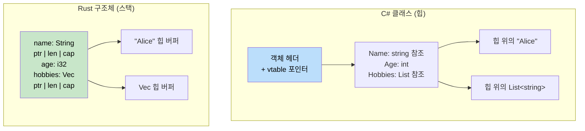

## 튜플과 구조 분해

> **학습 목표:** Rust의 튜플과 C#의 `ValueTuple`을 비교하고, 배열과 슬라이스, 구조체와 클래스의 차이점을 배웁니다. 제로 비용 타입 안전성을 제공하는 뉴타입(Newtype) 패턴과 구조 분해(Destructuring) 구문을 익힙니다.
>
> **난이도:** 🟢 초급

C#에는 (C# 7부터) `ValueTuple`이 있습니다. Rust의 튜플은 이와 유사하지만 언어에 더 깊이 통합되어 있습니다.

### C# 튜플
```csharp
// C# ValueTuple (C# 7+)
var point = (10, 20);                         // (int, int)
var named = (X: 10, Y: 20);                   // 명명된 요소
Console.WriteLine($"{named.X}, {named.Y}");

// 반환 타입으로서의 튜플
public (int Quotient, int Remainder) Divide(int a, int b)
{
    return (a / b, a % b);
}

var (q, r) = Divide(10, 3);    // 구조 분해
Console.WriteLine($"{q} 나머지 {r}");

// 무시하기 (_)
var (_, remainder) = Divide(10, 3);  // 몫은 무시함
```

### Rust 튜플
```rust
// Rust 튜플 — 기본적으로 불변이며, 요소에 이름을 붙일 수 없음
let point = (10, 20);                // (i32, i32)
let point3d: (f64, f64, f64) = (1.0, 2.0, 3.0);

// 인덱스로 접근 (0부터 시작)
println!("x={}, y={}", point.0, point.1);

// 반환 타입으로서의 튜플
fn divide(a: i32, b: i32) -> (i32, i32) {
    (a / b, a % b)
}

let (q, r) = divide(10, 3);       // 구조 분해
println!("{q} 나머지 {r}");

// _를 사용한 무시
let (_, remainder) = divide(10, 3);

// 유닛 타입 () — "빈 튜플" (C#의 void와 유사)
fn greet() {          // 암시적 반환 타입은 ()
    println!("안녕");
}
```

### 주요 차이점

| 특징 | C# `ValueTuple` | Rust 튜플 |
|---------|-----------------|------------|
| 명명된 요소 | `(int X, int Y)` | 미지원 — 구조체 사용 권장 |
| 최대 요소 수 | 약 8개 (중첩으로 확장 가능) | 제한 없음 (실무적 한계는 약 12개) |
| 비교 연산 | 자동 지원 | 요소가 12개 이하인 경우 자동 지원 |
| 딕셔너리 키 사용 | 가능 | 가능 (요소가 `Hash`를 구현한 경우) |
| 함수 반환값 사용 | 흔함 | 흔함 |
| 요소 가변성 | 항상 가변적임 | `let mut` 선언 시에만 가변적임 |

### 튜플 구조체 (뉴타입 패턴)
```rust
// 단순한 튜플만으로 설명이 부족할 때 튜플 구조체를 사용합니다:
struct Meters(f64);     // 단일 필드 "뉴타입" 래퍼
struct Celsius(f64);
struct Fahrenheit(f64);

// 컴파일러는 이들을 서로 다른 타입으로 취급합니다:
let distance = Meters(100.0);
let temp = Celsius(36.6);
// distance == temp;  // ❌ 에러: Meters와 Celsius는 비교할 수 없음

// 뉴타입 패턴은 단위 혼동으로 인한 버그를 컴파일 타임에 방지합니다!
// C#에서 동일한 안전성을 확보하려면 전체 클래스나 구조체를 정의해야 합니다.
```

```csharp
// C#에서는 더 복잡한 과정이 필요합니다:
public readonly record struct Meters(double Value);
public readonly record struct Celsius(double Value);
// 서로 교환은 안 되지만, Rust의 제로 비용 뉴타입에 비해 레코드는 오버헤드가 발생합니다.
```

### 뉴타입 패턴 심화: 제로 비용 도메인 모델링

뉴타입은 단순히 단위 혼동을 막는 것 이상의 역할을 합니다. 이는 비즈니스 규칙을 타입 시스템에 인코딩하는 Rust의 주요 도구로, C#에서 흔히 사용하는 "가드 절(Guard clause)"이나 "유효성 검사 클래스" 패턴을 대체합니다.

#### C# 유효성 검사 방식: 런타임 가드
```csharp
// C# — 유효성 검사가 매번 런타임에 발생합니다.
public class UserService
{
    public User CreateUser(string email, int age)
    {
        if (string.IsNullOrWhiteSpace(email) || !email.Contains('@'))
            throw new ArgumentException("유효하지 않은 이메일");
        if (age < 0 || age > 150)
            throw new ArgumentException("유효하지 않은 나이");

        return new User { Email = email, Age = age };
    }

    public void SendEmail(string email)
    {
        // 다시 검사해야 할까요? 아니면 호출자를 믿어야 할까요?
        if (!email.Contains('@')) throw new ArgumentException("유효하지 않은 이메일");
        // ...
    }
}
```

#### Rust 뉴타입 방식: 컴파일 타임 증명
```rust
/// 유효성이 검증된 이메일 주소 — 타입 자체가 유효성의 증거가 됩니다.
#[derive(Debug, Clone, PartialEq, Eq, Hash)]
pub struct Email(String);

impl Email {
    /// 이메일을 생성하는 유일한 방법 — 생성 시점에 유효성 검사가 한 번만 이루어집니다.
    pub fn new(raw: &str) -> Result<Self, &'static str> {
        if raw.contains('@') && raw.len() > 3 {
            Ok(Email(raw.to_lowercase()))
        } else {
            Err("유효하지 않은 이메일 형식")
        }
    }

    /// 내부 값에 대한 안전한 접근
    pub fn as_str(&self) -> &str { &self.0 }
}

/// 유효성이 검증된 나이 — 잘못된 나이를 생성하는 것 자체가 불가능합니다.
#[derive(Debug, Clone, Copy, PartialEq, Eq, PartialOrd, Ord)]
pub struct Age(u8);

impl Age {
    pub fn new(raw: u8) -> Result<Self, &'static str> {
        if raw <= 150 { Ok(Age(raw)) } else { Err("나이 범위를 벗어남") }
    }
    pub fn value(&self) -> u8 { self.0 }
}

// 이제 함수는 '증명된' 타입을 받습니다 — 재검증이 필요 없습니다!
fn create_user(email: Email, age: Age) -> User {
    // email은 반드시 유효함이 보장됩니다 — 이는 타입 불변성(Invariant)입니다.
    User { email, age }
}

fn send_email(to: &Email) {
    // 유효성 검사가 필요 없음 — Email 타입이 이미 유효성을 증명함
    println!("전송 대상: {}", to.as_str());
}
```

#### C# 개발자를 위한 일반적인 뉴타입 활용 사례

| C# 패턴 | Rust 뉴타입 | 방지할 수 있는 문제 |
|------------|-------------|------------------|
| UserId, Email 등을 위한 `string` | `struct UserId(Uuid)` | 잘못된 문자열을 잘못된 매개변수에 전달하는 실수 |
| Port, Count, Index 등을 위한 `int` | `struct Port(u16)` | Port와 Count가 서로 혼용되는 상황 |
| 곳곳에 흩어진 가드 절 | 생성 시점에 한 번만 검증 | 반복적인 검증, 누락된 검증 |
| USD, EUR 등을 위한 `decimal` | `struct Usd(Decimal)` | 실수로 USD에 EUR을 더하는 사고 |
| 서로 다른 의미의 `TimeSpan` | `struct Timeout(Duration)` | 연결 타임아웃을 요청 타임아웃으로 전달하는 실수 |

```rust
// 제로 비용: 뉴타입은 컴파일 시 내부 타입과 동일한 어셈블리로 컴파일됩니다.
// 다음 Rust 코드는:
struct UserId(u64);
fn lookup(id: UserId) -> Option<User> { /* ... */ }

// 아래 코드와 동일한 기계어를 생성합니다:
fn lookup(id: u64) -> Option<User> { /* ... */ }
// 하지만 컴파일 타임에는 완전한 타입 안전성을 제공합니다!
```

***

## 배열과 슬라이스

배열(Array), 슬라이스(Slice), 벡터(Vector)의 차이점을 이해하는 것이 중요합니다.

### C# 배열
```csharp
// C# 배열
int[] numbers = new int[5];         // 고정 크기, 힙에 할당됨
int[] initialized = { 1, 2, 3, 4, 5 }; // 배열 리터럴

// 접근
numbers[0] = 10;
int first = numbers[0];

// 길이
int length = numbers.Length;

// 매개변수로서의 배열 (참조 타입)
void ProcessArray(int[] array)
{
    array[0] = 99;  // 원본을 수정함
}
```

### Rust 배열, 슬라이스, 벡터
```rust
// 1. 배열 - 고정 크기, 스택에 할당됨
let numbers: [i32; 5] = [1, 2, 3, 4, 5];  // 타입: [i32; 5]
let zeros = [0; 10];                       // 0이 10개인 배열

// 접근
let first = numbers[0];
// numbers[0] = 10;  // ❌ 에러: 배열은 기본적으로 불변임

let mut mut_array = [1, 2, 3, 4, 5];
mut_array[0] = 10;  // ✅ mut을 선언하면 가능함

// 2. 슬라이스 - 배열이나 벡터의 일부를 바라보는 뷰(View)
let slice: &[i32] = &numbers[1..4];  // 인덱스 1, 2, 3 요소
let all_slice: &[i32] = &numbers;    // 배열 전체를 슬라이스로

// 3. 벡터 - 동적 크기, 힙에 할당됨 (앞서 다룸)
let mut vec = vec![1, 2, 3, 4, 5];
vec.push(6);  // 크기 확장 가능
```

### 함수 매개변수로서의 슬라이스
```csharp
// C# - 배열을 처리하는 메서드
public void ProcessNumbers(int[] numbers)
{
    for (int i = 0; i < numbers.Length; i++)
    {
        Console.WriteLine(numbers[i]);
    }
}

// 배열만 전달 가능
ProcessNumbers(new int[] { 1, 2, 3 });
```

```rust
// Rust - 어떤 시퀀스든 처리하는 함수
fn process_numbers(numbers: &[i32]) {  // 슬라이스 매개변수
    for (i, num) in numbers.iter().enumerate() {
        println!("인덱스 {}: {}", i, num);
    }
}

fn main() {
    let array = [1, 2, 3, 4, 5];
    let vec = vec![1, 2, 3, 4, 5];
    
    // 동일한 함수가 양쪽 모두에 작동합니다!
    process_numbers(&array);      // 배열을 슬라이스로 전달
    process_numbers(&vec);        // 벡터를 슬라이스로 전달
    process_numbers(&vec[1..4]);  // 벡터의 일부 슬라이스 전달
}
```

### 문자열 슬라이스 (&str) 재방문
```rust
// String과 &str의 관계
fn string_slice_example() {
    let owned = String::from("Hello, World!");
    let slice: &str = &owned[0..5];      // "Hello"
    let slice2: &str = &owned[7..];      // "World!"
    
    println!("{}", slice);   // "Hello"
    println!("{}", slice2);  // "World!"
    
    // 어떤 문자열 타입이든 받아들이는 함수
    print_string("문자열 리터럴");         // &str
    print_string(&owned);               // String을 &str로 전달
    print_string(slice);                // &str 슬라이스
}

fn print_string(s: &str) {
    println!("{}", s);
}
```

***

## 구조체(Struct) vs 클래스(Class)

Rust의 구조체는 C#의 클래스와 비슷하지만, 메모리 레이아웃과 소유권 측면에서 큰 차이가 있습니다.



> **핵심 통찰**: C# 클래스는 항상 참조를 통해 힙에 존재합니다. 반면 Rust 구조체는 기본적으로 스택에 존재하며, 오직 동적 크기 데이터(예: `String` 내용물)만 힙으로 보냅니다. 이는 자주 생성되는 작은 객체들에 대한 가비지 컬렉션(GC) 오버헤드를 제거합니다.

### C# 클래스 정의
```csharp
// 프로퍼티와 메서드를 가진 C# 클래스
public class Person
{
    public string Name { get; set; }
    public int Age { get; set; }
    public List<string> Hobbies { get; set; }
    
    public Person(string name, int age)
    {
        Name = name;
        Age = age;
        Hobbies = new List<string>();
    }
    
    public void AddHobby(string hobby)
    {
        Hobbies.Add(hobby);
    }
    
    public string GetInfo()
    {
        return $"{Name}님은 {Age}살입니다";
    }
}
```

### Rust 구조체 정의
```rust
// 연관 함수와 메서드를 가진 Rust 구조체
#[derive(Debug)]  // Debug 트레이트를 자동으로 구현함
pub struct Person {
    pub name: String,    // 공개 필드
    pub age: u32,        // 공개 필드
    hobbies: Vec<String>, // 비공개 필드 (pub 없음)
}

impl Person {
    // 연관 함수 (정적 메서드와 유사)
    pub fn new(name: String, age: u32) -> Person {
        Person {
            name,
            age,
            hobbies: Vec::new(),
        }
    }
    
    // 메서드 (&self, &mut self, 또는 self를 받음)
    pub fn add_hobby(&mut self, hobby: String) {
        self.hobbies.push(hobby);
    }
    
    // 불변 빌림을 사용하는 메서드
    pub fn get_info(&self) -> String {
        format!("{}님은 {}살입니다", self.name, self.age)
    }
    
    // 비공개 필드용 게터(Getter)
    pub fn hobbies(&self) -> &Vec<String> {
        &self.hobbies
    }
}
```

### 인스턴스 생성 및 사용
```csharp
// C# 객체 생성 및 사용
var person = new Person("앨리스", 30);
person.AddHobby("독서");
person.AddHobby("수영");

Console.WriteLine(person.GetInfo());
Console.WriteLine($"취미: {string.Join(", ", person.Hobbies)}");

// 프로퍼티 직접 수정
person.Age = 31;
```

```rust
// Rust 구조체 생성 및 사용
let mut person = Person::new("앨리스".to_string(), 30);
person.add_hobby("독서".to_string());
person.add_hobby("수영".to_string());

println!("{}", person.get_info());
println!("취미: {:?}", person.hobbies());

// 공개 필드 직접 수정
person.age = 31;

// 구조체 전체를 디버그 출력
println!("{:?}", person);
```

### 구조체 초기화 패턴
```csharp
// C# 객체 초기화
var person = new Person("밥", 25)
{
    Hobbies = new List<string> { "게임", "코딩" }
};

// 익명 타입
var anonymous = new { Name = "찰리", Age = 35 };
```

```rust
// Rust 구조체 초기화
let person = Person {
    name: "밥".to_string(),
    age: 25,
    hobbies: vec!["게임".to_string(), "코딩".to_string()],
};

// 구조체 업데이트 구문 (객체 스프레드와 유사)
let older_person = Person {
    age: 26,
    ..person  // person의 나머지 필드들을 사용함 (person은 이동됨!)
};

// 튜플 구조체 (익명 타입과 유사)
#[derive(Debug)]
struct Point(i32, i32);

let point = Point(10, 20);
println!("좌표: ({}, {})", point.0, point.1);
```

***

## 메서드와 연관 함수

메서드(Method)와 연관 함수(Associated Function)의 차이를 이해하는 것이 중요합니다.

### C# 메서드 타입
```csharp
public class Calculator
{
    private int memory = 0;
    
    // 인스턴스 메서드
    public int Add(int a, int b)
    {
        return a + b;
    }
    
    // 상태를 사용하는 인스턴스 메서드
    public void StoreInMemory(int value)
    {
        memory = value;
    }
    
    // 정적 메서드
    public static int Multiply(int a, int b)
    {
        return a * b;
    }
    
    // 정적 팩토리 메서드
    public static Calculator CreateWithMemory(int initialMemory)
    {
        var calc = new Calculator();
        calc.memory = initialMemory;
        return calc;
    }
}
```

### Rust 메서드 타입
```rust
#[derive(Debug)]
pub struct Calculator {
    memory: i32,
}

impl Calculator {
    // 연관 함수 (정적 메서드와 유사) - self 매개변수가 없음
    pub fn new() -> Calculator {
        Calculator { memory: 0 }
    }
    
    // 매개변수가 있는 연관 함수
    pub fn with_memory(initial_memory: i32) -> Calculator {
        Calculator { memory: initial_memory }
    }
    
    // 불변 빌림을 사용하는 메서드 (&self)
    pub fn add(&self, a: i32, b: i32) -> i32 {
        a + b
    }
    
    // 가변 빌림을 사용하는 메서드 (&mut self)
    pub fn store_in_memory(&mut self, value: i32) {
        self.memory = value;
    }
    
    // 소유권을 가져가는 메서드 (self)
    pub fn into_memory(self) -> i32 {
        self.memory  // Calculator 인스턴스가 소비됨
    }
    
    // 게터 메서드
    pub fn memory(&self) -> i32 {
        self.memory
    }
}

fn main() {
    // 연관 함수는 ::로 호출함
    let mut calc = Calculator::new();
    let calc2 = Calculator::with_memory(42);
    
    // 메서드는 .으로 호출함
    let result = calc.add(5, 3);
    calc.store_in_memory(result);
    
    println!("메모리: {}", calc.memory());
    
    // 소비형 메서드
    let memory_value = calc.into_memory();  // calc를 더 이상 사용할 수 없음
    println!("최종 메모리 값: {}", memory_value);
}
```

### 메서드 수신자(Receiver) 타입 설명
```rust
impl Person {
    // &self - 불변 빌림 (가장 일반적임)
    // 데이터를 읽기만 하면 될 때 사용합니다.
    pub fn get_name(&self) -> &str {
        &self.name
    }
    
    // &mut self - 가변 빌림
    // 데이터를 수정해야 할 때 사용합니다.
    pub fn set_name(&mut self, name: String) {
        self.name = name;
    }
    
    // self - 소유권 가져오기 (비교적 드물게 사용됨)
    // 구조체 인스턴스를 소비하고 싶을 때 사용합니다.
    pub fn consume(self) -> String {
        self.name  // Person이 이동되어 더 이상 접근할 수 없음
    }
}

fn method_examples() {
    let mut person = Person::new("앨리스".to_string(), 30);
    
    // 불변 빌림
    let name = person.get_name();  // person은 여전히 사용 가능함
    println!("이름: {}", name);
    
    // 가변 빌림
    person.set_name("앨리스 스미스".to_string());  // person은 여전히 사용 가능함
    
    // 소유권 가져오기
    let final_name = person.consume();  // 이제 person을 사용할 수 없음
    println!("최종 이름: {}", final_name);
}
```

---

## 연습 문제

<details>
<summary><strong>🏋️ 실습: 슬라이스 윈도우 평균</strong> (펼치기)</summary>

**도전 과제**: `f64` 슬라이스와 윈도우 크기를 받아 이동 평균(Rolling average)의 `Vec<f64>`를 반환하는 함수를 작성하세요. 예를 들어 `[1.0, 2.0, 3.0, 4.0, 5.0]`과 윈도우 크기 3을 받으면 `[2.0, 3.0, 4.0]`을 반환해야 합니다.

```rust
fn rolling_average(data: &[f64], window: usize) -> Vec<f64> {
    // 구현 내용을 작성하세요
    todo!()
}

fn main() {
    let data = vec![1.0, 2.0, 3.0, 4.0, 5.0];
    let avgs = rolling_average(&data, 3);
    println!("{avgs:?}"); // [2.0, 3.0, 4.0]
}
```

<details>
<summary>🔑 해답</summary>

```rust
fn rolling_average(data: &[f64], window: usize) -> Vec<f64> {
    data.windows(window)
        .map(|w| w.iter().sum::<f64>() / w.len() as f64)
        .collect()
}

fn main() {
    let data = vec![1.0, 2.0, 3.0, 4.0, 5.0];
    let avgs = rolling_average(&data, 3);
    assert_eq!(avgs, vec![2.0, 3.0, 4.0]);
    println!("{avgs:?}");
}
```

**핵심 포인트**: 슬라이스에는 수동 인덱스 계산을 대체할 수 있는 `.windows()`, `.chunks()`, `.split()`과 같은 강력한 내장 메서드들이 있습니다. C#에서는 `Enumerable.Range`나 LINQ의 `.Skip().Take()`를 사용했을 것입니다.

</details>
</details>

<details>
<summary><strong>🏋️ 실습: 미니 주소록</strong> (펼치기)</summary>

구조체, 열거형, 메서드를 사용하여 간단한 주소록을 만들어 보세요:

1. `PhoneType { Mobile, Home, Work }` 열거형을 정의하세요.
2. `name: String`과 `phones: Vec<(PhoneType, String)>`을 가진 `Contact` 구조체를 정의하세요.
3. `Contact::new(name: impl Into<String>) -> Self`를 구현하세요.
4. `Contact::add_phone(&mut self, kind: PhoneType, number: impl Into<String>)`를 구현하세요.
5. 휴대전화 번호만 반환하는 `Contact::mobile_numbers(&self) -> Vec<&str>`를 구현하세요.
6. `main`에서 연락처를 생성하고, 두 개의 전화번호를 추가한 뒤 휴대전화 번호만 출력해 보세요.

<details>
<summary>🔑 해답</summary>

```rust
#[derive(Debug, PartialEq)]
enum PhoneType { Mobile, Home, Work }

#[derive(Debug)]
struct Contact {
    name: String,
    phones: Vec<(PhoneType, String)>,
}

impl Contact {
    fn new(name: impl Into<String>) -> Self {
        Contact { name: name.into(), phones: Vec::new() }
    }

    fn add_phone(&mut self, kind: PhoneType, number: impl Into<String>) {
        self.phones.push((kind, number.into()));
    }

    fn mobile_numbers(&self) -> Vec<&str> {
        self.phones
            .iter()
            .filter(|(kind, _)| *kind == PhoneType::Mobile)
            .map(|(_, num)| num.as_str())
            .collect()
    }
}

fn main() {
    let mut alice = Contact::new("앨리스");
    alice.add_phone(PhoneType::Mobile, "+1-555-0100");
    alice.add_phone(PhoneType::Work, "+1-555-0200");
    alice.add_phone(PhoneType::Mobile, "+1-555-0101");

    println!("{}님의 휴대전화 번호: {:?}", alice.name, alice.mobile_numbers());
}
```

</details>
</details>

***
