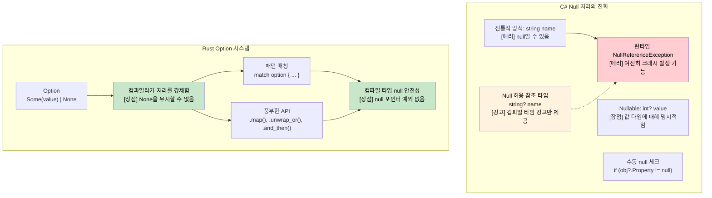

```mermaid
graph TD
    subgraph "C# 패턴 매칭의 한계"
        CS_SWITCH["switch 표현식"]
        CS_WARNING["⚠️ 컴파일러 경고만 발생"]
        CS_COMPILE["✅ 컴파일 성공"]
        CS_RUNTIME["💥 런타임 예외 발생"]
        CS_DEPLOY["❌ 버그가 운영 환경까지 도달"]
        CS_SILENT["😰 열거형 변경 시 소리 없는 실패"]
        
        CS_SWITCH --> CS_WARNING
        CS_WARNING --> CS_COMPILE
        CS_COMPILE --> CS_RUNTIME
        CS_RUNTIME --> CS_DEPLOY
        CS_SWITCH --> CS_SILENT
    end
    
    subgraph "Rust의 철저한 매칭"
        RUST_MATCH["match 표현식"]
        RUST_ERROR["🛑 컴파일 실패"]
        RUST_FIX["✅ 모든 케이스 처리 필수"]
        RUST_SAFE["✅ 런타임의 예상치 못한 동작 제로"]
        RUST_EVOLUTION["🔄 열거형 변경 시 컴파일 중단"]
        RUST_REFACTOR["🛠️ 강제적인 리팩토링 유도"]
        
        RUST_MATCH --> RUST_ERROR
        RUST_ERROR --> RUST_FIX
        RUST_FIX --> RUST_SAFE
        RUST_MATCH --> RUST_EVOLUTION
        RUST_EVOLUTION --> RUST_REFACTOR
    end
    
    style CS_RUNTIME fill:#ffcdd2,color:#000
    style CS_DEPLOY fill:#ffcdd2,color:#000
    style CS_SILENT fill:#ffcdd2,color:#000
    style RUST_SAFE fill:#c8e6c9,color:#000
    style RUST_REFACTOR fill:#c8e6c9,color:#000
```

## 철저한 패턴 매칭: 컴파일러 보장 vs 런타임 에러

> **학습 목표:** C#의 `switch` 표현식이 왜 소리 없이 케이스를 누락할 수 있는지, 반면 Rust의 `match`가 어떻게 컴파일 타임에 이를 포착하는지 알아봅니다. Null 안전성을 위한 `Option<T>`와 `Nullable<T>`의 차이점, 그리고 `Result<T, E>`를 사용한 사용자 정의 에러 타입을 배웁니다.
>
> **Difficulty:** 🟡 중급

### C# Switch 표현식 - 여전히 불완전함
```csharp
// C# switch 표현식은 철저해 보이지만 보장되지는 않습니다.
public enum HttpStatus { Ok, NotFound, ServerError, Unauthorized }

public string HandleResponse(HttpStatus status) => status switch
{
    HttpStatus.Ok => "성공",
    HttpStatus.NotFound => "리소스를 찾을 수 없음",
    HttpStatus.ServerError => "내부 에러",
    // Unauthorized 케이스 누락 — 경고 CS8524와 함께 컴파일은 되지만, 에러는 아님!
    // 런타임: status가 Unauthorized일 경우 SwitchExpressionException 발생
};

// Null 허용 경고가 있어도 다음 코드는 컴파일됩니다:
public class User 
{
    public string Name { get; set; }
    public bool IsActive { get; set; }
}

public string ProcessUser(User? user) => user switch
{
    { IsActive: true } => $"활성 상태: {user.Name}",
    { IsActive: false } => $"비활성 상태: {user.Name}",
    // null 케이스 누락 — 컴파일러 경고 CS8655는 발생하지만, 에러는 아님!
    // 런타임: user가 null일 때 SwitchExpressionException 발생
};
```

```csharp
// 나중에 열거형 변형을 추가해도 기존 switch 문의 컴파일이 중단되지 않습니다.
public enum HttpStatus 
{ 
    Ok, 
    NotFound, 
    ServerError, 
    Unauthorized,
    Forbidden  // 이를 추가하면 다른 CS8524 경고가 발생하지만 컴파일은 계속됨!
}
```

### Rust 패턴 매칭 - 진정한 철저함(Exhaustiveness)
```rust
#[derive(Debug)]
enum HttpStatus {
    Ok,
    NotFound, 
    ServerError,
    Unauthorized,
}

fn handle_response(status: HttpStatus) -> &'static str {
    match status {
        HttpStatus::Ok => "성공",
        HttpStatus::NotFound => "리소스를 찾을 수 없음", 
        HttpStatus::ServerError => "내부 에러",
        HttpStatus::Unauthorized => "인증 필요",
        // 하나라도 케이스가 누락되면 컴파일 에러 발생!
        // 이 코드는 아예 컴파일되지 않습니다.
    }
}

// 새로운 변형을 추가하면 이를 사용하는 모든 곳의 컴파일이 중단됩니다.
#[derive(Debug)]
enum HttpStatus {
    Ok,
    NotFound,
    ServerError, 
    Unauthorized,
    Forbidden,  // 이를 추가하면 handle_response()에서 컴파일 에러 발생
}
// 컴파일러는 여러분이 모든 케이스를 처리하도록 강제합니다.

// Option<T> 패턴 매칭 역시 철저합니다.
fn process_optional_value(value: Option<i32>) -> String {
    match value {
        Some(n) => format!("값 획득: {}", n),
        None => "값 없음".to_string(),
        // 어느 한 쪽이라도 잊으면 컴파일 에러가 발생합니다.
    }
}
```



***

## Null 안전성: `Nullable<T>` vs `Option<T>`

### C# Null 처리의 진화
```csharp
// C# - 전통적인 null 처리 (실수하기 쉬움)
public class User
{
    public string Name { get; set; }  // null일 수 있음!
    public string Email { get; set; } // null일 수 있음!
}

public string GetUserDisplayName(User user)
{
    if (user?.Name != null)  // Null 조건부 연산자
    {
        return user.Name;
    }
    return "알 수 없는 사용자";
}
```

```csharp
// C# 8+ Null 허용 참조 타입 (NRT)
public class User
{
    public string Name { get; set; }    // Null 허용 안 함
    public string? Email { get; set; }  // 명시적으로 Null 허용
}

// 값 타입을 위한 C# Nullable<T>
int? maybeNumber = GetNumber();
if (maybeNumber.HasValue)
{
    Console.WriteLine(maybeNumber.Value);
}
```

### Rust `Option<T>` 시스템
```rust
// Rust - Option<T>를 통한 명시적 null 처리
#[derive(Debug)]
pub struct User {
    name: String,           // 절대 null일 수 없음
    email: Option<String>,  // 명시적으로 선택 사항임
}

impl User {
    pub fn get_display_name(&self) -> &str {
        &self.name  // null 체크 불필요 - 존재함이 보장됨
    }
    
    pub fn get_email_or_default(&self) -> String {
        self.email
            .as_ref()
            .map(|e| e.clone())
            .unwrap_or_else(|| "no-email@example.com".to_string())
    }
}

// 패턴 매칭을 통해 None 케이스 처리를 강제함
fn handle_optional_user(user: Option<User>) {
    match user {
        Some(u) => println!("사용자: {}", u.get_display_name()),
        None => println!("사용자를 찾을 수 없음"),
        // None 케이스를 처리하지 않으면 컴파일 에러!
    }
}
```



***

```rust
#[derive(Debug)]
struct Point {
    x: i32,
    y: i32,
}

fn describe_point(point: Point) -> String {
    match point {
        Point { x: 0, y: 0 } => "원점".to_string(),
        Point { x: 0, y } => format!("y축 위 (y={})", y),
        Point { x, y: 0 } => format!("x축 위 (x={})", x),
        Point { x, y } if x == y => format!("대각선 위 ({}, {})", x, y),
        Point { x, y } => format!("좌표 ({}, {})", x, y),
    }
}
```

### Option 및 Result 타입
```csharp
// C# Null 허용 참조 타입 (C# 8+)
public class PersonService
{
    private Dictionary<int, string> people = new();
    
    public string? FindPerson(int id)
    {
        return people.TryGetValue(id, out string? name) ? name : null;
    }
    
    public string GetPersonOrDefault(int id)
    {
        return FindPerson(id) ?? "알 수 없음";
    }
    
    // 예외 기반의 에러 핸들링
    public void SavePerson(int id, string name)
    {
        if (string.IsNullOrEmpty(name))
            throw new ArgumentException("이름은 비어 있을 수 없습니다");
        
        people[id] = name;
    }
}
```

```rust
use std::collections::HashMap;

// Rust는 null 대신 Option<T>를 사용함
struct PersonService {
    people: HashMap<i32, String>,
}

impl PersonService {
    fn new() -> Self {
        PersonService {
            people: HashMap::new(),
        }
    }
    
    // Option<T> 반환 - null 없음!
    fn find_person(&self, id: i32) -> Option<&String> {
        self.people.get(&id)
    }
    
    // Option에 대한 패턴 매칭
    fn get_person_or_default(&self, id: i32) -> String {
        match self.find_person(id) {
            Some(name) => name.clone(),
            None => "알 수 없음".to_string(),
        }
    }
    
    // Option 메서드 사용 (더 함수형인 스타일)
    fn get_person_or_default_functional(&self, id: i32) -> String {
        self.find_person(id)
            .map(|name| name.clone())
            .unwrap_or_else(|| "알 수 없음".to_string())
    }
    
    // 에러 핸들링을 위한 Result<T, E>
    fn save_person(&mut self, id: i32, name: String) -> Result<(), String> {
        if name.is_empty() {
            return Err("이름은 비어 있을 수 없습니다".to_string());
        }
        
        self.people.insert(id, name);
        Ok(())
    }
    
    // 작업 체이닝
    fn get_person_length(&self, id: i32) -> Option<usize> {
        self.find_person(id).map(|name| name.len())
    }
}

fn main() {
    let mut service = PersonService::new();
    
    // Result 처리
    match service.save_person(1, "앨리스".to_string()) {
        Ok(()) => println!("사용자 저장 성공"),
        Err(error) => println!("에러: {}", error),
    }
    
    // Option 처리
    match service.find_person(1) {
        Some(name) => println!("찾음: {}", name),
        None => println!("사용자를 찾을 수 없음"),
    }
    
    // Option을 사용한 함수형 스타일
    let name_length = service.get_person_length(1)
        .unwrap_or(0);
    println!("이름 길이: {}", name_length);
    
    // 조기 반환을 위한 물음표(?) 연산자
    fn try_operation(service: &mut PersonService) -> Result<String, String> {
        service.save_person(2, "밥".to_string())?; // 에러 발생 시 조기 반환
        let name = service.find_person(2).ok_or("사용자를 찾을 수 없음")?; // Option을 Result로 변환
        Ok(format!("안녕하세요, {}", name))
    }
    
    match try_operation(&mut service) {
        Ok(message) => println!("{}", message),
        Err(error) => println!("작업 실패: {}", error),
    }
}
```

### 사용자 정의 에러 타입
```rust
// 사용자 정의 에러 열거형 정의
#[derive(Debug)]
enum PersonError {
    NotFound(i32),
    InvalidName(String),
    DatabaseError(String),
}

impl std::fmt::Display for PersonError {
    fn fmt(&self, f: &mut std::fmt::Formatter<'_>) -> std::fmt::Result {
        match self {
            PersonError::NotFound(id) => write!(f, "ID가 {}인 사용자를 찾을 수 없음", id),
            PersonError::InvalidName(name) => write!(f, "유효하지 않은 이름: '{}'", name),
            PersonError::DatabaseError(msg) => write!(f, "데이터베이스 에러: {}", msg),
        }
    }
}

impl std::error::Error for PersonError {}

// 사용자 정의 에러가 적용된 강화된 PersonService
impl PersonService {
    fn save_person_enhanced(&mut self, id: i32, name: String) -> Result<(), PersonError> {
        if name.is_empty() || name.len() > 50 {
            return Err(PersonError::InvalidName(name));
        }
        
        // 실패할 수 있는 데이터베이스 작업 시뮬레이션
        if id < 0 {
            return Err(PersonError::DatabaseError("음수 ID는 허용되지 않음".to_string()));
        }
        
        self.people.insert(id, name);
        Ok(())
    }
    
    fn find_person_enhanced(&self, id: i32) -> Result<&String, PersonError> {
        self.people.get(&id).ok_or(PersonError::NotFound(id))
    }
}

fn demo_error_handling() {
    let mut service = PersonService::new();
    
    // 다양한 에러 타입 처리
    match service.save_person_enhanced(-1, "Invalid".to_string()) {
        Ok(()) => println!("성공"),
        Err(PersonError::NotFound(id)) => println!("찾을 수 없음: {}", id),
        Err(PersonError::InvalidName(name)) => println!("유효하지 않은 이름: {}", name),
        Err(PersonError::DatabaseError(msg)) => println!("DB 에러: {}", msg),
    }
}
```

---

## 연습 문제

<details>
<summary><strong>🏋️ 실습: Option 콤비네이터</strong> (펼치기)</summary>

Rust의 `Option` 콤비네이터(`and_then`, `map`, `unwrap_or`)를 사용하여, 다음의 깊게 중첩된 C# null 체크 코드를 다시 작성해 보세요:

```csharp
string GetCityName(User? user)
{
    if (user != null)
        if (user.Address != null)
            if (user.Address.City != null)
                return user.Address.City.ToUpper();
    return "UNKNOWN";
}
```

다음 Rust 타입을 사용하세요:
```rust
struct User { address: Option<Address> }
struct Address { city: Option<String> }
```

`if let`이나 `match`를 사용하지 않고 **단일 표현식**으로 작성하세요.

<details>
<summary>🔑 해답</summary>

```rust
struct User { address: Option<Address> }
struct Address { city: Option<String> }

fn get_city_name(user: Option<&User>) -> String {
    user.and_then(|u| u.address.as_ref())
        .and_then(|a| a.city.as_ref())
        .map(|c| c.to_uppercase())
        .unwrap_or_else(|| "UNKNOWN".to_string())
}

fn main() {
    let user = User {
        address: Some(Address { city: Some("seattle".to_string()) }),
    };
    assert_eq!(get_city_name(Some(&user)), "SEATTLE");
    assert_eq!(get_city_name(None), "UNKNOWN");

    let no_city = User { address: Some(Address { city: None }) };
    assert_eq!(get_city_name(Some(&no_city)), "UNKNOWN");
}
```

**핵심 통찰**: `and_then`은 `Option`에 대한 Rust의 `?.` 연산자와 같습니다. 각 단계는 `Option`을 반환하며, 체인 도중 `None`이 발생하면 단락 평가(Short-circuit)가 이루어집니다. 이는 C#의 null 조건부 연산자 `?.`와 정확히 같지만, 훨씬 명시적이고 타입 안전합니다.

</details>
</details>

***
