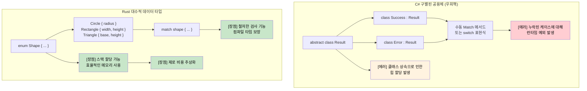

## 대수적 데이터 타입 vs C# Union

> **학습 목표:** Rust의 대수적 데이터 타입(데이터를 포함하는 열거형)과 C#의 제한적인 구별된 공용체(Discriminated Union)를 비교합니다. 철저한 검사 기능이 있는 `match` 표현식, 가드(Guard) 절, 그리고 중첩된 패턴 구조 분해를 배웁니다.
>
> **난이도:** 🟡 중급

### C# 구별된 공용체 (제한적)
```csharp
// C# - 상속을 이용한 제한적인 공용체 지원
public abstract class Result
{
    public abstract T Match<T>(Func<Success, T> onSuccess, Func<Error, T> onError);
}

public class Success : Result
{
    public string Value { get; }
    public Success(string value) => Value = value;
    
    public override T Match<T>(Func<Success, T> onSuccess, Func<Error, T> onError)
        => onSuccess(this);
}

public class Error : Result
{
    public string Message { get; }
    public Error(string message) => Message = message;
    
    public override T Match<T>(Func<Success, T> onSuccess, Func<Error, T> onError)
        => onError(this);
}

// C# 9+ 레코드와 패턴 매칭 (더 나은 방식)
public abstract record Shape;
public record Circle(double Radius) : Shape;
public record Rectangle(double Width, double Height) : Shape;

public static double Area(Shape shape) => shape switch
{
    Circle(var radius) => Math.PI * radius * radius,
    Rectangle(var width, var height) => width * height,
    _ => throw new ArgumentException("알 수 없는 도형")  // [에러] 런타임 에러 가능성 있음
};
```

### Rust 대수적 데이터 타입 (Enums)
```rust
// Rust - 철저한 패턴 매칭이 가능한 진정한 대수적 데이터 타입
#[derive(Debug, Clone)]
pub enum Result<T, E> {
    Ok(T),
    Err(E),
}

#[derive(Debug, Clone)]
pub enum Shape {
    Circle { radius: f64 },
    Rectangle { width: f64, height: f64 },
    Triangle { base: f64, height: f64 },
}

impl Shape {
    pub fn area(&self) -> f64 {
        match self {
            Shape::Circle { radius } => std::f64::consts::PI * radius * radius,
            Shape::Rectangle { width, height } => width * height,
            Shape::Triangle { base, height } => 0.5 * base * height,
            // [장점] 어떤 변형이라도 누락되면 컴파일 에러 발생!
        }
    }
}

// 고급 활용: 열거형은 서로 다른 타입을 가질 수 있음
#[derive(Debug)]
pub enum Value {
    Integer(i64),
    Float(f64),
    Text(String),
    Boolean(bool),
    List(Vec<Value>),  // 재귀적 타입!
}

impl Value {
    pub fn type_name(&self) -> &'static str {
        match self {
            Value::Integer(_) => "정수",
            Value::Float(_) => "부동소수점",
            Value::Text(_) => "텍스트",
            Value::Boolean(_) => "불리언",
            Value::List(_) => "리스트",
        }
    }
}
```



***

## 열거형과 패턴 매칭

Rust의 열거형은 C#보다 훨씬 강력합니다. 데이터를 포함할 수 있으며 타입 안전한 프로그래밍의 근간이 됩니다.

### C# 열거형의 한계
```csharp
// C# 열거형 - 단순한 명명된 상수일 뿐임
public enum Status
{
    Pending,
    Approved,
    Rejected
}

// 값을 명시한 C# 열거형
public enum HttpStatusCode
{
    OK = 200,
    NotFound = 404,
    InternalServerError = 500
}

// 복잡한 데이터를 위해서는 별도의 클래스가 필요함
public abstract class Result
{
    public abstract bool IsSuccess { get; }
}

public class Success : Result
{
    public string Value { get; }
    public override bool IsSuccess => true;
    
    public Success(string value)
    {
        Value = value;
    }
}

public class Error : Result
{
    public string Message { get; }
    public override bool IsSuccess => false;
    
    public Error(string message)
    {
        Message = message;
    }
}
```

### Rust 열거형의 강력함
```rust
// 단순 열거형 (C# 열거형과 유사)
#[derive(Debug, PartialEq)]
enum Status {
    Pending,
    Approved,
    Rejected,
}

// 데이터를 포함하는 열거형 (Rust의 강점!)
#[derive(Debug)]
enum Result<T, E> {
    Ok(T),      // T 타입의 값을 포함하는 성공 변형
    Err(E),     // E 타입의 에러를 포함하는 에러 변형
}

// 서로 다른 데이터 타입을 포함하는 복잡한 열거형
#[derive(Debug)]
enum Message {
    Quit,                       // 데이터 없음
    Move { x: i32, y: i32 },   // 구조체 형태의 변형
    Write(String),             // 튜플 형태의 변형
    ChangeColor(i32, i32, i32), // 여러 값 포함
}

// 실전 예제: HTTP 응답
#[derive(Debug)]
enum HttpResponse {
    Ok { body: String, headers: Vec<String> },
    NotFound { path: String },
    InternalError { message: String, code: u16 },
    Redirect { location: String },
}
```

### Match를 이용한 패턴 매칭
```csharp
// C# switch 문 (제한적)
public string HandleStatus(Status status)
{
    switch (status)
    {
        case Status.Pending:
            return "승인 대기 중";
        case Status.Approved:
            return "요청 승인됨";
        case Status.Rejected:
            return "요청 거절됨";
        default:
            return "알 수 없는 상태"; // 항상 default가 필요함
    }
}

// C# 패턴 매칭 (C# 8+)
public string HandleResult(Result result)
{
    return result switch
    {
        Success success => $"성공: {success.Value}",
        Error error => $"에러: {error.Message}",
        _ => "알 수 없는 결과" // 여전히 catch-all 패턴이 필요함
    };
}
```

```rust
// Rust match - 철저하고(Exhaustive) 강력함
fn handle_status(status: Status) -> String {
    match status {
        Status::Pending => "승인 대기 중".to_string(),
        Status::Approved => "요청 승인됨".to_string(),
        Status::Rejected => "요청 거절됨".to_string(),
        // default 불필요 - 컴파일러가 모든 케이스를 처리했는지 확인함
    }
}

// 데이터 추출을 동반한 패턴 매칭
fn handle_result<T, E>(result: Result<T, E>) -> String 
where 
    T: std::fmt::Debug,
    E: std::fmt::Debug,
{
    match result {
        Result::Ok(value) => format!("성공: {:?}", value),
        Result::Err(error) => format!("에러: {:?}", error),
        // 모든 케이스 처리 - default 불필요
    }
}

// 복잡한 패턴 매칭
fn handle_message(msg: Message) -> String {
    match msg {
        Message::Quit => "안녕히 가세요!".to_string(),
        Message::Move { x, y } => format!("({}, {})로 이동", x, y),
        Message::Write(text) => format!("텍스트 기록: {}", text),
        Message::ChangeColor(r, g, b) => format!("RGB({}, {}, {})로 색상 변경", r, g, b),
    }
}

// HTTP 응답 처리
fn handle_http_response(response: HttpResponse) -> String {
    match response {
        HttpResponse::Ok { body, headers } => {
            format!("성공! 바디: {}, 헤더: {:?}", body, headers)
        },
        HttpResponse::NotFound { path } => {
            format!("404: '{}' 경로를 찾을 수 없음", path)
        },
        HttpResponse::InternalError { message, code } => {
            format!("에러 {}: {}", code, message)
        },
        HttpResponse::Redirect { location } => {
            format!("{}로 리다이렉트", location)
        },
    }
}
```

### 가드(Guard) 및 고급 패턴
```rust
// 가드를 사용한 패턴 매칭
fn describe_number(x: i32) -> String {
    match x {
        n if n < 0 => "음수".to_string(),
        0 => "영".to_string(),
        n if n < 10 => "한 자리 수".to_string(),
        n if n < 100 => "두 자리 수".to_string(),
        _ => "큰 수".to_string(),
    }
}

// 범위 매칭
fn describe_age(age: u32) -> String {
    match age {
        0..=12 => "어린이".to_string(),
        13..=19 => "청소년".to_string(),
        20..=64 => "성인".to_string(),
        65.. => "노인".to_string(),
    }
}

// 구조체 및 튜플 구조 분해 가능
```

<details>
<summary><strong>🏋️ 실습: 명령어 파서</strong> (펼치기)</summary>

**도전 과제**: Rust 열거형을 사용하여 CLI 명령어 시스템을 모델링해 보세요. 문자열 입력을 `Command` 열거형으로 파싱하고 각 변형을 실행합니다. 알 수 없는 명령어는 적절한 에러 핸들링으로 처리하세요.

```rust
// 시작 코드 — 빈칸을 채우세요
#[derive(Debug)]
enum Command {
    // TODO: Quit, Echo(String), Move { x: i32, y: i32 }, Count(u32) 변형 추가
}

fn parse_command(input: &str) -> Result<Command, String> {
    let parts: Vec<&str> = input.splitn(2, ' ').collect();
    // TODO: parts[0]에 대해 매칭하고 인자 파싱
    todo!()
}

fn execute(cmd: &Command) -> String {
    // TODO: 각 변형에 대해 매칭하고 설명 반환
    todo!()
}
```

<details>
<summary>🔑 해답</summary>

```rust
#[derive(Debug)]
enum Command {
    Quit,
    Echo(String),
    Move { x: i32, y: i32 },
    Count(u32),
}

fn parse_command(input: &str) -> Result<Command, String> {
    let parts: Vec<&str> = input.splitn(2, ' ').collect();
    match parts[0] {
        "quit" => Ok(Command::Quit),
        "echo" => {
            let msg = parts.get(1).unwrap_or(&"").to_string();
            Ok(Command::Echo(msg))
        }
        "move" => {
            let args = parts.get(1).ok_or("move는 'x y' 인자가 필요합니다")?;
            let coords: Vec<&str> = args.split_whitespace().collect();
            let x = coords.get(0).ok_or("x 좌표 누락")?.parse::<i32>().map_err(|e| e.to_string())?;
            let y = coords.get(1).ok_or("y 좌표 누락")?.parse::<i32>().map_err(|e| e.to_string())?;
            Ok(Command::Move { x, y })
        }
        "count" => {
            let n = parts.get(1).ok_or("count는 숫자가 필요합니다")?
                .parse::<u32>().map_err(|e| e.to_string())?;
            Ok(Command::Count(n))
        }
        other => Err(format!("알 수 없는 명령어: {other}")),
    }
}

fn execute(cmd: &Command) -> String {
    match cmd {
        Command::Quit           => "안녕히 가세요!".to_string(),
        Command::Echo(msg)      => msg.clone(),
        Command::Move { x, y }  => format!("({x}, {y})로 이동 중"),
        Command::Count(n)       => format!("{n}까지 셌습니다"),
    }
}
```

**핵심 포인트**:
- 각 열거형 변형은 서로 다른 데이터를 가질 수 있음 — 클래스 계층 구조가 불필요함
- `match`는 모든 변형을 처리하도록 강제하여 실수를 방지함
- `?` 연산자를 사용하여 에러 전파를 깔끔하게 연결함 — 중첩된 try-catch 불필요

</details>
</details>

***
