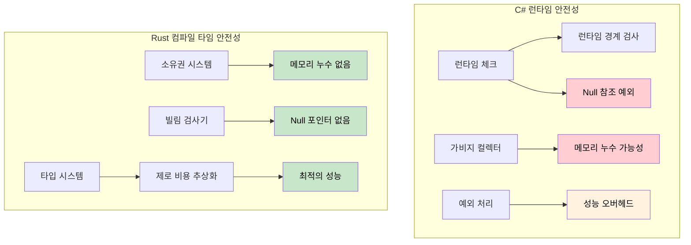

## 참조 vs 포인터

> **학습 목표:** Rust의 참조와 C#의 포인터 및 안전하지 않은(Unsafe) 컨텍스트를 비교하고, 수명(Lifetime)의 기초를 배웁니다. 왜 컴파일 타임의 안전성 증명이 C#의 런타임 체크(경계 검사, null 가드 등)보다 강력한지 이해합니다.
>
> **난이도:** 🟡 중급

### C# 포인터 (안전하지 않은 컨텍스트)
```csharp
// C#의 안전하지 않은 포인터 (거의 사용되지 않음)
unsafe void UnsafeExample()
{
    int value = 42;
    int* ptr = &value;  // 값에 대한 포인터
    *ptr = 100;         // 역참조 및 수정
    Console.WriteLine(value);  // 100
}
```

### Rust 참조 (기본적으로 안전함)
```rust
// Rust 참조 (항상 안전함)
fn safe_example() {
    let mut value = 42;
    let ptr = &mut value;  // 가변 참조
    *ptr = 100;           // 역참조 및 수정
    println!("{}", value); // 100
}

// "unsafe" 키워드가 필요 없음 - 빌림 검사기가 안전성을 보장함
```

### C# 개발자를 위한 수명(Lifetime) 기초
```csharp
// C# - 유효하지 않게 될 수 있는 참조를 반환할 수 있음
public class LifetimeIssues
{
    public string GetFirstWord(string input)
    {
        return input.Split(' ')[0];  // 새로운 문자열 반환 (안전함)
    }
    
    public unsafe char* GetFirstChar(string input)
    {
        // 위험한 상황 - 매니지드 메모리에 대한 포인터 반환
        fixed (char* ptr = input)
            return ptr;  // ❌ 위험: 메서드가 종료된 후 ptr은 유효하지 않게 됨
    }
}
```

```rust
// Rust - 수명 검사를 통해 허공에 뜬 참조(Dangling reference) 방지
fn get_first_word(input: &str) -> &str {
    input.split_whitespace().next().unwrap_or("")
    // ✅ 안전함: 반환된 참조는 input과 동일한 수명을 가짐
}

fn invalid_reference() -> &str {
    let temp = String::from("hello");
    &temp  // ❌ 컴파일 에러: temp가 충분히 오래 살지 못함
    // 함수가 끝나면 temp는 해제되기 때문
}

fn valid_reference() -> String {
    let temp = String::from("hello");
    temp  // ✅ 작동함: 소유권이 호출자에게 이전됨
}
```

***

## 메모리 안전성: 런타임 체크 vs 컴파일 타임 증명

### C# - 런타임 안전장치
```csharp
// C#은 런타임 체크와 GC에 의존합니다.
public class Buffer
{
    private byte[] data;
    
    public Buffer(int size)
    {
        data = new byte[size];
    }
    
    public void ProcessData(int index)
    {
        // 런타임 경계 검사(Bounds checking)
        if (index >= data.Length)
            throw new IndexOutOfRangeException();
            
        data[index] = 42;  // 안전하지만 런타임에 매번 체크됨
    }
    
    // 이벤트나 정적 참조로 인한 메모리 누수가 여전히 발생 가능
    public static event Action<string> GlobalEvent;
    
    public void Subscribe()
    {
        GlobalEvent += HandleEvent;  // 메모리 누수를 유발할 수 있음
        // 구독 해제를 잊으면 객체가 수집되지 않음
    }
    
    private void HandleEvent(string message) { /* ... */ }
    
    // Null 참조 예외가 여전히 발생 가능
    public void ProcessUser(User user)
    {
        Console.WriteLine(user.Name.ToUpper());  // user.Name이 null일 경우 NullReferenceException 발생
    }
    
    // 배열 접근이 런타임에 실패할 수 있음
    public int GetValue(int[] array, int index)
    {
        return array[index];  // IndexOutOfRangeException 발생 가능
    }
}
```

### Rust - 컴파일 타임 보장
```rust
struct Buffer {
    data: Vec<u8>,
}

impl Buffer {
    fn new(size: usize) -> Self {
        Buffer {
            data: vec![0; size],
        }
    }
    
    fn process_data(&mut self, index: usize) {
        // 안전함이 증명되면 컴파일러가 경계 검사를 최적화하여 제거할 수 있음
        if let Some(item) = self.data.get_mut(index) {
            *item = 42;  // 컴파일 타임에 안전함이 증명된 접근
        }
        // 또는 명시적인 경계 검사를 동반한 인덱싱 사용:
        // self.data[index] = 42;  // 디버그 모드에서 패닉이 발생하지만 메모리 안전은 보장됨
    }
    
    // 메모리 누수 불가능 - 소유권 시스템이 이를 방지함
    fn process_with_closure<F>(&mut self, processor: F) 
    where F: FnOnce(&mut Vec<u8>)
    {
        processor(&mut self.data);
        // processor가 스코프를 벗어나면 자동으로 정리됨
        // 허공에 뜬 참조나 메모리 누수를 만들 방법이 없음
    }
    
    // Null 포인터 역참조 불가능 - Rust에는 null 포인터가 없음!
    fn process_user(&self, user: &User) {
        println!("{}", user.name.to_uppercase());  // user.name은 null일 수 없음
    }
    
    // 배열 접근은 경계 검사가 수행되거나 명시적으로 unsafe하게 처리됨
    fn get_value(array: &[i32], index: usize) -> Option<i32> {
        array.get(index).copied()  // 범위를 벗어나면 None 반환
    }
    
    // 자신이 무엇을 하는지 정확히 알 경우 명시적으로 unsafe 사용 가능:
    /// # Safety
    /// `index`는 반드시 `array.len()`보다 작아야 합니다.
    unsafe fn get_value_unchecked(array: &[i32], index: usize) -> i32 {
        *array.get_unchecked(index)  // 빠르지만 경계를 직접 증명해야 함
    }
}

struct User {
    name: String,  // Rust에서 String은 null일 수 없음
}

// 소유권이 Use-After-Free(해제 후 사용)를 방지함
fn ownership_example() {
    let data = vec![1, 2, 3, 4, 5];
    let reference = &data[0];  // 데이터 빌림
    
    // drop(data);  // 에러: 빌려준 동안에는 해제할 수 없음
    println!("{}", reference);  // 이 코드는 안전함이 보장됨
}

// 빌림 시스템이 데이터 경합을 방지함
fn borrowing_example(data: &mut Vec<i32>) {
    let first = &data[0];  // 불변 빌림
    // data.push(6);  // 에러: 불변으로 빌려준 동안에는 가변으로 빌릴 수 없음
    println!("{}", first);  // 데이터 경합이 없음을 보장함
}
```



---

## 연습 문제

<details>
<summary><strong>🏋️ 실습: 안전 버그 찾아내기</strong> (펼치기)</summary>

다음 C# 코드에는 미묘한 안전 버그가 있습니다. 이를 찾아내고, 동일한 기능을 하는 Rust 코드를 작성한 뒤 왜 Rust 버전은 **컴파일되지 않는지** 설명해 보세요.

```csharp
public List<int> GetEvenNumbers(List<int> numbers)
{
    var result = new List<int>();
    foreach (var n in numbers)
    {
        if (n % 2 == 0)
        {
            result.Add(n);
            numbers.Remove(n);  // 버그: 반복문 도중 컬렉션 수정
        }
    }
    return result;
}
```

<details>
<summary>🔑 해답</summary>

**C# 버그**: 반복문 도중에 `numbers`를 수정하면 *런타임*에 `InvalidOperationException`이 발생합니다. 코드 리뷰에서 놓치기 쉬운 부분입니다.

```rust
fn get_even_numbers(numbers: &mut Vec<i32>) -> Vec<i32> {
    let mut result = Vec::new();
    for &n in numbers.iter() {
        if n % 2 == 0 {
            result.push(n);
            // numbers.retain(|&x| x != n);
            // ❌ 에러: `*numbers`를 가변으로 빌릴 수 없음.
            //    이미 반복자(iterator)에 의해 불변으로 빌려진 상태이기 때문.
        }
    }
    result
}

// 관용적인 Rust 방식: partition이나 retain 사용
fn get_even_numbers_idiomatic(numbers: &mut Vec<i32>) -> Vec<i32> {
    let evens: Vec<i32> = numbers.iter().copied().filter(|n| n % 2 == 0).collect();
    numbers.retain(|n| n % 2 != 0); // 반복이 끝난 후 짝수 제거
    evens
}

fn main() {
    let mut nums = vec![1, 2, 3, 4, 5, 6];
    let evens = get_even_numbers_idiomatic(&mut nums);
    assert_eq!(evens, vec![2, 4, 6]);
    assert_eq!(nums, vec![1, 3, 5]);
}
```

**핵심 통찰**: Rust의 빌림 검사기는 "반복 중 수정"으로 인해 발생하는 전체 범주의 버그를 컴파일 타임에 차단합니다. C#은 이를 런타임에 잡아내며, 많은 언어들은 아예 잡아내지 못하고 오동작을 일으킵니다.

</details>
</details>

***
