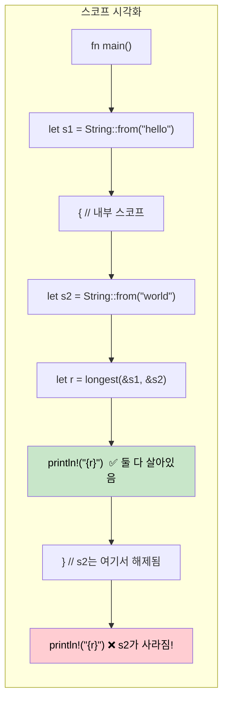

## 수명(Lifetimes): 참조의 유효 기간을 컴파일러에게 알리기

> **학습 목표:** 수명이 왜 존재하는지(GC가 없으므로 컴파일러에게 증거가 필요함), 수명 명시 구문, 생략 규칙(Elision rules), 구조체에서의 수명, `'static` 수명, 그리고 흔한 빌림 검사기 에러와 해결책을 배웁니다.
>
> **난이도:** 🔴 고급

C# 개발자들은 참조의 수명에 대해 고민할 필요가 없습니다. 가비지 컬렉터(GC)가 도달 가능성을 자동으로 관리하기 때문입니다. 하지만 Rust에서 컴파일러는 모든 참조가 사용되는 동안 유효하다는 **증거**를 필요로 합니다. 수명(Lifetimes)이 바로 그 증거입니다.

### 수명이 존재하는 이유
```rust
// 이 코드는 컴파일되지 않습니다 — 컴파일러가 반환된 참조의 유효성을 증명할 수 없기 때문입니다.
fn longest(a: &str, b: &str) -> &str {
    if a.len() > b.len() { a } else { b }
}
// 에러: 수명 매개변수가 누락됨 — 컴파일러는 반환값이 
// `a`에서 빌려온 것인지 `b`에서 빌려온 것인지 알 수 없습니다.
```

### 수명 명시(Lifetime Annotations)
```rust
// 수명 'a는 "반환값은 입력값들 중 '더 짧은 쪽'만큼은 살아남는다"는 것을 의미합니다.
fn longest<'a>(a: &'a str, b: &'a str) -> &'a str {
    if a.len() > b.len() { a } else { b }
}

fn main() {
    let result;
    let string1 = String::from("긴 문자열");
    {
        let string2 = String::from("xyz");
        result = longest(&string1, &string2);
        println!("가장 긴 문자열: {result}"); // ✅ 두 참조 모두 여기서 유효함
    }
    // println!("{result}"); // ❌ 에러: string2가 충분히 오래 살지 못함
}
```

### C#과의 비교
```csharp
// C# — 참조가 하나라도 남아있는 한 GC가 객체를 살려둡니다.
string Longest(string a, string b) => a.Length > b.Length ? a : b;

// 수명 문제가 발생하지 않음 — GC가 자동으로 도달 가능성을 추적함
// 하지만: GC 일시 중단, 예측 불가능한 메모리 사용량, 컴파일 타임의 안전성 증명 부재라는 단점이 있음
```

### 수명 생략 규칙 (Lifetime Elision Rules)

대부분의 경우 **수명을 직접 적을 필요는 없습니다**. 컴파일러가 다음 세 가지 규칙을 자동으로 적용하기 때문입니다:

| 규칙 | 설명 | 예시 |
|------|-------------|---------|
| **규칙 1** | 각 참조 매개변수는 고유한 수명을 가짐 | `fn foo(x: &str, y: &str)` → `fn foo<'a, 'b>(x: &'a str, y: &'b str)` |
| **규칙 2** | 입력 수명이 정확히 하나라면, 모든 출력 수명에 할당됨 | `fn first(s: &str) -> &str` → `fn first<'a>(s: &'a str) -> &'a str` |
| **규칙 3** | 입력 중 `&self` 또는 `&mut self`가 있다면, 그 수명이 모든 출력에 할당됨 | `fn name(&self) -> &str` → &self 덕분에 자동으로 작동함 |

```rust
// 아래 두 함수는 동일합니다 — 컴파일러가 수명을 자동으로 추가합니다:
fn first_word(s: &str) -> &str { /* ... */ }           // 생략됨
fn first_word<'a>(s: &'a str) -> &'a str { /* ... */ } // 명시됨

// 하지만 아래는 명시적인 수명이 필요합니다 — 입력이 두 개라 출력이 어디서 빌려오는지 모호하기 때문입니다.
fn longest<'a>(a: &'a str, b: &'a str) -> &'a str { /* ... */ }
```

### 구조체 수명
```rust
// 데이터를 소유하는 대신 빌려오는 구조체
struct Excerpt<'a> {
    text: &'a str,  // 이 구조체보다 더 오래 살아야 하는 어떤 String으로부터 빌려옴
}

impl<'a> Excerpt<'a> {
    fn new(text: &'a str) -> Self {
        Excerpt { text }
    }

    fn first_sentence(&self) -> &str {
        self.text.split('.').next().unwrap_or(self.text)
    }
}

fn main() {
    let novel = String::from("나를 이스마엘이라 불러다오. 몇 년 전...");
    let excerpt = Excerpt::new(&novel); // excerpt가 novel로부터 빌려옴
    println!("첫 문장: {}", excerpt.first_sentence());
    // novel은 excerpt가 존재하는 동안 계속 살아있어야 함
}
```

```csharp
// C# 대응 코드 — 수명 걱정은 없지만 컴파일 타임의 보장도 없음
class Excerpt
{
    public string Text { get; }
    public Excerpt(string text) => Text = text;
    public string FirstSentence() => Text.Split('.')[0];
}
// 만약 문자열이 다른 곳에서 수정된다면? 런타임에 예상치 못한 동작이 발생함.
```

### 정적 수명 (`'static`)
```rust
// 'static은 "프로그램 실행 전체 기간 동안 유효함"을 의미합니다.
let s: &'static str = "나는 문자열 리터럴입니다"; // 바이너리에 저장되어 항상 유효함

// 'static이 자주 쓰이는 곳:
// 1. 문자열 리터럴
// 2. 전역 상수
// 3. Thread::spawn 호출 시 (스레드가 호출자보다 오래 살 수 있기 때문)
std::thread::spawn(move || {
    // 스레드로 보내지는 클로저는 데이터를 직접 소유하거나 'static 참조를 사용해야 함
    println!("{s}"); // OK: &'static str임
});

// 'static이 "불멸"을 의미하는 것은 아닙니다 — "필요하다면 영원히 살 수 있음"을 뜻합니다.
let owned = String::from("안녕");
// owned는 'static은 아니지만, 스레드 내부로 이동(Ownership transfer)될 수 있습니다.
```

### 흔한 빌림 검사기 에러와 해결책

| 에러 메시지 | 원인 | 해결책 |
|-------|-------|-----|
| `missing lifetime specifier` | 입력 참조가 여러 개라 출력 참조의 출처가 모호함 | 출력을 올바른 입력과 연결하는 `<'a>` 명시 추가 |
| `does not live long enough` | 참조가 가리키는 데이터보다 더 오래 살려고 함 | 데이터의 범위를 넓히거나, 참조 대신 소유권이 있는 데이터 반환 |
| `cannot borrow as mutable` | 불변 참조가 여전히 활성화된 상태에서 가변으로 빌리려 함 | 수정하기 전에 불변 참조 사용을 끝내거나 구조를 변경함 |
| `cannot move out of borrowed content` | 빌려온 데이터의 소유권을 가져가려 함 | `.clone()`을 사용하거나, 이동이 필요 없는 구조로 변경함 |
| `lifetime may not live long enough` | 구조체의 빌림이 소스 데이터보다 더 오래 유지됨 | 소스 데이터의 범위가 구조체 사용 범위를 포함하도록 보장함 |

### 수명 스코프 시각화하기



### 다중 수명 매개변수

때로는 참조들이 서로 다른 수명을 가진 여러 소스에서 올 수 있습니다:

```rust
// 두 개의 독립적인 수명: 반환값은 'a에서만 빌려오며 'b와는 무관함
fn first_with_context<'a, 'b>(data: &'a str, _context: &'b str) -> &'a str {
    // 반환값은 'data'에서만 빌려옴 — 'context'는 더 짧은 수명을 가져도 됨
    data.split(',').next().unwrap_or(data)
}

fn main() {
    let data = String::from("앨리스,밥,찰리");
    let result;
    {
        let context = String::from("사용자 조회"); // 더 짧은 수명
        result = first_with_context(&data, &context);
    } // context는 해제됨 — 하지만 result는 data에서 빌려온 것이므로 괜찮음 ✅
    println!("{result}");
}
```

```csharp
// C# — 수명 추적이 없으므로 "A에서는 빌려오지만 B와는 무관함"과 같은 표현이 불가능함
string FirstWithContext(string data, string context) => data.Split(',')[0];
// GC 기반 언어에서는 문제없지만, Rust는 GC 없이도 이 안전성을 증명할 수 있음
```

### 실무에서의 수명 패턴

**패턴 1: 참조를 반환하는 반복자**
```rust
// 입력에서 빌려온 슬라이스들을 생성하는 파서
struct CsvRow<'a> {
    fields: Vec<&'a str>,
}

fn parse_csv_line(line: &str) -> CsvRow<'_> {
    // '_는 컴파일러에게 "입력으로부터 수명을 추론하라"고 지시함
    CsvRow {
        fields: line.split(',').collect(),
    }
}
```

**패턴 2: "확신이 서지 않으면 소유권이 있는 값을 반환하라"**
```rust
// 수명이 복잡해질 때, 소유권이 있는 데이터를 반환하는 것이 실용적인 해결책입니다.
fn format_greeting(first: &str, last: &str) -> String {
    // 소유권이 있는 String을 반환 — 수명 명시가 필요 없음
    format!("안녕하세요, {first} {last}님!")
}

// 빌림은 다음과 같은 경우에만 사용하세요:
// 1. 성능이 매우 중요할 때 (할당 방지)
// 2. 입력과 출력 수명 사이의 관계가 명확할 때
```

**패턴 3: 제네릭에 대한 수명 제약**
```rust
// "T는 최소한 'a 만큼은 살아있어야 함"
fn store_reference<'a, T: 'a>(cache: &mut Vec<&'a T>, item: &'a T) {
    cache.push(item);
}

// 트레이트 객체에서 흔히 쓰임: Box<dyn Display + 'a>
fn make_printer<'a>(text: &'a str) -> Box<dyn std::fmt::Display + 'a> {
    Box::new(text)
}
```

### 언제 `'static`을 사용해야 할까요?

| 시나리오 | `'static` 사용 여부 | 대안 |
|----------|:-----------:|-------------|
| 문자열 리터럴 | ✅ 예 — 항상 `'static`임 | — |
| `thread::spawn` 클로저 | 자주 사용 — 스레드가 호출자보다 오래 살 수 있음 | 빌려온 데이터를 위해 `thread::scope` 사용 |
| 전역 설정값 | ✅ `lazy_static!` 또는 `OnceLock` | 매개변수를 통해 참조 전달 |
| 장기 저장되는 트레이트 객체 | 자주 사용 — `Box<dyn Trait + 'static>` | 컨테이너에 `'a` 매개변수 추가 |
| 일시적인 빌림 | ❌ 절대 금지 — 과도한 제약임 | 실제 수명을 사용 |

<details>
<summary><strong>🏋️ 실습: 수명 명시하기</strong> (펼치기)</summary>

**도전 과제**: 아래 코드가 컴파일되도록 올바른 수명 명시를 추가해 보세요.

```rust
struct Config {
    db_url: String,
    api_key: String,
}

// TODO: 수명 명시 추가하기
fn get_connection_info(config: &Config) -> (&str, &str) {
    (&config.db_url, &config.api_key)
}

// TODO: 이 구조체는 Config로부터 데이터를 빌려옵니다 — 수명 매개변수 추가하기
struct ConnectionInfo {
    db_url: &str,
    api_key: &str,
}
```

<details>
<summary>🔑 해답</summary>

```rust
struct Config {
    db_url: String,
    api_key: String,
}

// 규칙 3은 적용되지 않음 (&self 없음), 규칙 2가 적용됨 (입력이 하나이므로 출력에 할당)
// 따라서 컴파일러가 이를 자동으로 처리합니다 — 명시가 필요 없습니다!
fn get_connection_info(config: &Config) -> (&str, &str) {
    (&config.db_url, &config.api_key)
}

// 구조체에는 수명 명시가 필요합니다:
struct ConnectionInfo<'a> {
    db_url: &'a str,
    api_key: &'a str,
}

fn make_info<'a>(config: &'a Config) -> ConnectionInfo<'a> {
    ConnectionInfo {
        db_url: &config.db_url,
        api_key: &config.api_key,
    }
}
```

**핵심 포인트**: 수명 생략 규칙 덕분에 함수에서는 명시를 생략하는 경우가 많지만, 데이터를 빌려오는 **구조체**는 항상 명시적인 `<'a>`가 필요합니다.

</details>
</details>

***
