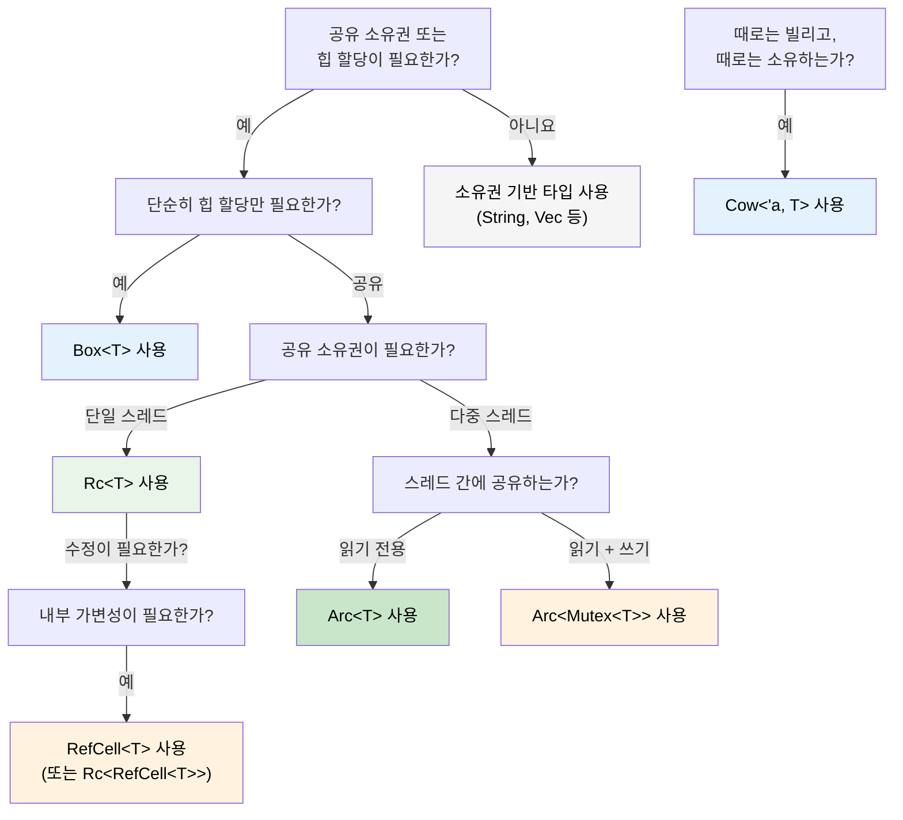

## 스마트 포인터(Smart Pointers): 단일 소유권만으로 부족할 때

> **학습 내용:** `Box<T>`, `Rc<T>`, `Arc<T>`, `Cell<T>`, `RefCell<T>`, `Cow<'a, T>` —
> 각 포인터의 사용 시점, C#의 GC 관리 참조(GC-managed references)와의 비교, Rust의 `IDisposable` 역할을 하는 `Drop`,
> `Deref` 강제 변환(coercion), 올바른 스마트 포인터 선택을 위한 결정 트리(decision tree).
>
> **난이도:** 🔴 고급

C#에서 모든 객체는 기본적으로 가비지 컬렉터(GC)에 의해 참조 횟수가 관리됩니다. Rust에서는 단일 소유권(Single ownership)이 기본이지만, 때로는 공유 소유권, 힙 할당, 또는 내부 가변성(interior mutability)이 필요할 때가 있습니다. 이때 스마트 포인터가 사용됩니다.

### Box&lt;T&gt; — 단순 힙 할당
```rust
// 스택 할당 (Rust의 기본값)
let x = 42;           // 스택에 저장됨

// Box를 이용한 힙 할당
let y = Box::new(42); // 힙에 저장됨, C#의 `new int(42)`(박싱된 형태)와 유사
println!("{}", y);     // 자동 역참조(auto-derefs): 42 출력

// 일반적인 용도: 재귀적 타입 (컴파일 타임에 크기를 알 수 없는 경우)
#[derive(Debug)]
enum List {
    Cons(i32, Box<List>),  // Box는 고정된 포인터 크기를 가짐
    Nil,
}

let list = List::Cons(1, Box::new(List::Cons(2, Box::new(List::Nil))));
```

```csharp
// C# — 모든 참조 타입은 이미 힙에 할당됨
// Rust는 스택 할당이 기본이므로, 힙 할당이 필요한 경우에만 Box<T>를 사용함
var list = new LinkedListNode<int>(1);  // 항상 힙에 할당됨
```

### Rc&lt;T&gt; — 공유 소유권 (단일 스레드용)
```rust
use std::rc::Rc;

// 동일한 데이터에 대한 다중 소유자 — C#의 다중 참조와 유사
let shared = Rc::new(vec![1, 2, 3]);
let clone1 = Rc::clone(&shared); // 참조 횟수: 2
let clone2 = Rc::clone(&shared); // 참조 횟수: 3

println!("Count: {}", Rc::strong_count(&shared)); // 3 출력
// 마지막 Rc가 범위를 벗어날 때 데이터가 메모리에서 해제됨

// 일반적인 용도: 공유 설정 객체, 그래프 노드, 트리 구조 등
```

### Arc&lt;T&gt; — 공유 소유권 (스레드 안전)
```rust
use std::sync::Arc;
use std::thread;

// Arc = Atomic Reference Counting(원자적 참조 횟수 계산) — 스레드 간 공유에 안전함
let data = Arc::new(vec![1, 2, 3]);

let handles: Vec<_> = (0..3).map(|i| {
    let data = Arc::clone(&data);
    thread::spawn(move || {
        println!("Thread {i}: {:?}", data);
    })
}).collect();

for h in handles { h.join().unwrap(); }
```

```csharp
// C# — 모든 참조는 기본적으로 스레드 안전함 (GC가 관리)
var data = new List<int> { 1, 2, 3 };
// 스레드 간 자유롭게 공유 가능 (단, 수정 시에는 여전히 동기화가 필요함!)
```

### Cell&lt;T&gt; 및 RefCell&lt;T&gt; — 내부 가변성(Interior Mutability)
```rust
use std::cell::RefCell;

// 때로는 공유 참조 뒤에 있는 데이터를 수정해야 할 때가 있습니다.
// RefCell은 빌림 검사(borrow checking)를 컴파일 타임에서 런타임으로 옮깁니다.
struct Logger {
    entries: RefCell<Vec<String>>,
}

impl Logger {
    fn new() -> Self {
        Logger { entries: RefCell::new(Vec::new()) }
    }

    fn log(&self, msg: &str) { // &mut self가 아닌 &self를 사용!
        self.entries.borrow_mut().push(msg.to_string());
    }

    fn dump(&self) {
        for entry in self.entries.borrow().iter() {
            println!("{entry}");
        }
    }
}
// ⚠️ RefCell은 런타임에 빌림 규칙을 위반하면 패닉(panic)을 발생시킵니다.
// 가급적 아껴서 사용하고, 가능한 한 컴파일 타임 검사를 선호하십시오.
```

### Cow&lt;'a, str&gt; — 쓰기 시 복제(Clone on Write)
```rust
use std::borrow::Cow;

// 때로는 &str이 필요할 때 String으로 변환해야 할 수도 있습니다.
fn normalize(input: &str) -> Cow<'_, str> {
    if input.contains('\t') {
        // 수정이 필요할 때만 메모리를 할당함
        Cow::Owned(input.replace('\t', "    "))
    } else {
        // 원본을 빌림 — 메모리 할당 없음
        Cow::Borrowed(input)
    }
}

let clean = normalize("hello");           // Cow::Borrowed — 할당 없음
let dirty = normalize("hello\tworld");    // Cow::Owned — 할당됨
// 둘 다 Deref를 통해 &str처럼 사용할 수 있음
println!("{clean} / {dirty}");
```

### Drop: Rust의 `IDisposable`

C#에서는 `IDisposable` 인터페이스와 `using` 문을 사용하여 리소스를 정리합니다. Rust의 대응물은 `Drop` 트레이트(trait)입니다. 하지만 Rust에서는 명시적으로 호출할 필요 없이 **자동으로** 수행됩니다.

```csharp
// C# — 'using'을 사용하거나 Dispose()를 명시적으로 호출해야 함
using var file = File.OpenRead("data.bin");
// 범위가 끝날 때 Dispose()가 호출됨

// 'using'을 잊어버리면 리소스 누수가 발생할 수 있음!
var file2 = File.OpenRead("data.bin");
// GC가 결국 파이널라이저를 실행하겠지만, 타이밍을 예측할 수 없음
```

```rust
// Rust — 값이 범위를 벗어나면 Drop이 자동으로 실행됨
{
    let file = File::open("data.bin")?;
    // file 사용...
}   // 여기서 file.drop()이 확정적으로 호출됨 — 'using'이 필요 없음

// 커스텀 Drop (IDisposable 구현과 유사)
struct TempFile {
    path: std::path::PathBuf,
}

impl Drop for TempFile {
    fn drop(&mut self) {
        // TempFile이 범위를 벗어날 때 실행이 보장됨
        let _ = std::fs::remove_file(&self.path);
        println!("Cleaned up {:?}", self.path);
    }
}

fn main() {
    let tmp = TempFile { path: "scratch.tmp".into() };
    // ... tmp 사용 ...
}   // 여기서 scratch.tmp가 자동으로 삭제됨
```

**C#과의 핵심 차이점:** Rust에서는 *모든* 타입이 확정적인 정리를 수행할 수 있습니다. `using`을 잊어버릴 걱정이 없는데, 소유자가 범위를 벗어날 때 `Drop`이 실행되기 때문입니다. 이러한 패턴을 **RAII**(Resource Acquisition Is Initialization, 리소스 획득은 초기화다)라고 합니다.

> **규칙**: 타입이 리소스(파일 핸들, 네트워크 연결, 락 가드, 임시 파일 등)를 보유하고 있다면 `Drop`을 구현하십시오. 소유권 시스템이 정확히 한 번 실행됨을 보장합니다.

### Deref 강제 변환: 스마트 포인터의 자동 역참조

Rust는 메서드를 호출하거나 함수에 인자를 전달할 때 스마트 포인터를 자동으로 "역참조"합니다. 이를 **Deref 강제 변환(coercion)**이라고 합니다.

```rust
let boxed: Box<String> = Box::new(String::from("hello"));

// Deref 강제 변환 체인: Box<String> → String → str
println!("Length: {}", boxed.len());   // str::len() 호출 — 자동 역참조!

fn greet(name: &str) {
    println!("Hello, {name}");
}

let s = String::from("Alice");
greet(&s);       // &String → &str (Deref 강제 변환)
greet(&boxed);   // &Box<String> → &String → &str (두 단계 변환!)
```

```csharp
// C#에는 이에 대응하는 기능이 없음 — 명시적 형변환이나 .ToString()이 필요함
// 가장 유사한 것은 암시적 변환 연산자이지만, 이는 명시적 정의가 필요함
```

**이것이 중요한 이유:** `&str`을 기대하는 곳에 `&String`을, `&[T]`를 기대하는 곳에 `&Vec<T>`를, `&T`를 기대하는 곳에 `&Box<T>`를 명시적 변환 없이 전달할 수 있습니다. 이 때문에 Rust API는 보통 `&String`이나 `&Vec<T>` 대신 `&str`과 `&[T]`를 매개변수로 받습니다.

### Rc vs Arc: 어떤 것을 선택해야 할까요?

| | `Rc<T>` | `Arc<T>` |
|---|---|---|
| **스레드 안전성** | ❌ 단일 스레드 전용 | ✅ 스레드 안전 (원자적 연산) |
| **오버헤드** | 낮음 (비원자적 참조 횟수) | 높음 (원자적 참조 횟수) |
| **컴파일러 강제** | `thread::spawn`을 통한 공유 불가 | 어디서나 작동 가능 |
| **조합 사용** | 수정을 위해 `RefCell<T>`와 조합 | 수정을 위해 `Mutex<T>` 또는 `RwLock<T>`와 조합 |

**기본 원칙:** 먼저 `Rc`로 시작하십시오. `Arc`가 필요한 상황이라면 컴파일러가 알려줄 것입니다.

### 결정 트리: 어떤 스마트 포인터를 사용할까요?



<details>
<summary><strong>🏋️ 연습 문제: 올바른 스마트 포인터 선택하기</strong> (클릭하여 확장)</summary>

**도전 과제**: 다음 시나리오에 맞는 올바른 스마트 포인터를 선택하고 그 이유를 설명하십시오.

1. 재귀적인 트리 데이터 구조
2. 여러 컴포넌트가 읽는 공유 설정 객체 (단일 스레드)
3. HTTP 핸들러 스레드 간에 공유되는 요청 카운터
4. 빌린 문자열 또는 소유한 문자열을 반환할 수 있는 캐시
5. 공유 참조를 통해 수정이 필요한 로깅 버퍼

<details>
<summary>🔑 정답</summary>

1. **`Box<T>`** — 재귀적 타입은 컴파일 타임에 크기를 알기 위해 간접 참조가 필요합니다.
2. **`Rc<T>`** — 단일 스레드에서 공유 읽기 전용 접근이 필요하며, `Arc`의 오버헤드가 필요 없습니다.
3. **`Arc<Mutex<u64>>`** — 스레드 간 공유(`Arc`)와 수정(`Mutex`)이 모두 필요합니다.
4. **`Cow<'a, str>`** — 캐시 히트 시에는 `&str`을, 미스 시에는 `String`을 반환할 수 있습니다.
5. **`RefCell<Vec<String>>`** — 단일 스레드에서 `&self`를 통한 내부 가변성이 필요합니다.

**기본 원칙**: 소유권 기반 타입으로 시작하십시오. 간접 참조가 필요할 때 `Box`, 공유가 필요할 때 `Rc`/`Arc`, 내부 가변성이 필요할 때 `RefCell`/`Mutex`, 그리고 일반적인 경우에 복사를 피하고 싶을 때 `Cow`를 사용하십시오.

</details>
</details>

***
